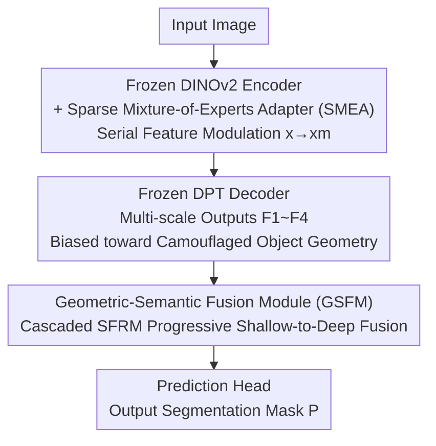

# Beyond Appearance: Camouflaged Object Detection via Geometric Structure

**Conference**: CVPR 2026  
**Paper**: [CVF Open Access](https://openaccess.thecvf.com/content/CVPR2026/html/Han_Beyond_Appearance_Camouflaged_Object_Detection_via_Geometric_Structure_CVPR_2026_paper.html)  
**Code**: https://depthsam.github.io/ (Project Page)  
**Area**: Semantic Segmentation / Camouflaged Object Detection  
**Keywords**: Camouflaged Object Detection, Monocular Depth Estimation, Geometric Priors, Sparse Mixture-of-Experts Adapter, Frequency Domain Fusion

## TL;DR
DepthSAM adapts the monocular depth estimation (MDE) foundation model, Depth Anything v2, for camouflaged object detection. By freezing the backbone and injecting Sparse Mixture-of-Experts Adapters (SMEA), it pivots the task from "reconstructing the entire scene geometry" to "highlighting camouflaged object geometry." A Geometric-Semantic Fusion Module (GSFM) is then used to align geometric cues with semantic information, achieving new SOTA results on COD10K, CAMO, and NC4K benchmarks (surpassing the runner-up by 3.0% $S_\alpha$ and 4.3% $F^\omega_\beta$ on COD10K).

## Background & Motivation
**Background**: Camouflaged Object Detection (COD) aims to segment objects that blend into their surroundings. Traditional methods evolved from customized CNNs to Transformers and, more recently, to fine-tuning large foundation models like SAM. However, these methods essentially mine **appearance cues such as color and texture from RGB images**.

**Limitations of Prior Work**: Under extreme camouflage, appearance cues are inherently distorted or deceptive—the object's color and texture are nearly identical to the background. General priors from models like SAM fail to provide assistance in these high-confusion scenarios, leading to significant performance degradation.

**Key Challenge**: The authors propose shifting to a more robust information source: **geometry**. MDE foundation models (e.g., Depth Anything) are pre-trained on large scales to infer rich 3D geometry from 2D appearance, and geometry distinguishes object boundaries better than color/texture. However, directly applying MDE to COD encounters **task misalignment**: the goal of MDE is to reconstruct the geometry of the *entire* scene, while COD aims to isolate only *specific* objects. When object and background geometries are "intertwined," MDE reconstructs both indiscriminately, causing the object structure to be submerged by the background (referred to as the "Depth Intertwine" scenario in Figure 1).

**Goal**: To "steer" the geometric priors of MDE toward camouflaged objects—highlighting object geometry and suppressing background geometry while effectively fusing depth priors with high-level semantics.

**Core Idea**: Instead of retraining the MDE model, **sparse mixture-of-experts adapters are inserted into the frozen MDE encoder to "steer" the features**, biasing the decoder outputs toward the camouflaged object. Then, a spatial-frequency dual-stream module aligns geometry with semantics to generate the final segmentation mask.

## Method

### Overall Architecture
DepthSAM uses the pre-trained Depth Anything v2 (DAv2) as its base, which consists of a DINOv2 encoder (for visual features) and a DPT decoder (for multi-scale upsampling), both of which are **entirely frozen**. Two main components are added: ① **SMEA** is serially injected into the frozen DINOv2 encoder to modulate internal features, forcing the multi-scale features $\{F_1, F_2, F_3, F_4\}$ from the frozen DPT decoder to lean toward the camouflaged object's geometry. ② **GSFM** progressively fuses these four complementary features into a high-quality representation $F_o$, followed by a lightweight primary prediction head that maps $F_o$ to the segmentation mask $P$. The training uses a hybrid loss $L = L_{BCE} + L_{IOU}$ combined with an auxiliary loss to ensure SMEA sparsity.

### Key Designs

**1. SMEA: Steering "Scene Geometry" to "Object Geometry" via Sparse MoE Adapters**

This design addresses task misalignment: frozen DINOv2 features are optimized for "general, full-scene geometric understanding," lacking the object-level task awareness required for COD. SMEA (Sparse Mixture-of-Experts Adapter) is injected **serially** before specified encoder Transformer Blocks. The input feature $x$ is modulated into $x_m$ by the adapter before being fed into subsequent frozen self-attention and FFN layers. This is crucial: **all information is forced through the SMEA**, enabling powerful task-specific modulation.

SMEA consists of $N$ lightweight experts $E_i$ and a gating network $G$ (router). The gate calculates weights $g_i$ for all experts, but only the Top-K (default $K=2$) experts are activated while others are zeroed, ensuring sparsity and efficiency. The modulated feature is the sparse weighted sum of expert outputs, added back to the original input via an internal residual connection:
$$x_m = x + \Big(\sum_{i=1}^{N} g_i E_i(x)\Big)\Big/\sum_{i=1}^{N} g_i, \quad g_i \in \text{Top-K}(G(x))$$
The gating network learns to select the most relevant combination of experts for different inputs, dynamically shifting the representation from "depth-centric" to "object-centric." This pre-modulated signal $x_m$ propagates to the DPT decoder, causing the multi-scale depth outputs $\{F_i\}$ to highlight the geometric priors of the camouflaged object. Note that the goal of SMEA is **not** to fundamentally change the features, but to "influence the DPT decoder to treat camouflaged object geometry as the most salient information." Visualizations show experts 1/7 activate for objects on flat textures like sand, while experts 4/6 handle objects hidden in complex vegetation.

**2. GSFM: Aligning Shallow Geometric Details with Deep Semantics via Progressive Fusion**

After SMEA modulation, although the DPT decoder is guided toward object geometry, it remains frozen, and its outputs are essentially "geometric understanding representations" rather than "segmentation representations." Furthermore, the four feature levels are complementary: shallow $F_1$ is rich in modulated geometric details, while deep $F_4$ contains strong semantics. GSFM (Geometric-Semantic Fusion Module) utilizes a **Progressive Fusion** architecture, cascading SFRM components from deep to shallow to allow fine-grained geometric details to guide and refine semantic representations stage-by-stage:
$$F_o = \text{SFRM}(\text{SFRM}(\text{SFRM}(F_4, F_3), F_2), F_1)$$
This multi-stage design ensures that "fine geometry" and "coarse semantics" are aligned level-by-level before convergence into a semantically robust and structurally precise feature $F_o$.

**3. SFRM: Spatial-Frequency Dual-Stream + 4-Way Cross Attention for Cross-Domain Enhancement**

SFRM (Spatial-Frequency Refinement Module) is the core of each GSFM stage, responsible for fusion of two input features $x_1, x_2$ via a **dual-domain design**. After initial interaction (concatenation + convolution), the features are processed in two parallel streams: the **Spatial Stream S** (rich in local geometric details) and the **Frequency Stream F** (processed via FFT to efficiently capture global semantic context). Then, a four-way parallel multi-head self-attention (MHSA) mechanism performs comprehensive information exchange:

$$
\begin{cases}
F_F = \mathcal{F}^{-1}\big(\text{Softmax}(\tfrac{QK^T}{\sqrt{d}})\cdot V\big) & \text{Frequency Self-Attention: Intra-stream Global Context} \\
F_S = \text{Softmax}(\tfrac{qk^T}{\sqrt{d}})\cdot v & \text{Spatial Self-Attention: Intra-stream Local Structure} \\
F_{S\to F} = \mathcal{F}^{-1}\big(\mathcal{F}(\text{Softmax}(\tfrac{qk^T}{\sqrt{d}}))\cdot V\big) & \text{Geometry-guiding-Semantics: Anchor global semantics with spatial structures} \\
F_{F\to S} = \mathcal{F}^{-1}\big(\text{Softmax}(\tfrac{QK^T}{\sqrt{d}})\big)\cdot v & \text{Semantics-guiding-Geometry: Suppress background noise with semantics}
\end{cases}
$$
Where $\mathcal{F}$ and $\mathcal{F}^{-1}$ are the Forward and Inverse Fast Fourier Transforms. $Q, K, V$ denote the frequency stream and $q, k, v$ denote the spatial stream. The cross-domain guiders use local geometry to calibrate global semantics and high-level semantics to enhance true object boundaries by suppressing background noise.

### Loss & Training
Supervision is provided by a mixed BCE + IoU loss $L = L_{BCE} + L_{IOU}$, with an additional auxiliary loss for SMEA routing sparsity. Implementation highlights: DAv2 architecture as the base, $N=8$ experts with Top-K=2; inputs and GT resized to 512×512 with random horizontal flip and cropping; Adam optimizer with an initial learning rate of 5e-5, decayed by 0.1 every 150 epochs; trained for 300 epochs on 4×RTX 4090 with a total batch size of 8. DepthSAM-B/L trainable parameters are only 9.09M/27.45M.

## Key Experimental Results

### Main Results
Compared against 18 SOTA methods on CAMO, COD10K, and NC4K benchmarks. DepthSAM-L (512×512) leads across the board with only 27.45M trainable parameters:

| Dataset | Metric | DepthSAM-L | Runner-up (CG-COD) | Gain |
|--------|------|-----------|-------------|------|
| CAMO | $S_\alpha$ ↑ / $F^\omega_\beta$ ↑ | 0.919 / 0.906 | 0.896 / 0.864 | +2.3% / +4.2% |
| COD10K | $S_\alpha$ ↑ / $F^\omega_\beta$ ↑ | 0.920 / 0.867 | 0.890 / 0.824 | +3.0% / +4.3% |
| NC4K | $S_\alpha$ ↑ / $F^\omega_\beta$ ↑ | 0.929 / 0.909 | 0.904 / 0.869 | +2.5% / +4.0% |

The lightweight DepthSAM-B (9.09M parameters) also outperforms all existing competitors at 512×512 resolution (e.g., $S_\alpha$=0.907 on COD10K).

### Zero-Shot Generalization (VCOD)
DepthSAM-L, trained only on static images, was tested in a zero-shot manner on the MoCA-Mask video camouflaged detection benchmark, outperforming methods specifically designed for video:

| Method | $S_\alpha$ ↑ | $F^\omega_\beta$ ↑ | mIoU ↑ |
|------|------|------|------|
| ZoomNeXt (TPAMI24) | 73.4 | 47.6 | 42.2 |
| SAM-PM (CVPR24) | 72.8 | 56.7 | 50.2 |
| **DepthSAM-L (Zero-shot)** | **78.4** | **60.9** | **54.9** |

The $S_\alpha$ is 5.0% higher than the runner-up ZoomNeXt. The authors attribute this to the model's ability to focus on the geometric essence of camouflaged objects after resolving the task misalignment.

### Ablation Study

| Configuration | $S_\alpha$ | $F^\omega_\beta$ | Note |
|------|------|------|------|
| w/o SMEA | 0.845 | 0.719 | Removing SMEA eats raw DAv2 priors → Worst Performance |
| SMEA→Standard Adapter | 0.914 | 0.840 | MoE outperforms single adapter by +2.7% $F^\omega_\beta$ |
| GSFM→Simple Concat | 0.875 | 0.766 | Simple concatenation is insufficient, drops 10 pts $F^\omega_\beta$ |
| SFRM→Standard MHSA | 0.899 | 0.809 | MHSA lacks frequency perspective → Degradation |
| **Full DepthSAM-L** | **0.920** | **0.867** | — |

Baseline model ablation (Table 3): Porting DepthSAM components to the SAM foundation model (denoted as SAM*) still results in a 4.0% lag on $S_\alpha$ (0.880 vs 0.920), proving that **geometric priors are key, rather than just large-scale pre-training**.

### Key Findings
- **SMEA is the most cost-effective component**: Removing it results in an $F^\omega_\beta$ crash of 14.8%. Pivoting general depth features toward the object level is decisive for the method's success.
- **Sparse MoE > Single Adapter**: Multiple experts dynamically assign tasks based on the scene (e.g., sand vs. vegetation), outperforming a universal adapter by 2.7% $F^\omega_\beta$. K=2 is sufficient.
- **Frequency domain is non-negotiable**: Replacing SFRM with standard MHSA drops performance to 0.809, indicating that global semantic capture via FFT and cross-guidance with spatial geometry is vital for fusing camouflaged features.
- **Geometry > General Semantics**: Under the same component configuration, the DAv2 backbone significantly outperforms the SAM backbone. In camouflaged scenarios, SAM's raw features are easily confused by background textures.

## Highlights & Insights
- **Shifting Information Sources**: While most COD works focus on "amplifying weak appearance cues," this work pivots directly to MDE geometric priors—a clean and effective shift in perspective.
- **"Steering" instead of "Reconstructing" foundation models**: SMEA does not fine-tune the backbone; it merely inserts sparse adapters to influence the orientation of the frozen decoder's output. Achieving SOTA with only 9~27M trainable parameters validates this "frozen + lightweight modulation" paradigm.
- **Task misalignment as a diagnostic framework**: Formalizing the gap between "foundation model pre-training goals ≠ downstream goals" as task misalignment provides a blueprint for adapting foundation models to other specific tasks.
- **Zero-shot video transfer as a ultimate proof**: Superiority over video-specific methods despite using static training data proves the model has learned the fundamental ability to focus on geometry.

## Limitations & Future Work
- **Dependency on MDE quality**: The method relies on DAv2's depth priors. In extreme scenarios where depth estimation fails (transparency, true co-planar camouflage with no depth variance), the geometric prior also fails.
- **Residual task misalignment**: SMEA "guides" the frozen decoder rather than retraining the geometry from scratch. Its effectiveness in "Depth Intertwine" scenarios where object and background depths are perfectly merged requires further quantitative definition.
- **Interpretability of Frequency Fusion**: While SFRM's cross-domain guidance is effective, the empirical assumption that frequency=global semantics and spatial=local geometry lacks more rigorous theoretical grounding.

## Related Work & Insights
- **vs DSAM / RISNet (Depth-based COD)**: Prior works use depth maps as boundary refinement or dual-stream inputs. These treat depth as an **external input**, susceptible to cumulative error. Ours **modulates MDE internals**, reducing error and more thoroughly exploiting geometric potential.
- **vs SAM-Adapter / CG-COD (Foundation fine-tuning)**: These fine-tune **semantic/segmentation** models, remaining trapped by appearance. Ours uses a **geometric** foundation model and proves its superiority in camouflaged scenes.

## Rating
- Novelty: ⭐⭐⭐⭐⭐ First to adapt MDE foundation models for COD using a "task misalignment" framework.
- Experimental Thoroughness: ⭐⭐⭐⭐⭐ 18 competitors, VCOD zero-shot, SOD/ORSI generalization, and extensive ablations.
- Writing Quality: ⭐⭐⭐⭐ Clear narrative, though symbols in Equation (3) are slightly ambiguous.
- Value: ⭐⭐⭐⭐⭐ Lightweight SOTA; the "frozen foundation + sparse modulation + cross-domain fusion" paradigm is highly transferable.

<!-- RELATED:START -->

## Related Papers

- [\[CVPR 2026\] SDDF: Specificity-Driven Dynamic Focusing for Open-Vocabulary Camouflaged Object Detection](sddf_specificity-driven_dynamic_focusing_for_open-vocabulary_camouflaged_object.md)
- [\[ICCV 2025\] Beyond Single Images: Retrieval Self-Augmented Unsupervised Camouflaged Object Detection](../../ICCV2025/segmentation/beyond_single_images_retrieval_self-augmented_unsupervised_camouflaged_object_de.md)
- [\[ICML 2026\] Beyond Detection: A Structure-Aware Framework for Scene Text Tracking](../../ICML2026/segmentation/beyond_detection_a_structure-aware_framework_for_scene_text_tracking.md)
- [\[CVPR 2026\] DSS: Discover, Segment, and Select for Zero-shot Camouflaged Object Segmentation](discover_segment_and_select_a_progressive_mechanism_for_zero-shot_camouflaged_ob.md)
- [\[CVPR 2026\] GeoGuide: Hierarchical Geometric Guidance for Open-Vocabulary 3D Semantic Segmentation](geoguide_hierarchical_geometric_guidance_for_open-vocabulary_3d_semantic_segment.md)

<!-- RELATED:END -->
