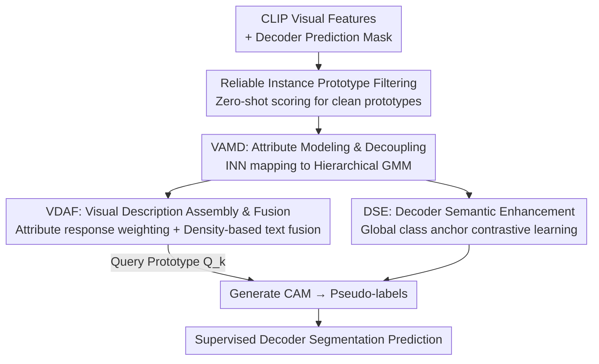

# Beyond Text: Visual Description Assembly by Probabilistic Model for CLIP-based Weakly Supervised Semantic Segmentation

**Conference**: CVPR 2026  
**Paper**: [CVF Open Access](https://openaccess.thecvf.com/content/CVPR2026/html/Qiu_Beyond_Text_Visual_Description_Assembly_by_Probabilistic_Model_for_CLIP-based_CVPR_2026_paper.html)  
**Code**: The paper states "Code is available", but no explicit repository link is provided (⚠️ Refer to original text)  
**Area**: Weakly Supervised Semantic Segmentation  
**Keywords**: Weakly Supervised Semantic Segmentation, CLIP, Probabilistic Model/GMM, Visual Prototype, Modality Gap

## TL;DR
To address the issues of "modality gap between text prototypes and visual features" and "static text failing to adapt to diverse instances" in CLIP-based weakly supervised segmentation, this paper uses an Invertible Neural Network to model CLIP visual features as a Hierarchical Gaussian Mixture Model (H-GMM). It explicitly decouples intra-class attributes in the visual space, dynamically assembles them into visual description prototypes based on instance responses to replace text queries, and adaptively reverts to text anchors using density weights. It achieves new SOTAs of 79.9%/51.4% mIoU on VOC/COCO for single-stage WSSS.

## Background & Motivation
**Background**: Weakly supervised semantic segmentation (WSSS) is trained only with image-level labels. The mainstream approach uses classification networks to generate Class Activation Maps (CAMs) as pseudo-labels. Since the emergence of CLIP, CLIP-based WSSS uses class text prototypes produced by the text encoder to calculate cosine similarity with visual patch features to generate CAMs—i.e., $M_k = \mathrm{Norm}(\cos\langle V, T_k^\top\rangle)$. When visual features $V$ are fixed, the quality of the CAM depends entirely on the text embedding $T$.

**Limitations of Prior Work**: Early methods (CLIP-ES, WeCLIP) use manual templates (e.g., "a clean origami of [CLASS]"), which only confirm the presence of an object and lack fine-grained attributes. ExCEL further uses LLMs to generate rich attribute descriptions and then clusters them into a more descriptive text prototype. However, these methods only work on the "text side" and cannot circumvent two fundamental flaws.

**Key Challenge**: ① **Modality Gap**—CLIP's text embeddings are optimized for global semantic alignment and reside on a different manifold than visual features. Even rich text prototypes often fall outside visual feature clusters, leading to incomplete CAMs. ② **Static Query**—The visual features of the same attribute (e.g., "train head") in different images are scattered across multiple clusters in the CLIP space, while a static text prototype is a fixed point sandwiched between these clusters, resulting in inconsistent activation strengths.

**Goal**: Instead of optimizing "sub-optimal static text descriptions," the goal is to directly construct **instance-specific** visual description prototypes from the visual space as queries to bypass the modality gap at the source.

**Key Insight**: A good query should come directly from the visual space and carry instance-specific attributes. The challenge is that attribute-related visual features in the original CLIP space are both scattered and entangled. The author's observation is that complex visual feature distributions can be mapped to a **structured latent space** (Gaussian Mixture Model, GMM), allowing intra-class attributes to be explicitly decoupled into countable components and reassembled according to instance responses.

**Core Idea**: Use an Invertible Neural Network (INN) to model CLIP visual features as a hierarchical GMM to decouple a "visual attribute vocabulary," dynamically assemble instance visual prototypes based on the response intensity of the target to each attribute, and adaptively fuse them with stable text anchors using density weights to replace static text queries.

## Method

### Overall Architecture
The input to VDA (Visual Description Assembly) is the frozen CLIP visual features of an image, and the output is a more complete and accurate CAM (refined into pseudo-labels to supervise a decoder). The pipeline is linked in four steps: first, extract instance prototypes from decoder predictions and use CLIP's zero-shot classification capability for **reliable prototype filtering** to collect a batch of clean prototypes; then use **VAMD** to map these prototypes via an INN to a hierarchical GMM—building an inter-class GMM to stabilize class centers first, then growing intra-class GMMs on top to decouple fine-grained attributes; next, **VDAF** maps these attribute prototypes back to the CLIP visual space, assembles them into visual description prototypes weighted by response intensity, and uses a density weight to linearly interpolate with text prototypes for the final query; additionally, **DSE** takes global class anchors from the inter-class GMM to perform contrastive learning on decoder features for enhanced semantic consistency. Notably, the training of the INN is completely independent of the segmentation network (no gradient backpropagation), and all INN-related components are removed during inference.

### Key Designs

**1. Reliable Instance Prototype Filtering: Collecting clean prototypes before modeling**

Training a probabilistic model directly on instance prototypes calculated from decoder predictions is problematic—in WSSS, decoder predictions are noisy, and dirty prototypes severely pollute the learning of the GMM. For an image $I$, the instance prototype for class $k$ is obtained via mask average pooling: $P_k = \frac{\sum_{x,y} P_k(x,y)\cdot V(x,y)}{\sum_{x,y} P_k(x,y)}$, where $P_k(x,y)=\mathbb{I}[P(x,y)=k]$ is the decoder prediction mask. To filter out noisy prototypes, the author leverages CLIP's zero-shot classification ability: encoding foreground $K$ classes and background $N$ classes into text prompts $T_{zs}$, calculating $s = \mathrm{Softmax}(P_k T_{zs}^\top / \tau)$, and retaining only prototypes with scores exceeding a threshold $\eta$ (set to 0.95) to form a reliable batch $B=\{P_k \mid s_k > \eta\}$. This step is the foundation of the method—removing it drops the mIoU from 78.7% to a disastrous 75.3%, as both VAMD and DSE rely on a clean latent space.

**2. VAMD — Explicitly decoupling visual attributes with INN + Hierarchical GMM**

This step addresses the problem of scattered and entangled attributes in the CLIP space. The author uses an Invertible Neural Network (INN, following the RealNVP architecture) to learn a bijective mapping $f_\theta: X\to Z$, mapping prototypes to a latent space where the distribution is modeled as a GMM: $p_Z(z)=\sum_{k=1}^K \pi_k\, \mathcal{N}(z\mid\mu_k,\Sigma_k)$. The INN is chosen for its bijectivity—it can precisely estimate probability density and map latent attribute prototypes **back** to the CLIP visual space to serve as queries. Training uses the negative log-likelihood $L_{nll}=\mathbb{E}_{x\sim X}[-\log p_Z(f_\theta(x)) - \log|\det J|]$. Covariances are set to identity $\Sigma_k=I$, and mixture weights $\pi_k=\mathrm{Softmax}(\psi)_k$ are learnable parameters.

Crucially, the model is built **hierarchically and progressively**. Simultaneously optimizing a GMM for all classes and fine-grained attributes is unstable. Therefore, an **inter-class GMM** is built first to stabilize $K$ class centers using an inter-class likelihood loss:

$$L_{inter}=\mathbb{E}_{x\sim B}\big[-\mathrm{LSE}_k(c_k - E_k(f_\theta(x),\mu_k)) - \log|\det J|\big],$$

accompanied by a discriminative loss $L_{dis}$ to pull samples toward their corresponding components and push them away from others. Once centers are stable, each inter-class component is expanded into an $M$-component **intra-class GMM** $p(Z\mid k)=\sum_{i=1}^M \pi_i(k)\mathcal{N}(\mu_i^k, I)$, where each $\mu_i^k$ is a latent visual attribute of class $k$. To prevent attributes from shifting the stable class centers, the remaining $M-1$ attribute centers are parameterized as offsets relative to the main center $\mu_i^k = \mu_1^k + \Delta\mu_i^k$ ($\Delta\mu_1^k=0$), and only offsets are optimized via $L_{intra}$. Training begins with $L_{inter}+L_{dis}$ for warmup, followed by joint optimization $L_{inn}=L_{inter}+L_{dis}+L_{intra}$.

**3. VDAF — Assembling visual prototypes by instance response and density-adaptive text fusion**

Once the INN is trained, the components of the intra-class GMM serve as a "visual attribute vocabulary." Since different instances of the same class exhibit different attributes, they must be **dynamically assembled**. This involves three steps: ① **Attribute Prototype Retrieval**—Map latent attribute centers back to the CLIP visual space using the inverse mapping $a_i^k = g_\theta(\mu_i^k)$ ($g_\theta=f_\theta^{-1}$), where $a_i^k$ correspond to abstract attributes like color or shape. ② **Response Intensity Calculation**—Map the instance prototype to the latent space $z_k=f_\theta(P_k)$ and calculate the posterior probability of it belonging to each intra-class component as a weight $\omega_i^k(z_k)=\mathrm{Softmax}_i(-\frac{1}{2}\|z_k-\mu_i^k\|_2^2 + c_i^k)$. ③ **Assembly**—The visual description prototype $A_k^{vis}(P_k)=\sum_{i=1}^M \omega_i^k(z_k)\cdot a_i^k$ weights attributes based on actual instance presence.

However, the quality of $A_k^{vis}$ depends on the input prototype $P_k$, which may come from noisy masks. Text prototypes like "a clean origami [CLASS]" provide stable, albeit general, semantics and serve as anchors. The author defines a density-adaptive weight $\alpha_k$ to measure how "typical" $z_k$ is under its inter-class component $\mathcal{N}(\mu_k,I)$:

$$\alpha_k(P_k)=\exp\!\Big(-\tfrac{1}{2}\|z_k-\mu_k\|_2^2\Big).$$

High $\alpha_k$ indicates a typical instance, favoring the visual prototype; low $\alpha_k$ indicates an atypical/low-quality sample, reverting to the stable text anchor. The final query prototype is $Q_k=(1-\alpha_k(P_k))T_k + \alpha_k(P_k)A_k^{vis}(P_k)$, which replaces the static $T_k$ to generate the CAM.

**4. DSE — Enhancing decoder semantic consistency with GMM global class anchors**

To improve semantic consistency in decoder embeddings, the author uses a learnable adapter to convert frozen CLIP features $V$ into $V_{dec}$ and introduces contrastive learning. Global semantic anchors $G_k$ are taken directly from inter-class GMM centers $\mu_k$ mapped back to the visual space $V_k^g=g_\theta(\mu_k)$. InfoNCE is used to pull adapter instance prototypes $P_{dec,k}$ toward their corresponding global anchors and push them away from others: $L_{con}=-\log\frac{\exp(\mathrm{sim}(P_{dec,k},G_k)/\tau)}{\sum_j \exp(\mathrm{sim}(P_{dec,k},G_j)/\tau)}$. This aligns adapter representations with the global class relationships learned by the GMM.

### Loss & Training
The framework has two **independent** training objectives: ① The segmentation network uses cross-entropy $L_{ce}=\mathrm{CE}(\hat{P},P)$ plus contrastive loss, with total $L_{seg}=L_{ce}+\lambda L_{con}$ ($\lambda=0.2$); ② The INN probabilistic model is trained separately with $L_{inn}$. There is no gradient backpropagation between them. INN components are removed at inference. Hyperparameters: $\eta=0.95$, attributes $M=8$, VOC batch=4 / COCO batch=8, reliable prototype batch $B=16$; adapter/decoder use AdamW (lr 1e-4), INN uses Adam (lr 2e-4); 30k steps for VOC, 100k for COCO on a single RTX 3090.

## Key Experimental Results

### Main Results
Comparison of mIoU (%) on VOC/COCO against single-stage and multi-stage WSSS methods. VDA's single-stage performance exceeds all multi-stage methods and outperforms the single-stage SOTA ExCEL by +1.5% on VOC val and +1.1% on COCO val:

| Method | Type | Backbone | VOC val | VOC test | COCO val |
|------|------|------|---------|----------|----------|
| WeCLIP (CVPR'24) | Single-stage | ViT-B | 76.4 | 77.2 | 47.1 |
| ExCEL (CVPR'25) | Single-stage | ViT-B | 78.4 | 78.5 | 50.3 |
| VPL (AAAI'25) | Multi-stage | ViT-B | 79.3 | 79.0 | 49.8 |
| **VDA (Ours)** | Single-stage | ViT-B | **79.9** | **79.8** | **51.4** |

CAM seed quality (VOC train, mIoU%) also leads: VDA 79.1 vs. ExCEL 78.0 and WeCLIP 75.4, proving visual queries produce more accurate CAMs than text-only queries.

### Ablation Study
Main component ablation (VOC val, mIoU%):

| Config | VDAF | DSE | Filter | mIoU |
|------|------|-----|--------|------|
| I Text template only | | | | 75.8 |
| II +VDAF | ✓ | | ✓ | 78.4 |
| III +DSE | | ✓ | ✓ | 76.5 |
| IV Model w/o Filter | ✓ | ✓ | | 75.3 |
| V Full Model | ✓ | ✓ | ✓ | **78.7** |

Sensitivity to attribute count $M$ (VOC val):

| M | 3 | 5 | 8 | 10 | 15 |
|---|---|---|---|----|----|
| mIoU (%) | 77.9 | 78.2 | **78.7** | 78.6 | 78.4 |

### Key Findings
- **Filter is foundational**: Removing zero-shot filtering causes the model to collapse from 78.7% to 75.3% (-3.4%), as VDAF and DSE depend on a clean latent space.
- **VDAF provides the largest gain**: Adding VDAF (+2.6% to 78.4%) is much more effective than adding DSE alone (76.5%), confirming that dynamic visual knowledge is critical for better CAM supervision.
- **Moderate attribute counts are best**: $M=8$ is optimal. Too few (3/5) fail to cover intra-class diversity, while too many (10/15) lead to over-fine attributes and optimization complexity.
- **Dynamic fusion outperforms static weighting**: Fixing $\alpha$ from 0 (text-only 76.5%) to 1 (visual-only 77.6%) shows a static optimum at $\alpha=0.6$, whereas dynamic density fusion reaches 78.7%.

## Highlights & Insights
- **Turning "modality gap" into a "query source" problem**: Rather than optimizing the text side (which never fully crosses the manifold gap), assembling queries directly from the visual space is a clever paradigm shift—circumventing the problem rather than forcing a solution.
- **Clever use of INN bijectivity**: The INN serves dual roles—performing precise density estimation/decoupling in the latent space and inverse mapping attribute prototypes back to the visual space for use as queries.
- **Density weight as quality self-assessment**: $\alpha_k$ uses instance typicality to decide whether to trust the visual description or revert to text. This acts as an unsupervised quality scorer, applicable to any scenario requiring adaptive mixing of dynamic prototypes and stable anchors.
- **Stabilized optimization via hierarchical modeling**: Splitting unstable joint optimization into a controlled process of inter-class center stabilization and intra-class offset learning is a practical engineering paradigm.

## Limitations & Future Work
- **Dependency on decoder prediction quality**: Instance prototypes come from decoder masks. Although the Filter helps, systematic errors in specific classes will lead to biased visual prototypes.
- **Independent training + INN overhead**: Separate training of the INN and segmentation network adds complexity to the pipeline, and hierarchical GMMs introduce multiple hyperparameters ($\eta, M$, warmup steps).
- **Attributed "interpretability" is claimed rather than verified**: While the paper suggests attributes correspond to color/shape/action, no quantitative metrics for attribute decoupling are provided. ⚠️ Interpretability remains qualitative.
- **Future directions**: Explore joint optimization of the INN and segmentation network (via soft coupling with stop-gradients), class-adaptive $M$, and extending visual description assembly to open-vocabulary segmentation.

## Related Work & Insights
- **vs. ExCEL (CVPR'25)**: ExCEL enriches text descriptions using LLMs but remains limited by the modality gap of static text; Ours assembles dynamic instance prototypes from visual space, gaining +1.5% on VOC val.
- **vs. CLIP-ES / WeCLIP**: These use manual text templates as queries, identifying presence but lacking fine-grained, dynamic details; Ours uses a visual attribute vocabulary for instance-specific assembly.
- **vs. BRNF**: Both use probabilistic/reversible modeling, but BRNF models pixel features to aid classifiers, while Ours models instance prototypes to decouple attributes and inverse map them as queries for CLIP.

## Rating
- Novelty: ⭐⭐⭐⭐⭐ Assembling queries from visual space to replace text targets the root cause of the modality gap; the H-GMM design is complete and novel.
- Experimental Thoroughness: ⭐⭐⭐⭐ Strong results on VOC/COCO with extensive ablations, though lacking quantitative validation of attribute interpretability.
- Writing Quality: ⭐⭐⭐⭐⭐ Clear motivation, complete formulas, and well-explained module progression.
- Value: ⭐⭐⭐⭐ Refreshes WSSS SOTA for single-stage methods; density-adaptive fusion and hierarchical modeling are highly transferable ideas.

<!-- RELATED:START -->

## Related Papers

- [\[CVPR 2026\] Leveraging Class Distributions in CLIP for Weakly Supervised Semantic Segmentation](leveraging_class_distributions_in_clip_for_weakly_supervised_semantic_segmentati.md)
- [\[CVPR 2026\] Frequency-Aware Affinity for Weakly Supervised Semantic Segmentation](frequency-aware_affinity_for_weakly_supervised_semantic_segmentation.md)
- [\[AAAI 2026\] SSR: Semantic and Spatial Rectification for CLIP-based Weakly Supervised Segmentation](../../AAAI2026/segmentation/ssr_semantic_and_spatial_rectification_for_clip-based_weakly_supervised_segmenta.md)
- [\[CVPR 2025\] Exploring CLIP's Dense Knowledge for Weakly Supervised Semantic Segmentation](../../CVPR2025/segmentation/exploring_clips_dense_knowledge_for_weakly_supervised_semantic_segmentation.md)
- [\[CVPR 2026\] DeBias-CLIP: CLIP Is Shortsighted — Paying Attention Beyond the First Sentence](clip_shortsighted_beyond_first_sentence.md)

<!-- RELATED:END -->
