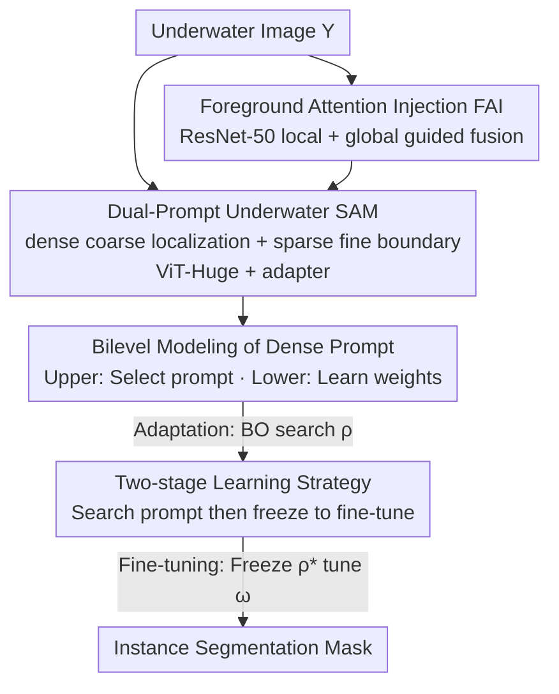

# BiPA: Bilevel Prompt Adaptation for Underwater Instance Segmentation

**Conference**: CVPR 2026  
**Paper**: [CVF Open Access](https://openaccess.thecvf.com/content/CVPR2026/html/Ma_BiPA_Bilevel_Prompt_Adaptation_for_Underwater_Instance_Segmentation_CVPR_2026_paper.html)  
**Code**: https://github.com/ZeAstra/BiPA  
**Area**: Underwater Instance Segmentation / Segmentation  
**Keywords**: Underwater Instance Segmentation, SAM Adaptation, Bilevel Optimization, Prompt Learning, Bayesian Optimization  

## TL;DR
BiPA reformulates SAM's dense prompt learning as a bilevel optimization problem with "prompts at the upper level and model parameters at the lower level." It employs Bayesian optimization and a two-stage training strategy to make the problem solvable, combined with a Foreground Attention Injection (FAI) module to restore local details. This efficiently transfers the general SAM to severely degraded underwater scenes, achieving mAP scores that comprehensively surpass previous SOTAs on UIIS and USIS10K datasets.

## Background & Motivation

**Background**: Underwater instance segmentation aims to segment each target instance and predict precise masks within turbid, scattering, and wavelength-dependent absorbing non-air media, supporting tasks like ecological monitoring and resource exploration. SAM exhibits strong general segmentation and zero-shot capabilities due to its billion-mask pre-training, leading recent works (UWSAM, USIS-SAM) to attempt transferring SAM's visual priors to underwater environments.

**Limitations of Prior Work**: There is a significant domain gap between underwater and air domains—scattering and color casts shift the overall data distribution, eroding the "prompt→mask" generalization learned by SAM in air. Direct application results in a sharp performance drop. Existing SAM adaptation methods (e.g., USIS-SAM) typically freeze dense prompts and only tune other parts, lacking an explicit mechanism to bridge the domain gap and fully exploit SAM's knowledge.

**Key Challenge**: Dense prompts and model parameters are mutually coupled—stronger dense prompts reshape the loss landscape and descent trajectory, while model weights in turn constrain the feasible space of the prompt. However, vanilla end-to-end joint training updates these two variables simultaneously, erasing the underlying leader-follower relationship, which leads to poor prompt learning and convergence to local optima (the blue path in Fig.4).

**Goal**: When adapting SAM to underwater environments, explicitly model the mutual dependence between prompts and parameters to learn a truly domain-specific dense prompt for underwater scenarios, ensuring correct and efficient cross-domain adaptation.

**Key Insight**: The authors borrow the perspective of hyperparameter learning—since dense prompts essentially act as "hyperparameters" that modulate model behavior, they should be optimized using a hierarchical structure where the upper level selects prompts and the lower level learns weights, rather than treating them as ordinary learnable parameters for simultaneous gradient descent.

**Core Idea**: Formulate dense prompt learning as a bilevel optimization problem (upper level uses the validation set to select prompts; lower level uses the training set to learn weights). A two-stage strategy—"Bayesian optimization for prompt searching + frozen prompt model fine-tuning"—is adopted to solve this originally expensive bilevel problem.

## Method

### Overall Architecture

BiPA consists of two main components: an underwater SAM backbone with **dual prompts** and a **Foreground Attention Injection (FAI)** module; these are wrapped in a **bilevel optimization + two-stage training** workflow that treats the dense prompt as a hyperparameter.

The input is an underwater image $Y$. The backbone uses a ViT-Huge enhanced with adapters as an image encoder to extract global features, while the SAM mask decoder predicts instance masks conditioned on both dense and sparse prompts. Unlike USIS-SAM which freezes dense prompts, BiPA enables end-to-end joint learning of both dense (coarse region prior, target localization) and sparse (boundary refinement) prompt paths. In parallel, a frozen ResNet-50 extracts multi-scale local features, which are injected back into the ViT features via the FAI module under global context guidance to compensate for local underwater details often lost by ViT's global self-attention. During training, only the dual prompts, adapters, and the FAI module are fine-tuned; the rest remain frozen.

The key lies in the fact that the dense prompt is not updated alongside model parameters. Instead, it is placed at the upper level for Bayesian optimization: the process iterates through an "Adaptation Phase"—the lower level runs $K_a$ steps on the training set to learn weights, and the upper level runs $K_b$ steps using Optuna to search for prompts, with warm-starts for the next round. After obtaining the optimal prompt $\rho^*$, the "Fine-tuning Phase" begins, freezing $\rho^*$ to fine-tune model parameters on the training set until convergence.

### Key Designs

**1. Dual-Prompt Underwater SAM + FAI: Restoring Lost Local Foreground**

ViT encoders rely on global self-attention; in low-quality underwater images, they often lose small local structures and struggle in turbid, low-contrast regions. BiPA addresses this by first splitting SAM's prompts into a dual-prompt synergy: the dense prompt provides a coarse region prior for localization, while the sparse prompt (generated by a sparse prompt generator) refines boundaries into precise masks. Both are learned jointly. Secondly, the FAI module injects local foreground cues: a frozen ResNet-50 extracts multi-scale features $\{G_v\}_{v\in\{1,2,3,4\}}$, and the ViT extracts $\{F_u\}$ at layers 8/16/24/32, with both paths aligned in spatial resolution.

During injection, each path is purified—the ResNet branch uses Efficient Multi-scale Attention to get $\bar G_v=\mathrm{EMA}(G_v)$, and the ViT branch uses a scale-aware sampling operator $\bar F_u=\mathrm{SS}(F_u)$, which decides upsampling/identity/downsampling based on resolution. Finally, a weight generator $\varphi$ performs global-guided fusion:

$$H_o = (1-\alpha)\odot \bar G_v + \alpha\odot \bar F_u,\quad \alpha=\varphi(\bar F_u,\bar G_v),$$

where $\varphi$ analyzes features from the heterogeneous backbones and outputs position-wise correlation weights $\alpha$. This fusion uses ViT's global context as a condition to decide whether to "trust local or global," proving more stable than simple summation—summation fusion achieves only 43.5 mAP, while FAI reaches 45.2.

**2. Bilevel Modeling of Dense Prompt: Explicit Dependency via Hyperparameters**

Vanilla joint training updates the dense prompt $\rho$ and model parameters $\omega$ simultaneously via gradients, blurring their underlying relationship. BiPA adopts a hyperparameter learning perspective, formulating dense prompt learning as a bilevel problem—upper level selects prompts on the validation set, lower level learns weights on the training set:

$$\min_{\rho} f\big(\rho,\omega(\rho);\mathcal{D}_{val}\big),\quad \text{s.t. }\ \omega(\rho)\in\arg\min_{\omega} g\big(\omega,\rho;\mathcal{D}_{tr}\big).$$

By treating the dense prompt $\rho$ as a hyperparameter for $\omega$, an optimization boundary is established: $\mathcal{D}_{val}$ is used only for prompt selection, and weights $\omega$ are learned only from $\mathcal{D}_{tr}$ without participating in the upper-level gradient update. Thus, the lower level $g$ optimizes $\omega$ given $\rho$, and the upper level $f$ optimizes $\rho$ given $\omega$, forming an explicit hierarchy: the lower-level solution $\omega(\rho)$ guides prompt learning to enhance cross-domain adaptation, while the upper-level prompt $\rho$ shapes the lower-level loss landscape. For losses, $f:=\ell_m$ (mask pixel BCE) and $g:=\ell_s=\ell_c+\ell_b+\ell_m$ (standard Mask R-CNN loss), with the upper level focusing solely on mask quality.

**3. Two-Stage Learning Strategy: Bayesian Optimization Instead of Hypergradient**

A standard solution for bilevel problems is hypergradient—unrolling inner training steps or using implicit differentiation. However, while BLO-SAM targets few-shot (2–8 images) scenarios, the inner loop here involves 7,442 images from USIS10K, which is nearly three orders of magnitude larger. Calculating hypergradients across a large dataset over multiple inner iterations is computationally prohibitive.

BiPA overcomes this by treating the upper level as a black box and using **Bayesian Optimization (BO)** to search for hyperparameters. In the **Adaptation Phase**, it learns a 256-dimensional dense prompt embedding from scratch. To make BO feasible, it divides the embedding into $N_g=16$ groups, each associated with a scalar weight, reducing the search space from 256 to 16 dimensions. Only group weights are updated to minimize the validation objective:

$$\rho_{k+1}=\mathrm{Optuna}\big(\rho_k,\omega_{K_a},s_0,N,B,f,\mathcal{D}_{val}\big),$$

where $\rho_k$ is the current weight modulating the 256-d prompt, $\omega_{K_a}$ are parameters after $K_a$ inner steps under $\rho_k$, and $s_0$ is the initial search space. Optuna returns the next candidate to minimize $f$. In each outer round $t\le T$: given $\rho_t$, the inner loop runs $K_a$ steps on $g$, then fixed $\omega_{K_a}$ is used to search $\rho$ for $K_b$ steps via BO, followed by a warm-start $\omega_0\leftarrow\omega_{K_a}$ for the next round. In the **Fine-tuning Phase**, $\rho^*$ is frozen, and model parameters are updated on $\mathcal{D}_{tr}$ for $K_c$ steps or until convergence:

$$\omega_{k+1}=\omega_k-\bar\eta_\omega\frac{\partial g(\omega_k,\rho^*;\mathcal{D}_{tr})}{\partial\omega}.$$

Intuition (Fig.4): Within the same $T$ steps, the naive path reaches a suboptimal region, while BiPA follows a shorter, straighter trajectory by first identifying the correct prompt, nearing the global optimum.

### Loss & Training
BiPA follows the standard Mask R-CNN loss for underwater instance segmentation: $\ell_s=\ell_c+\ell_b+\ell_m$ (classification cross-entropy + smooth-$\ell_1$ regression + pixel-wise BCE). In the bilevel setup, the upper target is $f:=\ell_m$ and the lower is $g:=\ell_s$. ViT-Huge and ResNet-50 (ImageNet pre-trained) are frozen. Input is resized to $1024\times1024$, batch size 2, using AdamW with an initial learning rate of $1\times10^{-4}$ and weight decay of $1\times10^{-3}$. Iteration hyperparameters are $K_a=30, K_b=21, K_c=7, T=3$. Implemented with MMDetection on a single RTX 4090.

## Key Experimental Results

### Main Results
Underwater instance segmentation on UIIS: BiPA achieves the best performance across all five metrics, with a relative mAP gain of over 8% compared to USIS-SAM.

| Method | mAP | AP50 | AP75 | APs | APm | APl |
|------|-----|------|------|-----|-----|-----|
| Mask2Former | 28.1 | 42.9 | 30.5 | 5.3 | 22.5 | 43.5 |
| WaterMask (Underwater tailored) | 26.4 | 43.6 | 28.8 | 9.1 | 21.1 | 38.1 |
| USIS-SAM (Prev. SOTA) | 29.5 | 45.9 | 31.9 | 8.1 | 23.8 | 41.0 |
| **BiPA (Ours)** | **32.1** | **48.7** | **35.2** | 7.2 | **25.6** | **45.6** |

Salient instance segmentation on USIS10K (multi-class / class-agnostic), with mAP at least 5% higher than the runner-up:

| Method | MC mAP | MC AP50 | MC AP75 | CA mAP | CA AP50 | CA AP75 |
|------|--------|---------|---------|--------|---------|---------|
| ConvNeXt-V2 | 39.5 | 55.4 | 44.5 | 62.3 | 85.0 | 72.5 |
| WaterMask | 37.7 | 54.0 | 42.5 | 58.3 | 80.2 | 66.5 |
| USIS-SAM | 43.1 | 59.0 | 48.5 | 59.7 | 81.6 | 67.7 |
| **BiPA (Ours)** | **45.2** | **60.5** | **52.5** | **64.2** | **85.1** | **74.0** |

### Ablation Study

Comparison of learning strategies (frozen / naive / BiPA, Table 3) + intermediate two-stage results (Table 4) + FAI necessity (Fig.9):

| Configuration | UIIS mAP | USIS10K mAP | Remarks |
|------|----------|-------------|------|
| Frozen (Prompt frozen) | 30.9 | 44.4 | Retains SAM prior but only captures coarse shapes |
| Naive (Joint update) | 31.3 | 43.6 | Minimal improvement over frozen; validates Fig.4 local optima |
| **BiPA** | **32.1** | **45.2** | Bilevel + two-stage; highest across all metrics |
| Adaptation phase only | 29.8 | — | Already achieves usable segmentation |
| + Fine-tuning phase | 32.1 | — | Freeze $\rho^*$ and tune; UIIS mAP +2.3 |
| FAI summation fusion | — | 43.5 | Summation is inferior to FAI (45.2), proving FAI necessity |

Parameter analysis (Table 5, UIIS): Optimization interval $B=[1,3]$ is optimal (mAP 32.1). Group number $N_g=16$ is best; too many groups lead to performance drops (8→31.5, 16→32.1, 32→30.8).

### Key Findings
- **The two-stage strategy is the core gain source**: The adaptation phase alone achieves 29.8 mAP, proving the value of learning an underwater dense prompt. Fine-tuning the model afterward pushes UIIS mAP to 32.1 (+2.3), confirming that "searching for the right prompt first, then tuning weights independently" is more effective than simultaneous updates.
- **Naive joint training is largely ineffective**: Direct joint updates are only marginally better than freezing (31.3 vs 30.9) with no significant improvement in boundaries. This supports the motivation that blurring prompt-parameter dependencies leads to suboptimal results.
- **Low cost, high gain**: Compared to USIS-SAM, BiPA uses 5.59% more parameters and only 0.42% more FLOPs (737M / 3314G vs 698M / 3300G), yet improves the average mAP across two datasets by 6.95%, making it more cost-effective.
- **Preserved SAM generalization**: When applying models trained on UIIS to unseen categories in USIS10K (e.g., Artiodactyla, Mollusk, Garbage), BiPA's zero-shot performance provides more complete and accurate masks than WaterMask and USIS-SAM.

## Highlights & Insights
- **Treating prompts as hyperparameters and using bilevel optimization to model the prompt↔parameter dependency** is the most innovative aspect. it provides a clear optimization boundary (validation set for prompts, training set for weights), theoretically explaining why naive joint training fails to learn dense prompts effectively.
- **Using Bayesian Optimization to bypass hypergradients** is a pragmatic engineering choice. Since unrolled bilevel solvers are unfeasible for 7,442 images, treating the upper level as a black box and compressing the 256-d space into 16 groups makes bilevel optimization possible on a single 4090. This "bilevel optimization on large datasets" approach is transferable to other SAM or large model adaptation tasks.
- **FAI's global-guided fusion** is not a simple concatenation. It uses $\varphi$ to output position-wise weights $\alpha$, allowing the ViT global context to determine whether to trust local or global cues, providing a lightweight yet effective fix for ViT's lack of local details.

## Limitations & Future Work
- **Real-time performance is limited**: The combination of dual prompts, FAI, and ViT-Huge is computationally heavy. Future work aims to use knowledge distillation for hardware-aware lightweighting and extend the bilevel framework to strict efficiency constraints.
- **Lack of quantitative evidence for unseen category generalization**: Due to the lack of reliable category mapping between UIIS and USIS10K, the authors only provide qualitative visual comparisons; quantitative cross-domain generalization lacks solid metric support.
- **Hyperparameter sensitivity**: Bayesian optimization introduces several hyperparameters ($K_a/K_b/K_c/T/N_g/B$). While the paper provides default values, the search cost and reproducibility are sensitive to computing power.

## Related Work & Insights
- **vs USIS-SAM**: Both use a dual-prompt SAM backbone, but USIS-SAM freezes the dense prompt. BiPA learns dense prompts end-to-end via bilevel optimization and adds FAI for local foreground injection—trading +5.59% parameters / +0.42% FLOPs for +6.95% average mAP.
- **vs BLO-SAM**: Both use bilevel optimization to adapt SAM. However, BLO-SAM focuses on few-shot semantic segmentation (2–8 images) using hypergradients. BiPA targets instance segmentation with tens of thousands of images, where hypergradients are infeasible, leading to the use of Bayesian Optimization as a black-box search—a key distinction for scaling bilevel prompt learning.
- **vs WaterMask**: WaterMask is a Mask R-CNN adapted for underwater use from scratch. BiPA follows the route of "transferring SAM's large-scale priors + efficient cross-domain adaptation," providing clearer boundaries and better generalization in turbid, low-contrast, and unseen category scenarios.

## Rating
- Novelty: ⭐⭐⭐⭐⭐ First to introduce bilevel optimization to underwater instance segmentation, modeling dense prompts as hyperparameters for parameter dependency.
- Experimental Thoroughness: ⭐⭐⭐⭐ Comprehensive results on two datasets plus extensive ablations on strategy/stages/FAI/parameters, though cross-domain generalization is only qualitatively supported.
- Writing Quality: ⭐⭐⭐⭐ Clear chain from motivation to formula to algorithm; Fig.4 intuitively explains the core optimization intuition.
- Value: ⭐⭐⭐⭐ Provides a transferable paradigm for "low-cost bilevel prompt adaptation on large datasets," offering valuable insights for SAM domain adaptation.

<!-- RELATED:START -->

## Related Papers

- [\[AAAI 2026\] Empowering DINO Representations for Underwater Instance Segmentation via Aligner and Prompter](../../AAAI2026/segmentation/empowering_dino_representations_for_underwater_instance_segmentation_via_aligner.md)
- [\[CVPR 2026\] Test-Time Multi-Prompt Adaptation for Open-Vocabulary Remote Sensing Image Segmentation](test-time_multi-prompt_adaptation_for_open-vocabulary_remote_sensing_image_segme.md)
- [\[CVPR 2026\] Exploring the Underwater World Segmentation without Extra Training](exploring_the_underwater_world_segmentation_without_extra_training.md)
- [\[CVPR 2026\] MARIS: Marine Open-Vocabulary Instance Segmentation](maris_marine_open-vocabulary_instance_segmentation.md)
- [\[CVPR 2026\] SouPLe: Enhancing Audio-Visual Localization and Segmentation with Learnable Prompt Contexts](souple_enhancing_audio-visual_localization_and_segmentation_with_learnable_promp.md)

<!-- RELATED:END -->
