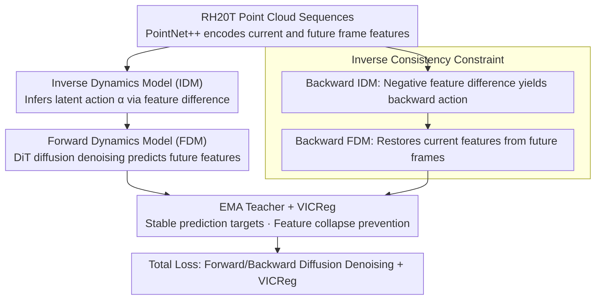

# AFRO: Bootstrap Dynamic-Aware 3D Visual Representation for Scalable Robot Learning

**Conference**: CVPR 2026  
**arXiv**: [2512.00074](https://arxiv.org/abs/2512.00074)  
**Code**: [Project Page](https://kolakivy.github.io/AFRO/)  
**Area**: Image Segmentation  
**Keywords**: 3D representation learning, dynamic-aware, inverse dynamics model, forward dynamics model, diffusion Transformer, robot manipulation  

## TL;DR
This paper proposes AFRO, a self-supervised 3D visual pre-training framework. By employing an Inverse Dynamics Model (IDM) to infer latent actions, a Forward Dynamics Model (FDM) based on Diffusion Transformers to predict future features, and an inverse consistency constraint to ensure temporal symmetry, the method achieves an average success rate of 76.0% on MetaWorld 14 tasks after pre-training on the large-scale RH20T dataset (vs. 64.9% for DynaMo-3D and 63.9% for PointMAE). It also achieves state-of-the-art results on four real-world tasks.

## Background & Motivation
3D visual representations offer natural advantages in robot manipulation by providing precise spatial geometric information. However, existing 3D pre-training methods perform poorly on downstream robotic tasks due to two fundamental issues:

1. **Lack of Dynamic Awareness**: Existing methods (e.g., PointMAE, Point-BERT) utilize single-frame mask-and-reconstruct objectives, learning only static geometric features. Since robot manipulation is inherently a temporal dynamic task, it requires understanding the evolution of a scene based on actions.

2. **Redundant Background Reconstruction**: Point cloud reconstruction objectives treat the entire scene equally, wasting computation on static backgrounds like tables and walls, while critical information is concentrated in object interaction regions.

Previous efforts to incorporate dynamic awareness (e.g., DynaMo) are restricted to 2D images. Extending these to 3D point clouds introduces new challenges such as feature leakage and multi-modal uncertainty.

## Core Problem
How can a 3D visual pre-training encoder be designed to automatically learn dynamic information relevant to robot manipulation instead of merely learning static geometry? Furthermore, how can dynamic-aware self-supervised learning be achieved without the need for labeled action data (using "in-the-wild" videos)?

## Method

### Overall Architecture

AFRO is a self-supervised 3D visual pre-training framework designed to encourage point cloud encoders to learn "manipulation-relevant dynamic information." It decomposes "action understanding" into a pair of reciprocal models: an Inverse Dynamics Model (IDM) that infers "what was done" (latent action) from two consecutive frames, and a Forward Dynamics Model (FDM) that predicts "what will happen" (future features) based on the current frame and the latent action. An inverse consistency constraint ensures temporal symmetry and prevents collapse, while an EMA Teacher paired with VICReg provides stable prediction targets and prevents feature collapse. The system is pre-trained on large-scale real-world data from RH20T using PointNet++ as the backbone, without any action labels.

### Key Designs

**1. Inverse Dynamics Model (IDM) — Inferring "what was done" via feature differences to block leakage**

Given current frame features $z_t$ and future frame features $z_{t+k}$, the IDM infers implicit latent actions $\alpha = f_{\text{IDM}}(z_{t+k} - z_t)$. The use of the difference $z_{t+k}-z_t$ rather than concatenation $[z_t, z_{t+k}]$ is critical: subtraction naturally removes static backgrounds present in both frames, forcing the IDM to focus on interaction regions. More importantly, concatenation allows the FDM to "see" the target frame and bypass action reasoning (feature leakage); the difference method effectively closes this shortcut.

**2. Forward Dynamics Model (FDM) — Modeling future multi-modal uncertainty with Diffusion Transformers**

Given the current frame $z_t$ and latent action $\alpha$, the FDM predicts future features $\hat{z}_{t+k} = f_{\text{FDM}}(z_t, \alpha)$. Since a single state and action pair can lead to multiple valid outcomes, deterministic regressors often output blurred averages. AFRO adopts a diffusion approach: based on a DiT (Diffusion Transformer) architecture, it injects the latent action $\alpha$ via AdaLN-Zero (Adaptive LayerNorm) and progressively denoises from $\hat{z}_{t+k}^{(T)}$ to $\hat{z}_{t+k}^{(0)}$. The target is the feature produced by an EMA Teacher encoder (rather than raw point clouds), allowing the model to represent the distribution of "possible futures."

**3. Inverse Consistency Constraint — Temporal symmetry for dual supervision**

If $z_t \xrightarrow{\alpha} z_{t+k}$ holds, the reverse should also be valid. Thus, the model computes a backward action $\alpha_{t+k \to t} = f_{\text{IDM}}(z_t - z_{t+k})$ and requires the restoration of $\hat{z}_t = f_{\text{FDM}}(z_{t+k}, \alpha_{t+k \to t})$. This constraint prevents IDM/FDM from converging to trivial solutions and structures the latent action space (where forward and backward operations are inverses) without requiring labels.

**4. EMA Teacher + VICReg — Stable targets and collapse prevention**

Training diverges if prediction targets shift too rapidly alongside the student. AFRO uses a slowly updated ($\tau \to 1$) EMA Teacher encoder to generate stable target features. A VICReg loss aligns the student and teacher feature spaces: the Variance term prevents collapse, the Invariance term handles student-teacher alignment, and the Covariance term reduces redundancy across feature dimensions.

### Loss & Training

- **Pre-training Data**: RH20T (Robot Hands from 20 Tasks) — a large-scale real-world robot manipulation dataset, with point clouds back-projected from RGB-D images using camera intrinsics.
- **Temporal Stride $k$**: Randomly sampled during training to enhance multi-scale dynamic learning.
- **Backbone**: PointNet++ as the 3D encoder.

The total loss consists of forward/backward diffusion denoising losses and a VICReg loss:

$$\mathcal{L} = \mathcal{L}_{\text{FDM}}^{\text{fwd}} + \mathcal{L}_{\text{FDM}}^{\text{bwd}} + \lambda_{\text{VIC}} \mathcal{L}_{\text{VICReg}}$$

where $\mathcal{L}_{\text{FDM}}$ is the diffusion denoising loss (MSE between predicted and ground-truth noise).

## Key Experimental Results

### Main Results: MetaWorld 14 Tasks Average Success Rate

| Method | Pre-training | Average Success Rate |
|------|-----------|-----------|
| PointMAE | Single-frame reconstruction | 63.9% |
| Point-BERT | Single-frame reconstruction | 60.2% |
| DynaMo-3D | Dynamic-aware (Deterministic) | 64.9% |
| **AFRO** | **Dynamic-aware (Diffusion)** | **76.0%** |

AFRO achieves a +11.1% Gain over DynaMo-3D and +12.1% over PointMAE.

### Adroit 2 Tasks

| Method | Pen | Door | Average |
|------|-----|------|------|
| PointMAE | — | — | Lower |
| DynaMo-3D | — | — | Medium |
| **AFRO** | — | — | **Ours (Best)** |

### Real-world 4 Tasks
AFRO achieves the highest success rate across four real-world manipulation tasks, validating its sim-to-real transfer capability.

### Ablation Study

| Ablation Item | Change in Performance |
|--------|---------|
| W/o IDM (No dynamic awareness) | Significant Decrease |
| FDM using MLP instead of DiT | Decrease (Inability to model multi-modal uncertainty) |
| W/o Inverse Consistency | Decrease (Susceptible to trivial solutions) |
| Concatenation instead of Feature Difference | Decrease (Feature leakage) |
| W/o VICReg | Decrease (Feature collapse) |

## Highlights & Insights
- **Feature Difference Solves Feature Leakage**: Using $z_{t+k} - z_t$ instead of concatenation is a simple yet critical design that naturally filters static background and prevents information leakage.
- **Diffusion Transformer for Multi-modal Futures**: Recognizing the multi-modal uncertainty of robot manipulation, using a diffusion process is more principled than deterministic regression.
- **Inverse Consistency Constraint**: Provides double the supervision signal without additional labels and enhances the structure of the latent action space.
- **Large-scale Pre-training + Comprehensive Evaluation**: A complete pipeline from RH20T pre-training to validation on MetaWorld, Adroit, and real-world scenarios.
- **Purely Self-supervised**: Does not require manual action labels, enabling the use of vast amounts of in-the-wild robotic videos.

## Limitations & Future Work
- **Aging Encoder**: PointNet++ is used; more modern 3D backbones (e.g., PointTransformerV3, Mamba3D) have not been explored.
- **Diffusion Inference Speed**: The iterative denoising process of FDM may impact real-time performance during inference.
- **Single Dataset Focus**: Only RH20T is used; joint pre-training on multiple datasets or internet-scale data remains unexplored.
- **Task Scope**: Primarily validated on tabletop manipulation; navigation or whole-body motion tasks have not been tested.
- **Point Cloud Quality**: Performance depends on the quality of RGB-D sensors and point cloud preprocessing.

## Related Work & Insights
- **DynaMo (NeurIPS 2024)**: 2D dynamic-aware pre-training using deterministic MLPs for FDM. AFRO extends this to 3D and handles multi-modality via diffusion, achieving a +11.1% Gain on MetaWorld.
- **PointMAE / Point-BERT**: Classic 3D self-supervised methods using single-frame mask-and-reconstruct objectives. AFRO introduces temporal dynamics, effectively upgrading from "how it looks" to "how it moves."
- **R3M / VIP**: 2D visual pre-training for robotics based on temporal contrastive learning. AFRO learns features through physically consistent dynamics in 3D space.
- **SPA (Robotic Pretraining)**: Joint semantic-geometric pre-training without dynamic modeling. AFRO focuses specifically on the dynamic awareness dimension.

## Rating
- Novelty: ⭐⭐⭐⭐⭐ — The synergy between IDM feature difference, diffusion FDM, and inverse consistency shows strong originality.
- Experimental Thoroughness: ⭐⭐⭐⭐ — Comprehensive testing across MetaWorld, Adroit, and real-world environments, though more 3D backbone comparisons would be beneficial.
- Writing Quality: ⭐⭐⭐⭐ — Clear motivation, logical methodological derivation, and intuitive illustrations.
- Value: ⭐⭐⭐⭐⭐ — Significant performance gains and a clear direction for dynamic-aware 3D robotic vision pre-training.

<!-- RELATED:START -->

## Related Papers

- [\[CVPR 2026\] Bootstrap Your Own AV-Proxies: Adaptive Contrastive and Prototype Learning for Audio-Visual Segmentation](bootstrap_your_own_av-proxies_adaptive_contrastive_and_prototype_learning_for_au.md)
- [\[CVPR 2026\] Structure-Aware Representation Distillation for Tiny-Dense Object Segmentation](structure-aware_representation_distillation_for_tiny-dense_object_segmentation.md)
- [\[CVPR 2026\] Synthetic Object Compositions for Scalable and Accurate Learning in Detection, Segmentation, and Grounding](synthetic_object_compositions_for_scalable_and_accurate_learning_in_detection_se.md)
- [\[ICCV 2025\] Region-based Cluster Discrimination for Visual Representation Learning](../../ICCV2025/segmentation/region-based_cluster_discrimination_for_visual_representation_learning.md)
- [\[CVPR 2026\] SARMAE: Masked Autoencoder for SAR Representation Learning](sarmae_masked_autoencoder_for_sar_representation_learning.md)

<!-- RELATED:END -->
