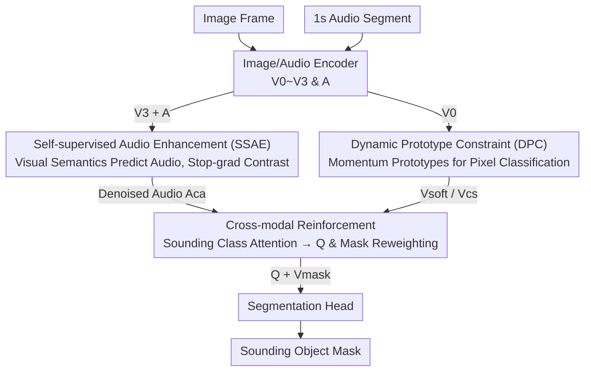

# Bootstrap Your Own AV-Proxies: Adaptive Contrastive and Prototype Learning for Audio-Visual Segmentation

**Conference**: CVPR 2026  
**Paper**: [CVF Open Access](https://openaccess.thecvf.com/content/CVPR2026/html/Zhang_Bootstrap_Your_Own_AV_Proxies_Adaptive_Contrastive_and_Prototype_Learning_for_CVPR_2026_paper.html)  
**Code**: None  
**Area**: Audio-Visual Segmentation / Multimodal  
**Keywords**: Audio-Visual Segmentation, Self-supervised Contrastive Learning, Prototype Learning, Cross-modal Alignment, Intra-modal Denoising

## TL;DR
Addressing the "intra-modal noise + audio-visual semantic gap" in audio-visual segmentation (AVS), this paper proposes BYOAVP. It utilizes BYOL-style negative-free contrastive learning (SSAE) to allow high-level visual semantics to supervise audio, suppressing off-screen/background noise. Additionally, it employs momentum-updated dynamic prototypes (DPC) for pixel-level classification and cross-modal reinforcement of sounding regions. Without any priors like SAM or offline prototypes, it achieves SOTA performance across six sub-tasks on AVSBench and VPO datasets.

## Background & Motivation
**Background**: Audio-Visual Segmentation (AVS) aims to extract "sounding objects" pixel-by-pixel from video frames. Early works (AVSBench, CATR, AVSegFormer, etc.) focused on cross-modal interaction and spatio-temporal correlation, using audio as a query to retrieve visual features for dense prediction. Recent methods have shifted toward introducing priors for denoising: either using masks generated by SAM / Semantic-SAM as visual priors, or guiding pixel clustering with offline-clustered prototype centers (e.g., COMBO, VCT, RAVS, DDESEG).

**Limitations of Prior Work**: Both mainstream approaches have drawbacks. Traditional feature fusion struggles to suppress "fusion noise"—where visual targets and background share similar semantics, and audio sources overlap in frequency. This **intra-modal noise** is amplified during cross-modal fusion, leading to blurred boundaries or incomplete masks (e.g., segmenting a guitar body but missing the headstock). Conversely, methods relying on data-dependent priors (SAM masks, offline prototypes) introduce complexity, additional computational overhead, and poor cross-domain generalization, as offline priors often fail on in-the-wild data.

**Key Challenge**: To suppress intra-modal noise and achieve fine-grained pixel discrimination, existing methods are either insufficiently clean (pure fusion) or rely on external priors at the cost of "complexity ↑, generalization ↓." Fundamentally, there is a lack of a **fully adaptive, prior-free** denoising and alignment mechanism.

**Goal**: The problem is decomposed into two sub-problems: (1) How to narrow the audio-visual semantic gap and denoise audio without relying on manual positive/negative pairs or fixed thresholds; (2) How to learn class prototypes online to constrain pixel classification and reinforce sounding regions without offline prototypes.

**Key Insight**: The authors draw inspiration from the "negative-free + stop-gradient" approach of BYOL / SimSiam in self-supervised learning. Since these methods can learn stable discriminative features without explicit negative samples or sensitivity to batch size, the authors adapt this from uni-modal to cross-modal learning: treating audio and vision as two "views" of the same instance and letting high-level visual semantics predict/supervise the audio branch.

**Core Idea**: **Bootstrap audio via visual semantics (SSAE) + constrain pixels with online momentum prototypes (DPC)**. This fully adaptive, zero-prior mechanism achieves fine-grained audio-visual pixel alignment while suppressing intra-modal noise.

## Method

### Overall Architecture
BYOAVP inputs an image frame and a corresponding 1-search audio segment, outputting the segmentation mask for sounding objects (binary for S4/MS3, semantic for AVSS). The image passes through a hierarchical encoder yielding four-level features $V_0\!\sim\!V_3$, while audio is encoded into $A$ using HTSAT from CLAP. Two core modules are integrated: **SSAE** uses the highest-level visual feature $V_3$ to align and enhance audio, producing a denoised audio embedding $A_{ca}$; **DPC** uses the lowest-level visual feature $V_0$ for pixel classification under dynamic prototype constraints. Finally, $A_{ca}$ interacts with classified visual features cross-modally to generate "target-enhanced" mask features $V_{mask}$ and a semantically aligned query $Q$, which are fed into the segmentation head.

The overall pipeline is a serial sequence: "Encoding → Dual-path Denoising (SSAE for audio, DPC for vision) → Cross-modal Reinforcement → Segmentation Head":

### Key Designs

**1. SSAE: Cross-modal BYOL to Supervise Audio with Vision**

To address heavy background/off-screen noise in audio and the semantic gap, SSAE treats audio and vision as two views for BYOL-style contrastive learning with three cross-modal adaptations. First, **pre-projection cross-modal alignment**: mapping $V_{pool}$ (global visual semantics from $V_3$ via attention pooling) directly to audio $A$ is difficult due to the large gap, so a multi-head cross-modal attention layer is used with **$V_{pool}$ as query and $A$ as key/value** to obtain early-aligned audio $A_{ca} = A + \mathrm{Softmax}\!\big((V_{pool}W_2^q)(AW_2^k)^\top/\sqrt{D}\big)(AW_2^v)$. Second, **non-shared branch weights**: unlike uni-modal contrastive learning, two independent projection heads are used. Third, **audio-only gradient backpropagation**: the predictor is placed on the audio side to map audio embeddings into the visual semantic space. The loss uses stop-gradient negative cosine similarity:

$$\mathcal{L}_{ssc} = -\,\frac{\mathrm{sg}(V_{pool})\odot A_{pred}}{\|V_{pool}\|_2\,\|A_{pred}\|_2}$$

This forces the "predicted audio embedding" to approximate the visual representation. Vision acts as a stable teacher (stop-gradient), while backpropagation constrains only audio to suppress noise and amplify target semantics. This avoids manual pairs/thresholds and handles small batch sizes (typical in AVS) by replacing the final BatchNorm in the projection head with GroupNorm ($F = \mathrm{GN}(\mathrm{ReLU}(\mathrm{BN}(FW_1^p))W_2^p)$).

**2. DPC: Online Momentum Prototypes for Pixel Classification**

Unlike methods relying on SAM masks or offline prototypes, DPC uses a **randomly initialized prototype bank** $P_{bank}\in\mathbb{R}^{K\times C_0}$ ($K$ = number of classes), updated online based on the class distribution of each batch. The lowest-level visual feature $V_0$ enters Proto Tessellation: similarity logits $P_l=V_0 P_{bank}^\top$ are added to the class-space projection $V_l$ and passed through Gumbel-Softmax for soft assignment $V_{soft}=\mathrm{Softmax}\big((V_0W_5^p+P_l+G_{noise})/\tau\big)$. Class-level semantic embeddings $V_{cs}$ are derived from $V_{soft}$ and $V_0$. Prototypes are updated using momentum with an adaptive weight $w_{ada}=(1-w_m)(1+P_{count}/N)$, where categories with larger pixel areas in the frame receive stronger updates. The adaptive prototype loss $\mathcal{L}_{ap}$ is defined as:

$$\mathcal{L}_{ap} = -\frac{1}{N}\sum_{n=1}^{N}\sum_{k=1}^{K} V_{soft}^{(n,k)}\odot P_{log}^{(n,k)}$$

This makes the prototype distribution more interpretable and discriminative without offline mismatch.

**3. Cross-modal Reinforcement: Lighting Up Sounding Regions**

After classifying pixels, the model must determine which classes are actually sounding and enhance those regions. A cross-modal attention layer uses denoised audio $A_{ca}$ as query and category embeddings $V_{cs}$ as key/value to calculate attention scores $w_s=\mathrm{Softmax}\big((A_{ca}W_3^q)(V_{cs}W_3^k)^\top\big)$, representing the sounding classes. These are used to aggregate the final query $Q=A_{ca}\odot\big(w_s(V_{cs}W_3^v)\big)$. Simultaneously, $w_s$ and $V_{soft}$ produce a pixel-level category weight map $M=\mathrm{Reshape}(w_s V_{soft})$, which enhances the visual features $V_{mask}=\mathrm{Reshape}(V_0+V_0\odot M)$. This injects "which classes are sounding" into the query and "where to light up" into the pixels, improving fine-grained discrimination.

### Loss & Training
The total loss consists of three parts: segmentation loss $\mathcal{L}_{seg}=\mathcal{L}_{bce}+\mathcal{L}_{dice}+\lambda_f\mathcal{L}_{focal}$, self-supervised contrastive loss $\mathcal{L}_{ssc}$, and adaptive prototype loss $\mathcal{L}_{ap}$, combined as $\mathcal{L}=\lambda_{seg}\mathcal{L}_{seg}+\lambda_{ssc}\mathcal{L}_{ssc}+\lambda_{ap}\mathcal{L}_{ap}$ with weights $\lambda_{seg}{=}5,\lambda_{ssc}{=}0.1,\lambda_{ap}{=}1$. The visual encoder is Swin-B (pretrained on ImageNet-21K), audio uses CLAP's HTSAT, and the pixel decoder is Deformable DETR. Training uses batch size 4, AdamW, lr 1e-4, and weight decay 0.05.

## Key Experimental Results

### Main Results

On three sub-tasks of AVSBench (J&F / J / F metrics), BYOAVP outperforms methods relying on SAM or offline prototypes (labeled with *):

| Dataset | Metric | BYOAVP | Runner-up | Gain |
|--------|------|--------|--------|------|
| AVS-Object-S4 | J&F | **95.0** | 94.2 (DDESEG*) | +0.8 |
| AVS-Object-MS3 | J&F | **80.5** | 79.9 (AuralSAM2*) | +0.6 |
| AVS-Semantic | J&F | **69.6** | 67.9 (DDESEG*) | +1.7 |

On the VPO synthetic dataset (testing multi-target and foreground-background distinction):

| Sub-task | Metric | BYOAVP | Runner-up | Gain |
|--------|------|--------|--------|------|
| VPO-SS | J&F | **75.5** | 75.0 (RAVS*) | +0.5 |
| VPO-MS | J&F | **77.2** | 74.3 (DDESEG*) | +2.9 |
| VPO-MSMI | J&F | **71.5** | 69.3 (RAVS*) | +2.2 |

Large gains on MS / MSMI highlight the model's advantage in "multi-object + same-class multiple instance" scenarios.

### Ablation Study

Component-level (AVS-Object-MS3 / AVS-Semantic, J&F):

| Configuration | MS3 J&F | AVSS J&F | Note |
|------|---------|----------|------|
| Baseline | 72.48 | 61.89 | Encoder + pixel decoder + head only |
| + SSAE | 76.22 | 65.08 | Audio denoising alone yields gain |
| + DPC | 77.98 | 67.40 | Prototype constraint alone yields gain |
| SSAE + DPC | **80.50** | **69.61** | Both modules: MS3 +8.02 / AVSS +7.72 |

SSAE Internal Design (CA=Pre-projection CMA, BN/GN=Normalization, MS3 J&F):

| CA | BN | GN | MS3 J&F | Note |
|----|----|----|---------|------|
| × | × | × | 77.98 | SSAE off (Baseline includes DPC) |
| ✓ | × | × | 77.54 | CA only → Decrease (modal bias w/o stability) |
| × | ✓ | × | 76.95 | BN only → Normalization alone fails gap |
| × | × | ✓ | 77.77 | GN only → Same as above |
| ✓ | ✓ | × | 78.85 | CA+BN |
| ✓ | × | ✓ | **80.50** | CA+GN (Best) |

### Key Findings
- **SSAE requires "Pre-alignment + Post-normalization" synergy**: Using CA / BN / GN individually is worse than disabling SSAE, as CA only introduces bias and normalization only stabilizes values; they must be combined to bridge the semantic gap.
- **GroupNorm (GN) significantly outperforms BatchNorm (BN) in small batches**: CA+GN is +1.65 / +0.85 J&F higher than CA+BN. t-SNE shows CA+GN produces more compact, separable audio features, especially for "hard" acoustic classes.
- **Complementary Modules**: SSAE and DPC independently improve performance, and their combination yields massive gains (+8.02 on MS3).
- **Maximum gain in multi-target scenarios**: Large gains on VPO-MS/MSMI prove cross-modal reinforcement is effective for "same-class multi-instance" and foreground-background confusion.

## Highlights & Insights
- **Systematic adaptation of BYOL/SimSiam to cross-modal denoising**: Using vision as a stable teacher with gradients only for audio avoids fragile manual pairs/thresholds, favoring both generalization and efficiency.
- **Pre-projection alignment is the "on-switch" for cross-modal contrastive learning**: Dips in performance without CA warn against direct contrastive learning between modalities without early alignment.
- **Engineering detail (GN vs. BN)**: In video tasks with batch < 8, normalization choice critically affects self-supervised stability—a highly reusable trick.
- **Online momentum prototypes**: Adaptive updates ($w_{ada}$ based on pixel ratios) allow the prototype library to evolve with data, outperforming offline SAM/clustering methods.

## Limitations & Future Work
- **Author's Perspective**: The method is validated on six benchmark sub-tasks, but failure cases and extreme noise boundaries are not deeply analyzed.
- **Independent Observations**: ① Parameter count is high (137M), which may hinder mobile deployment. ② Prototype bank size $K$ is fixed to the class count, raising questions about scalability for open-vocabulary tasks. ③ 1s audio granularity might be too coarse for rapid acoustic transitions. ④ Loss coefficients (e.g., $\lambda_s{=}10$) are empirically set.
- **Future Directions**: Exploring adaptive/growing prototype libraries for new classes; testing the stability limits of SSAE in varying batch sizes; extending cross-modal reinforcement to video-query-level temporal processing.

## Related Work & Insights
- **vs. RAVS / DDESEG (Prior-driven)**: These rely on offline prototypes or SAM masks. BYOAVP is fully online and zero-prior, achieving better generalization and performance with the same backbone.
- **vs. CAVP / CPM (Manual Contrast)**: These use manual pairs or similarity thresholds across samples. BYOAVP uses BYOL-style negative-free learning, which is more robust for in-the-wild data and computationally cheaper.
- **vs. AVSegFormer / CATR (Fusion-based)**: These fuse features directly and ignore intra-modal noise. BYOAVP denoises modalities individually before interaction.

## Rating
- Novelty: ⭐⭐⭐⭐ Adapting BYOL-style SSL to cross-modal denoising and online prototypes is a solid, well-integrated combination.
- Experimental Thoroughness: ⭐⭐⭐⭐⭐ SOTA on six sub-tasks across two datasets, comprehensive ablation of SSAE/DPC, and clear t-SNE/heatmap visualizations.
- Writing Quality: ⭐⭐⭐⭐ Clear motivation and module descriptions; some formula details require careful reading.
- Value: ⭐⭐⭐⭐ A zero-prior, online, efficient AVS paradigm with strong multi-target performance and reusable engineering tricks.

<!-- RELATED:START -->

## Related Papers

- [\[CVPR 2026\] AFRO: Bootstrap Dynamic-Aware 3D Visual Representation for Scalable Robot Learning](bootstrap_dynamic-aware_3d_visual_representation_for_scalable_robot_learning.md)
- [\[ICCV 2025\] Implicit Counterfactual Learning for Audio-Visual Segmentation](../../ICCV2025/segmentation/implicit_counterfactual_learning_for_audio-visual_segmentation.md)
- [\[CVPR 2026\] SouPLe: Enhancing Audio-Visual Localization and Segmentation with Learnable Prompt Contexts](souple_enhancing_audio-visual_localization_and_segmentation_with_learnable_promp.md)
- [\[CVPR 2026\] Heuristic Self-Paced Learning for Domain Adaptive Semantic Segmentation under Adverse Conditions](heuristic_self-paced_learning_for_domain_adaptive_semantic_segmentation_under_ad.md)
- [\[ICML 2026\] LightAVSeg: Lightweight Audio-Visual Segmentation](../../ICML2026/segmentation/lightavseg_lightweight_audio-visual_segmentation.md)

<!-- RELATED:END -->
