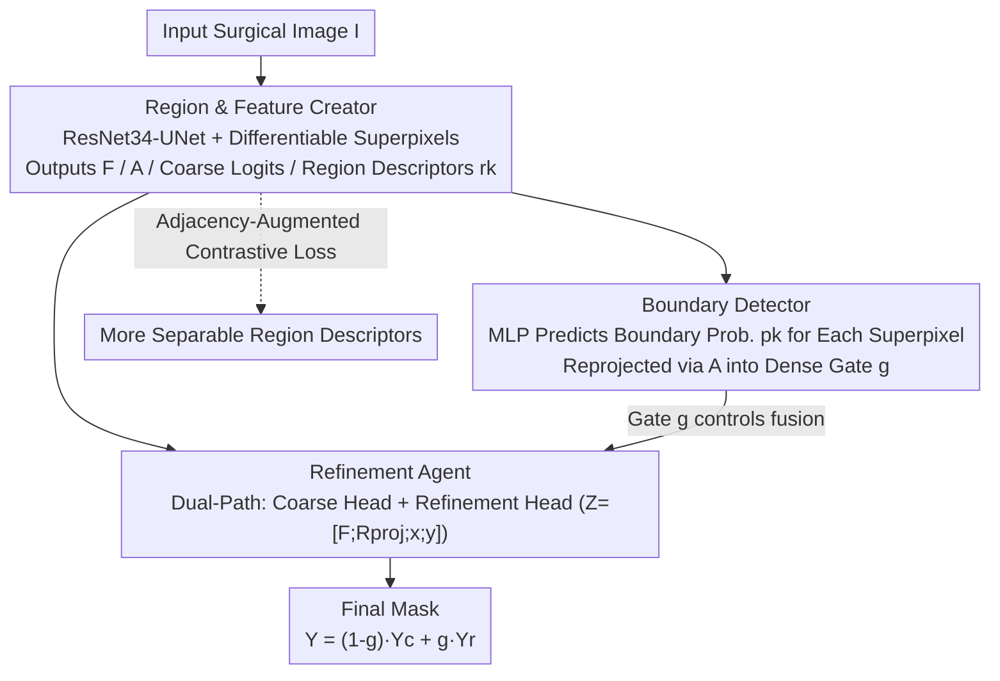

# Boundary-Responsive Differentiable Gating for Superpixel-Based Segmentation

**Conference**: CVPR 2026  
**Paper**: [CVF Open Access](https://openaccess.thecvf.com/content/CVPR2026/html/Ahmed_Boundary-Responsive_Differentiable_Gating_for_Superpixel-Based_Segmentation_CVPR_2026_paper.html)  
**Code**: None  
**Area**: Semantic Segmentation / Surgical Scene Understanding  
**Keywords**: Differentiable Superpixels, Boundary Gating, Selective Refinement, Contrastive Learning, Real-Time Segmentation

## TL;DR
BRDG constructs a three-agent pipeline combining "differentiable superpixels + boundary gating + selective refinement". High-precision refinement heads are activated only on superpixels identified as "boundaries," while stable inner regions bypass them via cheap coarse classification. This design simultaneously achieves high accuracy (mIoU +4.5~7.0, Boundary-F1 +10) and real-time speed (150 FPS, 24M parameters) in surgical segmentation.

## Background & Motivation

**Background**: Semantic segmentation in minimally invasive and robotic surgery forms the foundation for instrument tracking, navigation, and intraoperative decision-making. Conventional approaches formulate segmentation as a pixel-wise classification problem on high-resolution inputs (e.g., U-Net, DeepLabv3+, SegFormer).

**Limitations of Prior Work**: Although pixel-wise dense prediction yields high accuracy, it incurs substantial computational overhead, large parameter counts, and severe spatial redundancy in surgical scenarios. Furthermore, independent pixel predictions often produce fragmented, incoherent regions along fine-grained instrument boundaries, hindering real-time safe deployment. Superpixel methods group perceptually similar pixels into compact regions to naturally reduce redundancy; however, classic algorithms (e.g., SLIC, Felzenszwalb, Watershed) are non-differentiable, acting only as fixed pre-processing steps that cannot adapt to domain-specific cues such as "instrument-tissue boundaries" or "specular reflections." Even differentiable superpixel methods (e.g., SSN, HERS) are mostly designed for general vision and lack sufficient robustness for medical applications.

**Key Challenge**: Pixel-wise methods are high-fidelity but computationally expensive, whereas superpixel methods are efficient but sacrifice semantic accuracy (especially near boundaries). Crucially, existing differentiable superpixel methods (e.g., SSN, HERS) tend to **collapse information to the region level prematurely**—directly classifying after average-pooling within regions—which discards pixel-level details and introduces boundary smoothing errors that they initially aimed to avoid.

**Goal**: To construct a differentiable superpixel framework that explicitly perceives boundaries while preserving pixel-level details, allocating refinement computational resources strictly to where they are needed (fuzzy boundaries) while stable internal regions enjoy superpixel-level efficiency.

**Key Insight**: The authors observe that only a small fraction of pixels in an image (near semantic boundaries) actually require high-resolution refinement. If the network can learn on its own "where the stable inner areas are and where the uncertain boundaries lie," a differentiable gate can be used to **sparsely** route the refinement head only to the boundaries.

**Core Idea**: To leverage "boundary-responsive differentiable gating" to fuse coarse and refined predictions pixel-by-pixel—boundary pixels with high gate values undergo the refinement path, while inner pixels with low gate values pass through the cheap coarse path. Three collaborative agents learn "what to refine" and "how to refine" end-to-end within a single unified differentiable framework.

## Method

### Overall Architecture
BRDG is a fully differentiable architecture completed in a single forward pass: the input image $I$ is encoded by the backbone $\rightarrow$ infers soft superpixel allocations $\rightarrow$ estimates the boundary confidence of each superpixel $\rightarrow$ fuses coarse and refined predictions via gating $\rightarrow$ outputs the final logits $\hat{Y}$. The entire network is organized into three collaborative "agents": Agent 1 constructs mid-level representations (dense features $F$, soft allocation $A$, coarse logits $\hat{Y}_c$, and $K$ region descriptors $r_k$); Agent 2 is a lightweight gating head that predicts the boundary probability of each superpixel from the region descriptors and projects it back to the dense pixel space to form the gate $g$; Agent 3 is a dual-path classifier that fuses the coarse path and the refinement path using the gate $g$. This division of labor decouples "what to refine" (Agent 2) from "how to refine" (Agent 3), both of which are built upon the multi-layer features provided by Agent 1.

### Key Designs

**1. Unified Differentiable Superpixels: Region & Feature Creator (Agent 1)**

This is the foundation of the entire network, aimed at learning "dense features" and "superpixel tokens" simultaneously within a differentiable framework. The backbone consists of a ResNet-34 encoder (ImageNet pre-trained, with early batch normalization layers frozen for several epochs to preserve pre-training statistics) and a U-Net-style decoder. Multi-scale features are fused via bilinear upsampling and lateral skip connections into a dense feature field $F \in \mathbb{R}^{B\times C_f\times H\times W}$ ($C_f=96$). Two $1\times1$ convolutional heads are attached to $F$: an allocation head that outputs superpixel allocation logits, and a coarse head that produces coarse segmentation logits $\hat{Y}_c$ as a fast baseline. The allocation logits are transformed via a temperature softmax into a soft allocation map:

$$A_{b,k,i,j} = \frac{\exp(A_{\text{logits},b,k,i,j}/\omega)}{\sum_{k'}\exp(A_{\text{logits},b,k',i,j}/\omega)}$$

The soft allocation is then used to softly pool $F$ into $K$ region descriptors $r_k = \frac{\sum_{i,j} A_{k,i,j} F_{:,i,j}}{\sum_{i,j} A_{k,i,j}}$. Unlike SSN/HERS, $F$ is **not** discarded after computing $r_k$; instead, $F$, $A$, $r_k$, and $\hat{Y}_c$ are all passed downstream to selectively "reintroduce pixel-level information" later.

**2. Boundary-Routed Refinement: Boundary Detector Learns "Where to Refine" (Agent 2)**

The main pain point is that refinement computations are expensive, making it infeasible to apply a refinement head uniformly across the entire image. The task of Agent 2 is to determine which of the $K$ regions are "fuzzy zones" lying on semantic boundaries. It feeds the region descriptors $r_k$ into a small MLP to predict a boundary probability $p_k\in[0,1]$ for each superpixel. Then, using the soft allocation map $A$ from Agent 1, these $K$ region-level probabilities are **reprojected** back into the dense pixel space, yielding a pixel-level gate $g_{i,j} = \sum_{k=1}^{K} A_{k,i,j}\,p_k$. The gate value is close to 1 for pixels in boundary superpixels and close to 0 in stable inner regions. The supervision comes from a ground-truth boundary map derived directly from the labels: a pixel is labeled as a boundary pixel if its neighbor belongs to a different class. Superpixels containing at least one boundary pixel receive a positive label (1), while others are labeled 0. Binary Cross-Entropy (BCE) loss is used to supervise $p_k$, ensuring that refinement is triggered only at structural interfaces between classes. This differs from prior paradigms that predict boundaries as parallel branches (e.g., Gated-SCNN, SegFix)—here, boundary reasoning is directly embedded into the superpixel allocation process, learning a differentiable gate for **selective routing** of the refinement.

**3. Dual-Path Gated Fusion: Refinement Agent Decides "How to Refine" (Agent 3)**

Agent 3 operates two paths, which are then fused by Agent 2's gate $g$. The coarse path computes coarse logits $\hat{Y}_c$ directly from the shared features $F$ via a $1\times1$ convolution, which is fast but coarse. The high fidelity of the refinement path relies not on the convolution itself, but on its compiled rich input tensor:

$$Z_{i,j} = [\,F_{i,j};\ R_{\text{proj},i,j};\ x_{i,j};\ y_{i,j}\,]$$

where $F_{i,j}$ represents the raw pixel features, $R_{\text{proj},i,j}=\sum_k A_{k,i,j} r_k$ represents the shared context of the entire superpixel region of the pixel, and $x_{i,j},y_{i,j}$ represent normalized absolute coordinates. $Z$ is processed through a lightweight MLP (refine head) to output refined logits $\hat{Y}_r$. The final output is obtained by a pixel-wise linear blending weighted by the gate:

$$\hat{Y} = (1-g)\,\hat{Y}_c + g\,\hat{Y}_r$$

At high gate values (boundaries), the precise, context-aware $\hat{Y}_r$ is used, while at low gate values (stable inner areas), the efficient $\hat{Y}_c$ is preferred. This gated blending also brings a training benefit: the refinement path is trained almost exclusively on boundary pixels ($g\approx1$), whereas the coarse path is trained on inner pixels ($g\approx0$). Consequently, the model becomes a "sparse refiner," achieving high accuracy without requiring a second, heavy-weight refinement network.

**4. Adjacency-Augmented Boundary Contrastive Loss: Separating Neighboring Superpixels in Feature Space**

To make the region descriptors $r_k$ more discriminative (especially to contrast the semantic difference between the interior of a class and its boundaries), the authors incorporate a contrastive loss on region features. The core innovation is an "adjacency-augmented term" $w_{ik}$:

$$L_{\text{bnd}} = -\frac{1}{|P|}\sum_{(i,j)\in P}\log\frac{\exp(s_{ij}/T)}{\sum_{k\neq i}\exp(s_{ik} w_{ik}/T)}$$

where $s_{ij}=r_i^\top r_j$ represents the feature similarity, $T$ is the temperature, and $w_{ik}=1+\varepsilon\,\mathbb{1}[i,k\ \text{adjacent}]$. This term specifically **escalates the penalty for adjacent negative sample pairs**, forcing Agent 1 to learn sharp feature separations for superpixels that are close in space but belong to different sides of a semantic boundary. Compared to generic pixel-wise contrastive loss (which is computationally heavy and ignores region adjacency), it directly exploits the superpixel adjacency graph to mine hard negatives. This couples semantic contrast and geometric adjacency into a single differentiable objective, operating on $K$ regions rather than all pixels, thereby keeping overhead minimal. When $\varepsilon=1$ ($\log 1=0$), it degenerates to the standard contrastive loss.

### Loss & Training
AdamW optimizer is used with a base learning rate of $1\times10^{-4}$ and weight decay of $1\times10^{-4}$. Discriminative learning rates are applied to the encoder (approximately $0.1\times$ of the base rate) to transfer ImageNet general features, while the decoder and heads use the base rate to quickly learn task representations. Inputs are resized to $512\times640$ with a multi-stage schedule over 100 epochs: warm-up (epochs 1–5) freezes the ResNet encoder and activates only the main segmentation loss (weighted 0.5 each for CE and Tversky) to stabilize the decoder/heads; unfreeze-ramp (epochs 6–10) unfreezes the encoder at a $0.1\times$ learning rate and linearly scales the auxiliary loss weights from 0 to their targets; full training (epochs 11–60) trains all components together with their final loss weights.

## Key Experimental Results

### Main Results
Comparison across four surgical segmentation tasks (mIoU / Dice / BF1@2px, model cost is dataset-independent, $512\times640$):

| Method | EndoVis'18 Parts mIoU | EndoVis'18 Tools mIoU | EndoVis'18 Tools BF1 | Params(M) | FPS |
|------|------|------|------|------|------|
| DeepLabv3+ (R101) | 0.56 | 0.78 | 0.67 | 61.0 | 15.1 |
| SegFormer-B5 | 0.57 | 0.71 | — | 84.7 | 13.84 |
| U-Net (R34) | 0.53 | 0.64 | 0.21 | 13.39 | 45.96 |
| SSN (Differentiable Superpixel) | 0.37 | 0.41 | 0.30 | 0.66 | 271.62 |
| HERS (Differentiable Superpixel) | 0.45 | 0.70 | 0.60 | 7.70 | 564.76 |
| **BRDG (Ours)** | **0.72** | **0.75** | **0.71** | 23.9 | 150.25 |

- Accuracy: 0.72 mIoU on EndoVis'18 Parts, which is +6 points higher than the strongest superpixel method HERS, and +7 points higher than the strongest pixel-wise method (MedT); on Tools, it outperforms SegFormer-B5 by +4.46 points.
- Boundary: The BF1 on Tools reaches 0.71, which is +10.88 points higher than HERS, demonstrating the advantage of gated refinement for delineation of boundaries.
- Efficiency: 150.25 FPS (6.63 ms/frame), about 10× faster than DeepLabv3+/SegFormer-B5, with ~3.5× fewer parameters than SegFormer-B5. Although SSN is faster, its mIoU < 0.42 makes it non-competitive.

### Ablation Study
On EndoVis2018-Part (K=100, inference unit: ms, Peak Mem unit: GB):

| Configuration | mIoU | Inference | FPS | Peak Mem | Description |
|------|------|------|------|------|------|
| No-superpixels | 0.57 | 24 | 128.88 | 1.53 | Degenerates to pure pixel-wise; drops to the same level as SegFormer, and peak memory increases by >400MB |
| No-boundary | 0.57 | 8.12 | 123.20 | 1.52 | Removes boundary BCE + boundary contrastive loss; drops by 0.15 |
| No-refine / Gate=0 | 0.61 | 6.63 | 150.90 | 1.17 | Uses only the coarse head; drops by 11 points; removing refinement does not save time or memory |
| Only-coarse | 0.52 | 9.8 | 65 | 1.23 | Coarse-path only variant |
| **Full** | **0.72** | **6.63** | **150.25** | **1.05** | Full model |

### Key Findings
- Boundary supervision is one of the most significant contributors: removing the boundary BCE + boundary contrastive loss (No-boundary) directly drops mIoU by 0.15, highlighting that boundary-aware supervision is vital.
- Selective refinement is a free lunch: re-enabling the refinement head and learning gate recovers mIoU from 0.61 to 0.72, while the inference remains 6.63 ms, and peak memory even decreases from 1.17 to 1.05 GB. This proves that the learning gate's mechanism of "refining only boundaries and keeping coarse interiors" is superior to either pure coarse or pure refinement streams.
- An optimal number of superpixels $K$ exists: on BSDS500, the Boundary Recall peaks (0.67) at $K=500$. Further increasing to 1000 degrades performance, as the allocation becomes over-fragmented, which harms boundary alignment.
- $\varepsilon$ (adjacency augmentation strength) remains stable in the $>1$ range; setting it too high over-emphasizes boundaries and degrades overall segmentation quality.
- Backbone-agnostic: performance increases smoothly from ResNet-34 $\rightarrow$ 50 $\rightarrow$ 101 $\rightarrow$ ViT (72.0 $\rightarrow$ 72.7 $\rightarrow$ 72.9 $\rightarrow$ 74.78 mIoU), but ViT's parameter count balloons to 99M. ResNet-34 (24M) is the sweet spot of efficiency and accuracy in the surgical domain.
- Failure Modes: The primary failure is the learning gate "misfiring" (incorrectly routing internal regions into the refinement head or suppressing actual boundaries). Among synthetic perturbations, fog causes the most severe degradation (mIoU 82.3 $\rightarrow$ 68.9), whereas motion/Gaussian blur are better tolerated, indicating that low-frequency contrast degradation is more damaging to boundary gating than high-frequency noise.

## Highlights & Insights
- Explicitly decoupling "what to refine" and "how to refine" into two agents: Agent 2 only learns boundary probabilities, and Agent 3 handles the dual-path fusion. The gating naturally enforces **sparse training** of the refinement head on boundary pixels. This is the key to obtaining high-fidelity without a second heavy network and can be transferred to any dense prediction task where full-map refinement is too costly.
- The ablation "removing refinement does not save time or memory" is counter-intuitive yet highly convincing. It proves that the computational overhead of refinement in BRDG is almost entirely mitigated by gating; removing it merely reduces accuracy without gaining efficiency, rendering refinement a net positive.
- The adjacency-augmented contrastive loss operates on just $K$ regions yet specifically mines hard negatives that are "adjacent but cross semantic boundaries." By injecting geometric priors into the contrastive objective using the superpixel adjacency graph, it is far cheaper than pixel-wise contrastive alternatives, representing a highly lightweight yet effective trick.
- Retaining the dense feature $F$ instead of collapsing it prematurely to the region level directly addresses the boundary smoothing issue inherent in SSN/HERS, enabling "superpixels for efficiency, pixels for accuracy" to coexist within a single framework.

## Limitations & Future Work
- The authors acknowledge that gating misfires—incorrectly routing internal regions to refinement or suppressing true boundaries—serve as the primary source of failure.
- Poor robustness to low-frequency contrast degradation (fog), where mIoU drops by more than 13 points, limits its reliability under harsh imaging conditions.
- General-domain results (Cityscapes 0.54, ADE20K 0.60) are evaluated under "foveated/efficient segmentation protocols." The authors explicitly state that these are not directly comparable to general segmentation leaderboards; the model still struggles with small objects and occlusions.
- Future Directions (Internal/Self-review): The gating currently skews towards a single-scale, binary-like decision, which could potentially be alleviated by multi-scale or soft hierarchical gating to mitigate misfires. Fog robustness could be addressed by incorporating defogging or contrast-normalization pre-processing. Since $K$ is fixed and its optimal value depends on the dataset, enabling adaptive superpixel counts remains an open question.

## Related Work & Insights
- **vs SSN / HERS (Differentiable Superpixels)**: These methods collapse information to the region level and classify on pooled features, discarding pixel details and causing boundary smoothing. BRDG retains dense $F$ and uses a gate to **selectively re-introduce** pixel information back to boundaries, substantially leading in BF1 (Tools +10.88).
- **vs Gated-SCNN / SegFix / RefineNet (Boundary Refinement)**: These mostly treat boundaries as parallel branches or post-processing offset corrections. BRDG directly embeds boundary reasoning into the superpixel allocation and learns a differentiable gate to **route** refinement along predicted boundaries, utilizing structural cues rather than side branches.
- **vs Pixel-level Contrastive (e.g., ReCo, PiCIE)**: These perform pixel-wise sampling, which is computationally expensive for high-resolution surgical images. BRDG's adjacency-augmented boundary contrastive loss mines hard negatives on the superpixel graph, coupling semantic contrast and geometric adjacency into a single differentiable objective.

## Rating
- Novelty: ⭐⭐⭐⭐ Boundary-responsive differentiable gating + three-agent sparse refinement + adjacency-augmented contrast, providing a clean combination specifically targeting the superpixel-collapse pain point.
- Experimental Thoroughness: ⭐⭐⭐⭐ Evaluated on four surgical datasets + general domain + exhaustive ablations on components, superpixel counts, α, backbones, and failure modes.
- Writing Quality: ⭐⭐⭐⭐ Clear presentation of algorithms, mathematical equations, and the three-agent narrative; some specific numbers (such as mixed use of mIoU percentages/decimals, or baseline values like 82.3 not directly shown in the tables) should be cross-referenced with the original text.
- Value: ⭐⭐⭐⭐ Truly resolves the accuracy-efficiency trade-off (150 FPS, 24M) in real-time surgical segmentation, holding direct significance for resource-constrained deployments.

<!-- RELATED:START -->

## Related Papers

- [\[CVPR 2026\] Differentiable Laplacian Matrix Guided Superpixel Segmentation](differentiable_laplacian_matrix_guided_superpixel_segmentation.md)
- [\[CVPR 2026\] PRUE: A Practical Recipe for Field Boundary Segmentation at Scale](prue_a_practical_recipe_for_field_boundary_segmentation_at_scale.md)
- [\[CVPR 2026\] SouPLe: Enhancing Audio-Visual Localization and Segmentation with Learnable Prompt Contexts](souple_enhancing_audio-visual_localization_and_segmentation_with_learnable_promp.md)
- [\[CVPR 2026\] Universal 3D Shape Matching via Coarse-to-Fine Language Guidance](universal_3d_shape_matching_via_coarse-to-fine_language_guidance.md)
- [\[CVPR 2026\] GeoSURGE: Geo-localization using Semantic Fusion with Hierarchy of Geographic Embeddings](geosurge_geo-localization_using_semantic_fusion_with_hierarchy_of_geographic_emb.md)

<!-- RELATED:END -->
