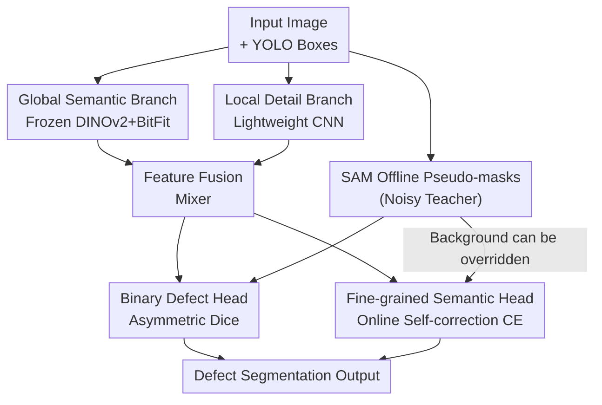

# Boxes2Pixels: Learning Defect Segmentation from Noisy SAM Masks

**Conference**: CVPR 2026  
**arXiv**: [2604.11162](https://arxiv.org/abs/2604.11162)  
**Code**: https://github.com/CLendering/Boxes2Pixels (Available)  
**Area**: Semantic Segmentation / Weakly Supervised / Industrial Defect Detection  
**Keywords**: Box-to-pixel distillation, noisy pseudo-labels, SAM, DINOv2, self-correction  

## TL;DR
Addressing the lack of pixel-level annotations in industrial defect segmentation, this paper treats SAM as an "error-prone noisy teacher" rather than ground truth. It generates offline pseudo-masks from existing bounding boxes and trains a lightweight student network based on a frozen DINOv2. By employing a binary localization head and a "unidirectional online self-correction" loss to resist pseudo-label noise, it improves abnormal mIoU by +6.97 and binary IoU by +9.71 on a wind turbine blade defect dataset with only 5.6M trainable parameters (an 80% reduction).

## Background & Motivation
**Background**: Industrial inspection (e.g., wind turbine blades) requires defect segmentation, but pixel-level annotations are expensive and scarce. A common cost-saving approach is to use bounding boxes (YOLO format, already prevalent in existing inspection pipelines) for weak supervision, then use the Segment Anything Model (SAM) to prompt boxes into pseudo-masks to train student networks with dense supervision.

**Limitations of Prior Work**: SAM-generated pseudo-masks on industrial surfaces are **systematically noisy**. They produce false positives by over-segmenting shadows, stains, or textures, and false negatives by missing fine cracks or low-contrast defects. Directly supervising regular segmentation networks like U-Net or SegFormer with these pseudo-masks causes them to **overfit the teacher's error patterns**, inheriting the teacher's failures.

**Key Challenge**: Defect pixels within a bounding box are often **sparse, slender, and occupy a tiny fraction of the area** (often <5% of the image area in datasets). Traditional box-supervision methods like BoxInst or DiscoBox implicitly assume that the target occupies most of the box and is spatially compact. In industrial scenarios, this assumption is broken, causing models to collapse into "filling the entire box." Furthermore, the ground truth annotations themselves are often incomplete, with subtle defects remaining unboxed.

**Goal**: To learn a reliable student model under weakly supervised bounding box constraints that does not rely on SAM at inference time, can perform dense defect segmentation directly from images, and is robust to the systematic noise of teacher pseudo-labels.

**Key Insight**: The authors cite recent WSSS analyses stating that "improvement in pseudo-mask quality does not linearly correlate with improvement in final segmentation accuracy," suggesting that **how pseudo-labels are used** is more critical than **how they are generated**. Thus, the focus shifts from "creating better masks" to "how to treat noisy masks during training."

**Core Idea**: Treat SAM as a noisy teacher. By using a "semantically stable representation + decoupled binary localization + unidirectional self-correction" suite, the student can trust reliable supervision while courageously overriding the teacher's missed background labels when its own confidence is high, specifically rescuing the teacher’s false negatives.

## Method

### Overall Architecture
The input is an industrial RGB image (resized to $518\times518$ during training), and the output consists of two full-resolution predictions: a binary defect map (foreground/background) and a $(K{+}1)$-class fine-grained semantic map. Before training, SAM is used offline to prompt each annotated box into a single binary pseudo-mask, which is rasterized into a multi-class label map $\tilde{y}$ (in a two-class setup, Dirt/Damage map to pixel labels 1/2, and background to 0) and stored. **SAM is not required during inference.**

The student is a dual-branch hierarchical structure: the **global semantic branch** uses a frozen DINOv2 ViT-S/14 to extract multi-layer features for top-down fusion, providing semantic stability against high-frequency artifacts. The **local detail branch** uses a lightweight CNN to extract high-resolution features directly from RGB to preserve the local structures of slender defects. Features from both branches are fused via a feature mixer and sent to the **binary defect head** and **fine-grained semantic head**. Each head is paired with a noise-resilient loss: the binary head uses an asymmetric Dice loss biased towards recall, and the semantic head uses cross-entropy with "unidirectional online self-correction."

### Key Designs

**1. Offline Box-to-Pixel Distillation treating SAM as a Noisy Teacher: Decoupling "Label Generation" and "Label Usage"**

The pain point is that using SAM pseudo-masks directly as ground truth causes the student to inherit teacher errors. The authors decouple this: each box $b_{i,m}$ in an image is fed individually to SAM (using only box prompts, no point/mask guidance) to obtain a binary mask $\tilde{y}_i^{(m)} = \mathrm{SAM}(x_i, b_{i,m})$. The class $k_{i,m}$ is assigned to all pixels within the mask and rasterized. This **offline** process saves compute by not running the large SAM encoder during training and explicitly treats "pseudo-labels as noise" in the optimization objective. The student learns $S_\theta: x \mapsto \hat{y}\in[0,1]^{H\times W\times(K+1)}$ with an objective designed to be robust to systematic errors rather than blind alignment.

**2. Hierarchical Student Architecture with Frozen DINOv2 + BitFit: Using Semantic Stability to Suppress Artifacts**

Conventional segmentation networks (U-Net/SegFormer) are end-to-end trainable; their high capacity makes it easier to memorize high-frequency artifacts and false boundaries in SAM masks. This paper uses a frozen DINOv2 ViT-S/14 as the semantic backbone, performing lightweight domain adaptation via **BitFit-style updates only for bias and normalization parameters**. Self-supervised Transformer representations are less sensitive to high-frequency noise, and the frozen backbone limits the effective capacity exposed to noisy labels, naturally resisting overfitting. Specifically, intermediate activations are extracted from layers $L=\{1,2,4,7\}$, projected via $1\times1$ convolutions, and fused top-down. The deepest $F^{(7)}$ initializes $F_{\text{deep}}$, which is added to shallower lateral features $F_{\text{skip}}$ through a residual fusion block $\phi$ (Conv–BN–ReLU–Conv–BN):

$$F_{\text{out}} = \sigma\!\left(\phi(F_{\text{deep}} + F_{\text{skip}}) + (F_{\text{deep}} + F_{\text{skip}})\right)$$

The local detail branch uses two stride-2 Conv–BN–ReLU layers to bring the image to $H/4\times W/4$, restoring high-frequency structures lost by the ViT patch resolution.

**3. Auxiliary Binary Localization Head: Decoupling "Finding Sparse Foreground" from "Class Judgment"**

Since defects occupy a tiny area, a single multi-class head would be dominated by background pixels, leading the model to ignore defects or collapse to the box. The authors add an auxiliary binary head to predict foreground/background, sharing $F_{\text{fusion}}$ with the semantic head but optimizing a different goal (structural localization vs. semantic discrimination). The binary head uses an **asymmetric Dice loss**, reducing the weight of false positives $\beta\in(0,1)$ (default 0.4) to bias optimization toward recall:

$$\mathcal{L}_{\text{bin}} = 1 - \frac{\langle p, g\rangle + \epsilon}{\langle p, g\rangle + \beta\langle p, 1-g\rangle + \langle 1-p, g\rangle + \epsilon}$$

Where $g_i = \mathbb{1}[\tilde{y}_i>0]$ is the binary target. $\beta<1$ implies that missing a defect is costlier than a slight over-segmentation—matching industrial requirements. Ablations show that removing this head causes the largest performance drop.

**4. Unidirectional Online Self-Correction Loss: Specifically Rescuing Defects Missed by the Teacher**

This is the key innovation. Both the teacher and box labels often treat subtle defects as background (false negatives). To prevent propagating these omissions, the semantic head is allowed to "rebel": if a pixel's pseudo-label is background ($\tilde{y}_i=0$) but the student's confidence for a defect class exceeds a threshold $\tau$, the training target is updated to the student's prediction:

$$\tilde{y}_i^{\text{corr}} = \begin{cases} \arg\max_{c>0} p_{i,c}, & \text{if } \tilde{y}_i=0 \ \land\ \max_{c>0}p_{i,c} > \tau \\ \tilde{y}_i, & \text{otherwise} \end{cases}$$

The key is that it is **unidirectional**: only background labels can be overridden; annotated defect regions are never modified. This prevents semantic drift. Correction is computed online per mini-batch with a warm-up phase. The conservative threshold ($\tau=0.9$) ensures only high-confidence predictions override supervision.

### Loss & Training
The total loss is an equal combination of binary localization and semantic discrimination: $\mathcal{L}_{\text{total}} = \lambda_{\text{bin}}\mathcal{L}_{\text{bin}} + \lambda_{\text{fine}}\mathcal{L}_{\text{fine}}$, with $\lambda_{\text{bin}}=\lambda_{\text{fine}}=0.5$. It uses AdamW with a cosine learning rate scheduler (initial lr $5\times10^{-4}$), weight decay $1\times10^{-2}$, and $\ell_2$ gradient clipping at 1.0. EMA weights with a decay of 0.999 are maintained for inference.

## Key Experimental Results

Dataset: DTU wind turbine blade UAV inspection dataset (approx. 13,000 images, $586\times371$ RGB, box annotations only, two classes: damage/dirt). For reliable evaluation, a separate test set was manually annotated with pixel-level ground truth.

### Main Results
All models were trained under identical box supervision (SAM pseudo-masks). Evaluation on the test set against manual pixel ground truth:

| Model | mIoU | mIoU$_{\text{anom}}$ | F1$_{\text{anom}}$ | IoU$_{\text{bin}}$ |
|------|------|------|------|------|
| U-Net | 0.7057 | 0.5629 | 0.7036 | 0.5427 |
| DeepLabV3-B2 | 0.6867 | 0.5342 | 0.6955 | 0.5331 |
| SegFormer-B2 | 0.7231 | 0.5881 | 0.6939 | 0.5312 |
| **Boxes2Pixels (Ours)** | **0.7661** | **0.6523** | **0.7674** | **0.6226** |

Compared to the strongest baseline SegFormer-B2, abnormal mIoU increased by +0.0642 and binary IoU increased from 0.5312 to 0.6226 (+0.0914).

### Ablation Study
Evaluation on the validation set against SAM pseudo-labels (reflecting consistency with the noisy teacher):

| Configuration | mIoU | mIoU$_{\text{anom}}$ | F1$_{\text{anom}}$ | IoU$_{\text{bin}}$ |
|------|------|------|------|------|
| Boxes2Pixels (Full) | 0.6709 | 0.5093 | 0.6761 | 0.5107 |
| w/o Local Detail Branch | 0.6655 | 0.5013 | 0.6631 | 0.4960 |
| w/o Binary Head | 0.5868 | **0.3851** | 0.5693 | 0.3979 |
| w/o Self-Correction | 0.6679 | 0.5049 | 0.6622 | 0.4949 |

Self-correction validated on the **Test Set** (manual ground truth):

| Method | mIoU$_{\text{anom}}$ | F1$_{\text{anom}}$ | IoU$_{\text{bin}}$ | Recall$_{\text{bin}}$ |
|------|------|------|------|------|
| w/o Self-Correction | 0.5826 | 0.6889 | 0.5255 | 0.6195 |
| w/ Self-Correction (Ours)| **0.6523** | **0.7674** | **0.6226** | **0.8051** |
| **Gain** | **+0.0697** | **+0.0785** | **+0.0971** | **+0.1856** |

### Key Findings
- **Binary head has the greatest contribution**: Removing it caused abnormal mIoU to drop from 0.5093 to 0.3851, confirming that decoupling sparse foreground discovery from fine-grained classification is core to resisting background-dominated pseudo-labels.
- **Value of self-correction is evident only on ground truth**: While metrics barely change on the validation set (which lacks the defects the method aims to rescue), binary recall on the manual ground truth test set jumped from 0.6195 to 0.8051 (+0.1856). 
- **Efficiency**: With only 5.6M trainable parameters, it achieves the lowest latency (6.20ms) and highest throughput (161.4 FPS on H100), enabling real-time deployment.

## Highlights & Insights
- **Unidirectional Self-Correction is the masterstroke**: Allowing only "background-to-defect" corrections prevents the semantic drift common in bidirectional noise-cleaning while effectively rescuing teacher omissions.
- **Differentiated Evaluation Methodology**: Using the validation set (noisy labels) for model selection and the test set (GT) for conclusions explains why certain mechanisms appear ineffective on the former but excel on the latter.
- **Frozen Backbone for Robustness**: Freezing the backbone not only saves parameters but also limits the model's capacity to memorize high-frequency noise from pseudo-labels, effectively using "parameter efficiency" as a tool for "robustness."

## Limitations & Future Work
- **Dataset Diversity**: Validated only on a wind turbine dataset with two classes; generalization to other industrial surfaces (metal, PCB, etc.) is unknown.
- **Limited GT Scale**: Manual pixel annotations cover only a small test split; statistical robustness is limited by this sample size.
- **Heuristic Thresholding**: Self-correction depends on a fixed $\tau=0.9$. Adaptive thresholds or dynamic schedules were not explored.
- **Teacher False Positives**: While the method excels at false negatives (missed defects), it lacks an explicit mechanism for teacher false positives (stains as defects), relying mainly on the DINOv2 backbone's semantic stability.

## Related Work & Insights
- **vs. BoxInst / DiscoBox**: These rely on projection constraints and assume spatial compactness; this paper argues such assumptions lead to "filling the box" for sparse industrial defects and uses SAM as an explicit pixel-wise prior instead.
- **vs. SAM Distillation (MobileSAM/FastSAM)**: Those aim to mimic SAM. This paper treats SAM as a **noisy teacher** and focuses on resisting its systematic errors rather than replicating them.
- **vs. Noisy Label Learning**: Unlike "noise rejection" (downweighting noisy areas), this work emphasizes "controlled self-correction" to rescue false negatives when the student is highly confident.

## Rating
- Novelty: ⭐⭐⭐⭐ 
- Experimental Thoroughness: ⭐⭐⭐⭐ 
- Writing Quality: ⭐⭐⭐⭐ 
- Value: ⭐⭐⭐⭐ 

<!-- RELATED:START -->

## Related Papers

- [\[CVPR 2026\] Spatial-SAM: Spatially Consistent 3D Electron Microscopy Segmentation with SDF Memory and Semi-Supervised Learning](spatial-sam_spatially_consistent_3d_electron_microscopy_segmentation_with_sdf_me.md)
- [\[NeurIPS 2025\] SAM-R1: Leveraging SAM for Reward Feedback in Multimodal Segmentation via Reinforcement Learning](../../NeurIPS2025/segmentation/sam-r1_leveraging_sam_for_reward_feedback_in_multimodal_segmentation_via_reinfor.md)
- [\[ECCV 2024\] Learning Camouflaged Object Detection from Noisy Pseudo Label](../../ECCV2024/segmentation/learning_camouflaged_object_detection_from_noisy_pseudo_label.md)
- [\[CVPR 2026\] M4-SAM: Multi-Modal Mixture-of-Experts with Memory-Augmented SAM for RGB-D Video Salient Object Detection](m4-sam_multi-modal_mixture-of-experts_with_memory-augmented_sam_for_rgb-d_video_.md)
- [\[CVPR 2025\] Mask-Adapter: The Devil is in the Masks for Open-Vocabulary Segmentation](../../CVPR2025/segmentation/mask-adapter_the_devil_is_in_the_masks_for_open-vocabulary_segmentation.md)

<!-- RELATED:END -->
