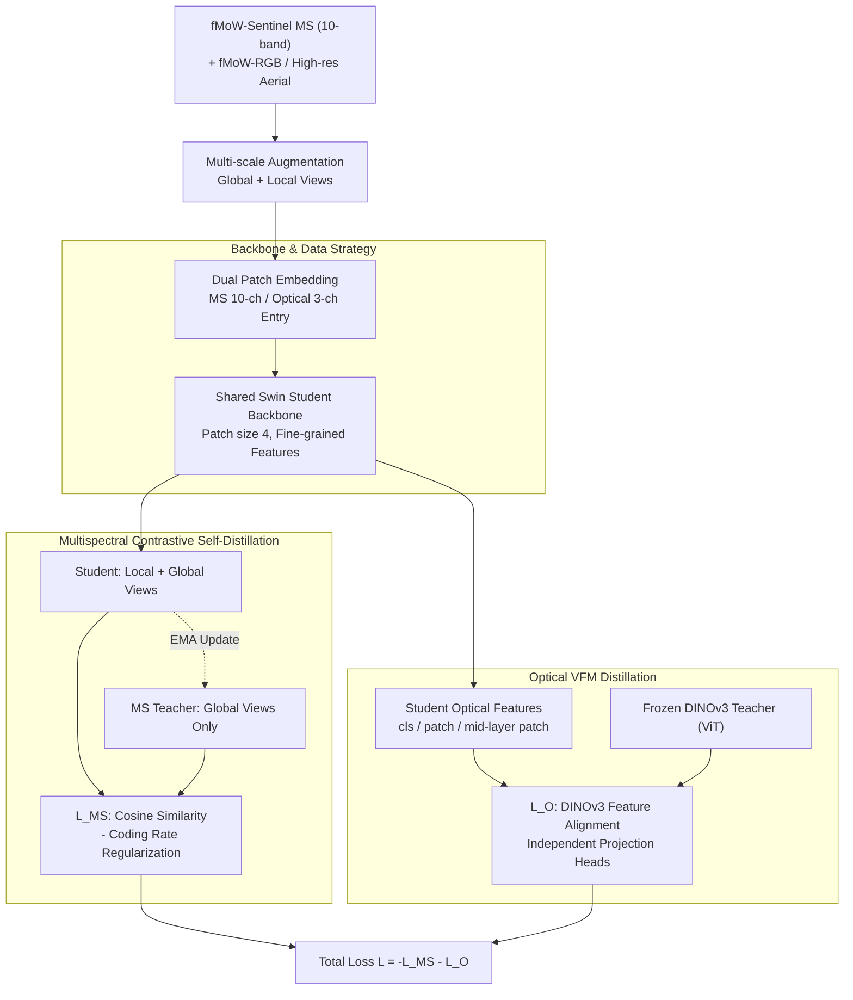

# Brewing Stronger Features: Dual-Teacher Distillation for Multispectral Earth Observation

**Conference**: CVPR 2026  
**arXiv**: [2602.19863](https://arxiv.org/abs/2602.19863)  
**Code**: [Project Page](https://wolfilip.github.io/DEO/)  
**Area**: Image Segmentation  
**Keywords**: Remote Sensing Foundation Models, Multispectral, Knowledge Distillation, Contrastive Learning, Dual-Teacher Training  

## TL;DR

Proposes **DEO (Distillation for Earth Observation)**, a dual-teacher contrastive distillation framework. It utilizes a multispectral self-distillation teacher to learn spectral representations and an optical VFM teacher (DINOv3) to inject high-level semantic priors. This enables a single student network to excel in both optical and multispectral remote sensing tasks, achieving SOTA across semantic segmentation, change detection, and classification.

## Background & Motivation

**Background**: Foundation models are transforming the Earth Observation (EO) field. Large-scale unlabeled data combined with flexible task adaptation is particularly valuable given the scarcity of annotations in EO. However, the diversity of sensors and modalities makes training a single universal model **unrealistic**, leading to the co-existence of multiple specialized foundation models.

**Limitations of Prior Work**:
   - Most EO pre-training utilizes **Masked Image Modeling (MIM)**, which emphasizes local reconstruction but has **limited control** over global semantic structures.
   - General VFMs (e.g., DINOv2/DINOv3) possess strong optical semantic priors but lack multispectral (MS) capabilities.
   - Training MS foundation models from scratch is **computationally expensive**.

**Key Challenge**: How to efficiently transfer a VFM's strong optical semantic priors to a multispectral student **without compromising the learning of MS-specific information**? Existing methods (e.g., Copernicus-FM) combine MIM with VFM distillation, but the MIM objective is **incompatible** with the contrastive self-distillation objective of VFMs, resulting in weak global semantic structures.

**Goal**: Propose a pre-training strategy that performs exceptionally well when multispectral data is available, while not sacrificing performance on optical-only tasks.

**Key Insight**: **Match the pre-training objectives of the student and the VFM teacher**. If the VFM was trained with contrastive self-distillation, the student should also use contrastive self-distillation, making the latent feature spaces easier to align.

**Core Idea**: Dual-Teacher = Multispectral contrastive self-distillation teacher (structuring MS feature space) + Optical VFM frozen teacher (providing global semantic priors), unified under a contrastive distillation framework.

## Method

### Overall Architecture

DEO aims for a **single student network** capable of handling both multispectral (MS) and optical (RGB) inputs effectively. It bridges these using a shared backbone and two sets of teachers. Starting from a Sentinel-2 MS image, it generates global/local views via multi-scale augmentation, which are fed into the same student through two paths. In the **multispectral branch**, the student performs contrastive self-distillation with an EMA-updated MS teacher to learn structured spectral features. In the **optical branch**, the student performs feature distillation with a frozen DINOv3 teacher to ingest optical semantic priors. The student uses a Swin Transformer backbone with dual patch embeddings (10-channel for MS, 3-channel for optical), followed by shared Transformer layers to map both modalities into a unified feature space.

### Key Designs

**1. Multispectral Contrastive Self-Distillation: Contrastive Objectives for Global Semantics**

EO pre-training has long relied on Masked Image Modeling (MIM), which excels at local reconstruction but fails to regulate global semantic structures. DEO adopts the contrastive self-distillation approach of DINO: the MS teacher weights are slowly updated via student EMA. The student processes local+global views while the teacher processes only global views, forcing the student to map different views to consistent features. The loss simultaneously compresses and expands the feature space—a cosine term pulls positive pairs together, while a coding rate regularization term expands the overall representation to prevent collapse:

$$\mathcal{L}_{MS} = \mathcal{L}_\text{cos}(p_M(\mathbf{z}_g^M), p_s^{MS}(\mathbf{z}_{g \cup l}^M)) - \gamma \mathcal{L}_{CR}(\cdot)$$

The coding rate regularization $\mathcal{L}_{CR} = -\log\det(\mathbf{I} + \text{Cov}[\mathbf{z}])$ measures the volume of the feature covariance. A larger volume indicates more spread-out features, replacing traditional negative sampling or temperature scaling to prevent collapse.

**2. Optical VFM Distillation: Matching Teacher Objectives**

DEO’s key insight is that **the student’s pre-training objective must match the teacher's**. Since DINOv3 is trained via contrastive self-distillation, the student uses the same, making latent feature space alignment natural. Three types of features are distilled using independent projection heads:

$$\mathcal{L}_O = \alpha_1 \mathcal{L}_\text{cos}(\text{[cls]}_F) + \alpha_2 \mathcal{L}_\text{cos}(\text{[p]}_F) + \alpha_3 \mathcal{L}_\text{cos}(\text{[p]}_\text{mid})$$

These terms correspond to the final layer class token $\text{[cls]}_F$ (global semantics), final layer patch tokens $\text{[p]}_F$ (pixel-level features), and intermediate layer patch tokens $\text{[p]}_\text{mid}$ (mid-level semantics). Patch-level distillation is crucial for dense prediction tasks like segmentation.

**3. Backbone & Data Strategy: Fine-resolution Swin and High-res Optical Support**

Dense prediction requires high feature resolution. While ViT typically uses a patch size of 16, DEO employs a Swin Transformer (patch size 4) for finer feature maps. The model is pre-trained on fMoW-Sentinel (MS) and fMoW-RGB (Optical). Since Sentinel-2 optical bands have low resolution (10–60m), the authors replace them with ~150,000 high-resolution aerial images for the optical branch to provide clearer supervision.

### Loss & Training

The objectives of both branches are jointly optimized:

$$\mathcal{L} = -\mathcal{L}_{MS} - \mathcal{L}_O$$

Weights are set to $\alpha_1=1,\ \alpha_2=0.5,\ \alpha_3=0.5,\ \gamma=1$.

## Key Experimental Results

### Main Results: Semantic Segmentation (mIoU)

**Optical Segmentation:**

| Method | SpaceNet | GB-cattle | GB-pv | GB-chesa. | Average |
|------|----------|-----------|-------|-----------|------|
| DINOv3-B (RGB) | 79.06 | 73.01 | 94.34 | 64.04 | 77.61 |
| Copernicus-FM (MS) | 75.45 | 68.88 | 93.56 | 55.81 | 73.43 |
| **Ours (DEO)** | **82.22** | **76.22** | **95.36** | **75.08** | **82.22** |

**Multispectral Segmentation:**

| Method | GB-SA-crop | GB-cashew | S1F11 | PASTIS | Average |
|------|-----------|-----------|-------|--------|------|
| TerraFM (MS) | 30.95 | 59.49 | 92.72 | 19.65 | 50.70 |
| Copernicus-FM (MS) | - | 55.71 | 92.58 | 21.49 | 51.11 |
| **Ours (DEO)** | **36.59** | **65.60** | **93.30** | **23.06** | **63.51** |

- MS segmentation average **+12.4 pp gain** over Prev. SOTA (63.51 vs 51.11).

### Ablation Study

| Component | Optical Avg | MS Avg | Total Avg |
|------|----------|--------|--------|
| Base (MS Self-distill only) | 77.87 | 60.44 | 69.16 |
| +DINOv3 [cls] | 79.07 (+1.20) | 62.81 (+2.37) | 70.94 |
| +Independent Optical Path | 81.20 (+2.13) | 62.69 (-0.12) | 71.95 |
| +DINOv3 [p] | 81.74 (+0.53) | 62.46 | 72.10 |
| +Optical Aug. | 81.95 | 63.02 (+0.55) | 72.48 |
| +High-res Optical | 82.22 (+0.27) | 63.51 (+0.50) | 72.87 |

### Key Findings

1. **Optical VFM distillation benefits MS performance**: Adding DINOv3 [cls] distillation improved MS average by **+2.37pp**.
2. **Objective compatibility is crucial**: Matching the student's contrastive objective with DINOv3 allows for natural feature space alignment.
3. **Efficiency**: DEO achieves SOTA with only 500k images (vs. TerraFM's 18M) and 87M parameters.
4. **Swin Backbone Advantages**: Patch size 4 provides fine-grained features essential for dense tasks, even when distilled from a ViT teacher.

## Highlights & Insights

1. **Insight on Objective Compatibility**: Pre-training objectives should align between student and teacher. This explains why MIM+VFM distillation (e.g., Copernicus-FM) is less effective than contrastive+VFM distillation.
2. **"No-Harm" Multimodality**: Integrating MS capabilities does not sacrifice optical performance, which is rare in multi-modal foundation models.
3. **Scalable Efficiency**: Achieved comprehensive SOTA using 16×A100 GPUs for 100 epochs on a relatively small dataset.

## Limitations & Future Work

1. **Modality Coverage**: Currently only covers 10 Sentinel-2 bands; does not yet include SAR or Thermal IR.
2. **Spatial Resolution**: MS bands are still limited by Sentinel-2's native 10-60m resolution.
3. **Geographical Bias**: The fMoW dataset may have biases, with unknown generalization to polar or maritime regions.

## Related Work & Insights

- **DINOv3**: Provided the foundation for the optical priors used in DEO.
- **Coding Rate Regularization**: From MCR², it serves as an elegant alternative to negative sampling in contrastive learning to prevent representation collapse.
- **Insight for the EO Community**: Instead of spending massive compute to train MS models from scratch, efficiently distilling knowledge from existing VFMs is a more sustainable path for EO foundation models.

## Rating

⭐⭐⭐⭐⭐ — Strong insights (objective compatibility), excellent efficiency (SOTA with 500k images), and comprehensive evaluation across 11 datasets.

<!-- RELATED:START -->

<!-- RELATED:END -->

## Related Papers

- [\[CVPR 2026\] Towards Robust Multi-Modal Semantic Segmentation with Teacher-Student Framework and Hybrid Prototype Distillation](towards_robust_multi-modal_semantic_segmentation_with_teacher-student_framework_.md)
- [\[ICCV 2025\] On the Generalization of Representation Uncertainty in Earth Observation](../../ICCV2025/segmentation/on_the_generalization_of_representation_uncertainty_in_earth_observation.md)
- [\[CVPR 2026\] GKD: Generalizable Knowledge Distillation from Vision Foundation Models for Semantic Segmentation](gkd_generalizable_knowledge_distillation_vfm.md)
- [\[CVPR 2026\] Structure-Aware Representation Distillation for Tiny-Dense Object Segmentation](structure-aware_representation_distillation_for_tiny-dense_object_segmentation.md)
- [\[CVPR 2026\] Fast Reasoning Segmentation for Images and Videos](fast_reasoning_segmentation_for_images_and_videos.md)

<!-- RELATED:END -->
