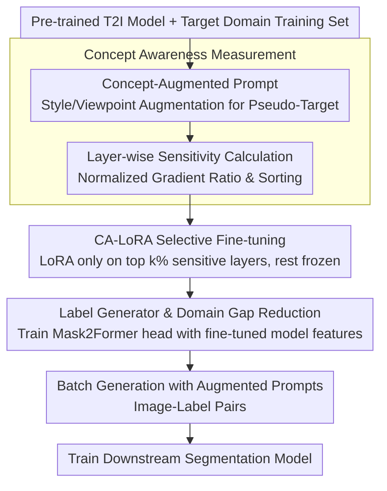

# CA-LoRA: Concept-Aware LoRA for Domain-Aligned Segmentation Dataset Generation

**Conference**: CVPR 2026  
**arXiv**: [2503.22172](https://arxiv.org/abs/2503.22172)  
**Code**: None (Internal to Qualcomm AI Research)  
**Area**: Segmentation / Data Generation  
**Keywords**: LoRA Fine-tuning, T2I Generative Models, Semantic Segmentation, Concept Decoupling, Domain Generalization

## TL;DR
Ours proposes Concept-Aware LoRA (CA-LoRA), which automatically identifies weight layers in T2I models associated with specific concepts (e.g., viewpoint, style) and applies LoRA fine-tuning only to these layers. This achieves selective alignment with the target domain while preserving the diverse generation capabilities of the pre-trained model for generating high-quality urban scene segmentation datasets.

## Background & Motivation

**Background**: Semantic segmentation requires a large amount of pixel-level annotated data, which is costly. Recently, utilizing T2I generative models to synthesize training data has become an effective strategy to alleviate data scarcity.

**Limitations of Prior Work**: Generating segmentation datasets faces two key challenges: (1) generated samples must align with the target domain (e.g., driving viewpoint, urban style); (2) generated samples must go beyond the training data to be informative and diverse. Early methods (training generative models only on target data) achieve domain alignment but lack diversity; recent methods (directly using pre-trained T2I models) are diverse but lack domain alignment.

**Key Challenge**: Applying LoRA fine-tuning to T2I models can achieve domain alignment but leads to overfitting and memorization of training data—because LoRA simultaneously learns all concepts such as viewpoint, style, object shape, and layout, thereby limiting diversity.

**Key Insight**: Domain alignment typically only requires learning a specific concept (e.g., viewpoint or style) rather than all concepts.

**Core Idea**: Automatically measure the sensitivity of each layer's weight to specific concepts (concept awareness) and apply LoRA only to the top $k\%$ most sensitive layers, while freezing the rest to preserve pre-trained knowledge.

## Method

### Overall Architecture

This paper addresses the contradiction where "synthetic segmentation data must align with the target domain while maintaining diversity": generating images directly with pre-trained T2I models is diverse but does not look like driving scenes, while full LoRA fine-tuning achieves alignment but learns viewpoint, style, shape, and layout altogether, leading to overfitting on the training set and loss of diversity. The breakthrough of CA-LoRA is narrowing fine-tuning from "learning everything" to "learning only a specific concept." The pipeline consists of: first calculating a "concept sensitivity" score for each weight layer; selecting only the top $k\%$ most sensitive layers for LoRA attachment while freezing others to retain pre-trained knowledge; then using this aligned model to train a label generator; and finally producing image-label pairs in batches using augmented prompts to feed the segmentation model.

### Key Designs

**1. Concept Awareness Measurement: Using normalized gradient ratios to fairly measure each layer's sensitivity to a specific concept**

To "learn only a certain concept," one must first identify which layers are responsible for that concept. The difficulty lies in the fact that gradient magnitudes of diffusion model weights vary drastically across layers (shallow vs. deep, different projection layers), making direct comparison unfair. CA-LoRA constructs a concept loss by using concept-augmented prompts as pseudo-targets. For example, if the original prompt is "Photorealistic first-person urban street view," style augmentation yields "Sketch of first-person urban street view," and viewpoint augmentation yields "Photorealistic urban street in top-down view." The model's denoising predictions under the original and augmented prompts are encouraged to converge:

$$\mathcal{L}_{Concept} = \|\epsilon_\theta(x_t, c, t) - \text{sg}[\epsilon_\theta(x_t, c_{Aug}, t)]\|_2^2$$

where $\text{sg}[\cdot]$ denotes stop-gradient. The crucial step is not using the gradient norm of this loss directly as a score, but normalizing it with the gradient norm of the diffusion loss itself:

$$\text{Concept-Awareness}(\theta) = \mathbb{E}_{x_0, \epsilon, c_{Aug}}\left[\frac{\|\nabla_\theta \mathcal{L}_{Concept}\|}{\|\nabla_\theta \mathcal{L}_{Diff}\|}\right]$$

The denominator cancels out inherent gradient magnitude differences (positional bias) across layers. The remaining ratio truly reflects "how much this layer cares about concept perturbations relative to its own baseline." This ranking can be extended to any custom concept by simply changing the concept-augmented prompt.

**2. CA-LoRA Selective Fine-tuning: Ranking by concept sensitivity and applying LoRA only to the top k% layers, freezing the rest**

Standard LoRA updates all layers indiscriminately, forcing the model to learn viewpoint, style, shape, and layout together, which is the root of overfitting. CA-LoRA uses the calculated concept sensitivity to rank all attention projection layers (Q/K/V/OUT) and applies low-rank updates $W_0 + \Delta W = W_0 + BA$ only to the top $k\%$ sensitive layers. Frozen layers retain the pre-trained model's controllability over "other concepts," allowing the model to align only with the specified concept. This is particularly valuable for domain generalization. Depending on the target concept, the method is used in two ways: **Style CA-LoRA** for in-domain settings to learn training set styles (e.g., sunny city); and **Viewpoint CA-LoRA** for domain generalization to learn only the driving viewpoint while leaving style (weather, lighting) controllable via text prompts.

**3. Label Generator and Domain Gap Reduction: Training the label head with the fine-tuned model instead of the pre-trained model**

Generating images alone is insufficient; producing pixel labels is necessary for a segmentation dataset. CA-LoRA extracts multi-scale generative features and cross-attention maps during the denoising process to train a Mask2Former-style label generator. A critical but often overlooked choice is made here: while DatasetDM trains the label head using **pre-trained** T2I features, CA-LoRA uses the **fine-tuned** model. This is because the distribution of pre-trained generation features does not match the target domain image feature distribution, causing a domain gap between training and inference for the label head. By using the aligned model, feature statistics remain consistent during generation, significantly improving label quality.

### Loss & Training

CA-LoRA layers are fine-tuned using standard diffusion loss, while the label generator is trained with Mask2Former's segmentation loss. During generation, prompts follow templates like "Photorealistic first-person urban street view with [class names] in [weather]," filling in categories and weather to produce diverse image-label pairs in batches.

## Key Experimental Results

### Main Results (In-domain Segmentation mIoU on Cityscapes)

| Method | 0.3% | 1% | 10% | 100% |
|------|------|------|------|------|
| Baseline (Real Data Only) | 41.83 | 49.15 | 69.02 | 79.40 |
| DatasetDM | 42.82 (+0.99) | 49.71 (+0.56) | 69.04 (+0.02) | 80.45 (+1.05) |
| LoRA | 42.97 (+1.14) | 51.80 (+2.65) | 69.21 (+0.19) | 79.75 (+0.35) |
| AdaLoRA | 43.67 (+1.84) | 48.21 (-0.94) | 68.32 (-0.70) | 78.62 (-0.78) |
| **CA-LoRA (Ours)** | **44.13 (+2.30)** | **51.90 (+2.75)** | **70.29 (+1.27)** | **80.74 (+1.34)** |

### Domain Generalization (DAFormer, mIoU)

| Method | ACDC | DZ | BDD | MV | Average |
|------|------|------|------|------|---------|
| Baseline | 53.98 | 27.82 | 54.29 | 62.69 | 49.70 |
| DatasetDM | 55.24 (+0.62) | 28.44 | 54.40 | 63.18 | 50.32 |
| LoRA | 54.64 (+1.22) | 30.22 | 55.44 | 63.39 | 50.92 |
| **CA-LoRA (Ours)** | **55.83 (+1.63)** | **31.68** | **54.68** | **63.09** | **51.32** |

### Key Findings
- CA-LoRA outperforms standard LoRA and AdaLoRA across **all data ratios**, indicating that selective fine-tuning effectively avoids overfitting.
- AdaLoRA even performs **lower than the baseline** (negative Gain) in 10% and 100% settings, proving that automated rank adjustment cannot replace concept selection.
- In domain generalization settings, the advantage of CA-LoRA is more pronounced (+3.86 on DZ vs. LoRA) because Viewpoint CA-LoRA preserves style controllability.
- The highest Gain (+2.30 mIoU) occurs in the few-shot (0.3%) setting, suggesting that diverse generation is most valuable when data is extremely scarce.

## Highlights & Insights
- **Concept Decoupling**: Refinement of the fine-tuning problem from "to learn or not to learn" to "which concepts to learn" is insightful for all LoRA-based fine-tuning. Different tasks require learning different subsets of concepts from training data.
- **Ingenious Concept Awareness Metric**: Using denoising predictions from concept-augmented captions as pseudo-targets and normalizing with diffusion loss gradients eliminates positional bias. This process can be extended to identify sensitive layers for any custom concept.
- **Key Domain Gap Insight**: Training the label generator with a fine-tuned T2I model is significantly better than using a pre-trained model because it narrows the generalization feature domain gap between training and inference.

## Limitations & Future Work
- Currently verified only on urban scene segmentation; other domains (e.g., medical imaging, remote sensing) remain to be explored.
- The selection of $k\%$ requires manual adjustment; can the optimal selection ratio be determined automatically?
- Concept-augmented prompt design relies on human intervention (e.g., knowing which words to modify); can concepts needing alignment be discovered automatically?
- Verified only on Stable Diffusion; effectiveness when extended to newer T2I models (e.g., FLUX, SD3) needs confirmation.

## Related Work & Insights
- **vs DatasetDM**: DatasetDM uses pre-trained T2I models directly without fine-tuning, resulting in poor domain alignment. CA-LoRA achieves a balance between alignment and diversity through selective fine-tuning.
- **vs Standard LoRA**: Standard LoRA learns all concepts, leading to overfitting. CA-LoRA's selective learning avoids this issue.
- **vs DGInStyle**: DGInStyle performs style transfer via InstructPix2Pix to generate adverse weather data, whereas CA-LoRA controls style directly from the generative model, offering more flexibility.

## Rating
- Novelty: ⭐⭐⭐⭐ The concept-aware fine-tuning selection mechanism is novel and practical.
- Experimental Thoroughness: ⭐⭐⭐⭐ Covers in-domain (multiple ratios) and domain generalization (multiple methods), though ablation could be deeper.
- Writing Quality: ⭐⭐⭐⭐⭐ Clear motivation, intuitive diagrams, and complete method description.
- Value: ⭐⭐⭐⭐ High practical value for data-scarce scenarios; the concept decoupling idea is widely transferable.

<!-- RELATED:START -->

## Related Papers

- [\[CVPR 2026\] Concept-Aware LoRA for Domain-Aligned Segmentation Dataset Generation](concept-aware_lora_for_domain-aligned_segmentation_dataset_generation.md)
- [\[CVPR 2026\] Efficient Video Object Segmentation and Tracking with Recurrent Dynamic Submodel](efficient_video_object_segmentation_and_tracking_with_recurrent_dynamic_submodel.md)
- [\[CVPR 2026\] Generalizable Co-Salient Object Detection via Mixed Content-Style Modulation](generalizable_co-salient_object_detection_via_mixed_content-style_modulation.md)
- [\[CVPR 2026\] Masked Representation Modeling for Domain-Adaptive Segmentation](mrm_masked_representation_modeling_domain_adaptive.md)
- [\[CVPR 2026\] GenMask: Adapting DiT for Segmentation via Direct Mask Generation](genmask_adapting_dit_for_segmentation_via_direct_mask_generation.md)

<!-- RELATED:END -->
