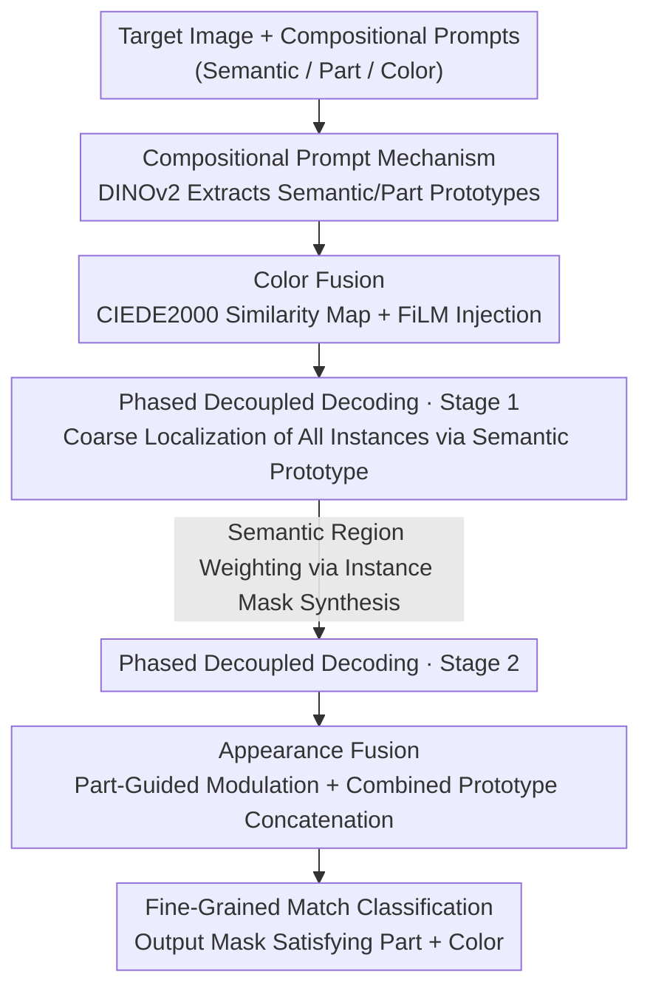

# CDICS: Delving Into Fine-Grained Attribute for In-Context Segmentation via Compositional Prompts and Phased Decoupling

**Conference**: CVPR 2026  
**Paper**: [CVF Open Access](https://openaccess.thecvf.com/content/CVPR2026/html/Li_CDICS_Delving_Into_Fine_Grained_Attribute_for_In-Context_Segmentation_via_Compositional_CVPR_2026_paper.html)  
**Code**: None  
**Area**: In-context segmentation / Semantic segmentation  
**Keywords**: In-context segmentation, compositional prompts, fine-grained attribute, phased decoupling, color prompt  

## TL;DR
CDICS upgrades traditional in-context segmentation from "one reference image defines one target" to "a combination of semantic, part, and color reference images defines the target." By utilizing a decoupled two-stage decoder (first for coarse semantic localization, then for refinement with appearance constraints), it separates the sub-problems of "what it is" and "what it looks like." In compositional prompt segmentation tasks, it improves IoU from 42.9% to 57.6% and reduces the False Positive Rate (FPR) from 8.3% to 3.9%.

## Background & Motivation
**Background**: In-Context Learning (ICL) has become a mainstream paradigm for image segmentation. By providing a model with one or more "reference image + mask" examples, the model can segment similar targets in a query image without updating weights. Compared to pure text descriptions, reference images directly convey complex visual appearance details, which is the primary advantage of ICL in segmentation. Representative methods include SegGPT, Matcher, and SINE.

**Limitations of Prior Work**: Existing ICL segmentation methods only understand reference images at the **semantic or instance level**. They excel at answering "what category is the target" but lack the flexibility to adjust the granularity of segmentation. Real-world user needs are diverse; sometimes one needs to "segment a chair," and other times "segment a person wearing a necklace of a specific style and color." To achieve the latter, users must find a reference image with a **perfectly matching appearance attribute**, which is nearly impossible for rare or complex concepts.

**Key Challenge**: The fundamental issue is that compressing "semantic identity" and "fine-grained appearance constraints (parts, colors)" into a single reference image for matching leads to **feature coupling**. The model must simultaneously determine "is this a chair" and "is this color correct," goals that interfere with each other. Consequently, appearance constraints are either overwhelmed by semantic information, or foreground objects with similar colors in the background are falsely activated. Text-based approaches (RES, Referring Expression Segmentation) cannot solve the color dimension either: natural language color vocabulary is discrete, limited, and ambiguous (distinct people understand "red" differently), making it insufficient for scenarios like e-commerce or industrial inspection.

**Goal**: To enable in-context segmentation to support **compositional, controllable, and fine-grained** target descriptions without undermining its original general segmentation capabilities.

**Key Insight**: The authors observe that since a single "perfect reference image" is unavailable, the target description should be **decomposed into compositional visual primitives**: a semantic reference (defining the category), a part reference (defining the specific component), and a color reference (defining the desired color). These three can be independently sampled from different images and freely combined, bypassing the difficulty of "finding a perfect sample." To ensure these signals collaborate without mutual interference, the task is decoupled at the **architectural level** into two separate stages.

**Core Idea**: Replace "one-step matching with a single reference image" with a "compositional prompt (semantic-part-color) + phased task decoupling (coarse semantic localization → fine appearance refinement)" to resolve fine-grained attribute control at the task definition level.

## Method

### Overall Architecture
CDICS follows an encoder-decoder architecture. The input consists of a target image $I_{tar}\in\mathbb{R}^{3\times H\times W}$ and a set of **compositional prompts** acting upon it: a semantic reference (image + mask), a part reference (image + mask), and a color reference $I_{col}\in\mathbb{R}^{3\times1\times1}$ (an RGB value). The output is a fine-grained segmentation mask strictly satisfying the "specified part + specified color" criteria.

The key to the entire pipeline lies in the **orthogonal decomposition** of a complex task into two independent sub-problems assigned to two specialized decoding stages:

- **Encoding Stage**: Uses DINOv2 to extract semantic prototype $F_{sem}$, part prototype $F_{part}$, and target features $F_{tar}$. Simultaneously, the Color Fusion module converts the color reference into a "similarity intensity map" and injects it into the target features to obtain color-enhanced features $F^{col}_{tar}$.
- **Stage 1 Decoder**: Considers only the semantic prototype to answer "what is the target"—it performs coarse localization for all instances of that semantic category, producing a set of instance masks.
- **Stage 2 Decoder**: Within the regions identified in Stage 1, it answers "what does this specific target look like"—using the Appearance Fusion module to integrate part and color constraints into the features, refining the final mask that satisfies appearance constraints.

### Key Designs

**1. Compositional Prompt Mechanism: Decomposing "Perfect Samples" into Freely Combinable Visual Primitives**

Traditional ICL segmentation can only process a single reference image where the target's semantics, parts, and colors are all conflated, forcing users to find a perfectly matching sample while preventing independent control of attributes. CDICS splits prompts into three independent visual references: the semantic reference $(I_{sem}, M_{sem})$ uses DINOv2 + MaskPooling to extract a semantic prototype $F_{sem}\in\mathbb{R}^{1\times C}$, the part reference $(I_{part}, M_{part})$ similarly extracts a part prototype $F_{part}\in\mathbb{R}^{1\times C}$, and the color reference is an RGB value $I_{col}$. These can be sampled independently and combined arbitrarily, allowing the same framework to support instructions at three levels: "segment a chair" (pure semantic), "segment a chair with a backrest" (semantic + part), and "segment a chair where the backrest is that color" (semantic + part + color). This is claimed to be the first compositional prompt scheme to unify "object semantics + part morphology + color attributes" into a segmentation network, fundamentally eliminating dependency on "perfect reference samples."

**2. Color Fusion Module: Quantifying Vague Colors into Spatial Intensity Maps**

A raw RGB value cannot directly inform a network which regions in an image have the "correct color." The Color Fusion approach generates a **positional indicator intensity map**: pixels in the target image closer to the reference color yield higher intensities. Specifically, the target image $I_{tar}$ and reference color $I_{col}$ are converted to the perceptually uniform CIELAB color space. The CIEDE2000 color difference $\Delta E_{00}$ is calculated pixel-wise and then inverted and normalized into a similarity map:

$$M_{sim}(I_{tar}, I_{col}) = 1 - \mathrm{Norm}(\Delta E_{00}(I_{tar}, I_{col})).$$

Smaller color differences result in higher similarity. This map then modulates target features via a FiLM (Feature-wise Linear Modulation) layer, which generates per-channel affine parameters $\gamma, \beta$ from $M_{sim}$ to scale and shift the features:

$$\gamma, \beta = \mathrm{FiLM}(M_{sim}), \qquad F^{col}_{tar} = F_{tar}\cdot(1+\gamma) + \beta.$$

This specifically enhances features in regions matching the reference color, resulting in "color-sensitive" enhanced features $F^{col}_{tar}$. Using CIEDE2000 instead of simple RGB distance models human perceptual nuances, increasing stability in industrial/e-commerce scenarios sensitive to color precision.

**3. Phased Decoupled Decoding: Answering "What it is" then "What it looks like" to Avoid Feature Coupling**

Cramming semantic recognition and appearance matching into a single decoder causes features of different constraints to intertwine, hindering learning. CDICS splits this into two serial stages. **Stage 1 (Coarse Semantic Localization)** ignores parts and colors entirely, using only the semantic prototype $F_{sem}$. A set of learnable instance queries $Q_{ins}\in\mathbb{R}^{N\times C}$ interacts with target features through a transformer decoder to localize all instances of that category, outputting coarse masks and semantic labels—this step is nearly identical to traditional ICL segmentation and provides global localization. **Stage 2 (Appearance Constraint Refinement)** follows: it merges the $N$ instance masks from Stage 1 ($Score_{ins}\in\mathbb{R}^{N\times n\times m}$) into a single consolidated semantic region score map $Score_{sem}\in\mathbb{R}^{1\times n\times m}$, which is used to weight features for Stage 2 input:

$$F^{S2}_{tar} = (Score_{sem} + 1)\cdot F^{S1}_{tar}.$$

This dot product forces the model to focus on foreground targets and filter out background noise. Both stages are supervised with the same loss, allowing them to focus independently on their respective goals. This "coarse semantic → fine refinement" decoupling preserves the global localization of semantic guidance while providing independent learning space for fine-grained appearance.

**4. Appearance Fusion Module: Using Part Prototypes as "Semantic Locks" for Color**

Relying solely on $F^{col}_{tar}$ is problematic—it highlights all "color-correct" regions but cannot distinguish semantic identity, enhancing a "red mailbox" in the background as much as a "red car door" target. Appearance Fusion resolves this by using the part prototype $F_{part}$ to guide and modulate color-enhanced features. It calculates the cosine similarity between $F_{part}$ and $F^{col}_{tar}$ at each spatial location to generate a part attention map, followed by inverse selective modulation:

$$F^{cp}_{tar} = (\mathrm{sim}(F_{part}, F^{col}_{tar}) + 1)\cdot F^{col}_{tar}.$$

This step maximizes enhancement for regions where **both part and color match**, resolving the ambiguity of color alone. The process then reverses: this more accurate $F^{cp}_{tar}$ is used to enhance the original part prototype $F_{part}$, resulting in an "appearance-aware" part feature $F_{cp}$. Finally, $F_{cp}$ and the semantic prototype $F^{s1}_{sem}$ are fused into a combined prototype $F_{scp}\in\mathbb{R}^{1\times C}$, which is concatenated with the original $F^{s1}_{sem}$ to form the final compositional feature $F^{s2}_{sem}\in\mathbb{R}^{2\times C}$. This feature carries both "semantic identity" and "appearance constraints," allowing the classifier to distinguish attribute-level differences within the same semantic class.

### Loss & Training
The model is supervised at each stage with the same loss for instance segmentation outputs. Since the network outputs a set of instance predictions for a variable number of GT objects, the Hungarian algorithm is used for one-to-one optimal matching. The loss for each matched pair in stage $i\in\{1,2\}$ includes classification and mask terms:

$$L^i_H = \sum_{j=1}^{N_i}\left[-\log p_{\sigma(j)}(c_j) + \mathbb{1}_{c_j\neq\varnothing}L_{mask}\right],$$

where the classification term is the negative log-likelihood of the predicted category, and the mask loss is the sum of BCE and Dice: $L_{mask}(\hat{M}, M) = L_{BCE} + L_{Dice}$. Total loss is $L_{total} = \sum_{i=1}^{2} L^i_H$. The model is built on the SINE architecture, initialized with its pre-trained weights, and jointly trained on ColorPACO + COCO-Ins with a 1:1 sampling ratio using AdamW with an initial learning rate of $1\times10^{-4}$ on 8 A6000 GPUs with batch 160 for 60 epochs.

## Key Experimental Results

### Main Results
Evaluation is conducted on four datasets: the author-reconstructed **ColorPACO** (fine-grained RGB color annotations on PACO, 75 objects / 456 object-part classes), **ColorPartImageNet** (similar annotations on PartImageNet for out-of-distribution testing), and standard **COCO-20i** (few-shot segmentation) and COCO-Ins. The dataset includes positive samples (matching object/part/color) and negative samples (category present but part or color mismatch, GT is an all-zero mask). Metrics: IoU for positive samples, **FPR** (False Positive Rate, $FPR = FP/(FP+TN)$) for negative samples—lower FPR indicates better rejection of mismatched instructions.

| Method | Category | COCO-20i IoU↑ | ColorPACO IoU↑ | ColorPACO FPR↓ | ColorPartImageNet IoU↑ | ColorPartImageNet FPR↓ |
|------|------|------|------|------|------|------|
| SegGPT | in-context | 56.1 | 23.9 | 4.9 | **85.2** | 23.8 |
| Matcher | in-context | 52.7 | 42.6 | 8.3 | 81.9 | 20.9 |
| SINE | in-context | 64.5 | 44.1 | 17.1 | 84.1 | 23.4 |
| LDIS | in-context | 60.3 | 31.0 | 12.4 | 71.3 | 26.4 |
| PSALM | referring | / | 40.8 | 12.5 | / | / |
| HyperSeg | referring | / | 42.9 | 8.3 | / | / |
| **CDICS** | ours | **65.2** | **57.6** | **3.9** | 84.4 | **12.5** |

- On ColorPACO, IoU is 14.7 points higher than the strongest referring segmentation model HyperSeg (42.9), while FPR (3.9 vs 8.3) is more than halved.
- On ColorPartImageNet, although SegGPT has the highest IoU (85.2), its FPR is as high as 23.8 (tending towards "over-segmentation"); CDICS achieves a similar IoU (84.4) with an FPR of only 12.5, balancing precision and fidelity.
- On COCO-20i, IoU at 65.2 is slightly higher than SINE (64.5), indicating that the compositional understanding module does not degrade general segmentation performance.

Instance segmentation comparisons (ColorPACO, AP/AP50) also show comprehensive leadership:

| Method | AP↑ | AP50↑ |
|------|------|------|
| HyperSeg | 12.9 | 16.3 |
| PSALM | 10.7 | 13.9 |
| SINE | 14.3 | 27.3 |
| **CDICS** | **20.8** | **34.9** |

### Ablation Study
Stepwise addition of two core modules on ColorPACO (Baseline uses basic encoder fusion of three features):

| Config | IoU↑ | FPR↓ | AP↑ | AP50↑ | Description |
|------|------|------|------|------|------|
| Baseline | 50.3 | 12.0 | 16.9 | 27.7 | Basic feature fusion |
| + Appearance Fusion | 51.4 | 9.3 | 18.9 | 30.8 | FPR reduced by 2.7 points |
| + Two-Stage | **58.9** | **5.7** | **23.8** | **42.4** | Full model |

### Key Findings
- **Phased decoupling is the primary driver of performance**: Adding Two-Stage improves IoU from 51.4 to 58.9 (+7.5), reduces FPR from 9.3 to 5.7, and raises AP50 from 30.8 to 42.4. This localized refinement is more effective than just adding Appearance Fusion.
- **Appearance Fusion primarily manages "rejecting incorrect instructions"**: Adding it alone increases IoU by only 1.1 but reduces FPR by 2.7 points—indicating its value lies in using part guidance to eliminate color ambiguity rather than just increasing overlap.
- ⚠️ In the ablation table, the full model IoU is 58.9, whereas CDICS's ColorPACO IoU in the main table is 57.6; this slight discrepancy may stem from differences in training/evaluation settings.

## Highlights & Insights
- **Transitioning color from language to the visual dimension**: Using an RGB value + CIEDE2000 similarity map + FiLM injection bypasses the discrete and ambiguous nature of natural language color descriptors. This is practical for "hard to describe but easy to show" scenarios like e-commerce or quality control.
- **Task orthogonal decomposition as a transferable paradigm**: Coarse localization followed by fine-grained attribute matching within localized regions can be applied to any "classify then identify attributes" task.
- **Using FPR as a core metric addresses the real problem**: Fine-grained controllable segmentation isn't just about accurate segmenting; it's about the ability to refuse to segment when constraints aren't met. The inclusion of negative samples and FPR forces the model to learn instruction discrimination.
- **Part prototypes as "semantic locks" for color**: Single color signals often false-trigger background objects. Using part similarity for spatial modulation ensures color and parts are mutually constrained during enhancement.

## Limitations & Future Work
- **Dependency on reconstructed datasets**: The ability to process compositional prompts relies on the ColorPACO dataset. Performance might overfit this "semantic-part-color" structure, and the cost of scaling this to domains without part annotations is high.
- **Color prompt as a single RGB value**: $I_{col}$ only represents solid colors, potentially failing on gradients, textures, or multi-colored targets. CIEDE2000 also assumes relatively uniform color distribution within regions.
- **High interaction cost**: Although it avoids "perfect samples," users must provide three distinct inputs. The behavior when a prompt component is missing is not discussed.
- ⚠️ The discrepancy between ablation and main table IoU (58.9 vs 57.6) remains unexplained in the text.

## Related Work & Insights
- **vs SINE / Matcher / SegGPT (In-context Segmentation)**: These models struggle with attribute-level control and rely on single reference images. CDICS builds on the SINE architecture but extends it with compositional prompts and decoupling, outperforming them in both precision and instruction following.
- **vs HyperSeg / PSALM / OMG-LLaVA (Referring Segmentation)**: These use MLLMs for text parsing, but discrete color vocabulary is ambiguous. CDICS's visual color cues provide more consistent and precise cross-lingual color semantics.
- **vs Compositional Paradigms (CZSL / CIR)**: While previous work explored compositionality in recognition/retrieval, CDICS is the first to introduce it to in-context segmentation, treating visual samples as compositional inputs for fine-grained control.

## Rating
- Novelty: ⭐⭐⭐⭐⭐ First to introduce semantic+part+color compositional prompts to in-context segmentation; the "phased task decoupling" effectively addresses feature coupling.
- Experimental Thoroughness: ⭐⭐⭐⭐ Extensive datasets and OOD testing; however, minor IoU discrepancies in tables exist.
- Writing Quality: ⭐⭐⭐⭐ Clear motivation and complete formulas.
- Value: ⭐⭐⭐⭐ Significant value for e-commerce/industrial applications; decoupled paradigm is highly transferable.

<!-- RELATED:START -->

## Related Papers

- [\[CVPR 2026\] High-Precision Dichotomous Image Segmentation via Depth Integrity-Prior and Fine-Grained Patch Strategy](high-precision_dichotomous_image_segmentation_via_depth_integrity-prior_and_fine.md)
- [\[CVPR 2026\] Training-Free Open-Vocabulary Camouflaged Object Segmentation via Fine-Grained Object Binding and Adaptive Hybrid Prompt](training-free_open-vocabulary_camouflaged_object_segmentation_via_fine-grained_o.md)
- [\[CVPR 2026\] Training-Free Fine-Grained Semantic Segmentations in Low Data Regimes: A FungiTastic Baseline](training-free_fine-grained_semantic_segmentations_in_low_data_regimes_a_fungitas.md)
- [\[CVPR 2026\] INSID3: Training-Free In-Context Segmentation with DINOv3](insid3_training-free_in-context_segmentation_with_dinov3.md)
- [\[CVPR 2026\] DeRVOS: Decoupling Consistent Trajectory Generation and Multimodal Understanding for Referring Video Object Segmentation](dervos_decoupling_consistent_trajectory_generation_and_multimodal_understanding_.md)

<!-- RELATED:END -->
