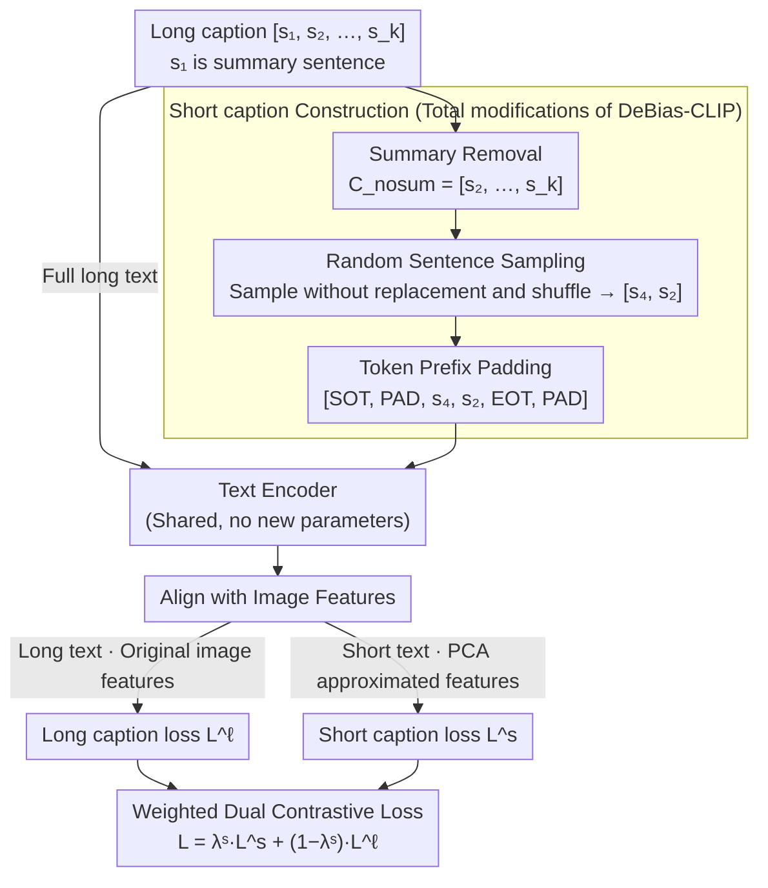

# DeBias-CLIP: CLIP Is Shortsighted — Paying Attention Beyond the First Sentence

**Conference**: CVPR 2026  
**arXiv**: [2602.22419](https://arxiv.org/abs/2602.22419)  
**Code**: [https://github.com/TRAILab/DeBias-CLIP.git](https://github.com/TRAILab/DeBias-CLIP.git)  
**Area**: Semantic Segmentation  
**Keywords**: CLIP, Long-text Retrieval, Attention Bias, First-sentence Bias, Data Augmentation

## TL;DR
It is discovered that CLIP models exhibit a heavy bias towards encoding summary sentences and early tokens in long-text scenarios ("shortsighted" behavior). By employing three zero-parameter incremental training augmentation strategies — summary removal, random sentence sampling, and token prefix padding — the proposed method achieves comprehensive SOTA performance in long-text retrieval while simultaneously improving short-text retrieval.

## Background & Motivation

**Background**: CLIP models obtain powerful cross-modal representations through image-text contrastive learning, which are widely used in zero-shot classification, multimodal retrieval, and text-to-image diffusion models. However, the original CLIP was primarily trained on short caption data with a token limit of only 77 (approximately 3-4 sentences), restricting its comprehension of long text. Long-CLIP mitigates this by stretching position embeddings to 248 tokens and performing fine-tuning.

**Limitations of Prior Work**: A critical but overlooked bias is identified — long captions generated by both humans and LLMs follow a "summary first + details later" structure. This structure acts as a shortcut during training, causing the model's attention to concentrate on the first sentence and early tokens, while subsequent content is largely ignored.

**Key Challenge**: Although methods like Long-CLIP extend context length, the inherent early-token bias of pre-trained CLIP remains, causing the extended model to still "see" only the first few tokens. Experiments confirm that removing the first sentence causes Long-CLIP's retrieval performance on DOCCI to drop by 17.1%, and swapping the first and fourth sentences results in a 9.7% decrease.

**Goal**: Eliminate the first-sentence/early-token bias in the CLIP text encoder to enable the model to truly utilize all information within long captions.

**Key Insight**: Since the bias stems from data structure (the summary sentence shortcut), it can be eliminated through data augmentation during training without requiring new architectures or additional parameters.

**Core Idea**: Remove the summary sentence from training captions and use sentence sampling and token padding to distribute supervision signals evenly across all token positions.

## Method

### Overall Architecture
DeBias-CLIP aims to resolve the "shortsightedness" of the CLIP text encoder where it primarily "looks" at the first sentence and ignores the latter half of long captions. It modifies the construction of short captions during training without changing the architecture or adding parameters. Specifically, it adopts the dual contrastive loss from Long-CLIP: a long caption loss $\mathcal{L}^\ell$ aligns the image with the full long text, and a short caption loss $\mathcal{L}^s$ aligns the image with a text subset. While Long-CLIP uses the first sentence summary as the short caption — which is the root of the first-sentence bias — DeBias-CLIP replaces the source of short captions with fragments processed through "summary removal, random sampling, and prefix padding" to force the model to distribute attention across the entire text.

### Key Designs

**1. Summary Removal: Changing the short caption "ground truth" from summary to details**

Nearly all long captions follow a "summary first + subsequent details" format. Since Long-CLIP uses the first sentence $s_1$ as the short caption, it becomes the easiest shortcut in the contrastive loss — the model only needs to align the first sentence to achieve high similarity. A control experiment revealed that for Long-CLIP on DOCCI, the similarity between the first sentence and the image $\overline{\text{sim}}(u^s, v) = 0.320$ was actually higher than the $0.308$ for the full caption, indicating that subsequent sentences failed to contribute and instead diluted similarity. DeBias-CLIP's strategy is direct: define the short caption during training as the remaining content after removing the first sentence $C^{\mathrm{no\_sum}} = [s_2, \ldots, s_k]$. Once the summary sentence disappears from the supervision signal, the model must read details to minimize loss, blocking the shortcut. This step alone provides a $+5.4\%$ improvement in ablation studies, representing the largest contribution.

**2. Random Sentence Sampling: Ensuring unique short captions per iteration**

Removing the summary sentence is insufficient if the remaining sentences are fed in their original sequence; the difference between short and long captions would remain too small. The proposed approach randomly samples $n_{\mathrm{sampled}} = \mathcal{U}\{1, 2, \ldots, n_{\mathrm{sents}}-1\}$ sentences from $C^{\mathrm{no\_sum}}$ without replacement and disrupts their original order to form a sub-caption varying in length and content (e.g., $C^{\mathrm{samp}} = [s_4, s_2]$). Different sentence combinations are seen at each training step, widening the gap between short and long captions at zero cost and forcing the model to be more sensitive to specific details in both text and images rather than memorizing fixed templates.

**3. Token Prefix Padding: Forcing training of late-position embeddings**

While the previous steps address "which sentences to look at," a latent issue remains: the sampled short captions are generally short, causing tokens to cluster at the beginning of the sequence. Consequently, position embeddings at later positions receive almost no gradients, making early-token bias difficult to correct. Prefix padding addresses this by randomly shifting some padding tokens from the end of the sequence to immediately after the SOT. The number of shifted tokens $n_{\mathrm{pre}} = \mathcal{U}\{0, 1, \ldots, n_{\mathrm{post}}\}$ is randomly sampled, pushing informative tokens backward. The resulting sequence takes the form:

$$T^s_{\mathrm{ours}} = [\mathtt{SOT}, \mathtt{PAD}_{\mathrm{pre}}, \mathtt{s}_4, \mathtt{s}_2, \mathtt{EOT}, \mathtt{PAD}_{\mathrm{post}}]$$

This ensures that later position embeddings are frequently activated and trained, while the text remains intact, preserving short-text retrieval performance. Adding this yields an additional $+2.5\%$, bringing the total Gain to $+8.6\%$.

### Mechanism Example: Processing a caption into a short caption
Consider a 5-sentence long caption $[s_1, s_2, s_3, s_4, s_5]$, where $s_1$ is the summary sentence. Step 1: Remove the summary to get $C^{\mathrm{no\_sum}} = [s_2, s_3, s_4, s_5]$. Step 2: Randomly sample 2 sentences and shuffle them to get $C^{\mathrm{samp}} = [s_4, s_2]$. Step 3: Tokenize and apply prefix padding to get $[\mathtt{SOT}, \mathtt{PAD}, \mathtt{PAD}, \mathtt{s}_4, \mathtt{s}_2, \mathtt{EOT}, \mathtt{PAD}, \ldots]$. This modified short fragment is used to calculate $\mathcal{L}^s$, while the complete $[s_1, \ldots, s_5]$ is used for $\mathcal{L}^\ell$. The model can no longer rely on the "align the first sentence" shortcut for the same image and must utilize full-text details.

### Loss & Training
The final objective is a weighted dual contrastive loss $\mathcal{L} = \lambda^s \mathcal{L}^s + (1 - \lambda^s) \mathcal{L}^\ell$. The short caption loss follows Long-CLIP's PCA-approximated image features, while the long caption loss uses original image features. Training is conducted on ShareGPT4V for 3 epochs with a batch size of 256 using 4× A100.

## Key Experimental Results

### Main Results (Long-text Retrieval Top-1)

| Method | Urban1k T2I/I2T | DCI T2I/I2T | Long-DCI T2I/I2T | DOCCI T2I/I2T |
|------|----------------|-------------|-------------------|---------------|
| CLIP (ViT-B) | 53.4/67.5 | 42.9/44.1 | 32.7/35.9 | 57.1/60.6 |
| Long-CLIP | 79.5/78.9 | 57.1/51.6 | 47.0/41.1 | 71.4/63.1 |
| SmartCLIP | 87.4/90.0 | 64.0/64.9 | 52.8/53.4 | 78.0/77.4 |
| **Ours** | **93.0/93.1** | **67.6/68.5** | **57.4/57.8** | **80.0/79.7** |

### Ablation Study (ViT-B/16, DOCCI T2I)

| Configuration | DOCCI T2I | Gain vs Long-CLIP |
|------|-----------|----------------|
| Long-CLIP baseline | 71.4 | — |
| + Summary Removal | 76.8 | +5.4 |
| + Summary Removal + Sentence Sampling | 77.5 | +6.1 |
| + Summary Removal + Sentence Sampling + Padding | **80.0** | **+8.6** |

### Key Findings
- Removing the summary sentence is the most critical improvement (+5.4%), confirming that first-sentence bias is the core bottleneck.
- The combination of the three augmentation strategies is highly effective, achieving SOTA across almost all long and short-text retrieval datasets.
- Robustness to sentence permutations is significantly improved: the performance drop after swapping sentences decreased from -9.7% in Long-CLIP to -3.5%.
- The method is generalizable across various pre-trained CLIP variants (OpenAI CLIP, OpenCLIP, SigLIP, SigLIP2), showing consistent improvements.

## Highlights & Insights
- Diagnosing the problem is more fascinating than the solution itself — systematically revealing CLIP's "shortsighted" behavior (early-token bias + summary sentence shortcut) is highly valuable. The methodology of using padding experiments, sentence swapping, and attention weight analysis to quantify bias is exemplary.
- The zero-parameter solution is exceptionally elegant — achieving SOTA through training data sampling strategies alone reflects the "data over model" insight. This approach is transferable to any contrastive learning scenario with structured data bias.
- Attention weight analysis shows that DeBias-CLIP exhibits a flatter attention distribution, indicating that the model has truly learned to utilize deep information within long text.

## Limitations & Future Work
- SigLIP/SigLIP2 variants still show significant performance drops after sentence permutation (-6.1%/-6.5%), suggesting that residual position sensitivity inherits from pre-training and is difficult to eliminate via fine-tuning alone.
- The assumption of semantic independence between sentences is simplified; real long captions contain coreference and causal relations which might be lost by shuffling sequences.
- Training was limited to ShareGPT4V (1.2M images); effectiveness on larger scales or different domains remains to be verified.
- Impact on downstream generation tasks (e.g., text-to-image) was not explored.

## Related Work & Insights
- **vs Long-CLIP**: Long-CLIP extends context length via position embedding stretching but does not address first-sentence bias. DeBias-CLIP resolves this core bias as a significant incremental improvement.
- **vs SmartCLIP**: SmartCLIP learns text-conditioned image feature masks (adding parameters); DeBias-CLIP uses no extra parameters yet achieves better performance.
- **vs FineLIP**: FineLIP adds cross-modal refinement modules (requiring known positive pairs at inference); DeBias-CLIP is simpler and does not rely on additional information during inference.

## Rating
- Novelty: ⭐⭐⭐⭐ Excellent problem diagnosis; solution is simple but effective.
- Experimental Thoroughness: ⭐⭐⭐⭐⭐ Extremely thorough analysis across multiple datasets and models.
- Writing Quality: ⭐⭐⭐⭐⭐ Logical flow, progressing clearly from diagnosis to resolution.
- Value: ⭐⭐⭐⭐ Practical impact on understanding and improving the CLIP ecosystem.

<!-- RELATED:START -->

## Related Papers

- [\[CVPR 2026\] Beyond Text: Visual Description Assembly by Probabilistic Model for CLIP-based Weakly Supervised Semantic Segmentation](beyond_text_visual_description_assembly_by_probabilistic_model_for_clip-based_we.md)
- [\[CVPR 2026\] Looking Beyond the Window: Global-Local Aligned CLIP for Training-free Open-Vocabulary Semantic Segmentation](looking_beyond_the_window_global-local_aligned_clip_for_training-free_open-vocab.md)
- [\[CVPR 2026\] ReAttnCLIP: Training-Free Open-Vocabulary Remote Sensing Image Segmentation via Re-defined Attention in CLIP](reattnclip_training-free_open-vocabulary_remote_sensing_image_segmentation_via_r.md)
- [\[CVPR 2026\] Leveraging Class Distributions in CLIP for Weakly Supervised Semantic Segmentation](leveraging_class_distributions_in_clip_for_weakly_supervised_semantic_segmentati.md)
- [\[NeurIPS 2025\] Interpreting ResNet-based CLIP via Neuron-Attention Decomposition](../../NeurIPS2025/segmentation/interpreting_resnet-based_clip_via_neuron-attention_decomposition.md)

<!-- RELATED:END -->
