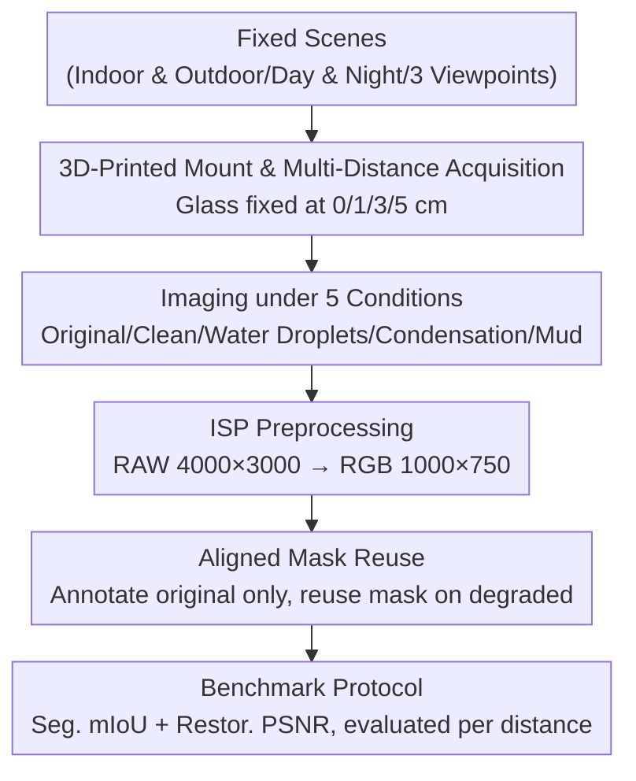

# CLP: A Real-World Dataset of Contaminated Lens Protectors for Robust Semantic Segmentation

**Conference**: CVPR 2026  
**Paper**: [CVF Open Access](https://openaccess.thecvf.com/content/CVPR2026/html/Park_CLP_A_Real-World_Dataset_of_Contaminated_Lens_Protectors_for_Robust_CVPR_2026_paper.html)  
**Code**: https://clp-dataset.github.io (Project Page)  
**Area**: Semantic Segmentation / Robust Perception / Dataset  
**Keywords**: Lens Protector Contamination, Real-world Degradation, Aligned Clean-Degraded Images, Multi-distance Acquisition, Robust Semantic Segmentation

## TL;DR
The authors utilize a 3D-printed "glass holder" to mount replaceable contaminated glass sheets in front of a smartphone camera, constructing CLP—a dataset of **real physical contamination** on lens protectors (three types of contamination: mud, water droplets, and condensation $\times$ four lens-to-protector distances: 0/1/3/5 cm). It provides strictly aligned "clean/degraded" image pairs and 125 dense semantic label classes. A wide range of segmentation and restoration models are systematically evaluated, yielding baseline conclusions such as "robustness depends more on adaptation strategies than model size" and "task-aware restoration is what truly benefits segmentation."

## Background & Motivation
**Background**: Semantic segmentation has achieved significant progress using large-scale datasets and foundation models. Robustness research also covers digital corruptions (e.g., ImageNet-C noise/blur) and adverse weather (fog, rain, night). However, these benchmarks either **synthesize** degradations on clean images to obtain aligned image pairs or collect real-world adverse weather images without **pixel-aligned** clean references.

**Limitations of Prior Work**: Physical contamination attached to the lens (mud, water droplets, and condensation) is rarely studied. The artifacts generated by such contamination are both severe and **spatially irregular** (mixing blur, color cast, occlusion, and scattering), which cannot be simulated by synthetic corruptions. Meanwhile, collecting paired "clean image + real contamination image" for the same scene is extremely difficult. A few prior works (e.g., SIDL) collected real paired data using customized hardware, but only cover fixed configurations like smartphones.

**Key Challenge**: In real camera systems, there is often a **lens protector/cover** in front of the lens, separated by a physical **gap** (varying across devices for heat dissipation, shock absorption, and maintenance convenience). This gap introduces distinct **refractive effects**—the same mud on the protector generates **completely different image degradation patterns** depending on the gap size. Existing works place contamination directly on the lens, entirely ignoring this "lens-to-protector distance" dimension.

**Goal**: To build a realistic, controllable, and densely annotated lens protector contamination dataset, allowing researchers to: (1) access paired clean/degraded images under real-world contamination, (2) evaluate dense recognition performance, and (3) systematically study the impact of the zoom/distance geometric factor on perception.

**Key Insight**: Utilizing a smartphone as a low-cost proxy (since robot/vehicle collection is too expensive and hard to scale), and a **3D-printed mount** to precisely fix replaceable glass sheets at 0/1/3/5 cm from the lens, thereby obtaining real physical refractive degradations while ensuring controllable geometry and scene alignment.

**Core Idea**: By using "distance-controllable contaminated glass sheet proxies + strict geometric alignment," this work establishes a reproducible benchmark with "real lens protector contamination paired data + dense segmentation annotations," which was previously uncollectible.

## Method

### Overall Architecture
CLP is essentially a **data acquisition and benchmark construction pipeline** and does not propose a new model; its contribution lies in the dataset itself. The overall workflow is: first, fix a thin glass plate at optional distances in front of a smartphone camera using a 3D-printed mount $\rightarrow$ for the same fixed scene, capture the **original image** (without glass), then the **clean glass image**, and finally replace it with a contaminated glass to take one image at each of the four distances $\rightarrow$ convert all images from RAW to RGB using an open-source ISP and resize them uniformly $\rightarrow$ perform dense semantic annotation only on the original (uncovered) images, and then reuse the same mask onto the corresponding degraded images based on geometric alignment $\rightarrow$ split into train/test sets, with evaluation protocols for both segmentation mIoU and restoration PSNR. This yields 600 scenes, 4,800 degraded images, 125 semantic classes, and 19,203 instances.

### Key Designs

**1. 3D-Printed Protector Holder + Multi-Distance Acquisition: Making the "Lens-Protector Gap" a Controllable Variable**

This design directly addresses the limitation of prior work ignoring the physical gap between the lens and the protector. The authors created a custom 3D-printed phone mount (Figure 3a) with slots to precisely fix a thin transparent glass plate at four preset distances: **0 cm, 1 cm, 3 cm, and 5 cm**. During acquisition, the camera is set to a fixed bracket angle (one of three mounting postures: upward, horizontal, downward). Then, **the scene and camera are kept strictly stationary**, and only the contaminated glass plate is adjusted to capture images at the four distances. Thus, the gap is transformed from an ignored confounding factor into an experimental variable that can be ablated independently. Its value is demonstrated in the analysis of Figure 5: different types of contamination respond completely differently to distance—scattering distortion on clean glass **monotonically increases** with distance; condensation actually **improves** at larger distances (as the condensation layer lies further from the focal plane and becomes defocussed); and localized occlusions like mud and water droplets only show **spatial shifts with no change in overall severity**. This interaction between "distance $\times$ contamination type" cannot be provided by synthetic data or direct-on-lens collection.

**2. Five Conditions + Real Physical Contamination: Covering Aligned Image Pairs of Original, Clean, Water Droplets, Condensation, and Mud**

To address the limitation that synthetic artifacts cannot capture the complexity of real-world contamination, CLP collects five conditions for each scene: **Original** (no glass, acting as the restoration target and the uncovered reference for annotation), **Clean** (through an uncontaminated glass, introducing minor reflections/attenuations—the pixel histogram in Figure 4 shows its distribution is highly close to the original images), **Water Droplets** (spraying water on the glass, creating complex refraction with each droplet), **Condensation** (fogging the glass with steam, causing large-area blur), and **Mud** (splashing thick mud, causing heavy local occlusion). All three contamination types are **physically produced** rather than digitally synthesized, thus inherently retaining realistic mixed artifacts of refraction, scattering, and occlusion. Each scene yields 9 aligned images: 1 original + 4 distances $\times$ (clean, contaminated) pairs, totaling $600 \times 2 \times 4 = 4,800$ degraded images.

**3. Aligned Mask Reuse: Annotating the Original Only, Reusing Masks on Degraded Images via Geometric Consistency**

This represents the key engineering technique that allows the dataset to obtain dense annotations, addressing the limitation that direct pixel-wise annotation on heavily degraded images is unreliable. Since mud and condensation distort or obscure large areas, human annotators cannot reliably segment degraded images. Exploiting the premise that **viewpoints are strictly consistent** between original and degraded images, the authors perform dense semantic annotations only on the clean **original (uncovered) images**, and directly copy the same mask to the corresponding degraded images. All masks are manually annotated by 4 experts and experience **multi-stage cross-checking**. This yields 125 semantic classes and 19,203 instances, with each class appearing at least once in the test set to ensure class-balanced evaluation.

> Design 1 (mount/distance) guarantees that the premise of "geometric alignment" holds, and Design 3 (mask reuse) is built on top of this premise—they are causally linked: without controllable, aligned acquisition, transferring original masks to degraded images would be impossible.

### Loss & Training
Since this is a dataset paper, no new training objectives are proposed. Instead, the benchmarks are run on CLP using the official training pipelines of the respective baselines. Implementation details: segmentation inputs are resized to $512\times512$ and restoration inputs to $128\times128$, following the default augmentations (random flip/crop) of each codebase, with batch sizes of 8 and 4, respectively. During evaluation, segmentation predictions are resized back to the training crop size before computing mIoU, and restoration is evaluated in the original resolution using PSNR. All experiments are conducted on a single RTX 4090 with fixed random seeds.

## Key Experimental Results

### Main Results
The authors comprehensively evaluate 12 segmentation models across 6 paradigms on the CLP test set, using mIoU (%) as the metric. The table below excerpts the overall averages alongside representative types (the complete table in the paper contains per-distance results for 0/1/3/5 cm):

| Method (Paradigm) | Clean Avg | Mud Avg | Water Avg | Cond. Avg | Overall |
|------|------|------|------|------|------|
| Mask2Former (Supervised) | 44.0 | 29.5 | 39.8 | 32.5 | 36.4 |
| VMamba (Supervised) | 47.9 | 29.3 | 39.5 | 33.7 | 37.6 |
| Rein (DG) | 56.2 | 36.6 | 54.0 | 40.5 | 46.9 |
| **SoMA (DG)** | 57.4 | 40.0 | 51.4 | 43.2 | **48.0** |
| DAFormer (DA) | 44.9 | 27.5 | 35.1 | 28.5 | 34.0 |
| MIC (DA) | 39.5 | 26.1 | 33.2 | 30.0 | 32.2 |
| DINOv2 (Foundation Model) | 52.6 | 40.9 | 53.2 | 42.1 | 47.2 |
| SAM (Foundation Model) | 46.0 | 30.2 | 46.2 | 34.4 | 39.2 |
| RobustSAM (Robust) | 45.5 | 33.6 | 44.4 | 34.4 | 39.5 |
| FIFO (Robust) | 38.2 | 27.5 | 33.2 | 30.0 | 32.2 |
| UniRestore (Task-Aware Restor.) | 42.7 | 30.8 | 40.0 | 35.6 | 37.3 |
| URIE (Task-Aware Restor.) | 40.8 | 25.6 | 35.3 | 27.2 | 32.2 |

Key numbers to note: **SoMA leads with an overall mIoU of 48.0%**, followed closely by DINOv2 at 47.2%. The paper highlights that DINOv2 achieves the highest average when **only considering contamination types** (mud/water/condensation, excluding clean), and maintains coarse semantic structures even under heavy degradation at 5 cm (e.g., shoe/door remain distinguishable in Figure 8), which is attributed to its strong visual priors from large-scale pre-training. Most counterintuitively, **DG completely outperforms DA**: SoMA and Rein outperform the strongest DA baseline (DAFormer, 34.0) by **+14.0 and +12.9 mIoU**, respectively—despite DG being trained only on clean images, whereas DA has access to unlabeled contaminated images. All models exhibit significant performance drops under **mud contamination** as the distance increases (due to severe occlusion), while other contamination types show smaller variations across distances due to weaker occlusion.

For the restoration task evaluated using PSNR (dB): DiffUIR achieves the best overall performance at **27.92 dB**, followed by UniRestore at 26.85 dB. Both are diffusion/generative methods that outperform deterministic supervised baselines like NAFNet (25.76 dB) and Restormer (25.22 dB), indicating that generative priors are more suitable for handling complex degradations in CLP. However, visible artifacts remain in heavily degraded regions after restoration, representing an open challenge.

### Ablation Study

**Joint "Restoration $\rightarrow$ Segmentation" Pipeline (Table 3)**: Connecting restoration models to the frontend of Mask2Former to observe if restoration assists segmentation. The baseline Mask2Former yields 33.9 mIoU overall.

| Config | Water | Mud | Cond. | Overall |
|------|------|------|------|------|
| Mask2Former (Baseline) | 39.8 | 29.5 | 32.5 | 33.9 |
| NAFNet + M2F | 35.2 (-4.6) | 25.3 (-4.2) | 32.2 (-0.3) | 33.7 (-2.7) |
| DiffUIR + M2F | 37.9 (-1.9) | 29.2 (-0.3) | 34.9 (+2.4) | 35.7 (-0.7) |
| URIE + M2F | 35.3 (-4.5) | 25.6 (-3.9) | 27.2 (-5.3) | 32.2 (-4.2) |
| **UniRestore + M2F** | 40.0 (+0.2) | 30.8 (+1.3) | 35.6 (+3.1) | 35.5 (+1.6) |

The conclusion is sharp: **higher restoration quality does not equate to better segmentation**. While DiffUIR yields the highest restoration PSNR, connecting it to the segmentation model only gains +2.4 on condensation, but drops by -1.9 on water droplets and -0.3 on mud; generic restoration methods (NAFNet/URIE) even severely degrade segmentation performance. The only method that achieves **comprehensive improvements over the baseline** is the task-aware restoration **UniRestore (overall +1.6, +3.1 on condensation, +1.3 on mud)**, indicating that restoration trained with downstream tasks in mind is the most promising direction.

**Data Scale (Table 4)**: Analyzing scaling effects using 10%–100% of the training scenes, with results averaged across all contamination types.

| Training Ratio | SoMA mIoU | DAFormer mIoU | NAFNet PSNR | Restormer PSNR |
|------|------|------|------|------|
| 10% | 22.19 | 11.56 | 24.63 | 24.54 |
| 50% | 41.64 | 28.50 | 25.39 | 25.00 |
| 100% | 48.69 | 34.73 | 25.77 | 25.22 |

Performance improves for both segmentation and restoration with more training data, but **returns diminish at larger scales**, pointing toward further scaling as an open direction.

### Key Findings
- **DG > DA is the most counterintuitive finding**: Domain generalization (DG) methods trained only on clean images consistently outperform domain adaptation (DA) methods that can access unlabeled contaminated images (SoMA is +14.0 mIoU higher than DAFormer). This suggests that for domain shifts like lens contamination containing optical distortions and partial occlusions, learning "domain-invariant representations" is more effective than "aligning distributions between domains."
- **Robustness depends on adaptation strategies rather than model size**: Relatively efficient models like DINOv2, SoMA, and Rein achieve the best mIoU, whereas massive models like SAM (700M parameters), RobustSAM (790M parameters), and UniRestore (2512 GMACs) do not show an edge. Simply stacking parameters offers no apparent advantage (Figure 10).
- **Distance effects diverge based on contamination types**: Distortion on clean glass monotonically increases with distance; condensation actually improves at larger distances due to defocusing; and occlusions like mud and water droplets shift spatially without worsening. This highlights the unique value of the "lens-to-protector distance" dimension.
- **Mud is the most challenging contamination**: All models experience the sharpest performance drop under mud with large distances (due to severe occlusion and the loss of large-area details).

## Highlights & Insights
- **Addressing the notorious "geometric alignment" problem using an inexpensive 3D-printed mount**: By physically maintaining viewpoint consistency, the deadlock of "unreliable labeling on degraded images" is elegantly resolved into "annotating original images, reusing masks on degraded ones." This is fundamental to obtaining dense annotations. This paradigm of "proxy acquisition + controllable variable" can be transferred to any task requiring real degraded/paired data (e.g., windshields with rain/snow, endoscope contamination).
- **Introducing the "lens-to-protector distance" as an ablatable dimension for the first time**: Demonstrating that different contaminations respond to distance in opposite directions (condensation improves, clean glass degrades). This phenomenon would remain invisible if contamination were directly pasted onto the lens, and it offers direct reference value for the physical casing design of cameras on real autonomous vehicles and robots.
- **Two widely held assumptions are challenged**: Both "higher restoration quality brings better downstream output" and "larger models are more robust" do not hold on CLP, providing highly practical and cautionary insights.
- **A unified training/testing scene split** allows joint experiments of "restoration followed by segmentation" under the exact same protocol, maintaining methodological cleanliness.

## Limitations & Future Work
- **Gap between proxy acquisition and real-world deployment**: Simulating with a phone and glass plates introduces real physical contamination, but still differs from the optical structures and dynamic contamination (e.g., mud splashing on the move, continuous condensation) of actual vehicles and robots. The scenes are also **static and fixed**, lacking temporal/dynamic transitions.
- **Relatively small scale**: Consisting of only 600 scenes and 4,800 degraded images, it is much smaller than generic segmentation datasets. Although Table 4 shows diminishing returns at larger scales, the absolute scale may still limit the potential of massive models.
- **Limited coverage**: Only three contamination types and four discrete distances are covered. Oil, dust, ice, and scratches remain unexplored, and the distance is discretely sampled rather than continuous.
- **No new method proposed**: The paper positions itself as a benchmark, delivering datasets and insights. Dedicated robust segmentation and joint restoration-segmentation algorithms for lens contamination are left for future work.
- **Future Directions**: Scaling proxy data collection to real automotive/robotic casings, incorporating dynamic/sequential contamination, and driving dedicated task-aware joint restoration-segmentation models using CLP's real paired data.

## Related Work & Insights
- **vs. SIDL [13]**: While both collect physical contamination paired data, SIDL only covers fixed smartphone camera setups and cannot systematically vary the "lens-to-protector distance." CLP turns the distance into a controllable variable via the adjustable mount and complements it with dense semantic annotations.
- **vs. Synthetic Corruptions / Adverse Weather Benchmarks (PASCAL VOC-C, Foggy Cityscapes, etc.)**: These benchmarks either use digital synthetic artifacts (which cannot model true refraction/scattering) or are real but **lack pixel-level alignment**. CLP secures both real physical contamination and strictly aligned clean/degraded pairs with masks.
- **vs. Monitor-Recaptured Contaminations [52]**: Prior works recapture datasets displayed on monitors behind a water-sprayed glass sheet. CLP captures real 3D scenes directly, producing degradations closer to actual deployments.
- **vs. Task-Aware Restoration (UniRestore [6], EDTR [32])**: These methods mainly depend on synthetic or unpaired artifacts. CLP enables the joint evaluation of "restoration + segmentation" under real-world contamination for the first time using real aligned pairs and dense annotations, with experiments proving that only task-aware restoration (UniRestore) consistently assists segmentation.

## Rating
- Novelty: ⭐⭐⭐⭐⭐ First real physical "lens protector contamination" dataset, introducing the neglected "lens-to-protector distance" as a controllable dimension.
- Experimental Thoroughness: ⭐⭐⭐⭐⭐ Extensive benchmarks across 12 segmentation models under 6 paradigms + 6 restoration models + joint pipelines + data scaling.
- Writing Quality: ⭐⭐⭐⭐ Clear motivation (refractive differences across physical gaps) and abundant charts; a few statements on the "best model" (e.g., DINOv2 47.2 vs SoMA 48.0) require distinction regarding whether clean images are included.
- Value: ⭐⭐⭐⭐⭐ Provides highly scarce aligned data and reproducible benchmark insights for the robust perception of real-world autonomous systems under lens contamination.

<!-- RELATED:START -->

## Related Papers

- [\[CVPR 2026\] XSeg: A Large-scale X-ray Contraband Segmentation Benchmark for Real-World Security Screening](xseg_a_large-scale_x-ray_contraband_segmentation_benchmark_for_real-world_securi.md)
- [\[CVPR 2026\] Denoise and Align: Towards Source-Free UDA for Robust Panoramic Semantic Segmentation](denoise_and_align_towards_source-free_uda_for_robust_panoramic_semantic_segmenta.md)
- [\[CVPR 2026\] RealVLG-R1: A Large-Scale Real-World Visual-Language Grounding Benchmark for Robotic Perception and Manipulation](realvlg-r1_a_large-scale_real-world_visual-language_grounding_benchmark_for_robo.md)
- [\[CVPR 2026\] Towards Robust Multi-Modal Semantic Segmentation with Teacher-Student Framework and Hybrid Prototype Distillation](towards_robust_multi-modal_semantic_segmentation_with_teacher-student_framework_.md)
- [\[CVPR 2026\] Exploring the Underwater World Segmentation without Extra Training](exploring_the_underwater_world_segmentation_without_extra_training.md)

<!-- RELATED:END -->
