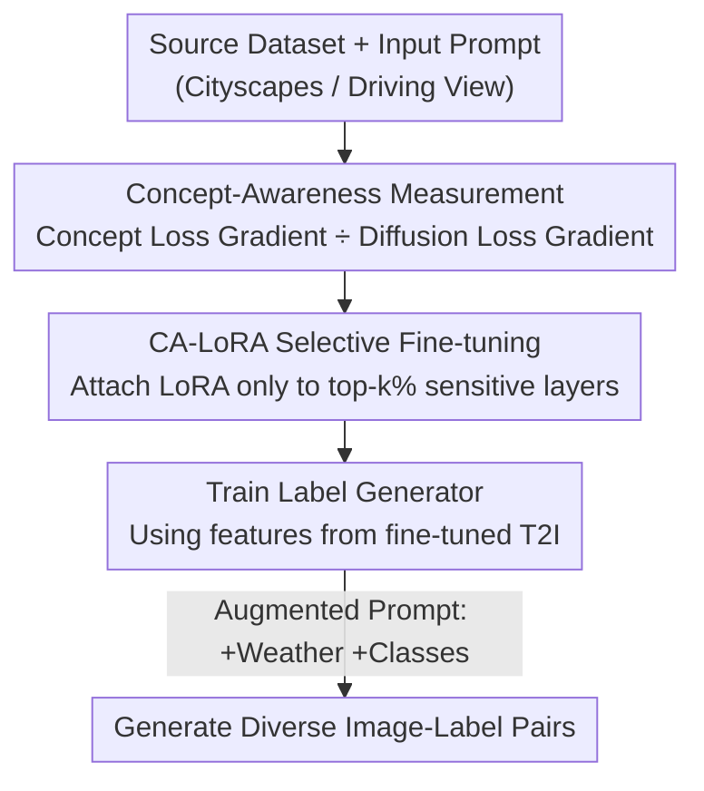

# Concept-Aware LoRA for Domain-Aligned Segmentation Dataset Generation

**Conference**: CVPR 2026  
**Paper**: [CVF Open Access](https://openaccess.thecvf.com/content/CVPR2026/html/Park_Concept-Aware_LoRA_for_Domain-Aligned_Segmentation_Dataset_Generation_CVPR_2026_paper.html)  
**Code**: None  
**Area**: Segmentation Dataset Generation / Diffusion Models / Semantic Segmentation  
**Keywords**: Dataset Generation, Selective LoRA Fine-tuning, Text-to-Image Diffusion, Domain Alignment, Urban Scene Segmentation  

## TL;DR
To address the dilemma in synthetic segmentation data generation where "fine-tuning leads to overfitting, yet not fine-tuning leads to domain misalignment," this paper proposes Concept-Aware LoRA (CA-LoRA). It first identifies the projection layers in a T2I model most sensitive to a specific target concept (viewpoint or style) using a "concept loss," and then applies LoRA fine-tuning only to these top-$k$% layers. This approach learns only the desired concepts while preserving pre-trained knowledge, generating image-label pairs that are both domain-aligned and diverse. It achieves a +2.30% mIoU improvement on Cityscapes few-shot and an average +1.53% mIoU gain in domain generalization.

## Background & Motivation
**Background**: Semantic segmentation heavily relies on pixel-level annotations, which are costly to collect and label. Recent approaches use Text-to-Image (T2I) diffusion models (e.g., Stable Diffusion) to synthesize "image-label pairs" for data augmentation, leveraging the generative capabilities learned from large-scale data like LAION-5B to synthesize rare or under-sampled distributions (e.g., adverse weather, night scenes).

**Limitations of Prior Work**: Synthesizing segmentation datasets involves two conflicting goals: (1) **Domain Alignment**: the synthetic images should fall within the target domain (e.g., the "first-person driving view" of Cityscapes); (2) **Information Density**: the model should generate diverse samples beyond the training set distribution. Early methods that trained from scratch on target data were naturally aligned but lacked external knowledge; direct application of pre-trained T2I without fine-tuning offered diversity but suffered from viewpoint/style misalignment.

**Key Challenge**: A natural compromise is to apply LoRA fine-tuning to pre-trained T2I models for domain alignment—however, LoRA tends to **overfit and memorize training data**. The root cause is that standard fine-tuning updates **all** layers, causing the model to learn every concept in the training set (viewpoint, style, object shapes, layouts, etc.) regardless of whether it is necessary for domain alignment. Consequently, the model memorizes fixed layouts or sunny styles, and textual control (e.g., changing to "foggy/night") fails.

**Goal**: Enable fine-tuning to **learn only the concept necessary for alignment** (e.g., viewpoint or style) while keeping the remaining pre-trained knowledge intact. Furthermore, different settings require different concepts: learning **style** is most effective for in-domain tasks (Same source and target), while learning **driving viewpoint** is more useful for domain generalization (Unseen targets like rain).

**Key Insight**: Since different concepts are managed by different weights within the model, "learning only one concept" is equivalent to "updating only the weights associated with that concept." The problem transforms into: **How to automatically locate weights sensitive to a target concept?**

**Core Idea**: Utilize a customizable "concept loss" to measure the response intensity (concept awareness) of each layer's weights. LoRA is then attached only to the top-$k$% sensitive projection layers, while freezing all others, achieving "concept-level" selective fine-tuning.

## Method

### Overall Architecture
The method addresses "how to fine-tune T2I to align domains without losing diversity" through a four-stage pipeline: **Locate** weights sensitive to the target concept, **Fine-tune** only those weights, **Train a label generator** based on the features of the fine-tuned model, and finally **Batch generate** diverse image-label pairs using augmented prompts. Stages 1-2 represent the core innovation (CA-LoRA), while stages 3-4 follow the DatasetDM paradigm using CA-LoRA fine-tuned T2I features.

### Key Designs

**1. Concept Awareness: Probing "Which Layer Manages Which Concept" with a Customizable Concept Loss**

To "learn only viewpoint/style," one must identify which layers manage these attributes. Standard LoRA fails because it updates all layers indiscriminately. This paper introduces a **concept loss** $L_{\text{Concept}}$ to force the model to "modify a specific concept" and observe which layers show the highest gradient response. Specifically: generate a clean image $x_0$ using the T2I model $\Phi_{T2I}$ and the original prompt $c$ (e.g., "Photorealistic first-person urban street view"), then obtain $x_t = \sqrt{\bar\alpha_t}x_0 + \sqrt{1-\bar\alpha_t}\,\epsilon$. Then, augment the prompt based on the target concept—e.g., style augmentation $c_{\text{Aug(Style)}}$="Sketch of..." or viewpoint augmentation $c_{\text{Aug(Viewpoint)}}$="...in top-down view." The denoising prediction from the augmented caption is used as a "pseudo ground truth" (with stop-gradient), and the concept loss is defined as:

$$L_{\text{Concept}} := \big\| \epsilon_\theta(x_t, c, t) - \text{sg}[\epsilon_\theta(x_t, c_{\text{Aug}}, t)] \big\|_2^2$$

Layers with larger gradients $\nabla_\theta L_{\text{Concept}}$ are those most responsive to changes in style or viewpoint.

Using the raw RMS norm of gradients to compare layers is problematic due to **positional bias** (magnitude differences between shallow and deep layers). The key correction is to **normalize by the diffusion loss gradient**. The standard diffusion loss $L_{\text{Diff}} := \|\epsilon_\theta(x_t,c,t)-\epsilon\|_2^2$ is calculated, and concept awareness is defined as the ratio of the gradient norms, taking the expectation over images, noise, and augmented prompts:

$$\text{Concept-Awareness}(\theta) := \mathbb{E}_{x_0,\epsilon,c_{\text{Aug}}}\!\left[\frac{\|\nabla_\theta L_{\text{Concept}}\|}{\|\nabla_\theta L_{\text{Diff}}\|}\right]$$

This step is crucial: ablation shows that removing normalization (concept-awareness w/o norm) degrades performance to nearly the same as "all-layer fine-tuning" (CMMD 0.730 but mIoU only +0.19). Finally, weight-level sensitivities are averaged across Q/K/V/OUT projection layers of the attention blocks to rank each projection layer's sensitivity.

**2. Concept-Aware LoRA: Selective Fine-tuning of the Top-k% Sensitive Layers**

Once sensitive layers are located, CA-LoRA does not add low-rank updates to all Q/K/V/OUT projections like standard LoRA. Instead, it **applies LoRA updates only to the projection layers ranked in the top k% for concept awareness** ($W_0 + \Delta W = W_0 + BA$, where $B\in\mathbb{R}^{d\times r}, A\in\mathbb{R}^{r\times k}$, rank $r\ll\min(d,k)$, fixed at rank=64), while freezing all other weights. This ensures the model only changes the layers responsible for the target concept, preserving other pre-trained knowledge.

The selection ratio $k$ is a user-adjustable hyperparameter (scanned at 1%/2%/3%/5%/10% in experiments). Depending on the goal, two instances are used: **Style CA-LoRA** (for in-domain tasks) and **Viewpoint CA-LoRA** (for domain generalization). Interestingly, style-related layers are more "efficient"—fine-tuning 1% of style-sensitive layers achieves domain alignment comparable to 5–10% of viewpoint-sensitive layers.

**3. Label Generator + Diverse Dataset Generation: Reducing Domain Gap and Creating Diversity**

With an aligned image generator, labels must be paired. This paper adopts the lightweight label generator from DatasetDM (Mask2Former architecture). For a real image $x_t$, multi-scale generative features (feature maps $\mathcal{F}$ and cross-attention maps $\mathcal{A}$) are extracted from $\epsilon_\theta(x_t,c,t)$ and fed into the label generator.

The **key difference** from DatasetDM is that DatasetDM uses un-tuned pre-trained T2I models, leading to a significant **domain gap** between training (real features) and inference (synthetic features), which degrades label quality. By using the CA-LoRA fine-tuned T2I, the feature statistics remain consistent, significantly improving image-label alignment. For generation, diversity is created via prompt augmentation: adding weather/lighting conditions (e.g., $c_{\text{Gen}}$ = "...in [weather]") and varying class names. Viewpoint CA-LoRA excels here—because it creates alignment without memorizing the "sunny" style, textual control for "foggy/night" remains effective.

### Loss & Training
- Measuring Concept Awareness: Concept loss $L_{\text{Concept}}$ (Eq.5) + Diffusion loss $L_{\text{Diff}}$ (Eq.6), calculating the ratio as per Eq.7.
- Fine-tuning T2I: LoRA training with diffusion loss on the selected top-$k$% layers.
- Label Generator: Supervised by cross-entropy, trained following DatasetDM.
- Key Hyperparameters: SDXL backbone; rank=64; concept identification at timestep $t=81$; CA-LoRA fine-tuning takes ~1 hour on a single V100. Style CA-LoRA is used for in-domain; Viewpoint CA-LoRA for DG.

## Key Experimental Results

### Main Results
**In-Domain (Cityscapes with varying data ratios, mIoU)**: 500 (few-shot) / 3000 (full) synthetic pairs mixed 1:1 with real samples.

| Method | 0.3% | 1% | 3% | 10% | 100% |
|------|------|------|------|------|------|
| Baseline (Real Only) | 41.83 | 49.15 | 59.07 | 69.02 | 79.40 |
| InstructPix2Pix | 41.94 | 48.17 | 60.43 | 66.21 | 78.06 |
| DatasetDM | 42.82 | 49.71 | 60.31 | 69.04 | 80.45 |
| LoRA | 42.97 | 51.80 | 60.22 | 69.21 | 79.75 |
| AdaLoRA | 43.67 | 48.21 | 60.93 | 68.32 | 78.62 |
| **CA-LoRA (Ours)** | **44.13 (+2.30)** | **51.90 (+2.75)** | **61.29 (+2.22)** | **70.29 (+1.27)** | **80.74 (+1.34)** |

CA-LoRA leads across all ratios; LoRA/AdaLoRA struggle at 10%/100% due to memorizing training data.

**Domain Generalization (Cityscapes→ACDC/DZ/BDD/MV, Average mIoU)**: Comparison for different DG methods.

| DG Method | Baseline | DatasetDM | LoRA | AdaLoRA | CA-LoRA (Ours) |
|---------|----------|-----------|------|---------|----------------|
| ColorAug | 47.91 | 48.95 | 49.61 | 49.65 | **50.39 (+2.49)** |
| DAFormer | 49.70 | 50.32 | 50.92 | 50.88 | **51.32 (+1.63)** |
| HRDA | 52.08 | 52.46 | 52.58 | 52.90 | **53.61 (+1.53)** |

Gains are most significant on ACDC and Dark Zurich, where weather/lighting drive domain shifts.

### Ablation Study
**Layer Selection Analysis (Cityscapes 0.3%; CMMD↓ for Alignment, mIoU↑ for Seg)**:

| Tuning Group | Parameter % | CMMD ↓ | mIoU |
|--------|---------|--------|------|
| No Fine-tuning (DatasetDM) | 0% | 5.063 | 42.82 |
| Q Projection Only | 25% | 4.305 | 40.50 (-2.32) |
| K Projection Only | 25% | 3.990 | 43.50 (+0.68) |
| V Projection Only | 25% | 3.003 | 42.77 (-0.05) |
| OUT Projection Only | 25% | 3.005 | 42.82 (+0.00) |
| All Projections (LoRA) | 100% | **0.644** | 42.97 (+0.15) |
| Random Selection | 2% | 0.783 | 43.24 (+0.42) |
| Concept-Aware w/o Norm | 2% | 0.730 | 43.01 (+0.19) |
| **Concept-Aware (Ours)** | 2% | 1.420 | **44.13 (+1.31)** |

### Key Findings
- **Normalization is Vital**: Without normalization, selection is dominated by the diffusion gradient, becoming a proxy for "standard LoRA," resulting in only a +0.19 mIoU gain. Normalization allows 2% of parameters to achieve the maximum +1.31 gain.
- **Minimizing CMMD $\neq$ Best Segmentation**: Standard LoRA achieves the lowest CMMD (0.644) but yields poor segmentation gains (+0.15) due to data memorization. Alignment and diversity must be balanced.
- **Manual Selection is Unreliable**: Updating only Q, V, or OUT projections shows little to no gain; only K projections showed slight improvement, though inferior to automated sensitivity ranking.
- **Style vs. Viewpoint Specialization**: Style layers are more efficient for alignment (1% suffices), while viewpoint layers preserve textual control for weather. Thus, Style CA-LoRA is preferred for in-domain tasks and Viewpoint for DG.

## Highlights & Insights
- **Mapping "Concept Learning" to "Weight Selection"**: Translating an abstract concept into measurable weight sensitivity via a customizable loss and normalization is the core strength of this paper.
- **Customizable Concept Loss**: By changing the augmented caption (e.g., "Sketch of..." for style vs. "top-down" for viewpoint), the framework can detect various concepts, making it highly extensible.
- **The "Less is More" Insight**: More fine-tuning improves domain alignment (lower CMMD) but hurts segmentation performance. Selective fine-tuning is superior for generative data augmentation where maintaining diversity is key.
- **High Efficiency**: CA-LoRA fine-tuning takes about 1 hour, making it a low-cost addition to the data generation pipeline.

## Limitations & Future Work
- The gains in some settings (e.g., +1.34% in 100% supervision) are relatively **marginal**.
- The concept probe relies on **manual prompt augmentation** (e.g., writing "Sketch of..."). Automating the selection of contrastive prompts for any arbitrary concept remains an open problem.
- Sensitivity is calculated at the projection layer level (Q/K/V/OUT); finer (individual weights) or coarser (entire blocks) granularity has not been explored.
- Experiments are concentrated on urban driving scenes; broader cross-task generalization (e.g., non-driving datasets) requires more evidence.

## Related Work & Insights
- **Compared to DatasetDM**: DatasetDM uses frozen T2I, leading to domain gaps in feature statistics. CA-LoRA improves image-label alignment by narrowing this gap through selective tuning.
- **Compared to LoRA / AdaLoRA**: These optimize for parameter efficiency but fail to **disentangle concepts**, leading to overfitting of unnecessary training attributes. CA-LoRA achieves concept-level decoupling.
- **Compared to InstructPix2Pix / DGInStyle**: These methods typically modify textures or struggle with structural diversity. CA-LoRA enables the generation of structure-diverse samples that are also domain-aligned.

## Rating
- Novelty: ⭐⭐⭐⭐ reformulating concept learning as weight selection with a normalized detector is clever.
- Experimental Thoroughness: ⭐⭐⭐⭐ covers 5 few-shot ratios and multiple DG benchmarks with parameter ablations, though cross-domain tasks are limited.
- Writing Quality: ⭐⭐⭐⭐ clear motivation, intuitive figures, and consistent logic.
- Value: ⭐⭐⭐⭐ provides a reusable paradigm for selective fine-tuning in generative data augmentation.

<!-- RELATED:START -->

## Related Papers

- [\[CVPR 2026\] GenMask: Adapting DiT for Segmentation via Direct Mask Generation](genmask_adapting_dit_for_segmentation_via_direct_mask_generation.md)
- [\[CVPR 2026\] Looking Beyond the Window: Global-Local Aligned CLIP for Training-free Open-Vocabulary Semantic Segmentation](looking_beyond_the_window_global-local_aligned_clip_for_training-free_open-vocab.md)
- [\[CVPR 2026\] RobotSeg: A Model and Dataset for Segmenting Robots in Image and Video](robotseg_a_model_and_dataset_for_segmenting_robots_in_image_and_video.md)
- [\[CVPR 2026\] CLP: A Real-World Dataset of Contaminated Lens Protectors for Robust Semantic Segmentation](clp_a_real-world_dataset_of_contaminated_lens_protectors_for_robust_semantic_seg.md)
- [\[CVPR 2026\] Masked Representation Modeling for Domain-Adaptive Segmentation](mrm_masked_representation_modeling_domain_adaptive.md)

<!-- RELATED:END -->
