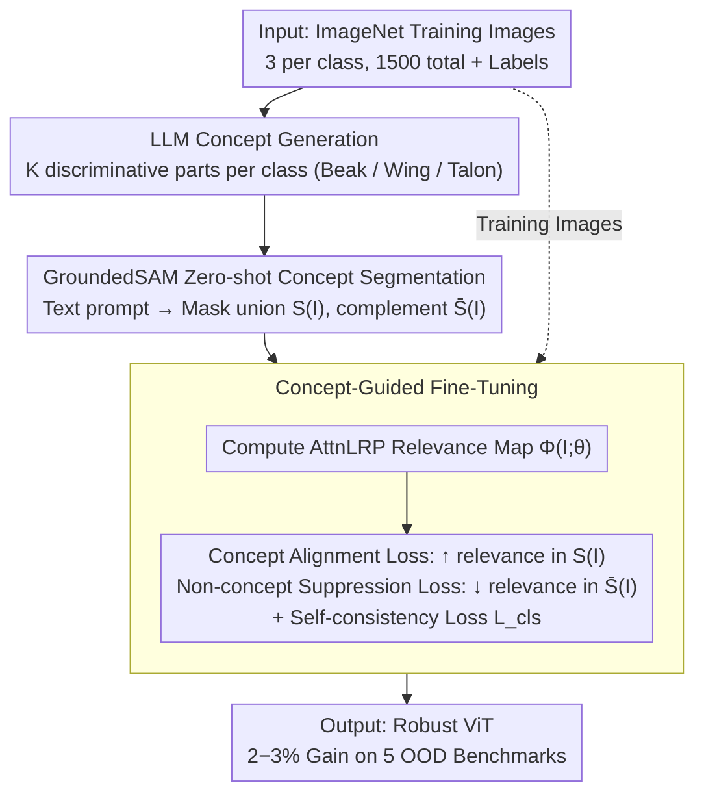

# Concept-Guided Fine-Tuning: Steering ViTs away from Spurious Correlations to Improve Robustness

**Conference**: CVPR2026  
**arXiv**: [2603.08309](https://arxiv.org/abs/2603.08309)  
**Code**: [GitHub](https://github.com/yonisGit/cft)  
**Area**: Image Segmentation  
**Keywords**: Spurious Correlations, ViT Robustness, Concept-Guided Fine-Tuning, AttnLRP, Zero-shot Segmentation, OOD Generalization

## TL;DR

Ours proposes CFT (Concept-Guided Fine-Tuning), which utilizes LLMs to generate category-level semantic concepts and obtains concept masks through GroundedSAM zero-shot segmentation. ViT is fine-tuned with the objective of aligning AttnLRP relevance maps with these concept regions. Using only 1500 images, it significantly improves robustness across five OOD benchmarks.

## Background & Motivation

1.  **ViT reliance on spurious correlations**: While large-scale pre-trained ViTs perform excellently in-distribution, they often rely on spurious features such as background textures and co-occurring objects rather than true semantic parts, leading to performance collapse in OOD scenarios.
2.  **Foreground-background dichotomy is too coarse**: Existing solutions (e.g., LANCE, RBF) regularize attention via foreground/background segmentation, but the "foreground" contains many non-discriminative regions (e.g., a bird's belly vs. its beak), failing to guide the model to focus on true category-discriminative features.
3.  **Manual concept annotation is non-scalable**: Manually defining semantic concepts and annotating segmentation masks for every category is extremely costly. With 1000 categories in ImageNet, individual annotation is impossible.
4.  **LLM + zero-shot segmentation provides a scalable solution**: LLMs can automatically generate discriminative concept descriptions for each category, and GroundedSAM can perform zero-shot segmentation on any text prompt. The combination enables concept-level supervision without manual annotation.
5.  **Relevance maps explain attention allocation**: AttnLRP provides pixel-level relevance attribution, quantifying the model's focus on each region and providing a differentiable supervisory signal for alignment optimization.

## Core Problem

How to guide ViTs to shift attention from spurious correlation regions (background, texture) to true category semantic concept regions to improve OOD robustness without relying on manual annotations?

## Method

### Overall Architecture

CFT (Concept-Guided Fine-Tuning) aims to steer ViT attention away from spurious correlations like background textures and co-occurring objects and back toward true category semantic parts, thereby improving OOD robustness. It consists of three stages and requires no manual annotation throughout: first, an LLM generates discriminative concepts for each category; next, GroundedSAM performs zero-shot segmentation of these concepts to produce masks; finally, ViT is fine-tuned to align AttnLRP relevance maps with concept regions—requiring only 3 images per category, totaling 1500 images.

### Key Designs

**1. LLM Concept Generation: Refining "where to look" from coarse foreground to specific semantic parts**

Existing methods only perform foreground/background binary separation, but the "foreground" contains many non-discriminative regions (both the bird's belly and its beak are foreground), providing suboptimal guidance. Manually defining and annotating concepts for thousands of ImageNet classes is not scalable. CFT uses an LLM (e.g., GPT-4) to automatically generate $K$ discriminative visual concepts for each category $c$. The prompt explicitly requires "visually distinguishable parts or attributes" rather than abstract semantics—for example, "bird" yields "long beak", "wings", "talons", and "feathers", covering the primary discriminative features of the class.

**2. GroundedSAM Zero-shot Concept Segmentation: Converting text concepts into supervisable pixel masks**

Once concept words are generated, they must be mapped to specific image regions. CFT feeds the LLM-generated concept text as prompts into GroundedSAM, which outputs zero-shot binary masks $S_k(I)$ for each concept in a training image $I$. The union of these masks forms the concept region mask $S(I) = \bigcup_{k=1}^K S_k(I)$. Its complement $\bar{S}(I) = 1 - S(I)$ represents non-concept regions, including the background and non-discriminative foreground. This step translates "semantic concepts" into pixel-level targets for attention supervision, maintaining a zero-manual-annotation pipeline.

**3. Concept-Guided Fine-Tuning: Aligning attention using AttnLRP relevance**

Finally, AttnLRP is used to calculate the relevance map $\Phi(I; \theta)$ (where $\Phi_{ij} \in [0, 1]$ represents the model's focus on pixel $(i,j)$), and three losses are defined for joint optimization. The concept alignment loss maximizes relevance within concept regions:

$$\mathcal{L}_{concept} = -\frac{1}{|S(I)|} \sum_{(i,j) \in S(I)} \log \Phi_{ij}(I; \theta)$$

The non-concept suppression loss minimizes relevance in non-concept regions:

$$\mathcal{L}_{non\text{-}concept} = -\frac{1}{|\bar{S}(I)|} \sum_{(i,j) \in \bar{S}(I)} \log(1 - \Phi_{ij}(I; \theta))$$

A standard cross-entropy self-consistency loss $\mathcal{L}_{cls}$ is added to prevent degradation of classification performance during fine-tuning, resulting in the total objective:

$$\mathcal{L}_{total} = \mathcal{L}_{cls} + \alpha \mathcal{L}_{concept} + \beta \mathcal{L}_{non\text{-}concept}$$

This directly incorporates "looking at the right place" into the differentiable objective, pulling relevance away from the background toward true components like beaks, wings, and talons.

### Loss & Training

- **Training Data**: Randomly sampled 3 images per category from the ImageNet training set, totaling 500 categories × 3 = 1500 images.
- Fine-tuned for 50 epochs, updating only the parameters of the last few ViT layers.
- AttnLRP relevance maps are calculated in real-time during each forward pass, providing pixel-level gradient signals.
- Concept masks are pre-computed and cached to avoid extra overhead during training.

## Key Experimental Results

### Background

- **In-distribution**: ImageNet-1K validation set.
- **OOD Benchmarks** (5): ImageNet-A (Natural adversarial examples), ObjectNet (New viewpoints/backgrounds), ImageNet-R (Artistic rendering styles), ImageNet-Sketch (Sketches), SI-Score (Synthetic shape/texture control).
- **Backbone Networks**: DINOv2 ViT-B/14, ViT-B/16, DeiT-B/16, ConvNeXt-B.
- **Baseline Methods**: vanilla fine-tuning, LANCE, RBF, StylEx, foreground-only baseline.

### Main Results

| Method | IN-1K↑ | IN-A↑ | ObjectNet↑ | IN-R↑ | IN-Sketch↑ | SI-Score↑ |
|:---|:---:|:---:|:---:|:---:|:---:|:---:|
| DINOv2 baseline | 84.5 | 70.3 | 53.8 | 72.1 | 52.4 | 61.2 |
| LANCE | 84.2 | 71.5 | 54.6 | 72.8 | 53.1 | 62.0 |
| RBF | 84.0 | 71.8 | 54.2 | 73.0 | 53.5 | 62.4 |
| **CFT (Ours)** | **84.8** | **73.6** | **56.4** | **74.5** | **55.2** | **64.1** |

CFT outperforms the baseline and existing methods across all 5 OOD benchmarks while maintaining or slightly improving in-distribution accuracy. Compared to LANCE/RBF, the OOD Gain is approximately 2-3 percentage points on average.

### Cross-architecture Generalization

| Backbone | IN-A Δ | ObjectNet Δ | IN-R Δ |
|:---|:---:|:---:|:---:|
| DINOv2 ViT-B | +3.3 | +2.6 | +2.4 |
| ViT-B/16 | +2.8 | +2.1 | +1.9 |
| DeiT-B/16 | +2.5 | +1.8 | +1.7 |
| ConvNeXt-B | +1.6 | +1.2 | +1.1 |

CFT is most effective for Transformer architectures. ConvNeXt also shows improvement, though the magnitude is smaller (since ConvNeXt lacks global attention, affecting the precision of relevance maps).

### Key Findings

- **Relevance Map Alignment Quality**: After fine-tuning, the IoU between the relevance map and ground-truth semantic part masks increased from 0.31 to 0.52.
- **Visualization**: Heatmaps from the baseline are scattered across background textures, while CFT-fine-tuned heatmaps are highly concentrated on semantic parts like beaks, wings, and talons.
- **SI-Score Analysis**: Indicates that the CFT model's reliance on shape features increased while reliance on texture features decreased.

### Ablation Study

- **Removing $\mathcal{L}_{concept}$**: OOD performance drops by 1.5% on average; the model cannot be guided to the correct regions.
- **Removing $\mathcal{L}_{non\text{-}concept}$**: OOD performance drops by 1.2% on average; relevance in spurious regions is not effectively suppressed.
- **Removing $\mathcal{L}_{cls}$**: In-distribution performance drops by 2.1%; fine-tuning deviates from the original classification objective.
- **Replacing concept masks with foreground-background masks**: OOD performance drops by 0.8-1.5% on average, validating the superiority of concept-level granularity.
- **Number of images per class**: Gains are limited with 1 image/class; benefits saturate at 3 images/class, with no significant extra gain at 5 images/class.
- **Number of LLM concepts**: 3-5 concepts per class is optimal; too many concepts introduce noisy masks.

## Highlights & Insights

- **Concept-level granularity innovation**: Breaks away from the foreground/background dichotomy by using LLM-generated semantic concepts (e.g., "beak", "wings") to precisely define the regions the model should focus on.
- **Fully automated pipeline**: From LLM concept generation to GroundedSAM segmentation and AttnLRP alignment, the end-to-end process requires zero manual annotation and is scalable to any number of categories.
- **Minimal data requirements**: Fine-tuning with only 1500 images (3 per class) for 50 epochs makes the training cost extremely low and suitable for practical deployment.
- **Maintains in-distribution performance**: Through the $\mathcal{L}_{cls}$ self-consistency constraint, ImageNet accuracy is maintained or even improved, resolving the trade-off between robustness and accuracy.
- **Architectural versatility**: Effective across DINOv2, ViT, DeiT, and ConvNeXt without relying on specific architectural designs.
- **Enhanced interpretability**: Visualization of relevance map alignment with semantic parts directly demonstrates that the model is "looking at the right place."

## Limitations & Future Work

- Concept quality depends on prompt design and LLM capability; LLMs may generate insufficiently discriminative concepts for fine-grained categories (e.g., insect subspecies).
- GroundedSAM zero-shot segmentation has limited precision; small objects or occluded scenes may generate noisy masks that propagate through fine-tuning.
- Validated only on classification tasks; not yet extended to detection, segmentation, or other downstream tasks.
- AttnLRP is primarily optimized for Transformer architectures; ConvNeXt requires alternative attribution methods, which limits effectiveness on CNNs.
- Hierarchical structures of concepts (e.g., "bird" → "head" → "beak") have not been explored; currently, it uses a flat list of concepts.
- Fine-tuning only updates a subset of parameters; the effects of full fine-tuning or parameter-efficient fine-tuning (PEFT) like LoRA have not been compared.

## Related Work & Insights

- **vs LANCE**: LANCE uses foreground masks and language-guided alignment, but the foreground granularity is too coarse and includes many non-discriminative regions. CFT uses concept-level masks for precise localization, achieving higher OOD gains.
- **vs RBF (Right for the Better Features)**: RBF reduces spurious correlations through data augmentation (enhancing foreground/suppressing background) at the data level. CFT is a model-level relevance alignment scheme; the two could be complementary.
- **vs StylEx**: StylEx identifies and manipulates stylistic attributes using StyleGAN to analyze spurious features, primarily as a diagnostic tool. CFT directly fixes spurious dependencies.
- **vs Concept Bottleneck Models (CBM)**: CBMs require manual concept annotations as intermediate representations, which is non-scalable. CFT uses LLM generation and GroundedSAM zero-shot segmentation, incurring zero manual annotation cost.
- **vs Attention Regularization Methods**: Traditional methods use manually defined regions or coarse attributions like CAM/GradCAM; CFT uses AttnLRP to provide precise pixel-level relevance signals.

## Rating

- Novelty: ⭐⭐⭐⭐ — The combination of LLM, segmentation, and relevance alignment is innovative; concept-level granularity is a core contribution.
- Experimental Thoroughness: ⭐⭐⭐⭐ — Covers 5 OOD benchmarks and 4 architectures with complete ablations, though downstream task validation is missing.
- Writing Quality: ⭐⭐⭐⭐ — Clear motivation, intuitive pipeline diagrams, and concise formulas.
- Value: ⭐⭐⭐⭐ — A practical solution for low-cost robustness improvement with direct relevance to OOD deployment.

<!-- RELATED:START -->

## Related Papers

- [\[ICCV 2025\] DDB: Diffusion Driven Balancing to Address Spurious Correlations](../../ICCV2025/segmentation/ddb_diffusion_driven_balancing_to_address_spurious_correlations.md)
- [\[CVPR 2026\] ConceptPrism: Concept Disentanglement in Personalized Diffusion Models via Residual Token Optimization](conceptprism_concept_disentanglement_in_personalized_diffusion_models_via_residu.md)
- [\[ECCV 2024\] Efficient and Versatile Robust Fine-Tuning of Zero-shot Models](../../ECCV2024/segmentation/efficient_and_versatile_robust_fine-tuning_of_zero-shot_models.md)
- [\[CVPR 2026\] Concept-Aware LoRA for Domain-Aligned Segmentation Dataset Generation](concept-aware_lora_for_domain-aligned_segmentation_dataset_generation.md)
- [\[ICML 2025\] InfoSAM: Fine-Tuning the Segment Anything Model from An Information-Theoretic Perspective](../../ICML2025/segmentation/infosam_fine-tuning_the_segment_anything_model_from_an_information-theoretic_per.md)

<!-- RELATED:END -->
