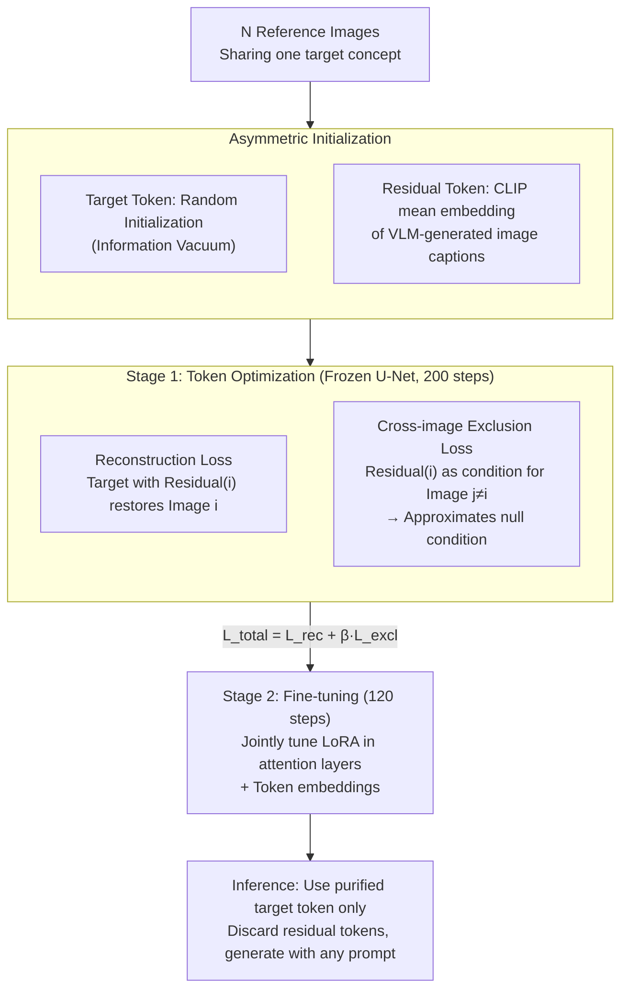

# ConceptPrism: Concept Disentanglement in Personalized Diffusion Models via Residual Token Optimization

**Conference**: CVPR2026  
**arXiv**: [2602.19575](https://arxiv.org/abs/2602.19575)  
**Code**: TBD  
**Area**: Image Segmentation  
**Keywords**: Personalized Diffusion Models, Concept Disentanglement, Residual Token Optimization, Textual Inversion, LoRA, Contrastive Learning

## TL;DR

ConceptPrism is proposed to automatically disentangle shared target concepts from image-specific residual information in personalized T2I diffusion models. By introducing image-level residual tokens and cross-image exclusion loss, the method achieves state-of-the-art performance across CLIP-T, DINO, and CLIP-I metrics on DreamBench.

## Background & Motivation

1.  **Concept entanglement in personalized T2I**: Methods like Textual Inversion and DreamBooth learn concept tokens from a few images, but these tokens inevitably conflate the target concept (e.g., a specific dog's appearance) with image-specific information (e.g., background, pose, lighting).
2.  **Harms of entanglement**: When generating new scenes, residual information "leaks" into the output—for example, elements of an indoor background from training images might appear in a "dog on a beach" prompt, leading to reduced text alignment and lower generation diversity.
3.  **Limitations of prior work**: Break-A-Scene requires segmentation mask annotations, Custom Diffusion only indirectly mitigates the issue by limiting fine-tuning parameters, and Cones requires manual specification of concept-related layers—all of which depend on extra supervision or priors.
4.  **Disentanglement signals in cross-image contrast**: Different images of the same concept share the target information but possess unique residual details. Cross-image contrast can naturally separate shared vs. specific components without additional annotations.
5.  **Information allocation in token space**: When learning multiple tokens without explicit constraints, all tokens redundantly encode the same information; a mechanism is needed to ensure different tokens perform distinct roles.

## Core Problem

How to learn a pure concept representation from a small set of reference images without extra annotations, such that it contains only the shared target concept while stripping away image-specific residual information (background, pose, lighting, etc.)?

## Method

### Overall Architecture

ConceptPrism addresses the entanglement between concepts and image-specific information in personalized T2I. It assigns two types of learnable tokens to each concept: a global target token $t_{target}$ shared across all reference images to capture recurring target concepts, and an image-specific residual token $t_{residual}^{(i)}$ for each image to absorb unique background, pose, and lighting details. The process consists of two stages: first, the U-Net is frozen while optimizing these tokens (using reconstruction loss to ensure the combination of "target + residual" can reconstruct the original image, and a cross-image exclusion loss to eject shared information from residual tokens). Second, LoRA is integrated into attention layers for joint fine-tuning to enhance model-level fidelity. During inference, only the purified target token is used, while all residual tokens are discarded.

### Key Designs

**1. Asymmetric Initialization: Establishing Role Differentiation**

Entanglement often stems from multiple tokens redundantly encoding the same information. ConceptPrism utilizes initialization to enforce division of labor. The target token is randomly initialized, creating an "information vacuum" that naturally fills with recurring cross-image content (the shared concept) under reconstruction loss. Unlike previous methods, it does not rely on a class noun prior. Conversely, each residual token is initialized with the mean CLIP embedding of an image caption (8–32 words, automatically generated by a VLM like Gemini 2.5 Flash). Starting with rich image details, the residual token only needs to "yield" shared parts to the target token. This "start from zero vs. start from full" design guides information flow naturally.

**2. Reconstruction Loss: Establishing Information Conservation**

Before disentanglement, an "information conservation" anchor is required to prevent the loss of target concepts when pushing them out of residual tokens. The reconstruction loss requires that the condition "[$t_{target}$] with [$t_{residual}^{(i)}$]" can reconstruct the $i$-th reference image $x^{(i)}$:

$$\mathcal{L}_{recon} = \mathbb{E}_{i, t, \epsilon} \left[ \| \epsilon - \epsilon_\theta(z_t^{(i)}, c_{target+residual}^{(i)}) \|^2 \right]$$

where $z_t^{(i)}$ is the noisy image and $c_{target+residual}^{(i)}$ is the text condition containing both token types. This ensures the combined tokens cover the full image information.

**3. Cross-image Exclusion Loss: Ejecting Shared Concepts from Residual Tokens**

This is the core of disentanglement. If a residual token still contains shared concepts, using it as a condition for generating a **different** image $x^{(j)}$ ($j \neq i$) would deviate from unconditional generation. If it contains no shared information, it should contribute nothing to other images, effectively acting as a null condition. The loss penalizes this "cross-image leakage":

$$\mathcal{L}_{excl} = \mathbb{E}_{i, j \neq i, t, \epsilon} \left[ \| \epsilon_\theta(z_t^{(j)}, c_{residual}^{(i)}) - \epsilon_\theta(z_t^{(j)}, \varnothing) \|^2 \right]$$

where $c_{residual}^{(i)}$ is the condition using only the $i$-th residual token, and $\varnothing$ is the null text condition. The $j \neq i$ cross-pairing is crucial; using $j = i$ would fail to distinguish concept leakage from image-specific matching because the noise sample of an image is naturally correlated with its own residual token. Minimizing this is equivalent to minimizing $\text{KL}(p(x) \| p(x|c_{residual}^{(i)}))$, forcing shared concepts into the target token.

### Loss & Training

The total loss combines reconstruction and exclusion with a weight $\beta = 0.05$ (too small leads to insufficient exclusion; too large forces residual tokens toward null, making target tokens re-absorb residuals):

$$\mathcal{L}_{total} = \mathcal{L}_{recon} + \beta\, \mathcal{L}_{excl}$$

The optimization uses a target token length of 1 and residual token lengths of 8. Stage 1 freezes the U-Net for 200 steps to optimize embeddings. Stage 2 adds LoRA to attention layers and jointly tunes for 120 steps to capture fine-grained fidelity. Inference discards residual tokens completely.

## Key Experimental Results

### Main Results

| Method | CLIP-T↑ | DINO↑ | CLIP-I↑ |
| :--- | :--- | :--- | :--- |
| Textual Inversion | 0.321 | 0.154 | 0.305 |
| DreamBooth | 0.340 | 0.189 | 0.332 |
| Custom Diffusion | 0.338 | 0.183 | 0.328 |
| Break-A-Scene | 0.335 | 0.178 | 0.322 |
| SVDiff | 0.331 | 0.171 | 0.319 |
| P+ | 0.342 | 0.192 | 0.341 |
| **Ours** | **0.357** | **0.210** | **0.353** |

ConceptPrism outperforms others across all metrics. High CLIP-T indicates superior text alignment (exclusion loss reduces residual interference), while high DINO indicates high concept fidelity.

### Multi-concept Analysis

| Concept Type | CLIP-T↑ | DINO↑ |
| :--- | :--- | :--- |
| Object | 0.361 | 0.223 |
| Style | 0.349 | 0.185 |
| Pose | 0.352 | 0.198 |

The effectiveness across object, style, and pose demonstrates the universality of the disentanglement mechanism.

### Ablation Study

- **Without $\mathcal{L}_{excl}$**: CLIP-T drops by 0.020, DINO by 0.018; degrades to standard multi-token learning.
- **$j = i$ (No cross-exclusion)**: Performance drops significantly due to natural correlation between image noise and its own residual.
- **Without residual tokens**: CLIP-T drops by 0.015; target token is forced to encode all information.
- **Without VLM initialization**: DINO drops by 0.012; residual tokens learn slower.
- **Without LoRA stage**: DINO drops by 0.025; token optimization alone cannot capture fine-grained details.

### Key Findings

- Qualitative results show ConceptPrism maintains precise target features (e.g., dog breed) in new scenes while strictly following prompts.
- Compared to DreamBooth, it avoids leaking indoor training backgrounds into "beach" scenes.
- Generating with residual tokens alone produces blurry images unrelated to the target, verifying exclusion effectiveness.

## Highlights & Insights

- **Clever exclusion loss**: Cross-image contrast ($j \neq i$) forces residual tokens to discard shared info, grounded in KL divergence minimization.
- **No extra labels**: Unlike Break-A-Scene (masks) or Cones (manual layer selection), it learns disentanglement from natural image contrast.
- **Asymmetric initialization**: Using "information vacuums" guides information flow naturally without complex optimization schedules.
- **Efficiency**: Only 320 total steps (200 Stage 1 + 120 Stage 2), significantly fewer than DreamBooth's full fine-tuning.

## Limitations & Future Work

- Experiments limited to Stable Diffusion v1.5; performance on SDXL/SD3 is unverified.
- Requires at least 2 reference images; single-image cases lack cross-image contrast.
- Residual token count scales with image count, increasing overhead for large datasets.
- VLM caption quality affects initialization; complex scenes may pose challenges.
- Potential value of residual tokens (e.g., style transfer) remains unexplored.

## Related Work & Insights

- **vs. Textual Inversion**: TI uses one token for all info; Ours uses multiple tokens + exclusion for explicit separation.
- **vs. DreamBooth**: DreamBooth fine-tunes the whole U-Net, causing high entanglement; Ours uses LoRA + exclusion for better balance.
- **vs. Custom Diffusion**: CD limits parameters to reduce entanglement indirectly; Ours uses a direct disentanglement objective.
- **vs. Break-A-Scene**: BAS requires masks for supervised disentanglement; Ours is self-supervised.

## Rating

- Novelty: ⭐⭐⭐⭐ — Residual tokens + exclusion loss is a core contribution.
- Experimental Thoroughness: ⭐⭐⭐⭐ — Comprehensive benchmarks, though restricted to SD1.5.
- Writing Quality: ⭐⭐⭐⭐ — Clear derivation from KL divergence to noise matching.
- Value: ⭐⭐⭐⭐ — Addresses a core pain point in personalized T2I with a lightweight solution.

<!-- RELATED:START -->

## Related Papers

- [\[ICCV 2025\] Personalized OVSS: Understanding Personal Concept in Open-Vocabulary Semantic Segmentation](../../ICCV2025/segmentation/understanding_personal_concept_in_open-vocabulary_semantic_segmentation.md)
- [\[CVPR 2026\] CA-LoRA: Concept-Aware LoRA for Domain-Aligned Segmentation Dataset Generation](ca-lora_concept-aware_lora_for_domain-aligned_segmentation_dataset_generation.md)
- [\[CVPR 2026\] Concept-Guided Fine-Tuning: Steering ViTs away from Spurious Correlations to Improve Robustness](concept-guided_fine-tuning_steering_vits_away_from_spurious_correlations_to_impr.md)
- [\[ECCV 2024\] Diffusion Models for Open-Vocabulary Segmentation](../../ECCV2024/segmentation/diffusion_models_for_open-vocabulary_segmentation.md)
- [\[CVPR 2026\] Concept-Aware LoRA for Domain-Aligned Segmentation Dataset Generation](concept-aware_lora_for_domain-aligned_segmentation_dataset_generation.md)

<!-- RELATED:END -->
