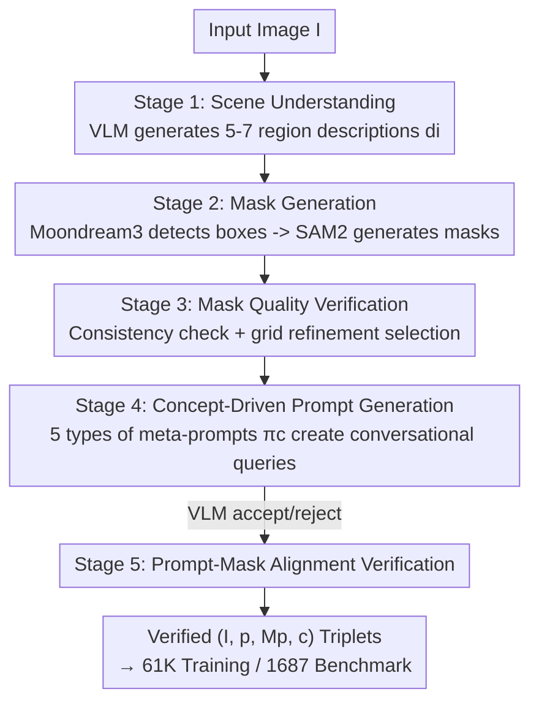

# Conversational Image Segmentation: Grounding Abstract Concepts with Scalable Supervision

**Conference**: CVPR 2026  
**Paper**: [CVF Open Access](https://openaccess.thecvf.com/content/CVPR2026/html/Sahoo_Conversational_Image_Segmentation_Grounding_Abstract_Concepts_with_Scalable_Supervision_CVPR_2026_paper.html)  
**Code**: https://glab-caltech.github.io/converseg (Project Page)  
**Area**: Referring/Conversational Image Segmentation  
**Keywords**: Conversational Segmentation, Affordance Reasoning, VLM Data Engine, Curriculum Learning, SAM2  

## TL;DR
This paper introduces the "Conversational Image Segmentation (CIS)" task—grounding abstract concepts such as affordances, physical stability, and user intent onto pixel-level masks. It presents the CONVERSEG benchmark, a fully automated VLM data engine (synthesizing 61K prompt–mask pairs without manual annotation), and CONVERSEG-NET, a single-pass model. CONVERSEG-NET achieves 70.5% (3B) / 73.3% (7B) gIoU on CONVERSEG while remaining competitive on traditional benchmarks like RefCOCO and ReasonSeg.

## Background & Motivation

**Background**: Pointing out image regions using natural language was pioneered by Referring Image Segmentation (RIS), with standard benchmarks like RefCOCO/+/g dominating the field.

**Limitations of Prior Work**: Queries in RefCOCO-like benchmarks mostly focus on categories and spatial relationships ("white umbrella," "leftmost apple"), testing whether a model "recognizes objects and distinguishes left from right." However, humans naturally ask questions like "Which box can be pulled out without collapsing the stack?" or "Where is a safe place to put the knife?" Such queries require joint reasoning over geometry, physical stability, and user intent. A segmentation model trained only on the `suitcase` or `cart` categories lacks representations for support relationships, occlusion order, or physical stability. While ReasonSeg introduced implicit reasoning, its queries remain centered on entities and space, with minimal coverage of affordances, safety, and physical constraints.

**Key Challenge**: Existing multimodal reasoning segmentation systems (e.g., LISA, GLaMM, PixelLM) can produce masks through multi-step reasoning but rely on heavy backbones and multi-stage pipelines (Chain-of-Thought, tool calling), making deployment expensive. Conversely, lightweight prompted segmentation models like SAM/SAM2 possess strong segmentation priors but lack text conditioning. These two capabilities—reasoning and precise segmentation—have not been integrated as a low-cost, unified system.

**Goal**: (1) Define and quantify the grounding capability for "conversational concepts"; (2) Scale the production of reasoning-rich prompt–mask supervision without expensive manual annotation; (3) Develop a single-pass feed-forward model that fuses segmentation priors with language understanding without relying on multiple rounds or tool calling.

**Key Insight**: Drawing from human visual science and intuitive physics, humans infer functional properties and physical constraints directly from visual input. The authors organize conversational concepts into five families (Entities, Spatial Layout, Relationship Events, Affordance/Function, Physical Safety) and ensure nearly uniform coverage across these categories in the benchmark, rather than being heavily skewed toward entities and space (>50% in older datasets).

**Core Idea**: Instead of merely increasing model capacity, the key is to **expand training data diversity**. A VLM-driven "generate-verify" closed loop automatically synthesizes 61K prompt–mask pairs across five reasoning categories. A lightweight 3B VLM with a SAM2 decoder then processes these in a single pass, cost-effectively merging reasoning and precise segmentation.

## Method

### Overall Architecture
The paper follows two main tracks: the **data side**, featuring an automated data engine that takes an image and outputs verified `(prompt, mask, concept type)` triplets for training and benchmarking; and the **model side**, featuring CONVERSEG-NET, which outputs a binary mask $M_p$ in a single pass given an image $I$ and text prompt $p$. The data engine is a five-stage serial pipeline with multiple verification checkpoints. The model architecture is intentionally simple: a frozen SAM2 image encoder, a LoRA-tuned Qwen2.5-VL prompt encoder, a lightweight adapter, and a fully fine-tuned SAM2 mask decoder. A two-stage "literal-to-conversational" curriculum is used to inject language conditions into the SAM2 framework, which originally lacks language priors.

The data engine pipeline flows as follows:

### Key Designs

**1. Conversational Data Engine: A Five-Stage Closed Loop for Zero-Human Abstract Concept Supervision**

Training a model to ground affordances or physical constraints requires labels with rich reasoning prompts and pixel-accurate masks. Human labeling for prompts like "Surfaces where a hot pot can be placed" combined with precise masking is prohibitively expensive. This paper automates the pipeline using VLMs, inserting verification steps to prevent cumulative errors. **Stage 1 (Scene Understanding)**: A VLM generates 5–7 descriptions $d_i$ (category, attribute, position, relationship) for regions. **Stage 2 (Mask Generation)**: For each $d_i$, Moondream3 performs open-vocabulary detection to produce a box $b_i$, and SAM2 uses the box to segment the mask $m_i$. **Stage 3 (Mask Quality Verification)** is critical: a VLM checks if $(b_i, m_i)$ correctly corresponds to $d_i$ in identity/attribute/position. Then, a refinement step uses a dense grid of points in SAM2 to produce candidate masks $m_i'$, selecting the one with the highest IoU with $m_i$ or letting the VLM pick the best $\hat m_i$ based on coverage and boundary precision. **Stage 4 (Concept-Driven Prompt Generation)**: For each concept $c$, a specialized meta-prompt $\pi_c$ is used with numbered region descriptions and set-of-marks visualizations to generate up to three prompts, filtering out trivial cases. **Stage 5 (Alignment Verification)**: A VLM performs a final check on $(I, p, M_p, c)$ to ensure the mask matches the target and the prompt is reasonable. All VLM steps use Gemini-2.5-Flash. This engine is **dual-purpose**: it process COCO val to build the benchmark and COCO train to generate the 61K training pairs.

**2. CONVERSEG-NET Single-Pass Architecture: Injecting Text Tokens as "Soft Point Prompts" into the SAM2 Decoder**

While SAM2 has strong segmentation priors, it lacks text conditioning. This paper fuses a VLM and SAM2 efficiently. The **Image Encoder** (SAM2's MAE-pre-trained ViT) is frozen and encodes the image once to produce spatial features $z_{img}$. The **Prompt Encoder** (Qwen2.5-VL-3B) processes image $I$ and text $p$ together, extracting hidden states $\{h_1, \dots, h_T, h_{EOS}\}$ from the last layer. Since these tokens have already attended to image tokens through the backbone, they contain visual context. Text sequences $\{h_1, \dots, h_T\}$ are treated as **sparse embeddings** (fine-grained info), while the EOS state serves as a **dense embedding** (global context). Two adapters project these into the decoder space: $e_{sparse} = \mathrm{Linear}_{D_t \to D_{dec}}(\{h_1, \dots, h_T\})$ and $e_{dense} = \mathrm{MLP}_{D_t \to D_{dec}}(h_{EOS})$. The Qwen backbone is tuned using LoRA (rank 16, $\alpha=32$). The **Mask Decoder** (SAM2) is fully fine-tuned, using cross-attention and upsampling to output foreground probabilities. The authors observe that cross-attention for each text token in the decoder is sparse and localized rather than diffuse, suggesting that **text embeddings effectively act as "soft point prompts"** to the SAM2 native prompt mechanism.

**3. Literal-to-Conversational Scaling: A Two-Stage Curriculum for Reasoning without Forgetting**

To prevent the model from failing on basic segmentation while learning abstract concepts, a curriculum of increasing complexity is used. Data is grouped into four sets: (1) Literal concepts (COCONut refined masks), (2) Basic referring (RefCOCO/+/g), (3) Open-vocabulary regions (from Engine Stage 3), and (4) Conversational concepts (61K engine pairs). **Phase 1 (Pre-training)** uses a mixture of sets 1–3 to build a baseline grounding model. **Phase 2 (Conversational Post-training)** fine-tunes this baseline on set 4 while **mixing in an equal amount of random samples from sets 1–3** with a lower learning rate ($\eta_2 = 10^{-5}$ vs. $\eta_1 = 10^{-4}$). This 50-50 mixture is crucial: ablations show that training on conversational data alone causes catastrophic forgetting of basic referring (68.0% on RefCOCO), while mixing everything from the start degrades conversational performance (61.9% on CONVERSEG). The curriculum achieves 76.2% on RefCOCO and 64.4% on CONVERSEG.

## Loss & Training Strategy
The mask is supervised using weighted BCE and Dice loss: $L = L_{BCE}(M, M^*) + \lambda L_{Dice}(M, M^*)$, with $\lambda=0.25$. Training uses AdamW, batch size 6, and a cosine schedule with warmup. Each phase takes 35K steps, totaling approximately 48 hours on a single A100 80GB.

## Key Experimental Results

### Main Results
Performance on the CONVERSEG benchmark (gIoU %).

| Model | Prompt Encoder | All (SAM-seeded) | Entity | Affordance | Physical Safety | All (human) |
| :--- | :--- | :--- | :--- | :--- | :--- | :--- |
| LISA⋆ | Llama2 13B | 55.2 | 60.0 | 50.1 | 46.6 | 53.8 |
| Seg-Zero | Qwen2.5-VL 7B | 69.2 | 74.1 | 65.1 | 60.9 | 61.1 |
| CONVERSEG-NET (Base) | Qwen2.5-VL 3B | 58.8 | 64.8 | 52.9 | 43.8 | 56.4 |
| **CONVERSEG-NET** | Qwen2.5-VL 3B | **70.5** | 73.9 | 65.6 | 60.7 | **64.4** |
| **CONVERSEG-NET** | Qwen2.5-VL 7B | **73.3** | 75.8 | 70.0 | 65.1 | **66.3** |

- The Phase-1 Base model (3B, no conversational training) achieves 58.8%, outperforming the 13B LISA variant despite a 4× smaller backbone.
- The 3B model (70.5%) exceeds Seg-Zero by +1.3%, and the 7B model reaches 73.3% (+4.1%).

Evaluation on traditional referring benchmarks (gIoU %):

| Model | RefCOCO val | ReasonSeg val | ReasonSeg test | Notes |
| :--- | :--- | :--- | :--- | :--- |
| LISA⋆ Llama2-13B | – | 60.0 | 51.5 | Fine-tuned on ReasonSeg |
| EVF-SAM‡ | 82.4 | – | – | More training data |
| CONVERSEG-NET 3B | 79.9 | 59.5 | 55.1 | **Zero-shot** ReasonSeg |
| CONVERSEG-NET 7B | 79.8 | 59.8 | 58.7 | **Zero-shot SOTA** on ReasonSeg |

The 7B model sets a new zero-shot SOTA on ReasonSeg (58.7%), outperforming models specifically fine-tuned on that dataset.

### Ablation Study

Curriculum Learning (RefCOCO/+/g 9-split average / CONVERSEG human split):

| Training Strategy | RefCOCO/+/g | CONVERSEG | Description |
| :--- | :--- | :--- | :--- |
| Conversational only, no curriculum | 68.0 | 63.0 | Catastrophic forgetting |
| Mixed training, no curriculum | 75.9 | 61.9 | Good base, lower conversational |
| Phase 1 + Phase 2 (conv. only) | 74.1 | 64.4 | No mix in phase 2 |
| Phase 1 only | 75.6 | 56.4 | No conversational training |
| **Full Curriculum (50-50 mix)** | **76.2** | **64.4** | Best balance |

Architecture Ablations:

| Configuration | CONVERSEG | Δ |
| :--- | :--- | :--- |
| Full CONVERSEG-NET | 64.4 | – |
| Frozen Prompt Encoder (No LoRA) | 49.4 | -15.0 |
| Text-only Qwen (No Image input) | 47.4 | -17.0 |
| Sparse Embeddings Only (No Dense) | 63.9 | -0.5 |

### Key Findings
- **Abstract concepts are a significant weakness**: All baselines perform best on entities and worst on affordances/physical safety. Phase-2 training specifically boosts physical safety (43.8 → 60.7).
- **Visual context > Text only**: Feeding Qwen text alone drops performance by 17.0 points, indicating that prompt encoders must see the image to ground abstract concepts correctly.
- **LoRA is essential**: Freezing the prompt encoder results in a 15.0-point drop.
- **Backbone flexibility**: Replacing Qwen with Perception-LM yields similar results (65.2 vs 64.4).

## Highlights & Insights
- **"Each text token = a soft point prompt"**: This insight explains how language embeddings can be used as direct inputs for the SAM2 decoder without changing its structure, as the cross-attention naturally localizes.
- **Trading capacity for diversity**: A 3B model with 61K high-diversity synthetic pairs can outperform a 13B model on complex reasoning tasks.
- **Verify-and-Refine Loop**: Using VLMs to verify consistency and refine masks with point grids is a robust paradigm for scaling high-quality data.
- **50-50 Anti-forgetting**: The balanced mixing in Phase 2 is a broadly applicable strategy for post-training on specialized data without losing general foundational capabilities.

## Limitations & Future Work
- **Ambiguity in Ground Truth**: Defining boundaries for abstract concepts (e.g., "surfaces for resting") is inherently subjective; gIoU may not perfectly capture the "reasonableness" of a mask.
- **VLM Dependency**: The system relies on closed-source VLMs like Gemini-2.5-Flash for data generation.
- **Data Domains**: The training data and benchmarks are based on COCO, leaving generalization to medical or robotic domains unexplored.

## Related Work & Insights
- **vs. LISA/GLaMM/PixelLM**: Instead of multi-step reasoning or heavy LLMs, this work focuses on single-pass execution and data diversity.
- **vs. ReasonSeg/Seg-Zero**: This paper expands the scope to five specific concept families and achieves superior zero-shot results on ReasonSeg by grounding more complex physical/functional properties.

## Rating
- Novelty: ⭐⭐⭐⭐⭐ Systematic definition and benchmark for conversational concepts in segmentation.
- Experimental Thoroughness: ⭐⭐⭐⭐ Multi-benchmark validation and extensive ablations, though training is limited to COCO.
- Writing Quality: ⭐⭐⭐⭐⭐ Very clear explanations of the pipeline and the "soft point prompt" concept.
- Value: ⭐⭐⭐⭐⭐ The data engine and grounding capability are highly relevant for robotics and HRI.

<!-- RELATED:START -->

## Related Papers

- [\[CVPR 2026\] Synthetic Object Compositions for Scalable and Accurate Learning in Detection, Segmentation, and Grounding](synthetic_object_compositions_for_scalable_and_accurate_learning_in_detection_se.md)
- [\[CVPR 2026\] SemLayer: Semantic-aware Generative Segmentation and Layer Construction for Abstract Icons](semlayer_semantic-aware_generative_segmentation_and_layer_construction_for_abstr.md)
- [\[CVPR 2026\] Rethinking Box Supervision: Bias-Free Weakly Supervised Medical Segmentation](rethinking_box_supervision_bias-free_weakly_supervised_medical_segmentation.md)
- [\[CVPR 2026\] Retrieve and Segment: Are a Few Examples Enough to Bridge the Supervision Gap in Open-Vocabulary Segmentation?](retrieve_and_segment_are_a_few_examples_enough_to_bridge_the_supervision_gap_in_.md)
- [\[CVPR 2026\] AFRO: Bootstrap Dynamic-Aware 3D Visual Representation for Scalable Robot Learning](bootstrap_dynamic-aware_3d_visual_representation_for_scalable_robot_learning.md)

<!-- RELATED:END -->
