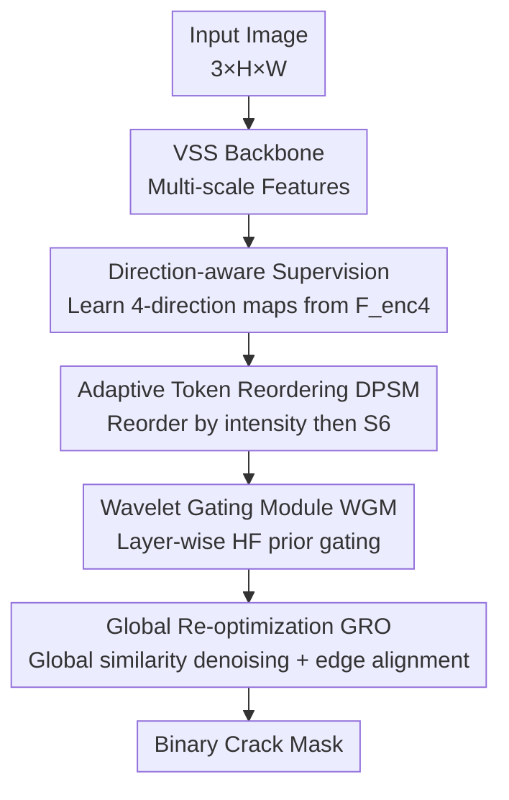

# CrackSSM: Reviving SSMs for Crack Segmentation via Dynamic Scanning

**Conference**: CVPR 2026  
**Paper**: [CVF Open Access](https://openaccess.thecvf.com/content/CVPR2026/html/Gu_CrackSSM_Reviving_SSMs_for_Crack_Segmentation_via_Dynamic_Scanning_CVPR_2026_paper.html)  
**Code**: https://github.com/hby123123/CrackSSM  
**Area**: Semantic Segmentation / State Space Models  
**Keywords**: Crack Segmentation, State Space Models, Dynamic Scanning, Adaptive Token Reordering, Wavelet Prior

## TL;DR
Addressing the slender, intermittent, and irregular nature of cracks, CrackSSM replaces the "fixed-path scanning" in Mamba-based vision models with **adaptive token reordering (dynamic scanning)** driven by crack direction intensity. This ensures that adjacent crack pixels remain adjacent in 1D sequences, restoring the causal modeling capability of S6. Combined with a wavelet high-frequency prior-guided decoder, it achieves superior accuracy over SOTAs like SCSegamba on three crack datasets with only **2.95M parameters / 4.69G FLOPs**.

## Background & Motivation
**Background**: Crack segmentation (CS) requires both high precision and efficiency for structural inspection. CNNs suffer from limited receptive fields and struggle to model global continuity, while Transformers capture long-range context but introduce quadratic complexity. Recent trends have shifted toward Mamba architectures based on State Space Models (SSMs). The S6 (Selective State Space) mechanism models long-range dependencies with linear complexity. VMamba introduced multi-direction scanning to flatten 2D feature maps into 1D sequences along fixed axes, and SCSegamba further incorporated diagonal snake scanning paths with SSMs in a lightweight encoder, becoming the current SOTA in CS.

**Limitations of Prior Work**: These methods rely on **static, predefined scanning paths that treat all images identically**. Fixed flattening orders destroy spatial continuity; pixels adjacent in 2D space may be pulled far apart in 1D sequences, which is particularly detrimental for curved or fragmented cracks.

**Key Challenge**: The effectiveness of S6 is built on the temporal/sequential coherence of the sequence, relying on information propagation between adjacent tokens. Once the flattening order scatters pixels of the same crack, the causal modeling capability of S6 is weakened, making the model unable to capture irregular structures—essentially, **static scanning fundamentally conflicts with the irregular morphology of cracks**.

**Goal**: To adapt the scanning order to the actual trajectory of cracks in each image without modifying the S6 structure or sacrificing linear efficiency, while recovering fine boundaries smoothed out during up/down-sampling in the decoding stage.

**Key Insight**: The authors observe that cracks typically have a dominant local extension direction. If the directional response intensity (horizontal, vertical, and two diagonals) can be extracted from high-level semantic features, these intensities can be used to reorder tokens, grouping semantically related and spatially connected crack regions within the sequence.

**Core Idea**: Replace fixed scanning paths with "directional response intensity-driven adaptive token reordering" to align 1D sequences with crack structures, thereby reviving S6's modeling capability for cracks.

## Method

### Overall Architecture
CrackSSM is a three-stage serial encoder-enhancement-decoder framework. The input is a $3\times H\times W$ image, and the output is a binary crack mask. **Encoding Stage**: A vanilla VSS (VMamba) backbone extracts four-level multi-scale features $\{F^{enc}_i\}_{i=1}^4$ (channel $2^{i-1}C$ at level $i$, with resolution halved at each step). **Feature Enhancement Stage** (the core): Directional crack intensity maps are calculated from the highest-level feature $F^{enc}_4$, used to reorder the token sequences of the lower three levels $\{F^{enc}_i\}_{i=1}^3$ before passing through S6 to obtain direction-aligned enhanced features $\{\hat F^{enc}_i\}$. **Decoding Stage**: Multi-scale features are fused top-down. Each level is equipped with a Wavelet Gating Module (WGM) to inject high-frequency boundary priors. The final level uses a Global Re-optimization Module (GRO) for global denoising and edge alignment before outputting the final mask.

### Key Designs

**1. Adaptive Token Reordering (DPSM/ATR): Aligning Scanning with Crack Trajectories**

Directly addressing the "static scanning scatters cracks" issue, the Dynamic Path Scanning Mamba (DPSM) uses Adaptive Token Reordering (ATR) **without altering the S6 structure**. For each scale of the lower three levels, four initial 1D sequences $\{P_k\}_{k=1}^4$ are generated along predefined snake paths (horizontal, vertical, and two diagonals). Reordered sequences are created using the upsampled directional intensity map $F_{dir}$ as the sorting key, grouping tokens with strong directional responses:

$$\hat P_k = \mathrm{Sort}(P_k,\ \mathrm{key}=F_{dir}),\quad k=1,2,3,4.$$

Each reordered sequence passes through a standard S6: $\bar P_k = \mathrm{S6}(\hat P_k)$, then mapped back to 2D to reconstruct feature maps $\{F_{p_k}\}$, which are concatenated and fused via point-wise convolution:

$$F^i_{merge} = \mathrm{PointConv}\big(\mathrm{Concat}(F_{p_1},F_{p_2},F_{p_3},F_{p_4})\big).$$

Finally, an SE block provides channel-adaptive weighting and residual connection to produce $\hat F^{enc}_i$. Unlike SCSegamba's fixed paths, this order is **content-adaptive per image**, restoring sequential coherence for S6 to propagate information along real crack structures.

**2. Direction-aware Auxiliary Supervision: Forcing "Direction" over "Semantics"**

The sort key $F_{dir}$ must specifically encode direction. Position information is injected into $F^{enc}_4$ via coordinate convolution and compressed to 4 channels. To provide explicit supervision, the ground truth mask is convolved with four Sobel-like directional kernels to generate labels $G_{dir}$. A channel-wise softmax produces the target distribution:

$$G'_{dir}(i,j,c)=\frac{\exp(G_{dir}(i,j,c))}{\sum_{k=1}^{4}\exp(G_{dir}(i,j,k))},\quad c\in\{1,2,3,4\}.$$

$F_{dir}$ is similarly normalized. Crucialy, **the probability vectors for background pixels are forced to zero $[0,0,0,0]$**, focusing supervision strictly on foreground cracks. The two are aligned using cross-entropy $L_{dir}=L_{CE}(G'_{dir},F'_{dir})$, forcing the model to predict the dominant crack direction at each point.

**3. Wavelet Gating Module (WGM): Gating Fine Boundaries via High-frequency Priors**

Decoding involves repeated upsampling that often blurs fine boundaries. WGM leverages **high-frequency structural cues from the original image** without extra parameters. A single-level Haar wavelet transform is applied to the input:

$$\{\hat I^w_{LL},\hat I^w_{LH},\hat I^w_{HL},\hat I^w_{HH}\}=\mathrm{HaarTransform}(I_{in}),$$

where high-frequency sub-bands ($\hat I^w_{LH},\hat I^w_{HL},\hat I^w_{HH}$) capture edges. Each map passes through point-wise convolutions and sigmoid to generate spatial gating weights $W_* = \sigma(\mathrm{Conv}_{1\times1}(\mathrm{ReLU}(\mathrm{BN}(\mathrm{Conv}_{1\times1}(\hat I^w_*)))))$. Features are modulated to **selectively amplify regions aligned with strong gradients (crack boundaries)**: $F^*_G = \mathrm{Resize}(W_*) \odot F^{dec}_i$.

**4. Global Re-optimization Module (GRO): A Global Consistency Check**

WGM focuses on local enhancement; GRO performs global calibration in the final stage. The high-frequency sub-bands are averaged into a structural map $I_{hf} = \frac{1}{3}(\hat I^w_{LH} + \hat I^w_{HL} + \hat I^w_{HH})$. The final decoded feature $F^3_{out}$ and $I_{hf}$ are projected into a shared latent space as $X, Y$. Pixel-wise similarity $S = \sigma(\mathrm{Proj}(X \odot Y))$ measures the consistency between features and real image edges. The final refinement is:

$$F_{refined} = (1-S) \odot F^3_{out} + S \odot \mathrm{Proj}(I_{hf}).$$

Where $S \to 1$ at true cracks, edge details are reinforced; where inconsistency is high, false responses are suppressed.

### Loss & Training
The framework adopts multi-task learning. The segmentation task uses BCE + Dice loss, while the directional task uses Cross-Entropy:

$$L_{total}=L_{main}+\alpha\cdot L_{dir},\quad L_{main}=\beta\cdot L_{BCE}(PM,GT)+L_{Dice}(PM,GT),\quad L_{dir}=L_{CE}(G'_{dir},F'_{dir}).$$

Parameters are set as $\alpha=0.5$ and $\beta=3$. Inputs are resized to $448\times448$. Training utilizes AdamW, batch size 16, initial learning rate $8\times10^{-4}$ with progressive decay for up to 300 epochs on an NVIDIA 3090.

## Key Experimental Results

### Main Results
CrackSSM benchmarks against recent SOTAs on three datasets (Crack500 / TUT / DeepCrack), leading in almost all metrics, especially on TUT.

| Dataset | Metric | CrackSSM | SCSegamba'25 | DefMamba'25 |
|--------|------|----------|--------------|-------------|
| Crack500 | F1 / mIoU | **0.764 / 0.780** | 0.746 / 0.771 | 0.752 / 0.772 |
| TUT | F1 / mIoU | **0.845 / 0.851** | 0.824 / 0.838 | 0.823 / 0.836 |
| DeepCrack | F1 / mIoU | **0.918 / 0.909** | 0.903 / 0.896 | 0.907 / 0.900 |

Efficiency is a standout feature, achieving top accuracy with minimal FLOPs and small parameter counts.

| Method | FLOPs↓ | Params↓ | Size↓ |
|------|--------|---------|-------|
| SimCrack'24 | 286.62G | 29.58M | 225MB |
| DefMamba'25 | 50.91G | 177.44M | 201MB |
| SCSegamba'25 | 18.16G | 2.80M | 37MB |
| **CrackSSM** | **4.69G** | 2.95M | **15MB** |

### Ablation Study
On the TUT dataset, starting from a baseline (VSSM backbone + direct upsampling):

| Config | F1↑ | mIoU↑ | Description |
|------|------|-------|------|
| baseline | 0.811 | 0.827 | All modules off |
| + DPSM | 0.824 | 0.836 | Reordering only |
| + WGM | 0.827 | 0.837 | Wav. gating only |
| + GRO | 0.825 | 0.835 | Global re-opt only |
| + DPSM + WGM | 0.830 | 0.839 | Modular complementarity |
| **Full** | **0.845** | **0.851** | Complete model |

Separate ablation on directional loss (Table 4) shows performance drops across all datasets without $L_{dir}$ (e.g., ODS 0.902 $\to$ 0.893 on DeepCrack). Regarding directional labels (Table 5), four directions (0.845 F1) outperform using only horizontal/vertical (0.838) or only two diagonals (0.839).

### Key Findings
- Each module independently contributes to the baseline, addressing different weaknesses (directional perception, detail enhancement, global optimization). Together, they synergistically push metrics to the optimum.
- Explicit directional supervision is essential: forcing $F_{dir}$ to learn "direction" is the prerequisite for effective sorting.
- The model performs particularly well in scenarios with limited training data or complex scenes (e.g., TUT).

## Highlights & Insights
- **Decoupling reordering from S6**: Solving the "irregular crack" problem by framing it as a "scanning order error" allows modifying token sequences before S6 without touching the core operators or breaking linear complexity.
- **Treating direction as an explicitly supervisable signal**: Using Sobel kernels to generate labels and forcing background zeros compels the model to output directional distributions—a strategy transferable to other structures with dominant topologies (vessels, roads, fibers).
- **Zero-parameter injection of wavelet priors**: WGM retrieves boundary cues from Haar sub-bands, recovering fine edges at almost no parameter cost.
- **Impressive efficiency**: At 4.69G FLOPs and 15MB size, it is more accurate than SCSegamba with half the computational requirement, making it deployment-friendly for real-world inspection.

## Limitations & Future Work
- The sorting key $F_{dir}$ is calculated at a low resolution ($H/32$). Whether extremely thin or dense intersecting cracks remain separable at this resolution is not fully analyzed.
- Directions are fixed to four axes. Curved paths between these axes are only approximated; the benefit of continuous angles or more directions was not explored beyond the 2 vs 4 comparison.
- The method is tailored for "slender structures + high-frequency boundaries." Its utility for blocky or textured targets remains questionable.
- The sorting operation introduces overhead. While FLOPs are low, the latency impact on actual inference and parallelism was not explicitly reported.

## Related Work & Insights
- **vs SCSegamba (CS SOTA)**: Both use SSMs for cracks, but SCSegamba applies a **fixed diagonal snake scan** to all images. CrackSSM uses **per-image adaptive reordering**, offering better sequential coherence and higher accuracy with significantly fewer FLOPs (4.69G vs 18.16G).
- **vs General Vision Mambas (VMamba/PlainMamba)**: Their multi-directional scans are better than unidirectional but remain static. This paper proves that content-adaptive scanning is critical for irregular targets like cracks.
- **vs DefMamba (Dynamic Scanning)**: DefMamba is heavy (177M params). CrackSSM achieves better results with only 2.95M params, indicating that direction-aware reordering is more effective and lightweight than general deformable scanning for this domain.

## Rating
- Novelty: ⭐⭐⭐⭐ Replacing static scanning with directional intensity-driven reordering without altering S6 is a clear and uncommon insight.
- Experimental Thoroughness: ⭐⭐⭐⭐ Extensive datasets, SOTA comparisons, and ablation on modules/labels; however, lacks analysis of sorting latency.
- Writing Quality: ⭐⭐⭐⭐ Clear motivation/mechanism and complete formulas.
- Value: ⭐⭐⭐⭐ Lightweight and plug-and-play for Mamba backbones, providing direct utility for industrial crack inspection.

<!-- RELATED:START -->

## Related Papers

- [\[CVPR 2026\] MixerCSeg: An Efficient Mixer Architecture for Crack Segmentation via Decoupled Mamba Attention](mixercseg_an_efficient_mixer_architecture_for_crack_segmentation_via_decoupled_m.md)
- [\[CVPR 2026\] Efficient Video Object Segmentation and Tracking with Recurrent Dynamic Submodel](efficient_video_object_segmentation_and_tracking_with_recurrent_dynamic_submodel.md)
- [\[CVPR 2026\] SDDF: Specificity-Driven Dynamic Focusing for Open-Vocabulary Camouflaged Object Detection](sddf_specificity-driven_dynamic_focusing_for_open-vocabulary_camouflaged_object.md)
- [\[CVPR 2026\] AFRO: Bootstrap Dynamic-Aware 3D Visual Representation for Scalable Robot Learning](bootstrap_dynamic-aware_3d_visual_representation_for_scalable_robot_learning.md)
- [\[ICML 2026\] FlowSeg: Dynamic Semantic Guidance for LLM-Conditioned Segmentation](../../ICML2026/segmentation/flowseg_dynamic_semantic_guidance_for_llm-conditioned_segmentation.md)

<!-- RELATED:END -->
