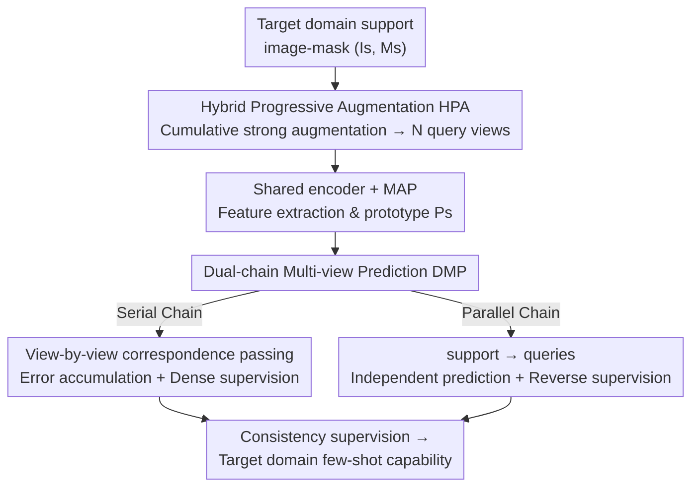

# Cross-Domain Few-Shot Segmentation via Multi-view Progressive Adaptation

**Conference**: CVPR 2026  
**arXiv**: [2602.05217](https://arxiv.org/abs/2602.05217)  
**Code**: https://github.com/niejiahao1998/MPA (Available)  
**Area**: Semantic Segmentation / Cross-Domain Few-Shot  
**Keywords**: Cross-domain few-shot segmentation, progressive adaptation, multi-view, cumulative data augmentation, dual-chain prediction

## TL;DR
To address the dilemma in Cross-Domain Few-Shot Segmentation (CD-FSS) where "scarcity of target samples + large domain gap weakens the few-shot capability of source models," this paper proposes Multi-view Progressive Adaptation (MPA). It performs "easy-to-hard" adaptation from both **data** and **strategy** perspectives—generating increasingly complex multi-views via Hybrid Progressive Augmentation (HPA) and fully exploiting supervision signals through Dual-chain Multi-view Prediction (DMP) across serial and parallel paths. MPA outperforms Prev. SOTA by an average of 7.0% (1-shot) across four data-scarce domains and reduces training time by 80% with negligible performance drops when omitting source domain training.

## Background & Motivation

**Background**: Few-shot segmentation (FSS) relies on meta-learning on base classes to learn the ability to "segment a query image using a few support images." However, data-scarce domains like medicine and satellite imagery lack sufficient base class samples. The standard practice for Cross-Domain Few-Shot Segmentation (CD-FSS) is a two-stage approach: meta-training on a large-scale source domain (e.g., Pascal VOC) followed by "transferring" this capability using extremely few samples from the target domain.

**Limitations of Prior Work**: The authors observe a counter-intuitive phenomenon—CD-FSS generally performs better in multi-shot than 1-shot, indicating that "extra samples/views" are valuable; however, **simply applying multi-view augmentation to visible samples yields marginal gains** (Fig.1 Up). This is because the source-trained model initially has weak few-shot capability in the target domain, and when combined with a large domain gap, it cannot "digest" views heavily perturbed by strong augmentation, wasting their supervision signals.

**Key Challenge**: Target domain samples are "scarce and lack diversity," while the initial few-shot capability of the source model in the target domain is weak. Directly feeding complex augmented views is akin to asking a model that hasn't learned to stand to solve difficult problems, hindering learning. The issue is not "whether to use multi-views," but "when and with what strategy to provide them."

**Goal**: Decomposition into two sub-problems—(i) Data side: How to match the complexity of augmented views with the model's current capability rather than introducing the hardest tasks immediately; (ii) Strategy side: How to fully convert these progressively difficult views into effective supervision.

**Key Insight**: Drawing from the success of "progressive" strategies in domain generalization—starting with simple tasks and gradually increasing difficulty as the model strengthens allows for a smooth transition from the source to the target domain.

**Core Idea**: Replace "one-time strong augmentation" with "easy-to-hard cumulative augmentation + dual-chain supervision" to progressively reconstruct few-shot capability in the target domain from both data and strategy perspectives.

## Method

### Overall Architecture
MPA is a framework that **operates only during the adaptation stage**: the input is target-domain support image-mask pairs $(I_s, M_s)$, and the output is an adapted model capable of few-shot segmentation in that target domain. It splits multi-view provision into two collaborative modules. First, **Hybrid Progressive Augmentation (HPA)** derives $N$ labeled query views $\{(I_{q_i}, M_{q_i})\}_{i=1}^N$ from the support image, making the views **increasingly numerous and complex** as training progresses. All support/query images pass through a weight-sharing encoder to extract features; support features undergo masked average pooling (MAP) to obtain the prototype $P_s$. Then, **Dual-chain Multi-view Prediction (DMP)** performs "support $\leftrightarrow$ query" prediction across these views using complementary serial and parallel paths, imposing dense supervision. By leveraging prediction consistency across views, the few-shot capability is reconstructed bit by bit. The entire workflow gradually transitions from easy to hard, with each difficulty level bringing stable gains.

### Key Designs

**1. Hybrid Progressive Augmentation (HPA): Matching View Difficulty with Model Capability**

The pain point is that "weak models cannot learn from strong augmented views provided at the start." HPA creates a controllable "ramp" for difficulty along two lines. First is **cumulative augmentation for harder views**: the first query $I_{q_1}$ undergoes simple transformations like flipping; $I_{q_2}$ adds brightness adjustments on top of that... eventually $I_{q_6}$ stacks all previous operations plus grid shuffle. Each new view "contains all previous operations plus a more complex one." Tab.1 verifies that higher complexity leads to lower mIoU on those views (i.e., harder tasks). Second is **progressively increasing the number of views** $N$: at the start of training $N=1$, requiring the model to predict $I_{q_1}$ from $I_s$; as adaptation progresses, $N$ is increased adaptively, requiring accuracy across all $N$ views. An **adaptive criterion** triggers this—when performance plateaus for three consecutive epochs (signaling saturation), a new, more complex query view is introduced. Thus, "when to add difficulty" is determined by the model's own learning curve rather than a fixed manual curriculum.

**2. Dual-chain Multi-view Prediction (DMP): Creating Difficulty Serially and Expanding Data Parallely**

Multi-view data alone is insufficient; a strategy is needed to extract its full value. DMP runs two complementary chains. The **Serial Chain** links $I_s$ and all $\{I_{q_i}\}$ into a single prediction chain, borrowing from SSP for self-support prototype refinement: $P_s = \mathrm{MAP}(F_s, M_s)$, $P_{q_1}^{seq} = \mathrm{SSP}(F_{q_1}, P_s)$, then generating a mask via cosine similarity $\hat{M}_{q_1}^{seq} = \sigma(\cos(F_{q_1}, P_{q_1}^{seq}))$, with bi-directional prediction as regularization. Crucially, the support pseudo-prototype for the $j$-th view comes from the $(j-1)$-th view's prediction ($P_s^{seq_0}=P_s$), meaning **errors accumulate and propagate down the chain**—Tab.2 confirms that later views indeed have lower mIoU. This "deliberate difficulty," combined with dense supervision $\mathcal{L}^{seq}=\sum_{i=2}^N(\mathcal{L}_{q_i}^{seq}+\mathcal{L}_s^{seq_i})$, forces the model to learn representations robust to various perturbations. The **Parallel Chain** directly mimics inference-time "support $\rightarrow$ query": $P_s$ is used to independently segment each $I_{q_i}$ ($P_{q_i}^{par}=\mathrm{SSP}(F_{q_i}, P_s)$) with corresponding reverse predictions and supervision $\mathcal{L}_s^{par}, \mathcal{L}_q^{par}$. The parallel chain does not propagate errors, treating each view as an independent learning path, which effectively **expands the adaptation data volume**. While the serial chain generates gradient difficulty, the parallel chain ensures basic alignment—one manages "error accumulation" and the other "error diversity" to complementarily build few-shot capability.

### Loss & Training
The total loss is a weighted combination of four terms: base support loss, serial loss, parallel support loss, and parallel query loss:

$$\mathcal{L} = \lambda_{bs}\mathcal{L}_{bs} + \lambda^{seq}\mathcal{L}^{seq} + \lambda_s^{par}\mathcal{L}_s^{par} + \lambda_q^{par}\mathcal{L}_q^{par}$$

Weights are set as $\lambda_{bs}=0.2$, $\lambda^{seq}=0.1$, $\lambda_s^{par}=0.4$, and $\lambda_q^{par}=1$ (parallel query loss is the primary supervision). Note that the first view's loss in the serial chain is equivalent to that in the parallel chain, so serial loss starts from $i=2$. The backbone is an ImageNet-pretrained ResNet-50 (with the last stage and ReLU removed for better generalization). Images are resized to $400\times400$ with a learning rate of 5e-4. For $K$-shot scenarios, the mean prototype $\bar{P}_s=\frac{1}{K}\sum_i P_s^i$ is used for initial prediction.

## Key Experimental Results

### Main Results
mIoU (%) on four common data-scarce domains, 1-shot/5-shot, ResNet-50 backbone:

| Method | Deepglobe (1s) | ISIC (1s) | Chest X-Ray (1s) | FSS-1000 (1s) | Mean (1s) | Mean (5s) |
|------|------|------|------|------|------|------|
| PATNet | 37.9 | 41.2 | 66.6 | 78.6 | 56.1 | 62.0 |
| SSP (baseline) | 41.3 | 48.6 | 72.6 | 77.0 | 60.0 | 68.0 |
| IFA (Prev. SOTA) | 50.6 | 66.3 | 74.0 | 80.1 | 67.8 | 71.4 |
| ABCDFSS | 42.6 | 45.7 | 79.8 | 74.6 | 60.7 | 65.0 |
| **MPA (w/ source training)** | **54.2** | **74.3** | **89.1** | **81.4** | **74.8** | **76.9** |
| **MPA (w/o source training)** | 53.1 | 71.1 | 89.0 | 80.2 | 73.4 | 75.5 |

MPA outperforms IFA by an average of **+7.0% (1-shot) / +5.5% (5-shot)**. On the underwater SUIM dataset, MPA achieves 55.5 (w/ source training) vs. 35.1 for ABCDFSS in 1-shot. Compared to SAM-based methods (average of Deepglobe/ISIC/FSS-1000), MPA (w/o source) achieves 68.1 vs. TAVP's 60.0 and APSeg's 53.7, while being more parameter-efficient.

### Ablation Study
Ablation of technical designs (Tab.6, mIoU%):

| Configuration | Deepglobe | ISIC | Description |
|------|------|------|------|
| Baseline (SSP) | 42.1 | 42.2 | Starting point |
| + HPA | 47.8 | 61.2 | +5.7 / +19.0 |
| + HPA + DMP | 53.1 | 71.1 | Further +5.3 / +9.9 (Full Model) |

Ablation of progressive strategy (Tab.7 on ISIC):

| Configuration | mIoU | Description |
|------|------|------|
| Always 1 view | 50.5 | No view increase |
| Implicit progressive (inc. views) | 52.0 | +1.4 |
| Always simple aug | 51.3 | No difficulty increase |
| Explicit progressive (inc. difficulty) | 52.4 | +1.1 |
| Combination | **53.1** | Full HPA |

Augmentation type ablation (Tab.8): Simple 51.3/67.9 → Single complex replacement 51.9/68.5 → **Cumulative 53.1/71.1**, validating that "cumulative" is superior to "replacement."

### Key Findings
- **DMP is the cornerstone of the framework**: While HPA alone yields significant improvements (ISIC +19.0), DMP is critical for "extracting" multi-view benefits, adding another +9.9. They are complementary—HPA creates data, and DMP creates supervision.
- **Most gains come from the adaptation stage rather than source training**: Removing source domain training only drops MPA's 1-shot performance from 74.8 to 73.4, still 5.6 higher than IFA (67.8) and 12.7 higher than the source-free ABCDFSS. Meanwhile, **training time is reduced by ~80%** (IFA 555min → MPA 98min on Deepglobe). This directly challenges the assumption that CD-FSS "must start with source domain meta-training."
- **Cumulative > Replacement**: Stacking augmentation operations (keeping historical ones and adding new ones) is better than using a single complex operation per view, showing the importance of continuous difficulty ramping.

## Highlights & Insights
- **Applying "Curriculum Learning" to two orthogonal axes of CD-FSS**: The data axis (augmentation difficulty/view count) plus the strategy axis (serial/parallel chains), triggered adaptively by the model's learning curve (3-epoch plateau). This "adaptive difficulty addition" is transferable to any few-shot or weakly-supervised adaptation task.
- **Deliberate error as regularization**: The serial chain knowingly propagates errors but uses dense supervision to convert them into training signals for "robustness against perturbations"—a counter-intuitive yet effective design that turns a potential flaw (error propagation) into an implicit source of data augmentation.
- **Challenging the necessity of source training**: Achieving results close to two-stage methods with a single-stage adaptation using one support image while saving 80% time provides strong evidence for "source-free CD-FSS," which is highly practical for compute-limited scenarios.

## Limitations & Future Work
- The main experiments follow a source-free setting, but the upper bound of HPA complexity (e.g., up to the 6th view with grid shuffle) and the set of augmentation operations are manually designed; whether these require re-tuning for different target domains is not fully discussed.
- The adaptive criterion "3-epoch plateau" is an empirical threshold. Hyperparameter sensitivity (growth limits of $N$, various $\lambda$) is primarily in the supplementary material, and most results in the main text are singular numbers for specific datasets, which may affect cross-domain generalization expectations.
- The "degree" of error accumulation in the serial chain is hard to control—theoretically, excessive accumulation could pollute supervision. The paper mitigates this with dense supervision but lacks a boundary analysis of when error accumulation becomes destabilizing.
- The authors look forward to extending progressive adaptation to broader cross-domain tasks and more complex real-world domain shifts.

## Related Work & Insights
- **vs. IFA**: IFA establishes support-query correspondence during fine-tuning but **augments only a single view**, leading to overfitting. MPA uses progressive multi-views + dual chains to fully expand and exploit supervision, leading to a 7.0% average gain in 1-shot.
- **vs. ABCDFSS**: ABCDFSS argues that source training introduces extra domain gaps and emphasizes the adaptation stage. MPA shares this view and goes further—providing a concrete solution for "how to adapt effectively with minimal samples," outperforming it by 12.7% (1-shot) in the source-free setting.
- **vs. SAM-based (APSeg / TAVP / PerSAM)**: These rely on SAM's strong zero-shot generalization but are larger and depend on foundation model priors. MPA uses a lightweight ResNet-50 + progressive strategy to win on both performance and model size (68.1 vs. 60.0).
- **vs. DR-Adapter / Frequency Decoupling**: Those methods rely on fine-tuning specific structures or decoupling feature frequencies to resist overfitting. MPA approaches the problem via "data diversity + supervision density," which is orthogonal and potentially combinable.

## Rating
- Novelty: ⭐⭐⭐⭐ The combination of "data+strategy dual-axis progression + dual-chain supervision" is novel and provides an effective counter-example to source training necessity.
- Experimental Thoroughness: ⭐⭐⭐⭐⭐ Comprehensive coverage across five data-scarce domains, comparisons with SAM-based methods, three sets of ablations, and efficiency analysis.
- Writing Quality: ⭐⭐⭐⭐ Motivated by preliminary study results (Tab.1/2) with clear logic; formulas are somewhat dense.
- Value: ⭐⭐⭐⭐ The source-free single-stage approach saves 80% time without performance loss, offering high utility for real-world data/compute-constrained scenarios.

<!-- RELATED:START -->

## Related Papers

- [\[CVPR 2026\] Selective, Regularized, and Calibrated: Harnessing Vision Foundation Models for Cross-Domain Few-Shot Semantic Segmentation](selective_regularized_and_calibrated_harnessing_vision_foundation_models_for_cro.md)
- [\[CVPR 2026\] PrAda: Few-Shot Visual Adaptation for Text-Prompted Segmentation](prada_few-shot_visual_adaptation_for_text-prompted_segmentation.md)
- [\[CVPR 2026\] V²-SAM: Marrying SAM2 with Multi-Prompt Experts for Cross-View Object Correspondence](v2-sam_marrying_sam2_with_multi-prompt_experts_for_cross-view_object_corresponde.md)
- [\[CVPR 2025\] The Devil is in Low-Level Features for Cross-Domain Few-Shot Segmentation](../../CVPR2025/segmentation/the_devil_is_in_low-level_features_for_cross-domain_few-shot_segmentation.md)
- [\[CVPR 2025\] Dual-Agent Optimization framework for Cross-Domain Few-Shot Segmentation](../../CVPR2025/segmentation/dual-agent_optimization_framework_for_cross-domain_few-shot_segmentation.md)

<!-- RELATED:END -->
