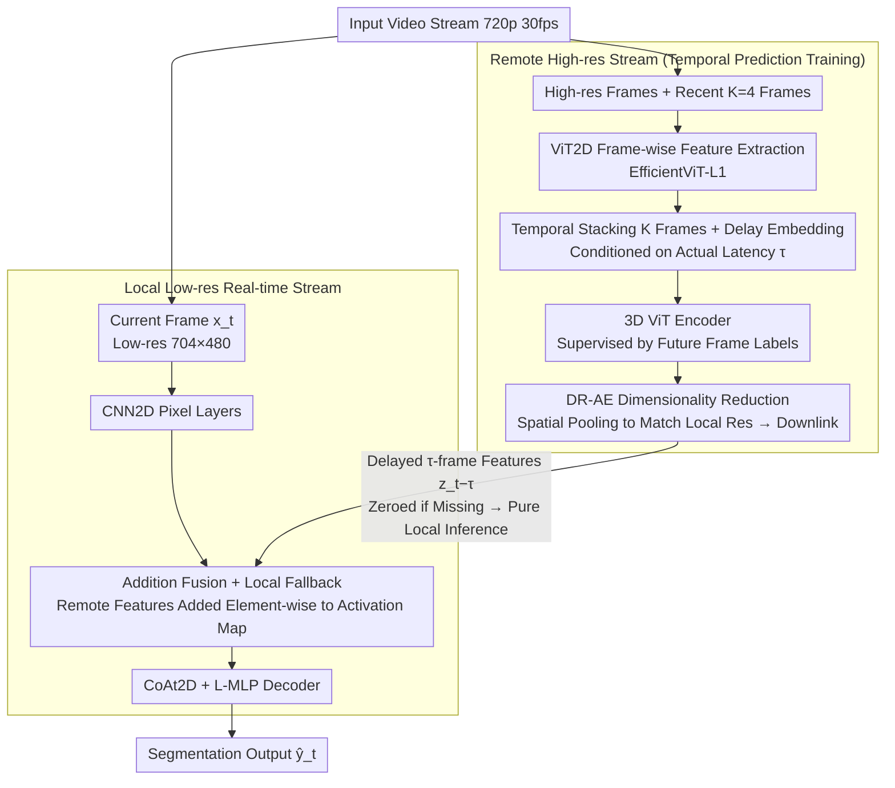

# DeDelayed: Deleting Remote Inference Delay via On-Device Correction

**Conference**: CVPR 2026  
**arXiv**: [2510.13714](https://arxiv.org/abs/2510.13714)  
**Code**: [github.com/InterDigitalInc/dedelayed](https://github.com/InterDigitalInc/dedelayed)  
**Area**: Image Segmentation  
**Keywords**: Collaborative inference, Real-time video segmentation, Delay compensation, Temporal prediction, Edge-cloud collaboration

## TL;DR
This paper proposes DeDelayed, an edge-cloud collaborative inference framework that combines a lightweight local image model with a delay-aware cloud temporal prediction video model. By training the cloud model for temporal prediction to compensate for network latency, the framework improves mIoU by 6.4 compared to purely local inference and by 9.8 compared to purely remote inference under a 100ms delay.

## Background & Motivation
**Background**: State-of-the-art video understanding models are too computationally intensive to run on resource-constrained edge devices. Conversely, offloading inference to the cloud introduces communication latency, leading to outdated predictions.

**Limitations of Prior Work**: (1) Existing split computing methods utilize all local resources for a single inference pipeline, lacking a fallback mechanism when the cloud is unavailable; (2) The impact of latency on prediction accuracy is often ignored; (3) Computational costs are typically controlled by reducing spatio-temporal resolution.

**Key Challenge**: Cloud models provide high accuracy but suffer from latency, while local models are real-time but exhibit lower accuracy—how can their respective strengths be unified?

**Goal**: Design a real-time inference system that integrates high-quality, delayed remote features with real-time, low-resolution local features.

**Key Insight**: Train the remote model to predict features for **future frames**, ensuring that delayed remote outputs remain relevant when they finally arrive at the edge.

**Core Idea**: $\hat{y}_t = f_{\text{local}}(x_t, z_{t-\tau})$, where the local model processes the current frame and the remote model predicts features for future frames, with the two being integrated through element-wise addition.

## Method

### Overall Architecture
DeDelayed addresses a practical engineering contradiction: high-resolution cloud models offer superior semantic accuracy but suffer from network delays that render their results outdated by the time they arrive. Meanwhile, local small models are real-time but struggle with complex scenes. The proposed approach runs both pipelines simultaneously and merges them: the local model processes the **current frame** at a lower resolution, while the cloud model extracts features at a high resolution and is trained to **predict future frames**. Consequently, the remote output, delayed by $\tau$ frames, aligns with the current visual scene upon arrival.

Specifically, the cloud utilizes a 2D ViT (EfficientViT-L1) for frame-wise feature extraction. Features from the most recent $K=4$ frames are temporally concatenated, augmented with a "delay embedding," and passed into a 3D ViT encoder. These are then compressed via Adaptive Spatial Pooling and a channel bottleneck (DR-AE) for downlink transmission. Locally, a CNN2D + CoAt2D architecture processes the current frame at $704 \times 480$. The aligned cloud features are **element-wise added** to the activation maps between the CNN2D and CoAt2D layers before decoding the segmentation. The core relationship is defined as $\hat{y}_t = f_{\text{local}}(x_t, z_{t-\tau})$: the local model ingests the current frame $x_t$, while the fusion incorporates the remote features $z_{t-\tau}$ that were transmitted $\tau$ frames ago but predicted for the current time.

### Key Designs

**1. Temporal Prediction Training: Offsetting Network Latency via Predictive Buffering**

Latency is an unavoidable bottleneck in edge-cloud collaboration—standard remote inference accuracy drops below purely local inference when latency exceeds 67ms because the returned features describe the past. DeDelayed injects artificial delay $D$ (sampled uniformly from 0–5 frames) into the cloud model's input during training, while using labels from **future frames** as supervision. This forces the model to learn to "predict semantics $D$ frames ahead based on current input." A learnable **delay embedding** (functioning similarly to positional encoding and conditioned on the actual latency) is introduced, allowing a single model to adaptively adjust its prediction according to the current real-world delay. Thus, whether the network jitters at 33ms or 167ms, the model outputs features "aligned with the present," effectively internalizing motion compensation within the network instead of performing post-hoc frame alignment.

**2. Addition Fusion + Local Fallback: Graceful Degradation to Purely Local Inference**

Hard real-time applications (e.g., autonomous driving) cannot assume the cloud is always online. DeDelayed integrates remote features by **element-wise addition** to the local intermediate layers rather than concatenation or gated fusion. This choice has a well-defined property: when the remote signal is zero (e.g., due to packet loss), $f_{\text{local}}(x_t, \mathbf{0})$ is numerically equivalent to purely local inference. The model behavior does not collapse; it simply reverts to local accuracy. This positions the remote signal as a "bonus" rather than a hard dependency, providing a natural fallback mechanism that many split computing methods—which commit all local power to the uplink pipeline—lack.

**3. Hybrid Resolution Inference: High-res for Semantic Identification, Low-res for Spatial Localization**

Running models at original capture resolution on edge devices is often impractical, but cloud GPUs can handle it. DeDelayed assigns the local model to process $704 \times 480$ low-resolution frames for precise spatial localization, while the cloud model extracts features from 720p high-resolution frames for semantic understanding. Visualizations demonstrate that remote activation maps accurately distinguish and classify small distant objects (e.g., pedestrians), while the local model provides precise boundary calibration. Their resolution roles are complementary: high-resolution semantic features from the cloud are pooled via DR-AE to match local dimensions and then added, saving downlink bandwidth (matching 5G uplink 1–10 Mbps) while assigning "clarity" and "real-time response" to the most suitable processing nodes.

### Mechanism Example
Consider frame $t$ with a network round-trip delay of $\tau = 3$ frames (≈100ms @30fps). At time $t$, the edge device receives the low-resolution frame $t$, and the CNN2D + CoAt2D immediately computes a real-time but coarse feature map. Simultaneously, the cloud feature $z_{t-3}$ arrives. This feature was sent by the cloud at frame $t-3$ but was trained (via "temporal prediction + delay embedding" conditioned on $D=3$) to **predict the semantics of frame $t$**. After the resolution is aligned via DR-AE, the two features are added element-wise to produce the segmentation $\hat{y}_t$, combining precise local spatial boundaries with distant object classifications from the cloud. If $z_{t-3}$ is lost, the addition term becomes zero, and the local model outputs a slightly coarser result without system failure. This explains why DeDelayed maintains a high mIoU of 0.665 at 100ms latency, showing almost no performance drop as latency increases.

### Loss & Training
- **Multi-stage Training**: Remote and local models are pre-trained on ImageNet → Cityscapes → BDD100K before joint fine-tuning.
- **Joint Training**: Uses per-pixel cross-entropy loss, the Adan optimizer, and a warmup-stable-decay learning rate schedule.
- **Latency Training**: Delay $\tau$ is uniformly sampled from 0–5 frames (0–167ms @30fps), coupled with delay embeddings to cover dynamic latencies within a single model.

## Key Experimental Results

### Main Results (BDD100K Semantic Segmentation mIoU)

| Inference Configuration | 0ms | 33ms | 67ms | 100ms | 167ms |
| :--- | :--- | :--- | :--- | :--- | :--- |
| Local only | 0.601 | 0.601 | 0.601 | 0.601 | 0.601 |
| Remote image | 0.655 | 0.616 | 0.567 | 0.530 | 0.525 |
| Remote predictive | 0.655 | 0.649 | 0.644 | 0.637 | 0.624 |
| **Ours (DeDelayed)** | **0.670** | **0.668** | **0.666** | **0.665** | **0.668** |

### Ablation Study

| Configuration | mIoU @167ms | Description |
| :--- | :--- | :--- |
| Local only | 0.601 | Unaffected by latency but lower accuracy |
| Remote image | 0.525 | Latency severely degrades accuracy |
| Remote predictive | 0.624 | Temporal prediction significantly mitigates drop |
| **Ours (DeDelayed full)** | **0.668** | Virtually eliminates the impact of latency |

### Key Findings
- Conventional remote inference performance falls below local inference when latency exceeds 67ms.
- DeDelayed outperforms local-only inference by 6.7 mIoU at 167ms delay, comparable to using a model 10x larger.
- Activation map visualizations show that the remote model provides accurate object classification, while the local model provides precise spatial localization.
- Delay embeddings allow a single model to adapt to a dynamic latency range of 0–167ms.

## Highlights & Insights
- **Fallback-first Design**: Remote information acts as an "auxiliary signal" rather than a mandatory dependency, ensuring safety for hard real-time applications.
- **Delay Embedding ≈ Learnable Motion Compensation**: By conditioning on the latency amount, the model learns varying degrees of motion prediction.
- **Hybrid Resolution Complementarity**: High-res remote processing identifies small distant targets, while low-res local processing provides spatial alignment.
- **Simplistic but Robust Fusion**: Element-wise addition is mathematically simple yet provides well-defined behavior for graceful degradation during signal loss.

## Limitations & Future Work
- Validated only on segmentation; detection or other dense prediction tasks remain untested.
- Relies on pseudo-label training (due to lack of per-frame annotations in BDD100K); performance might improve with ground truth.
- Artifacts from uplink video compression are not explicitly modeled.
- High-latency scenarios exceeding 167ms were not evaluated.
- Multi-remote model or hierarchical fusion strategies were not explored.
- Feasibility on ultra-low power devices (<5W) requires further validation.
- DR-AE compression efficiency needs optimization for extremely limited downlink bandwidth.
- Heterogeneous sensor fusion (e.g., LiDAR + Camera) scenarios are not covered.

## Related Work & Insights
- **Contrast with Split Computing**: Methods like FCM devote all local computation to the uplink pipeline, offering no fallback mechanism.
- **Contrast with Knowledge Boosting**: The latter requires training separate models for each fixed latency.
- **Extensibility**: The delay embedding design can be generalized to other asynchronous information fusion scenarios.
- **Orthogonality**: Adaptive Model Streaming (streaming weight updates) is orthogonal to DeDelayed's feature fusion approach.

## Rating
- **Novelty**: ⭐⭐⭐⭐ Clever design of the edge-cloud framework using temporal prediction and delay embeddings.
- **Experimental Thoroughness**: ⭐⭐⭐⭐ Detailed comparisons across configurations, though limited to one dataset/task.
- **Writing Quality**: ⭐⭐⭐⭐⭐ Clear problem definition and intuitive system diagrams.
- **Value**: ⭐⭐⭐⭐⭐ Highly relevant to actual deployment scenarios with significant engineering value.

<!-- RELATED:START -->

## Related Papers

- [\[AAAI 2026\] A²LC: Active and Automated Label Correction for Semantic Segmentation](../../AAAI2026/segmentation/a2lc_active_and_automated_label_correction_for_semantic_segm.md)
- [\[CVPR 2025\] EdgeTAM: On-Device Track Anything Model](../../CVPR2025/segmentation/edgetam_on-device_track_anything_model.md)
- [\[CVPR 2026\] HySeg: Learning Generative Priors for Structure-Aware Remote Sensing Segmentation](hyseg_learning_generative_priors_for_structure-aware_remote_sensing_segmentation.md)
- [\[CVPR 2026\] F2Net: A Frequency-Fused Network for Ultra-High Resolution Remote Sensing Segmentation](f2net_a_frequency-fused_network_for_ultra-high_resolution_remote_sensing_segment.md)
- [\[CVPR 2026\] Task-Oriented Data Synthesis and Control-Rectify Sampling for Remote Sensing Semantic Segmentation](task-oriented_data_synthesis_and_control-rectify_sampling_for_remote_sensing_sem.md)

<!-- RELATED:END -->
