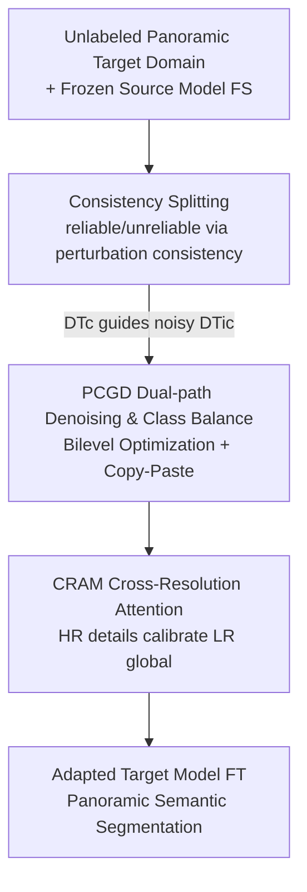

# Denoise and Align: Towards Source-Free UDA for Robust Panoramic Semantic Segmentation

**Conference**: CVPR 2026  
**Paper**: [CVF Open Access](https://openaccess.thecvf.com/content/CVPR2026/html/Chang_Denoise_and_Align_Towards_Source-Free_UDA_for_Robust_Panoramic_Semantic_CVPR_2026_paper.html)  
**Code**: https://github.com/ZZZPhaethon/DAPASS (Available)  
**Area**: Panoramic Semantic Segmentation / Source-Free Domain Adaptation  
**Keywords**: SFUDA, Panoramic Segmentation, Pseudo-label Denoising, Class Imbalance, Cross-Resolution Attention  

## TL;DR
DAPASS transfers a pinhole-pre-trained segmentation model to the panoramic domain without source data. It partitions target samples into reliable and unreliable sets based on confidence consistency, cleans pseudo-labels via bilevel optimization and class-balanced copy-paste, and aligns local details with global semantics using a cross-resolution attention module to mitigate ERP distortion. It achieves 55.04% and 70.38% mIoU on outdoor C-to-D and indoor Spin-to-Span benchmarks, respectively.

## Background & Motivation
**Background**: Panoramic (360°) semantic segmentation is critical for applications requiring full-scene understanding like autonomous driving and VR, but dense annotation is extremely expensive. The mainstream approach utilizes Unsupervised Domain Adaptation (UDA) to transfer models from labeled pinhole datasets to unlabeled panoramic domains.

**Limitations of Prior Work**: Source data is often inaccessible due to privacy or copyright, leading to the more restrictive **Source-Free UDA (SFUDA)**—where only a pre-trained source model and unlabeled panoramic images are available. This constraint amplifies the domain shift challenge: self-training relies heavily on pseudo-label quality, yet source models generate noisy labels in the panoramic domain and suffer from systematic under-training of minority classes (e.g., Rider) due to long-tail distributions in the source domain.

**Key Challenge**: The Equirectangular Projection (ERP) of panoramas introduces latitude-dependent geometric distortion—where polar regions are stretched while the equator remains stable. This spatial non-uniformity does not exist in pinhole images, causing standard feature learning to fail. Simultaneously, the invisibility of source data makes pseudo-label calibration difficult. Distortion, pseudo-label noise, and class imbalance are compounded under the SFUDA setting.

**Goal**: Without accessing source data or target labels, the objectives are to: (1) clean noisy pseudo-labels and supplement supervision for minority classes; (2) ensure model robustness against ERP distortion and scale variations.

**Key Insight**: Knowledge transfer is achieved by first **Denoising** (confidence-guided filtering and cleaning of pseudo-labels + class balancing) and then **Aligning** (calibrating low-resolution global semantics with high-resolution local details).

## Method

### Overall Architecture
Given a source model $F_S$ pre-trained on the pinhole domain and an unlabeled panoramic target set $\mathcal{D}_T=\{x_t\}$, the goal is to adapt a target model $F_T$. DAPASS consists of two sequential modules: **PCGD (Panoramic Confidence-Guided Denoising)** improves pseudo-label reliability by splitting target samples into a reliable set $\mathcal{D}_{Tc}$ and an unreliable set $\mathcal{D}_{Tic}$ based on consistency, then uses bilevel optimization and class-balanced copy-paste to clean labels. **CRAM (Cross-Resolution Attention Module)** counters distortion by using high-resolution (HR) crops to preserve local details and low-resolution (LR) panoramas for global context, fusing them via a learned scale attention. The source model remains frozen during adaptation.

### Key Designs

**1. Consistency Splitting: Identifying trustworthy samples via perturbation consistency**

Without source data, pseudo-label reliability varies significantly across regions. Directly treating all pseudo-labels equally causes noise accumulation. PCGD calculates a consistency score $CS$ for each target image: for every pixel $l$, it computes the KL divergence between the prediction distributions of the frozen source model at initial parameters $\Theta^0$ and after $\tau$ self-training steps $\Theta^\tau$:

$$CS^{i,\tau} = -\sum_{l=1}^{H\times W} D_{\mathrm{KL}}\!\left(\mathcal{F}_S(x_t^{(i,l)}\mid\Theta^0)\;\middle\|\;\mathcal{F}_S(x_t^{(i,l)}\mid\Theta^\tau)\right)$$

Higher $CS$ indicates stable and trustworthy predictions. The top-$P\%$ samples form the reliable set $\mathcal{D}_{Tc}$, while the rest are assigned to $\mathcal{D}_{Tic}$. This quantifies pseudo-label reliability, accounting for the spatial non-uniformity caused by ERP distortion.

**2. PCGD Dual-path Denoising & Class Balance: Reliability-guided cleaning and minority class compensation**

PCGD addresses noise in $\mathcal{D}_{Tic}$ and the long-tail distribution in $\mathcal{D}_{Tc}$ via two paths. **Path A: Bilevel Neighborhood Denoising**: An update from a noisy sample $x_i\in\mathcal{D}_{Tic}$ is considered reliable only if it improves a stable sample $x_j\in\mathcal{D}_{Tc}$. For each $x_i$, the most similar stable neighbor $x_j$ is retrieved in feature space. In the inner loop, parameters are temporarily updated using $x_i$: $\Theta_{inner}\leftarrow\Theta-\alpha\nabla_\Theta\mathrm{CE}(F_T(x_i\mid\Theta),F_S(x_i))$. In the outer loop, the update is evaluated on the stable neighbor: $\mathcal{L}_{outer}=\mathrm{CE}(F_T(x_j\mid\Theta_{inner}),F_S(x_j))$. Only gradients validated by the stable sample are applied.

**Path B: Class-Balanced Copy-Paste**: To resolve minority class scarcity, PCGD maintains a Top-K class-balanced pool $\mathcal{D}^c_{Tca}$ for each minority class $c$. If a neighbor $x_j$ lacks certain classes, high-quality objects of those classes are "borrowed" from the pool and pasted: $(\hat x_i^{con},\hat y_i^{con})=\mathrm{CP}[(x_i^{con},\hat y_i^{con}),(x_{mix},\hat y_{mix})]$. This supplements supervision for tail classes like Rider.

**3. CRAM Cross-Resolution Attention: Calibrating global semantics with local details**

CRAM uses two branches to counter ERP distortion: an HR crop branch for local details and an LR panoramic branch for global context. The LR context crop $x_t^{LR}$ is derived from the HR image by bilinear downsampling with factor $s$ to ensure pixel-level alignment during fusion.

A scale attention map $a_{LR}=\sigma(F_T^A(F_T^E(x_t^{LR})))$ is learned from the LR context to determine the reliability of HR details. The final fused prediction is:

$$\hat y_{LR,F}=\zeta\big((1-a'_{LR})\odot\hat y_{LR},\,s\big)+\zeta(a'_{LR},\,s)\odot\hat y_{LR}^{HR}$$

This allows the model to adaptively weight local details against global context, specifically addressing the distortion and scale variations inherent in panoramas.

### Loss & Training
CRAM is trained using the fused prediction and HR detail prediction to update the encoder, segmentation head, and attention head:

$$\mathcal{L}_{\mathrm{CRAM}}^T=(1-\lambda_d)\,\mathcal{L}_{ce}(\hat y_{LR,F}^T,p_{LR,F}^T,q_{LR,F}^T)+\lambda_d\,\mathcal{L}_{ce}(\hat y_{HR}^T,p_{HR}^T,q_{HR}^T)$$

Model training uses 4 NVIDIA 3090 GPUs, AdamW optimizer, and poly learning rate scheduling ($6\times10^{-5}$). For C-to-D, $P\%=10$, $\tau=6000$, $s=2$. For Spin-to-Span, $P\%=15$, $\tau=8000$, $s=2$.

## Key Experimental Results

### Main Results
Evaluation was conducted on Cityscapes→DensePASS (C-to-D, 19 classes) and Stanford2D3D pinhole→panoramic (Spin-to-Span, 8 classes).

| Setup | Backbone | Ours (DAPASS) | Prev. SOTA (360SFUDA++) | Gain |
|------|----------|-------------|---------------------|------|
| C-to-D | SegFormer-B1 | 53.16 | 50.19 | +2.97 |
| C-to-D | SegFormer-B2 | **55.04** | 52.99 | +2.05 |
| Spin-to-Span | SegFormer-B1 | 69.56 | 66.54 | +3.02 |
| Spin-to-Span | SegFormer-B2 | **70.38** | 68.84 | +1.54 |

On Spin-to-Span, DAPASS outperforms the source-available UDA method MPA by 3.22%, demonstrating that effective denoising can overcome the absence of source data.

### Ablation Study
Ablation of dual-path PCGD (mIoU):

| Configuration | C-to-D B1 | C-to-D B2 | Spin B1 | Spin B2 |
|------|-----------|-----------|---------|---------|
| Source-Only | 36.43 | 38.65 | 43.54 | 46.75 |
| PCGD (Full) | **50.23** | **52.38** | **65.87** | **67.32** |
| w/o Path A | 47.82 | 49.10 | 61.43 | 63.55 |
| w/o Path B | 48.35 | 50.02 | 63.12 | 64.78 |

Module-level ablation:

| Configuration | C-to-D B1 | C-to-D B2 | Spin B1 | Spin B2 |
|------|-----------|-----------|---------|---------|
| Source-Only | 36.43 | 38.65 | 43.54 | 46.75 |
| PCGD only | 50.23 | 52.38 | 65.87 | 67.32 |
| PCGD + CRAM | **53.16** | **55.04** | **69.56** | **70.38** |

### Key Findings
- **Denoising provides the primary gain**: PCGD accounts for the majority of mIoU improvement (e.g., 38.65 to 52.38 on C-to-D B2). CRAM provides additional fine-grained refinement.
- **Dual-path synergy**: Removing Path A (Bilevel Denoising) causes a larger drop than removing Path B, indicating that noise suppression is slightly more critical than class balancing, though both are necessary.
- **Hyperparameter Robustness**: Performance is stable across a wide range of top-$P\%$ values (1%–20%) and $\tau$ iterations.

## Highlights & Insights
- **Bilevel optimization for "Quality Control"**: Using stable neighbors to validate updates from noisy samples is a principled way to prevent error accumulation in SFUDA.
- **Consistency via KL Divergence**: Quantifying stability under iteration is more robust for ERP images than simple softmax confidence, as it captures spatial reliability better.
- **Asymmetric alignment**: CRAM effectively leverages the property that HR local details are more reliable than LR global context under ERP distortion.

## Limitations & Future Work
- **Complexity**: The framework introduces consistency splitting, bilevel optimization, and dual-resolution inference, which increases computational training overhead.
- **Manual Minority Definitions**: Minority classes are predefined based on target frequency; an automated selection mechanism would improve generalizability.
- **Copy-Paste Geometry**: The geometric consistency of ERP distortion for "pasted" objects wasn't deeply analyzed; pasting near poles might introduce artifacts.

## Related Work & Insights
- **Comparison with 360SFUDA++**: While 360SFUDA++ established the SFUDA framework for panoramas, DAPASS specifically targets the noise, long-tail, and distortion triad, achieving a +1.54 to +3.02 mIoU improvement.
- **Source-Free vs. Standard UDA**: DAPASS shows that high-quality denoising and cross-resolution alignment can allow source-free methods to reach or exceed the performance of source-available UDA methods like MPA.

## Rating
- Novelty: ⭐⭐⭐⭐
- Experimental Thoroughness: ⭐⭐⭐⭐
- Writing Quality: ⭐⭐⭐⭐
- Value: ⭐⭐⭐⭐

<!-- RELATED:START -->

## Related Papers

- [\[ICCV 2025\] OmniSAM: Omnidirectional Segment Anything Model for UDA in Panoramic Semantic Segmentation](../../ICCV2025/segmentation/omnisam_omnidirectional_segment_anything_model_for_uda_in_panoramic_semantic_seg.md)
- [\[CVPR 2026\] REL-SF4PASS: Panoramic Semantic Segmentation with REL Depth Representation and Spherical Fusion](rel-sf4pass_panoramic_semantic_segmentation_with_rel_depth_representation_and_sp.md)
- [\[CVPR 2026\] Seeing Beyond: Extrapolative Domain Adaptive Panoramic Segmentation](seeing_beyond_extrapolative_domain_adaptive_panoramic_segmentation.md)
- [\[CVPR 2026\] CLP: A Real-World Dataset of Contaminated Lens Protectors for Robust Semantic Segmentation](clp_a_real-world_dataset_of_contaminated_lens_protectors_for_robust_semantic_seg.md)
- [\[CVPR 2026\] The Power of Prior: Training-Free Open-Vocabulary Semantic Segmentation with LLaVA](the_power_of_prior_training-free_open-vocabulary_semantic_segmentation_with_llav.md)

<!-- RELATED:END -->
