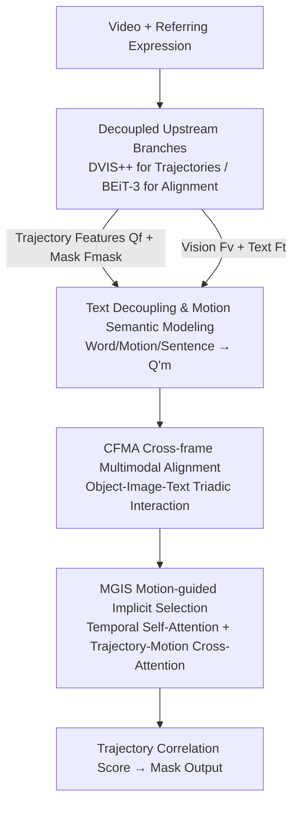

# DeRVOS: Decoupling Consistent Trajectory Generation and Multimodal Understanding for Referring Video Object Segmentation

**Conference**: CVPR 2026  
**Paper**: [CVF Open Access](https://openaccess.thecvf.com/content/CVPR2026/html/Cheng_DeRVOS_Decoupling_Consistent_Trajectory_Generation_and_Multimodal_Understanding_for_Referring_CVPR_2026_paper.html)  
**Code**: Not publicly available  
**Area**: Video Understanding  
**Keywords**: Referring Video Object Segmentation, Trajectory Consistency, Multimodal Understanding, DVIS++, BEiT-3  

## TL;DR
DeRVOS decouples Referring Video Object Segmentation (RVOS) into two upstream branches: "Consistent Trajectory Generation" and "Multimodal Understanding." Using a frozen DVIS++ and a pre-trained BEiT-3, the model directly produces stable instance trajectories and aligned vision-language features. A TAIS module then converges the task into "Referring Expression $\leftrightarrow$ Instance Trajectory" matching, outperforming LVLM-based methods by 4.7% on MeViS.

## Background & Motivation
**Background**: RVOS aims to segment a specific object across a video sequence based on a natural language expression. With the introduction of the MeViS dataset, which features occlusions, fast motion, mixed static-dynamic expressions, and long-range reasoning, the mainstream approach involves multi-stage serial pipelines based on queries—performing multimodal feature extraction and fusion, generating object representations, and finally predicting masks. Recent LVLM-based approaches have also leveraged large model capabilities for video understanding.

**Limitations of Prior Work**: This "end-to-end learning from scratch" multi-stage paradigm suffers from two main issues. First, **Trajectory Inconsistency**: object representations often lack explicit trajectory consistency modeling in the feature space, relying instead on implicit constraints from bipartite or similarity matching with ground truth. This leads to tracking failures and fragmented targets under occlusion or fast motion. Second, **Insufficient Multimodal Understanding**: most methods use independent vision/text encoders where cross-modal interaction is delayed to downstream fusion modules, making it difficult to establish deep consistency in the representation space, especially for expressions involving actions and relationships (e.g., "the dog chasing another").

**Key Challenge**: Compressing both trajectory consistency modeling and multimodal fusion into a single downstream pipeline trained from scratch leads to entanglement. The conflicting optimization targets and low data efficiency prevent either task from being learned effectively.

**Goal**: Delegate trajectory consistency and cross-modal alignment to well-performing pre-trained models at the upstream level. The objective is to isolate the remaining difficulty of RVOS—matching the expression to a specific instance trajectory—for independent modeling.

**Core Idea**: Utilize a frozen video instance segmentation model (DVIS++) to output temporally consistent object trajectories and a unified fusion encoder (BEiT-3) for image-level vision-language alignment. This reduces RVOS to "relationship modeling between referring expressions and instance trajectories," handled by a lightweight TAIS module for dynamic semantic selection at the trajectory level.

## Method

### Overall Architecture
DeRVOS decouples RVOS into three main components: a **Consistent Trajectory Generation Branch**, a **Multimodal Understanding Branch**, and the **TAIS (Trajectory Alignment and Implicit Selection) Module** that bridges them. The input consists of a video and a referring expression, and the output is the mask of the referred object in each frame.

The overall workflow is: High-resolution video is fed into a frozen DVIS++ to obtain temporally consistent object features $Q_f$ and mask features $F_{mask}$. A downsampled version of the same video is processed frame-by-frame along with the text by BEiT-3 to obtain aligned vision features $F_v$ and text features $F_t$. Since both branches are "ready-to-use," the downstream task focuses solely on understanding and selection. TAIS decouples the text into word-level, motion-level, and sentence-level features to encode a motion semantic query $Q'_m$. Then, CFMA performs cross-frame multimodal alignment, and MGIS executes motion-guided implicit trajectory selection to score each trajectory. The trajectory with the highest score provides the final mask.

### Key Designs

**1. Branch Decoupling: Shifting Consistency and Alignment to the Upstream**

To address the conflict of learning trajectory consistency and multimodal fusion simultaneously, DeRVOS employs two pre-trained specialists. For trajectories, it uses frozen **DVIS++** (including backbone, segmentator, tracker, and refiner). Given high-resolution video $V_{high}\in\mathbb{R}^{T\times3\times H\times W}$, it outputs mask features $F_{mask}$, temporally consistent object features $Q_f\in\mathbb{R}^{T\times Q\times C}$, and refined masks $P_{mask}$. For the multimodal side, the independent dual-stream encoders are replaced by a **Unified Fusion Encoder (BEiT-3)**. Video frames $I_{low}$ and text tokens are concatenated as $Z_{in}=\{v_1,\dots,v_{N_v},l_1,\dots,l_{N_l}\}$ and encoded together to produce $F_v$ and $F_t$ in a shared space. This shifts fusion capability from downstream learning to upstream pre-training.

**2. Text Decoupling and Motion Semantic Modeling: Extracting Actions and Relations**

MeViS expressions contain dense motion and relational cues. TAIS performs **Text Decoupling**: $F_w, F_m, F_s = \mathrm{Decoupler}(F_t)$, yielding word-level $F_w$, motion-level $F_m$ (verbs and adverbs), and sentence-level $F_s$. On the vision side, $F_{mask}$ is downsampled and fused with $F_v$ to generate fusion visual features $F_f$. 

Then, motion and sentence features are concatenated, and a set of learnable queries $Q_m$ interact with them via a Transformer-style SemDecoder to produce **Motion-aware Semantic Features**:

$$Q'_m = \mathrm{FFN}\big(\mathrm{MCA}(\mathrm{MSA}(Q_m),\, F_s \oplus F_m)\big)$$

This explicitly extracts "what action is being performed" for later use in MGIS to enhance matching trajectories.

**3. CFMA Cross-frame Multimodal Alignment: Triadic Interaction**

Since the two branches are pre-trained separately, their feature spaces are not naturally aligned. CFMA (Cross-Frame Multimodal Aligner) bridges this gap. It first performs **Bi-directional Multi-head Attention** between $F_f$ and $F_w$:

$$F'_f, F'_w = \mathrm{BiMHA}(F_f, F_w)$$

Then, the temporally consistent object features $Q_f$ sequentially perform cross-attention with the enhanced vision $F'_f$ and text $F'_w$. Finally, instance-level self-attention and FFN produce $Q'_f$:

$$Q'_f = \mathrm{FFN}\big(\mathrm{MSA}(\mathrm{MCA}(\mathrm{MCA}(Q_f, F'_f),\, F'_w))\big)$$

This **Triadic Interaction** ensures each trajectory feature incorporates both visual consistency and semantic alignment.

**4. MGIS Motion-Guided Implicit Selection: Selecting Trajectories via Motion Cues**

MGIS (Motion-Guided Implicit Selector) selects the trajectory matching the motion description across frames. By Transposing the temporal and query dimensions of $Q'_f$ to $Q_t\in\mathbb{R}^{N\times T\times C}$, **Temporal Self-Attention** models cross-frame dependencies to obtain $Q'_t$. **Trajectory-Motion Cross-Attention** then allows trajectory features to selectively attend to the motion semantics $Q'_m$:

$$Q_p = \mathrm{FFN}\big(\mathrm{MCA}(\mathrm{MSA}(Q_t),\, Q'_m)\big)$$

A linear projection maps $Q_p$ to a scalar score space, resulting in correlation scores $S_f\in\mathbb{R}^{T\times Q\times2}$. This "implicit selection" avoids explicit classification by using motion cues to allow the best-matching trajectory to emerge naturally.

### Loss & Training
The RVOS training phase uses a simple classification loss. Predicted trajectories and GT are matched one-to-one via the Hungarian algorithm: $L = L_{cls}$. During image-level pre-training on RIS tasks, only the DVIS++ refiner is fine-tuned, with a total loss $L = \lambda_{cls}L_{cls} + \lambda_{mask}L_{mask}$. Mask loss combines Dice loss and binary cross-entropy. Clips of length $T=8$ are used. DVIS++ takes $640\times640$ inputs, while the multimodal encoder takes $320\times320$.

## Key Experimental Results

### Main Results
DeRVOS achieves state-of-the-art performance among specialist methods. When pre-trained at the image level (†), it shows a significant advantage over LVLM methods, outperforming GLUS by 4.7% on MeViS val.

| Dataset | Metric | DeRVOS | Prev. SOTA | Gain |
| :--- | :--- | :--- | :--- | :--- |
| MeViS (val) | J&F | 51.8 | 49.3 (ReferDINO) | +2.5 |
| MeViS (valu) | J&F | 60.6 | 58.3 (DMVS) | +2.3 |
| MeViS (val)† | J&F | 56.0 | 51.3 (GLUS, LVLM) | +4.7 |
| MeViS (valu)† | J&F | 61.5 | 57.8 (VISA-7B, LVLM) | +3.7 |
| Ref-YouTube-VOS | J&F | 70.0 | 69.3 (ReferDINO) | +0.7 |

### Ablation Study
Evaluated on MeViS valu.

| Configuration | J&F | Description |
| :--- | :--- | :--- |
| CTG=M2F / MU=BEiT3-B | 55.5 | Image-level segmenter baseline |
| CTG=VITA / MU=BEiT3-B | 56.0 | Video instance segmentation (+0.5) |
| CTG=DVIS++ / MU=BEiT3-B | 57.4 | Advanced trajectory generator (+1.9) |
| CTG=DVIS++ / MU=BERT-B | 55.9 | Weak multimodal understanding |
| Text-Direct Integrator | 56.1 | Naive text-trajectory connection |
| TAIS (CFMA+MGIS) | 57.4 | Full proposed module (+1.3) |

### Key Findings
- **Branch scaling**: Improving either the trajectory generator (M2F to DVIS++) or the multimodal understanding (BERT to BEiT-3) consistently boosts performance, showing the decoupled architecture allows independent upgrades.
- **MGIS Importance**: Adding MGIS to CFMA increases J&F from 56.5 to 57.4, confirming that motion-guided selection is more effective than simple frame-level alignment.
- **Resolution Impact**: Increasing DVIS++ input resolution from 320 to 640 boosts J&F by 4.0 points with only a modest increase in training time (3.8h to 5.8h).
- **Motion-rich Pre-training**: DVIS++ pre-trained on OVIS (57.4 J&F) significantly outperforms versions trained on YouTube-VIS (53.8–55.4), as OVIS contains more complex motions relevant to MeViS.

## Highlights & Insights
- **Problem Reduction**: By freezing pre-trained experts, RVOS is reduced to a matching problem. This "standing on the shoulders of giants" approach is more efficient than training a joint network from scratch.
- **Motion-Level Focus**: Explicitly extracting verbs and adverbs to guide temporal selection addresses the core difficulty of motion-heavy datasets like MeViS.
- **Implicit Selection**: Treating the task as a relationship modeling problem between trajectories and expressions simplifies the engineering pipeline and improves semantic focus.

## Limitations & Future Work
- **Dependency on Experts**: Performance is bounded by the frozen DVIS++ and BEiT-3. If the object is not detected by DVIS++, the error cannot be corrected downstream.
- **Computational Overhead**: Running a high-resolution VIS model alongside a transformer-based multimodal encoder may be computationally intensive for real-time applications.
- **Future Directions**: Exploring lightweight, fine-tunable trajectory generators or introducing error-recovery mechanisms if an object is missed by the initial tracker.

## Related Work & Insights
- **vs. ReferDINO (Specialists)**: While specialists learn consistency implicitly via matching, DeRVOS decouples and freezes consistency in the upstream, gaining 2.5% on MeViS val.
- **vs. GSVA/GLUS (LVLMs)**: DeRVOS achieves higher accuracy with fewer parameters by using specialized expert models rather than general-purpose large models.
- **vs. Integrated VIS Methods**: Unlike standard integrations, DeRVOS uses a progressive TAIS bridge with triadic interaction and motion-guided selection, proving superior to naive text-to-query connections.

## Rating
- **Novelty**: ⭐⭐⭐⭐ Solid combination of decoupling, expert freezing, and TAIS bridge.
- **Experimental Thoroughness**: ⭐⭐⭐⭐⭐ Comprehensive coverage across major RVOS and RIS benchmarks with robust ablations.
- **Writing Quality**: ⭐⭐⭐⭐ Logical flow from motivation to the decoupling-and-bridging strategy.
- **Value**: ⭐⭐⭐⭐ Significantly outperforms LVLMs on MeViS and provides a practical paradigm for multi-expert fusion.

<!-- RELATED:START -->

## Related Papers

- [\[CVPR 2026\] InterRVOS: Interaction-Aware Referring Video Object Segmentation](interrvos_interaction-aware_referring_video_object_segmentation.md)
- [\[CVPR 2026\] Long-RVOS: A Comprehensive Benchmark for Long-term Referring Video Object Segmentation](long-rvos_a_comprehensive_benchmark_for_long-term_referring_video_object_segment.md)
- [\[CVPR 2026\] Weakly-Supervised Referring Video Object Segmentation through Text Supervision](wsrvos_weakly_supervised_rvos.md)
- [\[CVPR 2026\] Towards Streaming Referring Video Segmentation via Large Language Model](towards_streaming_referring_video_segmentation_via_large_language_model.md)
- [\[CVPR 2026\] Learning Cross-View Object Correspondence via Cycle-Consistent Mask Prediction](learning_cross-view_object_correspondence_via_cycle-consistent_mask_prediction.md)

<!-- RELATED:END -->
