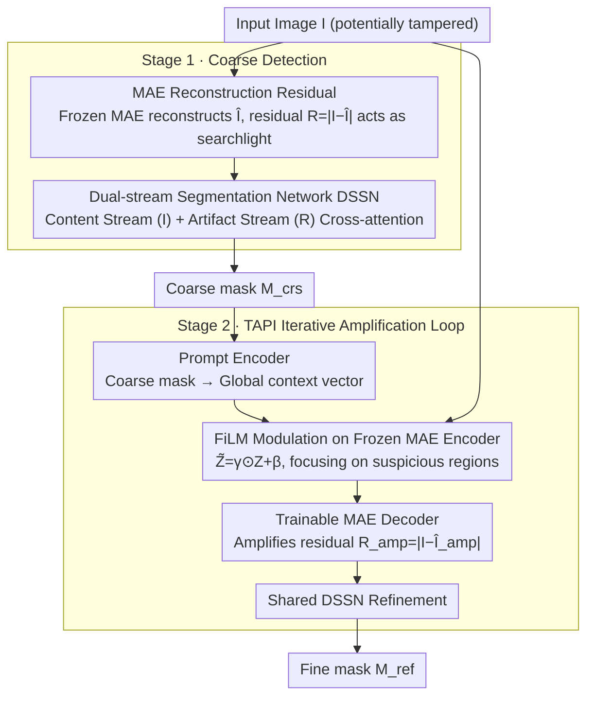

# Detecting AI-Generated Forgeries via Iterative Manifold Deviation Amplification

**Conference**: CVPR 2026  
**arXiv**: [2602.18842](https://arxiv.org/abs/2602.18842)  
**Code**: To be confirmed  
**Area**: Image Segmentation / AI Forgery Detection  
**Keywords**: AI-generated image detection, Manifold deviation, MAE reconstruction, Iterative amplification, Image forgery localization

## TL;DR
The authors propose IFA-Net, which detects AI forgeries from the perspective of "modeling what is real" rather than "learning what is fake". By utilizing a frozen MAE to reconstruct inputs, the method produces residuals that expose regions deviating from the natural image manifold. Through a two-stage closed loop—coarse detection → task-adaptive prior injection → residual amplification → refinement—manifold deviations are iteratively amplified. The model achieves SOTA performance on both diffusion inpainting and traditional tampering detection.

## Background & Motivation
With the explosion of AI image generation technologies like Stable Diffusion and DALL-E, the detection and localization of AI-generated content (AIGC) forgeries have become critical. Most existing methods follow the "learning what is fake" paradigm by extracting forgery-specific artifacts (e.g., spectral anomalies, GAN fingerprints). However, these methods face fundamental issues:

**Limitations of Prior Work**: Detectors trained on specific generators struggle to generalize to unseen generators.

**Adversarial Vulnerability**: Forgers can bypass artifact-based detection by fine-tuning the generation process.

**Data Dependency**: Large-scale annotated "real-fake" paired data is required.

**Key Insight**: Instead of learning "what a fake image looks like," one should precisely model "what a real image should look like." Any region deviating from the natural image manifold is deemed suspicious. This approach possesses inherent cross-generator generalization capabilities because it models the statistical regularities of natural images rather than the artifacts of specific forgery methods.

Pre-trained MAE (Masked Autoencoder) learns powerful natural image manifold priors from massive amounts of real data. When an MAE attempts to reconstruct a partially forged image, real regions are reconstructed well (as they lie on the manifold), while forged regions produce larger reconstruction residuals (as they deviate from the manifold). **The residual map naturally serves as a "searchlight" for forged regions.**

## Method

### Overall Architecture
IFA-Net adopts a novel perspective for AI forgery detection: instead of learning "fake patterns," it uses an MAE pre-trained on massive real data to model "real patterns." Regions deviating from the natural image manifold are identified as suspicious. The framework is a two-stage closed loop: Stage 1 reconstructs the input using a frozen MAE, exposing suspicious areas via a residual map which is processed by a Dual-stream Segmentation Network (DSSN) to produce a coarse mask $M_{\text{crs}}$. Stage 2 injects the coarse mask as a prior into the MAE to amplify the reconstruction residuals of those regions, followed by the same DSSN to refine the final mask $M_{\text{ref}}$. This "detection → focus → amplification → refinement" loop ensures that residuals in suspicious areas are increasingly emphasized.

### Key Designs

**1. MAE Reconstruction Residuals: Turning "Manifold Deviation" into a Searchlight**

The generalization challenge in forgery detection stems from artifact-based methods recognizing only specific generator fingerprints. IFA-Net utilizes the natural image manifold prior of a frozen MAE. Given a potentially tampered image $I$, the MAE reconstructs $\hat{I}$. Real regions lie on the manifold and are accurately reconstructed, while forged regions deviate from the manifold, leading to large reconstruction errors. Thus, the residual map $R = |I - \hat{I}|$ naturally highlights forgeries. Since it models natural image statistics rather than specific traces, it generalizes across generators and does not rely on "real-fake" paired labels.

**2. Dual-stream Segmentation Network (DSSN): Content and Artifact Guidance**

Relying solely on residuals can be misleading due to texture noise, while the original image lack clear forgery cues. DSSN, based on SegFormer, employs a dual-stream design: the Content Stream encodes the semantic content of the original image $I$ ("where to look"), and the Artifact Stream encodes forgery cues within the residual map $R$ (or amplified residual $R_{\text{amp}}$ in Stage 2) ("what anomalies are seen"). The two streams exchange information via cross-attention after each SegFormer stage. Sharing DSSN weights across both stages reduces parameters and allows Stage 1 gradients to assist the Shared DSSN learning for Stage 2.

**3. TAPI Iterative Amplification Loop: Pushing and Refining Weak Residuals**

Higher generation quality results in weaker residuals in Stage 1, necessitating active amplification. TAPI (Task-Adaptive Prior Injection) uses a Prompt Encoder to compress the coarse mask $M_{\text{crs}}$ into a global context vector via convolutional downsampling and linear projection. This vector performs FiLM modulation $\tilde{Z} = \gamma \odot Z + \beta$ on the intermediate features $Z$ of the frozen MAE encoder, effectively instructing the MAE to "focus on these regions." Coupled with a trainable MAE decoder in Stage 2, reconstruction errors in suspicious areas are further pushed. The amplified residual $R_{\text{amp}} = |I - \hat{I}_{\text{amp}}|$ is fed back into the shared DSSN to obtain the refined mask $M_{\text{ref}}$. The MAE encoder remains frozen to preserve the manifold prior, using only FiLM for task-specific injection, ensuring parameter efficiency.

### Loss & Training
The total loss is a weighted sum of both stages, with the refined mask weighted at 1.0 and the coarse mask at 0.5 to prioritize final output optimization:

$$\mathcal{L}_{\text{total}} = \mathcal{L}_{\text{ref}} + 0.5 \cdot \mathcal{L}_{\text{crs}}$$

Each stage uses a combination of BCE for pixel-level classification and Dice loss to mitigate the class imbalance where forged regions are much smaller than real ones:

$$\mathcal{L}_{\text{stage}} = \mathcal{L}_{\text{BCE}} + \mathcal{L}_{\text{Dice}}$$

## Key Experimental Results

### Main Results — Diffusion Inpainting Detection
Average results across four diffusion inpainting benchmarks:

| Method | IoU (%) | F1 (%) |
|------|---------|--------|
| MVSS-Net | 41.2 | 52.7 |
| ObjectFormer | 43.8 | 55.1 |
| SAFIRE | 47.3 | 59.6 |
| UnionFormer | 49.1 | 61.3 |
| **IFA-Net (Ours)** | **55.6 (+6.5)** | **69.4 (+8.1)** |

**Key Findings**:
- IFA-Net outperforms the best baseline by an average of +6.5% in IoU and +8.1% in F1.
- The Gain is most significant on Stable Diffusion v2 inpainting, suggesting that the manifold deviation approach is more effective for high-quality generation.

### Key Experimental Results — Traditional Tampering Detection
On traditional copy-move/splicing datasets such as CASIA, Columbia, and NIST:

| Method | CASIA F1 | Columbia F1 | NIST F1 |
|------|----------|-------------|---------|
| ManTra-Net | 48.2 | 72.5 | 35.8 |
| SPAN | 52.1 | 76.3 | 39.2 |
| **IFA-Net** | **56.8** | **79.1** | **43.7** |

**Key Findings**: **IFA-Net outperforms specialized tampering detection methods via zero-shot generalization** without training on traditional tampering data, verifying the generalization advantage of the "modeling real instead of learning fake" paradigm.

### Ablation Study

| Configuration | MAE Residual | TAPI Amp | Dual-stream DSSN | IoU (%) |
|------|---------|----------|----------|---------|
| Content Stream only | ✗ | ✗ | ✗ | 38.5 |
| + MAE Residual | ✓ | ✗ | ✗ | 46.2 |
| + Dual-stream Fusion | ✓ | ✗ | ✓ | 50.8 |
| **+ TAPI (Full)** | ✓ | ✓ | ✓ | **55.6** |

- MAE residuals introduce a +7.7% IoU Gain, confirming the validity of the manifold deviation signal.
- Dual-stream DSSN adds another +4.6%, showing complementarity between content and artifact information.
- TAPI iterative amplification provides an additional +4.8%, proving the residual amplification mechanism is crucial.

## Highlights & Insights
- **Paradigm Shift**: Moves from "learning fake" to "modeling real," leveraging pre-trained MAE manifold priors for inherent cross-generator generalization.
- **Closed-loop Amplification Design**: Coarse mask → MAE injection → amplified residual → fine mask, creating an elegant "detect → focus → amplify → refine" loop.
- **Frozen + Modulation**: The MAE encoder remains frozen to preserve manifold priors, while FiLM modulation injects task information efficiently.
- **Zero-shot Generalization**: Trained on diffusion inpainting and transferred zero-shot to traditional copy-move/splicing, indicating manifold deviation is a unified forgery metric.

## Limitations & Future Work
- MAE reconstruction capability is limited; residuals for extremely small regions (<32×32 pixels) might not be significant.
- Two-stage serial inference increases latency; real-time video forgery detection would require efficiency optimization.
- TAPI iterates only once (Stage 1 → Stage 2); whether multiple iterations yield further gains remains unexplored.
- Detection capability for full-image AI generation (rather than local inpainting) is not fully verified.
- Shared DSSN weights might face optimization conflicts between the two stages.

## Related Work & Insights
- Difference from ObjectFormer (which learns object-level artifacts): IFA-Net models manifold deviations instead of specific artifacts.
- The concept of MAE reconstruction residuals shares theoretical similarities with anomaly detection (e.g., PatchCore)—both follow the "learn normal → find abnormal" logic.
- TAPI's FiLM modulation is likely inspired by prompt encoders in models like SAM (Segment Anything Model).
- Insight: The manifold deviation amplification approach could be extended to deepfake video detection (temporal manifold deviation) and AI-generated text detection.

## Rating
- Novelty: ⭐⭐⭐⭐⭐ The "modeling real" paradigm shift and closed-loop residual amplification are highly original in forgery detection.
- Experimental Thoroughness: ⭐⭐⭐⭐ Extensive testing on diffusion inpainting and traditional tampering with complete ablations, though deepfake face scenarios are missing.
- Writing Quality: ⭐⭐⭐⭐ Excellent motivation and clear presentation of the "manifold deviation" concept.
- Value: ⭐⭐⭐⭐⭐ Cross-generator generalization makes the method highly practical for deployment; the paradigm is highly extensible.

<!-- RELATED:START -->

## Related Papers

- [\[ICCV 2025\] Rethinking Detecting Salient and Camouflaged Objects in Unconstrained Scenes](../../ICCV2025/segmentation/rethinking_detecting_salient_and_camouflaged_objects_in_unconstrained_scenes.md)
- [\[CVPR 2026\] Masked Representation Modeling for Domain-Adaptive Segmentation](mrm_masked_representation_modeling_domain_adaptive.md)
- [\[CVPR 2026\] Heuristic Self-Paced Learning for Domain Adaptive Semantic Segmentation under Adverse Conditions](heuristic_self-paced_learning_for_domain_adaptive_semantic_segmentation_under_ad.md)
- [\[CVPR 2026\] Joint Spectral Image Reconstruction and Semantic Segmentation with Cooperative Unfolding](joint_spectral_image_reconstruction_and_semantic_segmentation_with_cooperative_u.md)
- [\[CVPR 2026\] Mixture of Prototypes for Test-time Adaptive Segmentation](mixture_of_prototypes_for_test-time_adaptive_segmentation.md)

<!-- RELATED:END -->
