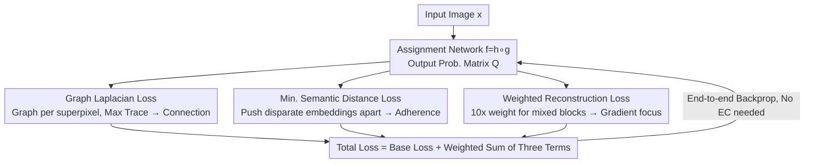

# Differentiable Laplacian Matrix Guided Superpixel Segmentation

**Conference**: CVPR 2026  
**Paper**: [CVF Open Access](https://openaccess.thecvf.com/content/CVPR2026/html/Juybari_Differentiable_Laplacian_Matrix_Guided_Superpixel_Segmentation_CVPR_2026_paper.html)  
**Code**: https://github.com/jeremyJJB/Differentiable-Laplacian-Matrix-Guided-Superpixel-Segmentation  
**Area**: Semantic Segmentation  
**Keywords**: Superpixel Segmentation, Graph Laplacian, Connectivity, Differentiable Post-processing, End-to-end Learning  

## TL;DR
Addressing the issue where deep superpixel models rely on non-differentiable "Enforced Connectivity (EC)" post-processing to eliminate fragments, this paper proposes a fully differentiable, model-agnostic Graph Laplacian loss (along with a minimal semantic distance loss and weighted reconstruction loss). It pushes superpixels toward connectivity during training, significantly reducing fragments with almost no loss in ASA, moving closer to "post-processing-free, true end-to-end" learning.

## Background & Motivation
**Background**: Superpixels group image pixels into perceptually consistent small regions, serving as a compression method for downstream segmentation/detection. Traditional methods (e.g., SLIC) are inherently connected—each label corresponds to one connected component, and isolated pixels are avoided by design. Since 2018, deep methods (SCN, AINet, CDS, SSM, etc.) have made superpixel generation differentiable and trainable end-to-end, greatly improving boundary adherence and segmentation accuracy.

**Limitations of Prior Work**: Although deep models offer good boundaries, they often produce irregular edges, split the same label into multiple disconnected fragments (excess components), and generate stray pixels. In practice, a non-differentiable post-processing step borrowed from SLIC—Enforced Connectivity (EC)—must be applied after inference to reassign these fragments and force connectivity.

**Key Challenge**: EC is a non-differentiable operation. Its inclusion in the pipeline cuts off end-to-end gradients, preventing joint optimization of the model and downstream tasks. Consequently, most applications relying on superpixels still use traditional algorithms. In other words, EC is a "mask" hiding a real issue: **deep models have not yet learned to produce spatially connected superpixels directly**. Furthermore, literature long assumed a hard trade-off between ASA (accuracy) and compactness (CO).

**Goal**: Transform connectivity from an "after-the-fact fix" into an "internalized training objective," enabling models to learn to produce connected superpixels and thus remove non-differentiable post-processing.

**Key Insight**: The authors leverage a classic fact from graph theory—the multiplicity of the zero eigenvalue of a Laplacian matrix equals the number of connected components in the graph. By viewing each superpixel as a graph where pixels are nodes and edge weights are the product of the probabilities that two pixels belong to the same superpixel, connectivity can be measured via the Laplacian spectrum, which is differentiable.

**Core Idea**: Use a differentiable Graph Laplacian loss (maximizing the trace of the Laplacian) as a proxy objective to "reduce the number of connected components." This implicitly forces superpixel connectivity during training. This loss is architecture-agnostic and can be integrated into any existing superpixel network.

## Method

### Overall Architecture
The method is built upon a general superpixel assignment network $f_\theta = h \circ g$: $g$ is a pixel embedding network, and $h$ is a convolutional layer with softmax, outputting an assignment probability matrix $Q = f_\theta(x) \in [0,1]^{N\times M}$, where $N = H\times W$ is the number of pixels and $M$ is the number of superpixels. The element $q_{i,s}$ represents the probability that pixel $i$ is assigned to superpixel $s$. Following prior work, the image is divided into a regular grid with $16\times16$ strides; for computational efficiency, each pixel can only be assigned to 9 candidate superpixels in its $3\times3$ neighborhood, and $Q$ is row-normalized ($\sum_{s\in S_i} q_{i,s}=1$).

This work does not change the architecture but **adds three new loss terms** to the base model's loss (SCN/AINet/CDS/SSM): Graph Laplacian loss $L_{LAP}$ (for connectivity), Minimal Semantic Distance loss $L_{MSD}$ (for semantic boundaries), and replaces the standard reconstruction loss with a Weighted Reconstruction loss $L_{WR}$ (focusing gradients on boundary blocks). These three collaborate to balance connectivity and accuracy. The final loss is:
$$L(\theta;x,y)=L_{base}+\lambda_{LAP}L_{LAP}+\lambda_{MSD}L_{MSD}+\lambda_{WR}L_{WR}$$
where $\lambda_{MSD}=10^{-3}$, $\lambda_{LAP}=360$, and $\lambda_{WR}=1$.

### Key Designs

**1. Graph Laplacian Loss: Turning connectivity into a differentiable objective via spectral properties**

This is the primary contribution addressing deep superpixel fragmentation. For each superpixel $s$, a graph $G_s$ is constructed using the set of pixels $P_s$ that could potentially be assigned to it. Each pixel is connected to its 8 neighbors with edge weights $q_{i,s}q_{j,s}$—the more certain both pixels are to belong to $s$, the "thicker" the edge. The degree of pixel $i$ is $d_{i,s}=\sum_{j\in N_i} q_{i,s}q_{j,s}$, and the Laplacian matrix is $L_s = D_s - A_s$.

The key graph theory fact is: the multiplicity of the zero eigenvalue of $L_s$ equals the number of connected components in $G_s$. Minimizing this multiplicity is equivalent to forcing connectivity. Since direct optimization is non-differentiable, the authors use a proxy: **maximizing the trace of the Laplacian** $\mathrm{tr}(L_s)=\sum_{i\in P_s} d_{i,s}$ (the sum of all degrees). A larger trace implies stronger overall edge weights and tighter connections. The normalized loss is:
$$L_{LAP}(\theta;x)=1-\frac{1}{M}\sum_{s=1}^{M}\frac{\mathrm{tr}(L_s)}{8N_s}$$
where $8N_s$ is the maximum possible trace when all weights are 1. Minimizing $L_{LAP}$ maximizes the normalized trace, implicitly reducing connected components. This process is fully differentiable and can be applied to any superpixel network, unlike SIN, which relies on specific interpolation layers.

**2. Minimal Semantic Distance Loss: Separating heterogeneous pixels in embedding space**

Connectivity alone is insufficient; superpixels should not cross semantic boundaries. Instead of explicit boundary detection, this work maximizes the distance between **pixels of different classes** in the embedding space. Ideally, one would maximize $\min\|z_i-z_j\|_2$ where $y_i\ne y_j$. To handle computational costs, 100 pixels per class are randomly sampled to form set $V$. The loss is defined as a squared hinge loss on the minimum distance $\rho$ in $V$:
$$L_{MSD}(\theta;x,y)=\big(\max(0,\,m-\rho)\big)^2,\quad m=1.5$$
The margin $m$ focuses optimization on the "hardest" cases—pixels from different classes with similar embeddings—pushing them apart to ensure superpixels adhere to semantic structures.

**3. Weighted Reconstruction Loss: Redirecting gradients from homogeneous blocks to boundary blocks**

Standard reconstruction loss (cross-entropy $E$ between ground truth $y_i$ and reconstructed $y_i'$) treats all pixels equally. However, most blocks in a regular grid (about 70% in BSDS500) are homogeneous, while multi-class blocks on boundaries are critical. The authors assign weights based on the block content:
$$w_i=\begin{cases}0.1 & \text{single class in block}\\ 1.0 & \ge 2 \text{ classes in block}\end{cases}$$
To prevent the total loss magnitude from depending on the proportion of mixed blocks, weights are normalized so their sum equals $N$:
$$W_i=\frac{N\cdot w_i}{\sum_{j=1}^N w_j},\qquad L_{WR}(\theta;x,y)=\sum_{i=1}^N W_i\,E(y_i,y_i')$$
This ensures the average weight is 1 while focusing gradient signals on difficult boundary regions.

### Loss & Training
Each baseline (SCN/AINet/CDS/SSM) follows its original training recipe, but with the reconstruction loss replaced by $L_{WR}$ and the addition of $L_{LAP}$ and $L_{MSD}$. $\lambda_{LAP}=360$ was determined via scanning. For multi-stage models like AINet/SSM, the Laplacian loss is only applied during the second stage.

## Key Experimental Results

### Main Results
Four baselines and their LAP variants were trained on BSDS500. Metrics used include ASA, CO, B (boundary recall), and two new metrics for "pre-EC" fragmentation: **excess component (XC)** and **stray pixel (Stray)**. Normalized AUC is used for cross-method comparison across the range of 384–1200 superpixels.

Summary of BSDS500 AUC results (selected from Table 2):

| EC | Model | ASA↑ | CO↑ | B↑ | XC↓ | Stray↓ |
|----|------|------|------|------|------|--------|
| Yes | CDS | 0.9739 | 0.3670 | 0.1082 | 0 | 0 |
| Yes | CDS-LAP | 0.9741 | **0.4344** | **0.1192** | 0 | 0 |
| No | CDS | 0.9741 | 0.3501 | 0.1084 | 218.7 | 901.6 |
| No | CDS-LAP | 0.9746 | 0.4339 | 0.1215 | **103.8** | **507.5** |
| No | AINET | 0.9728 | 0.3330 | 0.1071 | 339.2 | 1439.8 |
| No | AINET-LAP | 0.9726 | 0.4687 | 0.1189 | **129.5** | **562.9** |

With LAP, fragmentation (XC/Stray) is roughly halved or more (e.g., AINet XC 339→129) without EC. CO and B improve significantly while ASA remains stable. This refutes the assumption of a hard trade-off between ASA and compactness.

### Ablation Study
Training CDS with combinations of terms (from Table 3, No EC row):

| Config | ASA↑ | CO↑ | B↑ | XC↓ | Note |
|------|------|------|------|------|------|
| Baseline | 0.974 | 0.350 | 0.108 | 218.7 | Most fragments |
| LAP only | 0.973 | 0.468 | 0.118 | **61.6** | Primary driver for connectivity |
| LAP+MSD+WR| 0.975 | 0.434 | 0.122 | 103.8 | Full model |

### Key Findings
- **LAP is the primary driver for connectivity**: Adding LAP alone reduces XC from 218.7 to 61.6. MSD and WR provide complementary gains in boundary adherence.
- **Negligible accuracy drop**: LAP variants show only minor fluctuations in ASA while gaining significantly in CO and boundary recall.
- **Weight-controlled trade-off**: Larger $\lambda_{LAP}$ leads to fewer fragments (at 5760, XC≈0 for nearly half the images) with a slight decrease in ASA.
- **Minimal post-EC changes**: Models with LAP show little change in labels after applying EC, indicating outputs are already near-connected.

## Highlights & Insights
- **Turning graph theory into a differentiable loss**: Converting the "number of connected components" problem into a Laplacian trace maximization is an elegant differentiable proxy that can be transferred to other discrete topology constraint tasks.
- **Model-agnostic and plug-and-play**: The loss depends only on $Q$, allowing it to benefit various architectures (unlike SIN).
- **Weight normalization technique**: The $\sum W_i=N$ strategy decouples local boundary focus from global learning rates, a valuable detail for any sample weighting scheme.
- **Pre-EC fragmentation metrics**: XC and Stray metrics provide a way to quantify fragmentation before post-processing, which was previously evaluated qualitatively.

## Limitations & Future Work
- The authors admit this is a "step toward end-to-end" rather than a total elimination of EC; fragments are minimized but not guaranteed to be zero.
- The trace of the Laplacian is a proxy; it reflects total edge strength but does not strictly guarantee a single component (e.g., weak bridges).
- Integration into multi-stage models (AINet/SSM) is not "seamless" as it is typically applied only in later stages.
- Future work: Integrating this into joint visual pipelines (e.g., downstream segmentation) to leverage full end-to-end differentiability.

## Related Work & Insights
- **vs EC**: EC cuts gradients after inference. This work moves connectivity into the loss, allowing joint optimization.
- **vs SIN**: SIN uses a specialized architecture to force connectivity but loses accuracy and boundary recall. This work is a model-agnostic loss that preserves accuracy.
- **vs Traditional Laplacian Regularization**: Previous uses focused on feature smoothing; this work uses it to constrain the explicit topological property (number of components) of discrete spatial assignments.

## Rating
- Novelty: ⭐⭐⭐⭐⭐ Elegant use of spectral properties for a differentiable connectivity constraint.
- Experimental Thoroughness: ⭐⭐⭐⭐ Extensive across baselines, though training was primarily on BSDS500.
- Writing Quality: ⭐⭐⭐⭐⭐ Clear progression from motivation to mechanism and metrics.
- Value: ⭐⭐⭐⭐ Practical significance for moving superpixels toward true end-to-end joint optimization.

<!-- RELATED:START -->

## Related Papers

- [\[CVPR 2026\] LEMMA: Laplacian Pyramids for Efficient Marine Semantic Segmentation](lemma_laplacian_pyramids_for_efficient_marine_semantic_segmentation.md)
- [\[CVPR 2026\] FlowDIS: Language-Guided Dichotomous Image Segmentation with Flow Matching](flowdis_language-guided_dichotomous_image_segmentation_with_flow_matching.md)
- [\[CVPR 2026\] Spatial Matters: Position-Guided 3D Referring Expression Segmentation](spatial_matters_position-guided_3d_referring_expression_segmentation.md)
- [\[CVPR 2026\] Metric-Guided Feature Fusion of Visual Foundation Models for Segmentation Tasks](metric-guided_feature_fusion_of_visual_foundation_models_for_segmentation_tasks.md)
- [\[CVPR 2026\] SPOT: Spatiotemporal Prompt Optimization for Motion-Stabilized MLLM-Guided Video Segmentation](spot_spatiotemporal_prompt_optimization_for_motion-stabilized_mllm-guided_video_.md)

<!-- RELATED:END -->
