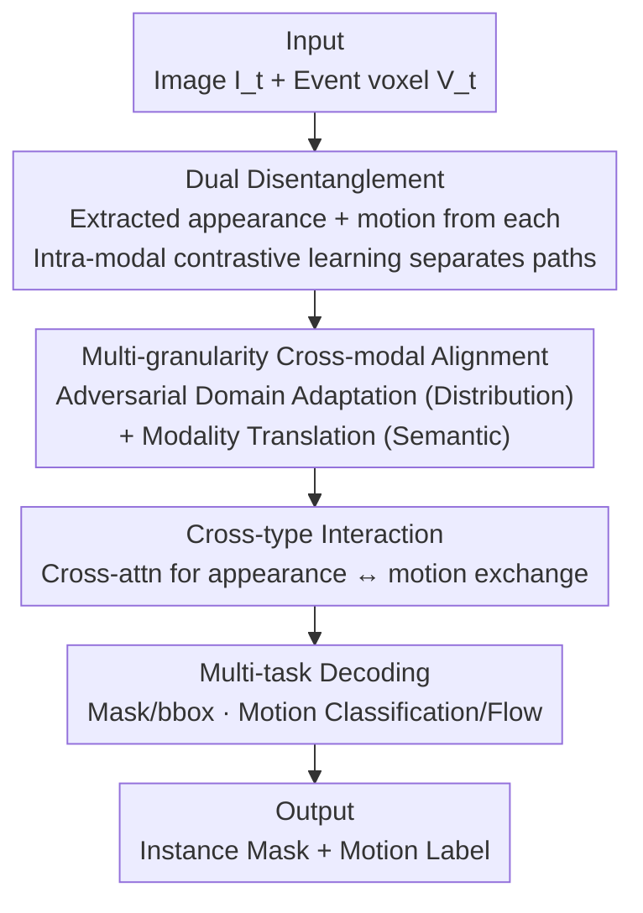

# DIMOS: Disentangling Instance-level Moving Object Segmentation

**Conference**: CVPR 2026  
**Paper**: [CVF Open Access](https://openaccess.thecvf.com/content/CVPR2026/html/Huang_DIMOS_Disentangling_Instance-level_Moving_Object_Segmentation_CVPR_2026_paper.html)  
**Code**: https://github.com/Neuromorphic-Electronics-Photonics-Lab/DIMOS-Moving-Instance-Segmentation-CVPR2026  
**Area**: Semantic Segmentation  
**Keywords**: Moving Instance Segmentation, Event Camera, Multi-modal Fusion, Feature Disentanglement, Cross-modal Alignment

## TL;DR
Addressing the challenges of "entangled appearance and motion information in event cameras and sparse features for small objects," DIMOS employs dual disentangled encoders to **extract dual branches of appearance and motion features from both image and event modalities**. By utilizing adversarial domain adaptation and modality translation for distribution-level and semantic-level alignment before fusion, DIMOS achieves State-of-the-Art (SOTA) performance on three small-object moving instance segmentation benchmarks: MouseSIS, SEVD-Fixed, and EVIMO.

## Background & Motivation
**Background**: Moving Instance Segmentation (MIS) requires simultaneous execution of three tasks: category classification, instance individualization, and determining whether each instance is in motion. This is significantly more difficult than standard semantic segmentation. Frame-based methods often fail under low light, backlighting, or high-speed motion. Event cameras, with microsecond temporal resolution and high dynamic range, are highly sensitive to motion, making the "appearance from frames, motion from events" multi-modal fusion the mainstream paradigm.

**Limitations of Prior Work**: This paradigm degrades severely for **small objects**. Event cameras have large pixel pitches and low spatial resolution, and event streams are sparse and asynchronous. When small objects occupy only a few pixels, both appearance and motion information are thinned, leading to poor segmentation quality due to insufficient feature density. A more subtle issue is that existing methods assume a hard "image = appearance, event = motion" split. However, event cameras are influenced by both motion and material/shape (reflections), meaning **appearance and motion are highly entangled within events**. The authors calculated cosine similarities of checkpoints during iterations on MouseSIS, finding that the similarity between the two types of features extracted from the event modality was significantly higher than that from the image modality (Figure 1b), proving the existence of entanglement.

**Key Challenge**: First, insufficient information density (especially for small objects) in single modalities; second, the entanglement of appearance and motion in the event modality causes "misalignment" during cross-modal fusion. Combined, small object segmentation becomes an extremely difficult task.

**Goal**: ① Increase feature density—no longer making each modality responsible for only one cue, but **extracting both appearance and motion from both images and events**; ② cleanly disentangle the entangled features, especially in events; ③ align the disentangled features of the same semantics before cross-modal fusion.

**Core Idea**: Replace "inter-modal hard splitting + simple concatenation fusion" with "**intra-modal disentangle + multi-granularity cross-modal alignment**." Each modality is treated as a source containing both appearance and motion cues, which are disentangled, then aligned, and finally fused.

## Method

### Overall Architecture
DIMOS takes an image frame $I_t$ and an event stream $E_{[t,t+\Delta t]}$ within the same interval. It predicts a segmentation mask $\hat{m}_k$ and a binary motion label $\hat{y}_k\in\{0,1\}$ for each instance. The event stream is first discretized into $B$ temporal bins and accumulated into a voxel representation $V_t$ before being fed into the network. The pipeline consists of four parts: a **dual disentanglement mechanism** extracts two paths ("appearance" and "motion") from both image and event modalities, resulting in 4 feature vectors; **multi-granularity cross-modal alignment and fusion** aligns features of the same semantics across modalities at distribution and semantic levels before fusing them into appearance features $\mathbf{F}_{appr}$ and motion features $\mathbf{F}_{mot}$; **cross-type interaction** uses cross-attention to let the appearance and motion paths reference each other; finally, **task-specific decoders** are split into appearance-related (mask, bbox) and motion-related (motion classification, optical flow) heads for prediction.

During inference, mask fusion follows EvInsMOS: mask embeddings are upsampled to full resolution, and a confidence threshold $\theta=0.1$ is applied to motion scores; only masks exceeding the threshold are kept as moving instances. During training, Hungarian matching creates a one-to-one correspondence between predicted masks and ground truth instances without thresholding.

### Key Designs

**1. Dual Disentanglement Mechanism: Extracting appearance and motion from each modality and pulling them apart via intra-modal contrastive learning**

To address the issue where the "image = appearance, event = motion" split leads to sparse features for small objects, DIMOS assigns a dual-branch encoder with independent parameters to **each modality**. Image yields $\mathbf{F}^{im}_{appr}, \mathbf{F}^{im}_{mot}$ and events yield $\mathbf{F}^{ev}_{appr}, \mathbf{F}^{ev}_{mot}$. These four paths are complementary, mitigating single-modality sparsity. To ensure disentanglement, **intra-modal contrastive learning** is applied. Note that it focuses on "intra-modality, cross-type" separation (rather than common cross-modal discrimination). Positive samples are features of the **same type + adjacent frames**, while negative samples are **different types or non-adjacent frames**, using InfoNCE:

$$\mathcal{L}_{con}=-\log\frac{\exp(F\cdot F^+/\tau)}{\exp(F\cdot F^+/\tau)+\sum_{F^-}\exp(F\cdot F^-/\tau)}$$

Where $\cdot$ denotes the dot product of $\ell_2$-normalized features and $\tau$ is temperature. This forces the network to emphasize the semantic difference between "appearance and motion" rather than modal differences, preventing the branches from learning redundant or mixed representations. In ablation studies, this mechanism pushed mIoUins from 63.46% to 68.11%, making it the single largest contributor.

**2. Multi-granularity Cross-modal Alignment: Distribution-level adversarial domain adaptation + semantic-level modality translation**

After disentanglement, each modality has appearance and motion paths, but image and event features from different sensors have gaps in distribution and semantics. Simple concatenation is insufficient. DIMOS performs alignment at two granularities before fusion. At the **distribution level**, the two modalities are treated as two "domains" of the same scene. Adversarial domain adaptation learns domain-invariant representations: discriminators $D_a, D_m$ judge which modality a feature comes from, while encoders use a Gradient Reversal Layer (GRL) to minimize this gap, following the min-max objective:

$$\min_G\max_D\ \mathbb{E}_{x\sim p_{ref}}[\log D(x)]+\mathbb{E}_{z\sim p_{src}}[\log(1-D(G(z)))]$$

An **asymmetric reference domain** strategy is used: the appearance branch uses images as the reference domain ($x=\mathbf{F}^{im}_{appr}$, aligning $G(z)=\mathbf{F}^{ev}_{appr}$), while the motion branch uses events as the reference domain ($x=\mathbf{F}^{ev}_{mot}$, aligning $\mathbf{F}^{im}_{mot}$). This is because appearance cues are clearer in images, and motion cues are cleaner in events, letting the "more reliable modality" serve as the anchor.

At the **semantic level**, distribution alignment alone cannot guarantee semantic consistency. Therefore, lightweight convolutional "modality translation" modules $T_{a1},T_{a2},T_{m1},T_{m2}$ perform **bidirectional reconstruction** of same-semantic features between image/event spaces, constrained by L2 loss:

$$\mathcal{L}_{trans}=\|T_{a1}(\mathbf{F}^{im}_{appr})-\mathbf{F}^{ev}_{appr}\|_2^2+\|T_{a2}(\mathbf{F}^{ev}_{appr})-\mathbf{F}^{im}_{appr}\|_2^2+\|T_{m1}(\mathbf{F}^{im}_{mot})-\mathbf{F}^{ev}_{mot}\|_2^2+\|T_{m2}(\mathbf{F}^{ev}_{mot})-\mathbf{F}^{im}_{mot}\|_2^2$$

This ensures that features of the same semantic type can be translated across modalities, stabilizing fusion. Notably, **these two alignment processes are entirely unsupervised and active only during training**, adding zero overhead to inference.

**3. Cross-type Interaction + Multi-task Supervision: Joint reasoning of appearance/motion with distinct task heads**

After aligning and fusing to obtain $\mathbf{F}_{appr}$ and $\mathbf{F}_{mot}$, a cross-attention module handles **cross-type interaction**, allowing joint reasoning where motion helps localization and appearance helps shape identification. To preserve the semantics of the disentangled features, the decoding end is split into two groups: appearance-related heads output **masks** and **bbox coordinates**, while motion-related heads output **motion classification** and **optical flow**. Bbox provides spatial priors (useful for small/overlapping objects), and unsupervised optical flow constrains motion semantics using warp consistency between adjacent frames. The total loss combines task, contrastive, and alignment objectives:

$$\mathcal{L}_{total}=\mathcal{L}_{mov\_seg}+\lambda_{flow}\mathcal{L}_{flow}+\lambda_{bbox}\mathcal{L}_{bbox}+\lambda_{con}\mathcal{L}_{con}+\lambda_{dist}\mathcal{L}_{adv}+\lambda_{sem}\mathcal{L}_{trans}$$

This multi-task supervision essentially pairs each "disentangled feature path" with a corresponding task, forcing it to learn the intended cue rather than degrading into a mixed representation.

### Loss & Training
Weights are set as $\lambda_{flow}=10.0, \lambda_{con}=0.5, \lambda_{bbox}=0.01, \lambda_{dist}=0.1, \lambda_{sem}=10.0$. Flow loss uses the robust function $\psi(u)=(|u|+\epsilon)^q$ ($\epsilon=0.01, q=0.4$). Event bins $B=10$, motion confidence threshold $\theta=0.1$. Adam optimizer, weight decay $1\times10^{-6}$, one-cycle learning rate peaking at $1\times10^{-4}$, batch size 16. Training: 400K iterations on MouseSIS, 500K on EVIMO, 800K on SEVD-Fixed. Dual A40 for training, single RTX 5090 for inference.

## Key Experimental Results

### Main Results
Evaluation was conducted on three benchmarks with image+event modalities (MouseSIS and SEVD-Fixed have very low small-object ratios, EVIMO has slightly larger objects), compared against frame-only IDOL and event-aided ModelMixSort and EvInsMOS. The primary metric is mIoUins (instance-level segmentation accuracy).

| Dataset | Method | mIoUins (%) | mIoU01 (%) | mAP (%) |
|--------|------|------|------|------|
| MouseSIS | IDOL (Frame-only) | 60.66 | 66.96 | 26.73 |
| MouseSIS | EvInsMOS (Event-aided) | 62.54 | 75.34 | 30.94 |
| MouseSIS | **DIMOS (Ours)** | **70.25** | **77.30** | **45.18** |
| SEVD-Fixed | EvInsMOS | 56.50 | 58.45 | 20.24 |
| SEVD-Fixed | **DIMOS (Ours)** | **62.05** | **61.53** | **23.29** |
| EVIMO | ModelMixSort | 71.67 | 78.33 | 33.99 |
| EVIMO | **DIMOS (Ours)** | **72.08** | **75.74** | **36.44** |

DIMOS achieves SOTA on all three benchmarks. On the small-object dense SEVD-Fixed, it exceeds EvInsMOS by 5.55% (mIoUins). On MouseSIS, mAP jumps from 30.94% to 45.18% (a 14 point increase), indicating a significant reduction in false detections. On EVIMO, where targets are larger and baselines are stronger, the gain is smaller (+0.82%), confirming DIMOS's primary advantage in small-object scenarios.

### Ablation Study (MouseSIS, Cumulative)

| Configuration | mIoUins (%) | Description |
|------|------|------|
| Baseline (Multi-modal interaction) | 60.47 | No additional modules |
| + Unsupervised Flow | 62.54 | Motion cue boost +2.07 |
| + Bbox supervision | 63.46 | Spatial prior +0.92 |
| + Dual Disentanglement | 68.11 | Largest single contribution +4.65 |
| + Semantic Alignment | 69.23 | Cross-modal translation +1.12 |
| + Distribution Alignment (Full) | 70.25 | Adversarial domain adaptation +1.02 |

Backbone ablation: ResNet-50 70.25% / ResNet-18 69.32% / MobileNetV2 68.62%. Switching to a lightweight backbone only results in a 0.93%~1.63% drop, suggesting gains come from disentanglement/alignment rather than larger encoders.

### Key Findings
- **Dual Disentanglement is the primary driver**: Its single-item contribution of +4.65% far exceeds optical flow (+2.07), bbox (+0.92), or the two levels of alignment (~1% each). This validates the core hypothesis—that appearance/motion entanglement in the event modality is the true bottleneck for small object segmentation.
- **mAP gain is significantly larger than mIoU**: The 14-point mAP lead on MouseSIS suggests DIMOS effectively cuts down on false detections and fragmented masks, producing cleaner separation in "crowded motion" scenes.
- **Backbone-agnostic**: A dual MobileNetV2 setup (~7.0M parameters) outperforms ResNet-50 (25.6M) in conventional methods, offering high cost-effectiveness—crucial for a multi-branch architecture.

## Highlights & Insights
- **The observation that "each modality contains both cues" is unintuitive but robust**: Images contain motion (as in optical flow), and event density/distribution implies appearance (reflectivity determines triggering). Recognizing this necessitates "dual disentanglement."
- **Asymmetric reference domains are clever**: Anchoring appearance to images and motion to events lets the reliable modality lead the teacher-student relationship, which is more logical than symmetric alignment at zero cost.
- **Alignment is training-only**: Adversarial discriminators and translation modules are discarded after training, making the "heavy training, light inference" design ideal for deployment.
- **Transferability**: The intra-modal contrastive learning strategy for "disentangling different semantics within the same modality" can be transferred to any sensor fusion task with entangled cues (e.g., Radar+Camera, IR+RGB).

## Limitations & Future Work
- **Limitations**: Like many multi-modal systems, DIMOS relies on **paired multi-modal inputs**; synchronous frame+event data is not always available. System performance may degrade or fail if a single modality is missing.
- **Self-Observation**: ⚠️ The paper lacks quantitative results for single-modality inputs, leaving the multi-modal robustness under degradation unverified by direct experiments.
- **Computational Overhead**: FLOPs on SEVD-Fixed reach 201.26G (doubling EvInsMOS’s 87.52G). Multi-branch encoding and multi-task heads come at a cost, though mitigation via lightweight backbones is possible.
- **Dataset constraints**: Two of the three datasets are controlled or synthetic (SEVD-Fixed is synthetic, MouseSIS is indoor), requiring more verification in complex real-world street scenes.

## Related Work & Insights
- **vs EvInsMOS**: EvInsMOS also fuses frames and events but uses a **hard-split** paradigm (image=appearance, event=motion) and cross-modal discrimination. DIMOS extracts two paths from each, uses intra-modal disentanglement, and adds multi-granularity alignment, significantly outperforming it (e.g., +5.55% on SEVD-Fixed).
- **vs ModelMixSort**: ModelMixSort connects a YOLO detector to SAM. Despite massive FLOPs (5.49T) and no explicit disentanglement, DIMOS achieves nearly 7 points higher mIoUins on MouseSIS with 60G FLOPs, offering a superior efficiency-accuracy trade-off.
- **vs IDOL (VIS)**: IDOL maintains temporal consistency but is not robust to motion blur or low light. DIMOS's event integration with disentanglement provides much more stable small-object segmentation in extreme conditions.

## Rating
- Novelty: ⭐⭐⭐⭐ The perspective of "dual cues in every modality" is novel; multi-granularity alignment is a logical, effective combination.
- Experimental Thoroughness: ⭐⭐⭐⭐ Solid results across three benchmarks and comprehensive ablations. Lacks single-modality degradation and real-world street scene validation.
- Writing Quality: ⭐⭐⭐⭐ Logic is clear, and the evidence for entanglement (Figure 1b) is very persuasive.
- Value: ⭐⭐⭐⭐ High potential for practical application in traffic monitoring and animal tracking; backbone-agnostic benefits make it deployment-friendly.

<!-- RELATED:START -->

## Related Papers

- [\[ECCV 2024\] Unsupervised Moving Object Segmentation with Atmospheric Turbulence](../../ECCV2024/segmentation/unsupervised_moving_object_segmentation_with_atmospheric_turbulence.md)
- [\[ECCV 2024\] Dataset Enhancement with Instance-Level Augmentations](../../ECCV2024/segmentation/dataset_enhancement_with_instance-level_augmentations.md)
- [\[CVPR 2026\] Dual-level Adapter Boosting Prompt-free Curvilinear Structure Segmentation](dual-level_adapter_boosting_prompt-free_curvilinear_structure_segmentation.md)
- [\[CVPR 2026\] MARIS: Marine Open-Vocabulary Instance Segmentation](maris_marine_open-vocabulary_instance_segmentation.md)
- [\[CVPR 2026\] BiPA: Bilevel Prompt Adaptation for Underwater Instance Segmentation](bipa_bilevel_prompt_adaptation_for_underwater_instance_segmentation.md)

<!-- RELATED:END -->
