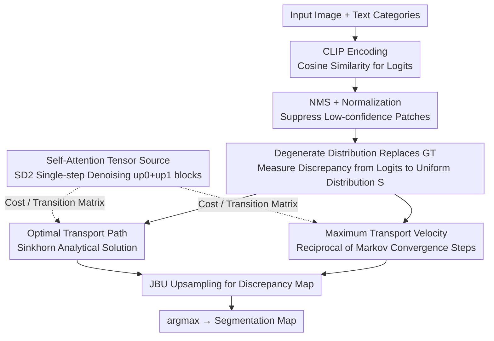

# Direct Segmentation without Logits Optimization for Training-Free Open-Vocabulary Semantic Segmentation

**Conference**: CVPR 2026  
**arXiv**: [2604.07723](https://arxiv.org/abs/2604.07723)  
**Code**: [GitHub](https://github.com/liblacklucy/DSLO)  
**Area**: Image Segmentation  
**Keywords**: Open-vocabulary semantic segmentation, Training-free, Distribution discrepancy, Optimal transport, Markov process

## TL;DR

A training-free open-vocabulary semantic segmentation method is proposed that bypasses the logits optimization process. Based on the hypothesis that "distribution discrepancies from logits to a degenerate distribution are consistent for homogeneous regions," segmentation maps are directly constructed via analytical solutions of optimal transport paths or maximum transport velocities. It achieves SOTA performance on 8 benchmarks without training or model-specific modulations.

## Background & Motivation

Open-vocabulary semantic segmentation (OVSS) requires pixel-level vision-language alignment. The core paradigm of existing methods can be summarized as **logits optimization**—calculating cosine similarity (logits) between vision and language features, minimizing the discrepancy between the logits distribution and the GT distribution to obtain optimal logits, and then applying argmax to get the segmentation map. This paradigm has two implementations:

**Iterative Training Paradigm**: Requires GT annotations and time-consuming training processes.

**Attention Modulation Paradigm** (Training-free): Calibrates self-attention computation to correct fine-grained alignment, but its denoising operations are **data-independent but model-specific** (e.g., CLIP-specific attention replacement), leading to poor generalization.

Both approaches **prioritize deriving optimal logits and then constructing segmentation maps**. The core insight of the authors is: can the **logits optimization be skipped entirely**, and segmentation maps be obtained directly from the distribution discrepancy itself?

Key Insight: **Homogeneous regions present consistent distribution discrepancies, while heterogeneous regions present different distribution discrepancies**. If this hypothesis holds, the distribution discrepancy itself encodes semantic information, eliminating the need to optimize for optimal logits first.

## Method

### Overall Architecture

This paper addresses training-free open-vocabulary semantic segmentation: given an image and a set of text categories, it outputs pixel-level segmentation without training or model-specific attention modifications. The critical shift in the pipeline is that it **no longer optimizes logits**. The traditional paradigm first calculates vision-language similarity logits via CLIP, pulls the logits distribution toward the GT distribution ($\mathcal{Q}^* = \arg\min_\mathcal{Q} \mathbf{D}(\mathcal{P}\|\mathcal{Q})$), and finally takes the argmax for categories. This work flips it into an analytical solution $\mathbf{M} = \arg\max_{N_c} \mathbf{D}(\mathcal{S}\|\mathcal{Q})$, using the "discrepancy from logits to the degenerate distribution $\mathcal{S}$" directly as the basis for segmentation.

Specifically: after calculating logits via CLIP, non-maximum suppression (NMS) and normalization are applied to suppress noise. Then, the discrepancy from normalized logits to the degenerate distribution (uniform distribution $\frac{1}{N}\mathbf{1}_N$) is calculated. This step offers two equivalent routes: the optimal transport path or the maximum transport velocity, both depending on a self-attention tensor characterizing inter-patch relationships. Finally, Joint Bilateral Upsampling (JBU) restores the low-resolution results to the original size, and argmax yields the segmentation map. There are no parameter updates throughout the process.

### Key Designs

**1. Degenerate Distribution Replaces GT: Replacing the unavailable GT endpoint with a universally known uniform distribution**

The validity of the entire method hinges on this replacement. Optimization paradigms rely on training because they need the GT distribution as a target, which is unavailable during inference. This work uses the degenerate distribution (uniform distribution) as a proxy: the authors found that in feature space, the degenerate distribution $\mathcal{S}$ and the GT distribution $\mathcal{P}$ occupy antipodal positions. Since logits optimization moves toward the GT endpoint, measuring "how far logits are from the degenerate endpoint" can similarly distinguish categories. Experimentally, the KL divergence from logits to GT ($\mathbf{D}(\mathcal{P}\|\mathcal{Q})$) and from logits to the degenerate distribution ($\mathbf{D}(\mathcal{S}\|\mathcal{Q})$) showed highly consistent performance across 5 datasets. The uniform distribution is chosen because it is the only distribution that can be defined during inference without any additional information.

**2. Optimal Transport Path: Quantifying "discrepancy" as transport cost based on path consistency in homogeneous regions**

The first metric measures "how far each patch's logits are from the degenerate distribution." The core hypothesis is that paths toward degradation should be consistent for homogeneous regions, meaning the path itself encodes semantic discrepancy. This is formulated as Sinkhorn optimal transport with entropic regularization:

$$\boldsymbol{\pi}^* = \min_{\boldsymbol{\pi}} \sum_{i,j} \mathbf{C}_{i,j}\boldsymbol{\pi}_{i,j} - \epsilon\sum_{i,j}\boldsymbol{\pi}_{i,j}(\ln\boldsymbol{\pi}_{i,j} - 1)$$

The cost matrix $\mathbf{C}$ is derived from the averaged hierarchical self-attention tensors of Stable Diffusion v2. Using the Lagrange multiplier method yields the analytical solution $\boldsymbol{\pi}^* = \text{diag}(\boldsymbol{\mu})\mathbf{K}\text{diag}(\boldsymbol{\nu})$, where the Gibbs kernel $\mathbf{K} = \exp(-\mathbf{C}/\epsilon)$. Convergence is reached via Sinkhorn iterations (50 iterations, $\epsilon=0.1$). This route is more sensitive to high-frequency textures.

**3. Maximum Transport Velocity: When paths are identical, slower degradation indicates greater discrepancy**

The second metric measures how fast the degradation occurs. The process of logits converging to a stationary distribution is modeled as a Markov chain $\mathbf{f}^{c(l)} = \mathbf{f}^{c(0)} \cdot \mathbf{T}^l$, where the transition matrix $\mathbf{T}$ is obtained by transforming the self-attention tensor into a doubly stochastic matrix via Iterative Proportional Fitting (IPF, 15 iterations). A patch that is pushed toward the uniform state faster is closer to the degenerate endpoint, showing less discrepancy with that category. The maximum transport velocity for each patch is defined as the reciprocal of convergence steps:

$$\mathbf{v}_i^c = \max\{1/l : |\mathbf{f}_i^{c(l)} - \mathbf{f}_i^{c(l-1)}| \leq \tau\}$$

where $\tau=0.3$ is the convergence threshold. This route is more sensitive to inter-class boundaries and complements the optimal path.

**4. Self-Attention Tensor Source: Using SD2 instead of CLIP self-attention as the patch relationship graph**

Both metrics rely on a tensor characterizing inter-patch relationships (cost matrix / transition matrix). The authors use Stable Diffusion v2 self-attention instead of CLIP's. Tensors are extracted by encoding noise-free latent features followed by single-step unconditional denoising to ensure feature determinism. The combination of $\text{up}_0$ and $\text{up}_1$ upsampling blocks yields the best results. This makes the method model-agnostic as it is not bound to specific CLIP architectures.

### Loss & Training

Completely **training-free** method. It involves no training or fine-tuning. Off-the-shelf weights for CLIP (ViT-B/16 or ViT-L/14) and Stable Diffusion v2 are used. Inference is performed with 16-bit floating-point precision, and full-image inference requires no sliding windows.

## Key Experimental Results

### Main Results

**CLIP ViT-B/16 Backbone:**

| Method | Paradigm | VOC21 | Context60 | COCO-Stuff | Cityscapes | ADE20K | Avg |
|------|------|-------|-----------|------------|------------|--------|-----|
| SCLIP | M.M. | 59.1 | 30.4 | 22.4 | 32.2 | 16.1 | 38.2 |
| NACLIP | M.M. | 58.9 | 32.2 | 23.3 | 35.5 | 17.4 | 39.4 |
| CASS | M.M. | 65.8 | 36.7 | 26.7 | 39.4 | 20.4 | 44.4 |
| **Ours (O.P.)** | - | 66.9 | 37.6 | 28.6 | 41.7 | 22.8 | **46.2** |
| **Ours (M.V.)** | - | **67.8** | **38.3** | **28.9** | **43.3** | **23.0** | **46.9** |

**CLIP ViT-L/14 Backbone:**

| Method | VOC21 | Context60 | COCO-Stuff | Cityscapes | ADE20K | Avg |
|------|-------|-----------|------------|------------|--------|-----|
| SC-CLIP | 65.0 | 36.9 | 26.9 | 41.3 | 21.7 | 45.2 |
| **Ours (M.V.)** | **68.9** | **38.7** | **29.2** | **43.9** | **23.4** | **47.8** |

### Ablation Study

| Configuration | VOC21 | COCO-Stuff | Cityscapes | ADE20K | Avg |
|------|-------|------------|------------|--------|-----|
| (I) Baseline (raw logits) | 18.6 | 7.2 | 6.7 | 3.2 | 8.9 |
| (II) + KL Divergence | 44.2 | 12.1 | 8.6 | 6.4 | 17.8 |
| (III) + NMS | 45.9 | 13.0 | 9.6 | 7.7 | 19.1 |
| (IV) + JBU | 46.3 | 13.3 | 10.1 | 8.8 | 19.6 |
| (V) + Optimal Transport Path | 66.9 | 28.6 | 41.7 | 22.8 | 40.0 |
| (VI) + Max Transport Velocity | **67.8** | **28.9** | **43.3** | **23.0** | **40.8** |
| (VII) Fusion (V)+(VI) | 64.9 | 26.8 | 41.4 | 20.5 | 38.4 |

### Key Findings

1. **Distribution discrepancy can replace logits optimization**: Simple KL divergence brings a +8.9% mIoU Gain, while optimal transport/Markov processes add another +22%.
2. **Maximum velocity mode slightly outperforms optimal path**: An average Gain of +0.7% for B/16 and +0.6% for L/14.
3. **Fusing two modes decreases performance**: The two metrics focus on different aspects (high-frequency texture vs. inter-class boundaries), and simple fusion introduces interference.
4. **SD2 self-attention is superior to ViT foundational models**: SD2 attention tensors are more effective for constructing transition matrices.
5. **Fewer denoising steps are better**: The encoding process avoids noise injection to ensure deterministic feature extraction.
6. **$\tau=0.3$ is the optimal threshold**: Higher thresholds lead to premature degradation before logits reach the optimal state.

## Highlights & Insights

- **Paradigm Shift**: Moves from "optimizing logits then constructing maps" to "obtaining maps directly from distribution discrepancy," eliminating training and model-specific modulations.
- **Theoretical Elegance**: Links segmentation to optimal transport and Markov processes, providing both geometric and probabilistic interpretations.
- **Degenerate Distribution Proxy**: Leverages the antipodal relationship between GT and degenerate distributions in feature space, removing the need for GT during inference.
- **Triple Freedom**: No GT annotations required, no time-consuming training, and no model-specific modulation needed.
- **Complementarity of Routes**: Optimal path is sensitive to high-frequency textures, while maximum velocity is sensitive to inter-class boundaries.
- **Stable Diffusion as Feature Extractor**: SD2 self-attention tensors are more suitable for building inter-patch transition probabilities than CLIP/DINO attention.

## Limitations & Future Work

1. **Dependence on Stable Diffusion**: Requires loading the SD2 model for self-attention extraction, increasing memory and computational overhead during inference.
2. **Computational Cost of Sinkhorn Iterations**: 50 iterations of optimal transport may be slow for high-resolution images.
3. **Manual Tuning for $\tau$ and $\epsilon$**: While relatively robust, these hyperparameters still require empirical setting.
4. **Failure of Fusion**: Simple fusion of the two modes did not yield additive gains, representing a missed opportunity for higher performance.
5. **Limited to Semantic Segmentation**: Applicability to more complex tasks like panoptic or instance segmentation is unexplored.
6. **Theoretical Guarantees**: While experimentally verified, a rigorous theoretical analysis of the degenerate distribution proxy is lacking.

## Related Work & Insights

- Contrasts with ClearCLIP, SCLIP, and NACLIP—which remain within the "logits optimization" paradigm.
- Introduces SD2 self-attention, whereas ProxyCLIP and CASS introduce DINO features.
- Application of Optimal Transport (Sinkhorn algorithm) provides a geometric perspective for measuring distribution discrepancy.
- Using Markov chain convergence speed as a semantic metric is a novel approach.
- The model-agnostic nature allows for potential generalization to future vision-language models.

## Rating

- Novelty: ⭐⭐⭐⭐⭐ — The paradigm shift skipping logits optimization is unique and convincing.
- Experimental Thoroughness: ⭐⭐⭐⭐⭐ — 8 benchmarks, two CLIP scales, detailed ablation and analysis.
- Writing Quality: ⭐⭐⭐⭐ — Clear mathematical derivation, though symbols are dense in parts.
- Value: ⭐⭐⭐⭐⭐ — New SOTA for training-free OVSS with a clean and generalizable logic.

<!-- RELATED:START -->

## Related Papers

- [\[CVPR 2026\] The Power of Prior: Training-Free Open-Vocabulary Semantic Segmentation with LLaVA](the_power_of_prior_training-free_open-vocabulary_semantic_segmentation_with_llav.md)
- [\[CVPR 2026\] PEARL: Geometry Aligns Semantics for Training-Free Open-Vocabulary Semantic Segmentation](pearl_geometry_aligns_semantics_for_training-free_open-vocabulary_semantic_segme.md)
- [\[CVPR 2026\] Looking Beyond the Window: Global-Local Aligned CLIP for Training-free Open-Vocabulary Semantic Segmentation](looking_beyond_the_window_global-local_aligned_clip_for_training-free_open-vocab.md)
- [\[CVPR 2026\] S2C2Seg: Semantic-Spatial Consistency and Category Optimization for Open-Vocabulary Segmentation](s2c2seg_semantic-spatial_consistency_and_category_optimization_for_open-vocabula.md)
- [\[CVPR 2026\] Exploring the Underwater World Segmentation without Extra Training](exploring_the_underwater_world_segmentation_without_extra_training.md)

<!-- RELATED:END -->
