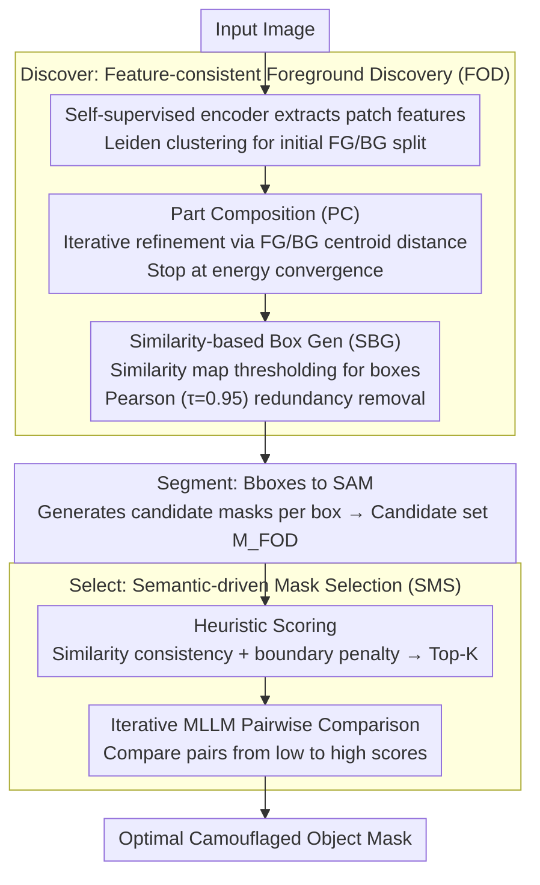

# DSS: Discover, Segment, and Select for Zero-shot Camouflaged Object Segmentation

**Conference**: CVPR 2026  
**arXiv**: [2602.19944](https://arxiv.org/abs/2602.19944)  
**Code**: To be confirmed  
**Area**: Zero-shot Camouflaged Object Segmentation  
**Keywords**: [Zero-shot segmentation, Camouflaged object detection, SAM, MLLM, Training-free pipeline, Clustering localization]  

## TL;DR
The proposed DSS is a three-stage progressive pipeline (Discover→Segment→Select) that achieves zero-shot training-free camouflaged object segmentation. It discovers the target (FOD) via self-supervised visual features and Leiden clustering, generates candidate masks with SAM, and selects the optimal mask through heuristic scoring and iterative MLLM pairwise comparisons. It significantly outperforms existing methods, particularly in multi-instance scenarios.

## Background & Motivation
Camouflaged Object Segmentation (COS) requires detecting and segmenting hidden targets that are highly integrated with their background. Current zero-shot COS methods typically follow an "MLLM localization → SAM segmentation" two-stage paradigm: a Multimodal Large Language Model (MLLM) generates target prompts (e.g., bounding boxes), which are then fed into SAM for pixel-level segmentation. However, the visual grounding capability of MLLMs degrades significantly in camouflaged scenes where targets share high color/texture similarity with the background, leading to inaccurate bounding boxes. Furthermore, in multi-instance scenarios, MLLMs often focus only on the most prominent target while ignoring others.

## Core Problem
The inaccurate localization of MLLMs in zero-shot COS limits the quality of SAM segmentation. Specifically, in multi-instance camouflaged scenes, MLLMs fail to reliably discover all targets. There is a need for a training-free solution that can automatically discover multiple camouflaged targets and select the optimal results from candidate masks without relying on MLLM localization.

## Method

### Overall Architecture
DSS aims to circumvent the bottleneck of "inaccurate MLLM localization" in zero-shot camouflaged segmentation. Since MLLMs struggle with the high similarity between targets and backgrounds, DSS decomposes the task into a three-stage progressive pipeline: **Discover** (Feature-consistent Foreground Discovery, FOD) uses clustering of self-supervised visual features instead of MLLMs to detect targets and generate bounding boxes; **Segment** feeds these boxes into SAM to produce candidate masks; **Select** (Semantic-driven Mask Selection, SMS) uses heuristic scoring for initial filtering followed by MLLM pairwise comparisons to select the best mask. The entire process is zero-shot and training-free, requiring no fine-tuning or annotations.

### Key Designs

**1. Discover (FOD): Clustering as a surrogate for MLLM localization**

Given the degradation of MLLM localization in camouflaged scenes, DSS leverages the intrinsic structure of self-supervised visual features. It first extracts patch-level features $X \in \mathbb{R}^{N \times D}$ using DINOv2 and applies Leiden community detection (based on graph modularity optimization) for initial foreground/background partitioning. This is followed by Part Composition (PC) refinement, where the foreground probability for each patch is iteratively calculated based on its distance to foreground and background centroids: $y_i^{(t)} = \sigma(\|x_i - \mu_b\|_2 - \|x_i - \mu_f\|_2)$, where $\mu_f, \mu_b$ are the current means. This continues until the energy function $E$ converges. Finally, Similarity-based Box Generation (SBG) creates an affinity map using the cosine similarity between the foreground centroid and all patches, extracts candidate regions via thresholding, and removes duplicates using Pearson correlation ($\tau=0.95$). This allows the automated discovery of multiple targets, overcoming the limitations of MLLMs.

**2. Segment: Bbox prompts for SAM candidate generation**

With improved localization, segmentation is handled by a general foundation model. All bounding box prompts generated by FOD are sent to SAM. Each box generates a set of candidate masks, which are aggregated into a candidate set $M_{FOD}$. This step leverages SAM’s ability to generate high-quality pixel-level masks from location prompts without additional training.

**3. Select (SMS): Repurposing MLLM from "localizer" to "judge"**

To find the best mask among candidates, DSS first calculates a heuristic quality score: $s_i = \text{corr}(m_i, \text{sim}_i) + (1 - \text{BC}(m_i))$. The first term is the Pearson correlation between the mask and the affinity map (feature consistency), and the second term uses Boundary Complexity ($\text{BC}$) to penalize over-fragmentation. High-quality masks should be feature-consistent and have clean boundaries. After ranking and keeping the Top-K, an Iterative Pairwise MLLM Comparison is performed: starting from the lowest-scoring masks, the MLLM is asked "which one segments the camouflaged object better?". Comparing from low-to-high scores allows the MLLM to establish a baseline for superior masks and reduces the accumulation of misjudgments.

### Loss & Training
The entire pipeline is training-free and operates only during inference. Tunable hyperparameters include the resolution parameter for Leiden clustering, convergence thresholds for PC, the Pearson redundancy threshold ($\tau=0.95$) for SBG, and the Top-K value for SMS heuristic scoring.

## Key Experimental Results

| Benchmark | Metric | DSS | Prev. SOTA (ZS) | Gain |
|-----------|------|-----|------------|------|
| CHAMELEON | S_m↑ | Significant Lead | MLLM+SAM baseline | +Large |
| CAMO | S_m↑ | Significant Lead | MLLM+SAM baseline | +Large |
| COD10K | S_m↑ | Significant Lead | MLLM+SAM baseline | +Large |
| NC4K | S_m↑ | Significant Lead | MLLM+SAM baseline | +Large |

- Demonstrates the greatest advantage in multi-instance camouflaged scenarios because FOD discovers multiple target regions where MLLMs typically find only one.
- Achieves SOTA across all COS benchmarks compared to zero-shot methods using MLLM localization.
- Training-free, requiring no COS-specific annotated data.

### Ablation Study
- FOD vs. MLLM Localization: FOD discovers significantly more targets in multi-instance scenes.
- Part Composition (PC): PC refinement significantly improves bounding box quality.
- SBG Pearson Deduplication: $\tau=0.95$ effectively reduces redundant bboxes.
- SMS MLLM Comparison: Pairwise MLLM judgment outperforms using heuristic scores alone.
- Comparison Order: Sorting from low-to-high scores yields better results than random ordering.

## Highlights & Insights
- Ingeniously switches the MLLM role from "localizer" to "judge," using self-supervised clustering for reliable localization and MLLM for easier pairwise comparisons.
- The Part Composition (PC) refinement formula is elegant; the sigmoid of the distance difference directly represents foreground probability.
- Pearson correlation serves as a lightweight and effective method for duplicate detection.
- The three-stage progressive design is clear, with independently evaluable objectives for each stage.
- Zero-shot and training-free characteristics ensure strong generalization and deployment flexibility.

## Limitations & Future Work
- High inference overhead due to the use of both SAM and MLLM (especially multiple MLLM calls in the SMS stage).
- Relies on the assumption that foreground/background are separable in feature space; may fail in extreme camouflage with near-zero feature variance.
- The trade-off between efficiency and quality in Top-K settings and MLLM iterations requires careful tuning.
- Impact of different self-supervised backbones (e.g., MAE, CLIP) on FOD remains unexplored.
- Fixed Pearson threshold $\tau=0.95$ could be improved via adaptive optimization.

## Related Work & Insights
- **vs. GenSAM/LAKE-RED**: These methods rely on MLLM-generated prompts, which are the bottleneck in COS. DSS replaces MLLM localization with FOD to solve this at the source.
- **vs. Supervised COS (e.g., SINet)**: Supervised methods provide high accuracy but are limited by annotation costs and domain shifts. DSS offers better generalization as a zero-shot method.
- **vs. General Zero-shot Segmentation (e.g., Matcher)**: General methods lack optimization for camouflage and fail when similarity is high. DSS's FOD is specifically designed to break through visual similarity using fine-grained patch clustering.

## Related Work & Insights
- **Key Idea**: The clustering + iterative refinement paradigm of FOD can be transferred to other difficult localization tasks like underwater detection or nocturnal object discovery.
- **Key Idea**: The SMS combination of heuristic scoring and MLLM pairwise comparison could act as a general "mask quality selector" for post-processing in other segmentation pipelines.
- **Key Idea**: Shifting large models to "judgment" roles rather than "execution" roles is a scalable strategy for other vision tasks.
- Complements unsupervised COS schemes like EReCu: while EReCu requires training, DSS is entirely training-free but relies on foundation models like SAM and MLLM.

## Rating
- **Novelty**: ⭐⭐⭐⭐ The three-stage pipeline and MLLM role transformation are high-value insights.
- **Experimental Thoroughness**: ⭐⭐⭐⭐ Extensive benchmarking across multiple datasets with specific multi-instance and ablation analyses.
- **Writing Quality**: ⭐⭐⭐⭐ Clear motivation and intuitive nomenclature for the three stages.
- **Value**: ⭐⭐⭐⭐ The zero-shot pipeline paradigm and the modular FOD/SMS components are highly reusable.

<!-- RELATED:START -->

## Related Papers

- [\[CVPR 2026\] MV3DIS: Multi-View Mask Matching via 3D Guides for Zero-Shot 3D Instance Segmentation](mv3dis_multi-view_mask_matching_via_3d_guides_for_zero-shot_3d_instance_segmenta.md)
- [\[CVPR 2026\] Beyond Appearance: Camouflaged Object Detection via Geometric Structure](beyond_appearance_camouflaged_object_detection_via_geometric_structure.md)
- [\[CVPR 2026\] Seeing Both Sides: Towards Bidirectional Semantic Alignment for Open-Vocabulary Camouflaged Object Segmentation](seeing_both_sides_towards_bidirectional_semantic_alignment_for_open-vocabulary_c.md)
- [\[CVPR 2026\] SDDF: Specificity-Driven Dynamic Focusing for Open-Vocabulary Camouflaged Object Detection](sddf_specificity-driven_dynamic_focusing_for_open-vocabulary_camouflaged_object.md)
- [\[CVPR 2026\] AG-VAS: Anchor-Guided Zero-Shot Visual Anomaly Segmentation with Large Multimodal Models](ag-vas_anchor-guided_zero-shot_visual_anomaly_segmentation_with_large_multimodal.md)

<!-- RELATED:END -->
