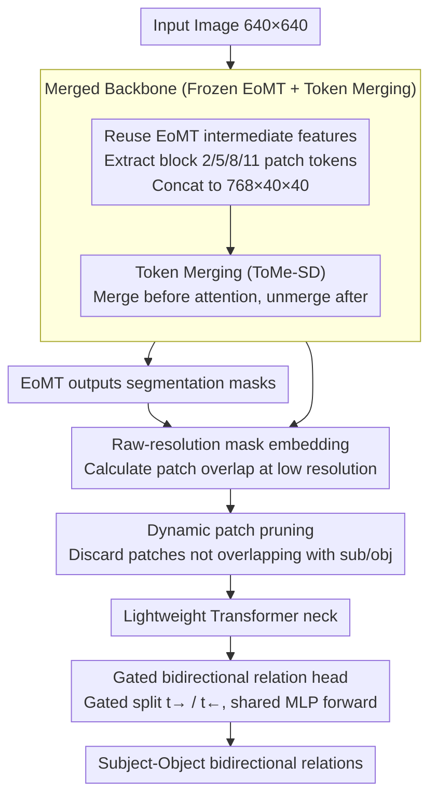

# DSFlash: Comprehensive Panoptic Scene Graph Generation in Realtime

**Conference**: CVPR 2026  
**arXiv**: [2603.10538](https://arxiv.org/abs/2603.10538)  
**Code**: TBD (Authors state release after acceptance)  
**Area**: Scene Graph Generation / Visual Scene Understanding  
**Keywords**: panoptic scene graph generation, real-time inference, bidirectional relation prediction, token pruning, low-latency  

## TL;DR
DSFlash improves panoptic scene graph generation speed to 56 FPS on an RTX 3090 while achieving SOTA performance with $mR@50=30.9$ on the PSG dataset by merging segmentation and relation prediction backbones, employing a bidirectional relation prediction head, and utilizing dynamic patch pruning.

## Background & Motivation
Scene Graphs (SGs) structure images into nodes (instances) and edges (relations), which are widely used in tasks such as VQA, reasoning, and image captioning. Existing PSGG methods focus little on latency; a single inference often takes hundreds of milliseconds, making them difficult to deploy on edge devices or real-time systems. While DSFormer achieves SOTA performance, its inference time is 458 ms, and it uses two independent backbones (MaskDINO + ResNet), resulting in significant resource waste. The **Key Insight** of this paper is that two-stage methods can achieve ultra-low latency without losing (or even while improving) scene graph quality by sharing backbone features, reducing the number of forward passes, and pruning irrelevant tokens.

## Core Problem
How can panoptic scene graph generation reach real-time inference speeds without sacrificing the quality of the scene graph?

## Method

### Overall Architecture
DSFlash addresses the neglected latency issue in PSGG—where the SOTA DSFormer takes 458 ms for a single inference and wastes resources by using separate MaskDINO and ResNet backbones. The **Core Idea** is that two-stage methods can compress latency to real-time by sharing backbone features, reducing forward passes, and pruning irrelevant tokens without performance degradation. Specifically, the first stage uses a frozen EoMT (Encoder-only Mask Transformer) segmentation model to extract masks and features. The second stage directly reuses intermediate EoMT features (extracting patch tokens from blocks 2/5/8/11 and concatenating them into a $768 \times 40 \times 40$ tensor). It encodes subject-object positions using mask embeddings, processes them through a lightweight Transformer neck, and outputs bidirectional relations in a single forward pass via a gated relation head. Within the backbone, ToMe-SD token merging is integrated to further reduce attention overhead.

### Key Designs

**1. Merged Backbone: Reusing EoMT features to eliminate one forward pass**
The greatest waste in two-stage methods is using separate backbones for segmentation and relation prediction. DSFlash no longer runs a separate relation backbone; instead, it reuses the EoMT already running for segmentation. It extracts patch tokens from blocks 2/5/8/11 (or 5/11/17/23 for the L-version), concatenating them along the channel dimension into a $768 \times 40 \times 40$ feature tensor for subsequent modules. This eliminates an entire backbone forward pass. By replacing the heavy MaskDINO with EoMT, it achieves comparable segmentation quality with much lower latency. The EoMT remains frozen; only the neck and head are trained, allowing training to complete in under 24 hours on a single GTX 1080.

**2. Raw-resolution Masks: Direct overlap calculation at low resolution**
Masks are integrated into patch tokens based on the area ratio of each patch covered by the subject/object mask. DSFormer bilinearly upsampled EoMT's $160 \times 160$ mask logits to the original resolution to calculate coverage, which is computationally expensive. DSFlash observes that only $13 \times 13$ patch granularity is needed, so it calculates overlap ratios directly at the low resolution, avoiding expensive upsampling.

**3. Mask-based Dynamic Patch Pruning: Zero-overhead irrelevant token removal**
Processing more patch tokens in the neck increases latency. Patches that do not overlap with either the subject or object mask contribute nothing to relationship determination. DSFlash discards these zero-overlap patches during the mask embedding stage before sending them to the neck. Since overlap ratios are already calculated, identifying patches to prune incurs almost zero extra cost. The neck can handle variable token sequences as the final prediction only depends on the classification token.

**4. Gated Bidirectional Prediction: Bidirectional relations in one forward pass**
Relations between a mask pair $(S_0, S_1)$ are directional. DSFormer required two forward passes for $S_0 \to S_1$ and $S_1 \to S_0$. DSFlash splits the encoded feature $x$ via a sigmoid gate $g$ into two branches, $t_\to = g \odot x$ and $t_\leftarrow = (1-g) \odot x$ (inspired by GRU gating), and passes both through the same shared MLP relation head. To prevent the model from exploiting data bias (where forward labels are 3x more common in PSG), an MSE consistency loss (Eq. 7) is used during training to ensure that flipping the input mask order result in swapped intermediate features ($z_\to = z'_\leftarrow$). This supervision improved $mR@50$ from 25.0 to 28.8.

**5. Token Merging (ToMe-SD): Further optimization for legacy GPUs**
This is an orthogonal optimization applied to the backbone: ToMe-SD merges similar tokens before each attention layer and unmerges them afterward to reduce computation. ToMe-SD is preferred over standard ToMe because it restores tokens, better preserving the backbone's segmentation capability. This significantly reduces latency on older GPUs like the GTX 1080 (from 230 ms to 173 ms).

### Loss & Training
- Relation Classification: Binary Cross Entropy
- Bidirectional Consistency: MSE consistency loss (Eq. 7) to constrain feature equivariance.
- Augmentation: DeiT III style (random flip, color jitter, choice of grayscale/blur/solarization).
- Optimizer: AdamW, $lr=1e-5$, cosine schedule + warmup, gradient clipping $norm \leq 1$, 20 epochs.
- Sampling: 1 negative sample for every 5 positive samples.

## Key Experimental Results

| Method | mR@50 | Latency (ms) | Params |
|------|-------|-----------|--------|
| DSFormer | 30.70 | 458 | 330M |
| REACT | 19.00 | 19 | 43M |
| HiLo-L | 19.08 | 427 | 230M |
| **DSFlash-L** | **30.90** | 50 | 340M |
| DSFlash-B* | 28.50 | 23 | 116M |
| DSFlash-S* | 25.05 | **18** | **40M** |

- DSFlash-L outperforms DSFormer in $mR@50$ (30.9 vs 30.7) with only 1/9 the latency.
- DSFlash-S* achieves 56 FPS (18ms) with only 40M parameters, still outperforming REACT and HiLo.

### Ablation Study
- Unifying the backbone reduced latency from 458ms to 41ms (-91%), though $mR@50$ dropped from 30.7 to 25.0.
- Efficient mask embedding: Latency reduced to 37ms (-10%) with no change in $mR@50$.
- Gated bidirectional prediction: Latency reduced to 29ms (-22%), while $mR@50$ rose from 25.0 to 28.8 due to additional supervision.
- Skipping mask upsampling: Latency reduced to 23ms (-21%), $mR@50=28.5$ (slight decrease).
- $mR@50$ performance shows a 0.99 correlation with the Panoptic Quality of the segmentation model.

## Highlights & Insights
- Implemented the first truly real-time PSGG system, capable of running at ~6 FPS even on a GTX 1080.
- The bidirectional relation prediction is clever, outputting both directions weighted by a gate while using consistency loss to improve quality.
- The design is simple and practical: frozen backbone + lightweight neck + shared head, resulting in extremely low training costs.
- Rigorous evaluation: Strictly followed SingleMPO to avoid $R@k$ inflation via multi-masking.

## Limitations & Future Work
- Freezing the backbone means relation prediction cannot influence feature extraction, potentially limiting the performance ceiling.
- The PSG dataset is relatively small (49k images); performance on larger datasets is unknown.
- Low-resolution masks may provide insufficient granularity for small objects.
- Shared MLP heads in bidirectional prediction might cause information confusion for highly directional predicates.
- Subject-object confusion remains a common failure mode; contrastive learning could be a solution.

## Related Work & Insights
- vs. DSFormer: Inherits mask embedding and strictly decoupled ideas but reduces latency by 9x through backbone merging and bidirectional prediction.
- vs. REACT: REACT uses YOLOv8 for bbox detection rather than panoptic segmentation; DSFlash outperforms it by 12 $mR@50$ points in the PSGG setting.
- vs. HiLo: A one-stage method whose performance (19.08 $mR@50$) is far inferior to DSFlash, with higher latency.

## Related Work & Insights
- Reusing intermediate features from a frozen backbone can be generalized to other two-stage vision tasks.
- Bidirectional prediction + consistency loss can be applied to directional relation modeling in detection.
- Dynamic patch pruning leverages task priors (mask coverage) for zero-overhead acceleration in mask-conditioned architectures.

## Rating
- Novelty: ⭐⭐⭐⭐ Bidirectional prediction and mask-based pruning are new for PSGG; system-level optimization is thorough.
- Experimental Thoroughness: ⭐⭐⭐⭐ Multi-GPU latency evaluation, detailed ablations, and fair evaluation protocols.
- Writing Quality: ⭐⭐⭐⭐ Clear structure, rich diagrams, and valuable discussion on evaluation issues.
- Value: ⭐⭐⭐⭐ Brings PSGG into the real-time domain with high practicality, especially for resource-constrained scenarios.

<!-- RELATED:START -->

## Related Papers

- [\[CVPR 2025\] Learning 4D Panoptic Scene Graph Generation from Rich 2D Visual Scene](../../CVPR2025/segmentation/learning_4d_panoptic_scene_graph_generation_from_rich_2d_visual_scene.md)
- [\[ECCV 2024\] OpenPSG: Open-set Panoptic Scene Graph Generation via Large Multimodal Models](../../ECCV2024/segmentation/openpsg_open-set_panoptic_scene_graph_generation_via_large_multimodal_models.md)
- [\[ICCV 2025\] SPADE: Spatial-Aware Denoising Network for Open-vocabulary Panoptic Scene Graph Generation](../../ICCV2025/segmentation/spade_spatial-aware_denoising_network_for_open-vocabulary_panoptic_scene_graph_g.md)
- [\[CVPR 2026\] Long-RVOS: A Comprehensive Benchmark for Long-term Referring Video Object Segmentation](long-rvos_a_comprehensive_benchmark_for_long-term_referring_video_object_segment.md)
- [\[CVPR 2026\] GenMask: Adapting DiT for Segmentation via Direct Mask Generation](genmask_adapting_dit_for_segmentation_via_direct_mask_generation.md)

<!-- RELATED:END -->
