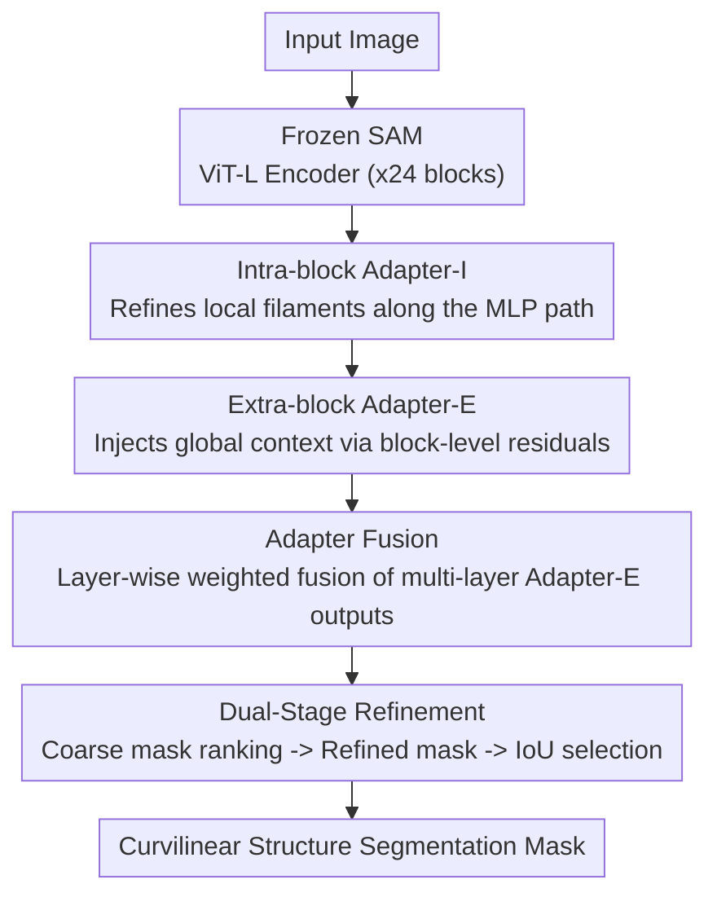

# Dual-level Adapter Boosting Prompt-free Curvilinear Structure Segmentation

**Conference**: CVPR 2026  
**Paper**: [CVF Open Access](https://openaccess.thecvf.com/content/CVPR2026/html/Zhu_Dual-level_Adapter_Boosting_Prompt-free_Curvilinear_Structure_Segmentation_CVPR_2026_paper.html)  
**Code**: https://github.com/kylechuuuuu/SACM  
**Area**: Semantic Segmentation / Parameter-Efficient Fine-Tuning  
**Keywords**: Curvilinear Structure Segmentation, SAM Adapter, Prompt-free Segmentation, Cross-domain Generalization, Few-shot Fine-tuning

## TL;DR
By inserting "intra-block + extra-block" dual-level adapters into a frozen SAM encoder, coupled with a prompt-free decoder that aggregates multi-layer features and a dual-stage mask refinement, this method achieves state-of-the-art (SOTA) performance across 12 highly diverse curvilinear structure datasets (including retinal vessels, roads, tire treads, and wires) using only 18 labeled images (3-shot per dataset). It also demonstrates strong zero-prompt generalization to novel classes and unseen distributions.

## Background & Motivation
**Background**: Curvilinear Structure Segmentation (CSS) targets thin, long, and branching objects such as blood vessels, nerve fibers, cracks, and roads, which is a common demand in medical imaging, remote sensing, and materials science. Mainstream approaches range from U-Net to various CNN enhancements (residual, multi-scale aggregation, attention, deformable convolution), and recently, hybrid Transformer architectures and State Space Models (SSMs).

**Limitations of Prior Work**: CSS faces a fundamental dilemma—it must capture both **local fine-grained details** (faint boundaries, intensity inhomogeneity, and rapidly changing widths of filaments) and maintain **global topological coherence** (continuity, extensibility, and branching structures). Traditional methods often compromise one for the other, yielding fractured segments in low-contrast regions or losing details and destroying topological integrity. More critically, they strictly rely on large-scale, domain-specific annotated data, exhibiting poor cross-domain generalization (e.g., a model trained on retinal vessels can hardly segment satellite roads).

**Key Challenge**: Although foundation models like SAM bring a paradigm shift in zero-shot generalization, it is designed for general object segmentation and inherits two structural biases against curvilinear structures: (1) **The prompt mechanism is inherently unsuitable for CSS**—for dense, winding, and interconnected networks like blood vessels or roads, sparse point/box prompts are highly inefficient for complete segmentation. (2) **Existing adaptation strategies are inadequate**—current adapter methods only insert lightweight modules into the MLP layers of the Transformer block (single-level adaptation), which can only refine intra-block local features but neglect the **global structure modeling mechanism itself**. Consequently, they cannot explicitly enhance the model's ability to capture long-range spatial dependencies, failing to construct global topology and transfer cross-domain structural knowledge.

**Goal**: To perform parameter-efficient fine-tuning on frozen SAM to simultaneously resolve local detail fidelity and global topological coherence, while completely eliminating prompts and minimizing the required annotations.

**Key Insight**: Since single-level (intra-block) adaptation only modulates local features, an **extra-block** pathway can be introduced. This pathway acts directly on the residual connection of the entire Transformer block to propagate global context through attention layers. Concurrently, the prompt-based segmentation is completely replaced with decoding driven by "learned multi-layer feature priors".

**Core Idea**: Utilizes a dual-level adaptation scheme combining "intra-block adapters for local refinement + extra-block adapters for global injection," combined with "prompt-free decoding aggregating multi-layer extra-block adapter features + dual-stage topological refinement" to transform a general-purpose SAM into a specialized curvilinear structure segmenter (SACM).

## Method

### Overall Architecture
The overall architecture of SACM (Segment Anything Curve Model) consists of a triumvirate: a frozen SAM image encoder, a Dual-Level Adapter (DLAda), and a Prompt-Free Adapter Fusion Decoder (PFAF-D). Given an input image, the frozen ViT-L encoder performs block-by-block forward propagation. Each Transformer block is equipped with two adapters: **Adapter-I** is embedded within the intra-block MLP residual path to refine local filament features, and **Adapter-E** is attached to the block-level residual connection to inject global context. The outputs of Adapter-E from all 24 blocks are collected and fed into the **Adapter Fusion** module, where they are dynamically weighted and fused into a global structural prior to replace point/box/mask prompts in the decoder. The decoder then applies **dual-stage refinement**: the first stage outputs a coarse mask and ranks candidate prediction heads by confidence, and the second stage outputs a refined mask guided by the ranked order, with an IoU predictor selecting the optimal mask. This pipeline preserves boundaries while mitigating topological fractures. During the entire process, only DLAda and PFAF-D are trained, while the encoder backbone remains fully frozen.

### Key Designs

**1. Intra-block Adapter (Adapter-I): Refining local filament features along the MLP path**

Addressing the local challenge of "faint filament boundaries easily confounded by the background," Adapter-I follows the bottleneck structure of parameter-efficient fine-tuning and is inserted into the **MLP sub-module residual path** of the $l$-th Transformer block. It functions as a token-wise bottleneck module: $\text{Adapter-}I(\mathbf{X}) = \mathcal{G}(\mathbf{X}\mathbf{W}_{\downarrow}^{I})\mathbf{W}_{\uparrow}^{I}$, where $\mathbf{W}_{\downarrow}^{I}\in\mathbb{R}^{D\times r}$ and $\mathbf{W}_{\uparrow}^{I}\in\mathbb{R}^{r\times D}$ are down- and up-projections, $r$ is the bottleneck ratio, and $\mathcal{G}$ denotes the GELU activation function. It is incorporated into the MLP output via residuals: $\mathbf{H}^{I}_{\text{out}} = \text{MLP}(\text{LN}(\mathbf{Y})) + \mathbf{Y} + \text{Adapter-}I(\text{LN}(\mathbf{Y}))$, where $\mathbf{Y}$ is the feature map post-attention.

The effectiveness of Adapter-I stems from its "token-wise" design, which restricts its Jacobian matrix between tokens to be block-diagonal. The updates are concentrated on local refinement across channel dimensions, thereby reinforcing local discriminative features for fine boundaries and capillaries without disrupting the pre-trained global representations already captured by the frozen Transformer—this is crucial for localizing the tuning and preserving backbone knowledge.

**2. Extra-block Adapter (Adapter-E): Injecting and propagating global context via block-level residuals**

This represents the primary divergence from conventional adapter designs. The pain point is that single-level adaptation only operates inside the block locally, failing to construct long-range topology. Instead of being placed internally, Adapter-E wraps **around the block-level residual connection of the entire Transformer block**, processing the normalized block-level output: $\mathbf{X}^{(l+1)} = F_l(\mathbf{X}^{(l)}) + \text{Adapter-}E(\text{LN}(F_l(\mathbf{X}^{(l)})))$, where $F_l$ represents the $l$-th Transformer block, and $\text{Adapter-}E(\mathbf{Y}) = \mathcal{G}(\mathbf{Y}\mathbf{W}_{\downarrow}^{E})\mathbf{W}_{\uparrow}^{E}$ shares a similar bottleneck structure with Adapter-I but uses independent parameters.

Critically, Adapter-E receives **features after attention-based token mixing**. Thus, the perturbations it introduces naturally propagate down to subsequent attention layers. As the network deepens and token interaction density increases, the structural cues from Adapter-E can influence increasingly distant tokens, thereby building up long-range dependencies layer-by-layer. The paper verifies via Grad-CAM that enabling only Adapter-E causes the attention maps to highlight **the entire vascular structure** (though with some noisy background regions), while enabling only Adapter-I focuses strictly on **local details**. Their complementarity effectively restores the "global topology modeling mechanism" explicitly back to SAM.

**3. Prompt-Free Decoding via Adapter Fusion: Replacing point/box prompts with multi-layer feature priors**

Prompt-based segmentation exhibits a threefold mismatch for CSS: (i) position bias—sparse prompts blur fine boundaries and disrupt filament continuity; (ii) scale mismatch—fixed prompts fail to represent the multi-scale representations required simultaneously for capillaries and large bifurcations; (iii) topology agnosticism—prompts do not yield any global continuity guidance. Consequently, SACM discards prompts entirely, relying instead on "learned feature-level structural guidance."

The Adapter Fusion module aggregates the extra-block adapter outputs $\{\mathcal{E}_1,\dots,\mathcal{E}_L\}$ from $L$ encoder layers. It first applies average pooling to obtain layer-level descriptors $\mathbf{z}_l = \mathcal{A}(\mathcal{E}_l)$. Since different layers contribute unequally to CSS, an FFN+Softmax is deployed to learn adaptive layer-wise weights: $\boldsymbol{\alpha} = \text{Softmax}(\text{FFN}(\text{Concat}(\mathbf{z}_1,\dots,\mathbf{z}_L)))$. The features are then weighted, aggregated, and upsampled: $\mathcal{F}_{\text{fusion}} = \text{UP}(\text{MLP}(\sum_{l=1}^{L}\alpha_l\cdot\mathcal{E}_l))$, and injected into the decoder via a residual connection: $\mathbf{F}^{\text{out}}_{\text{decoder}} = \mathbf{F}^{\text{in}}_{\text{decoder}} + \mathcal{F}_{\text{fusion}}$. Because Adapter-E encodes cross-layer, attention-mixed context, it inherently preserves elongated geometries and bifurcation information. This fused descriptor acts as a robust global prior to drive prompt-free automatic segmentation.

**4. Dual-Stage Refinement: Decoupling and optimizing local boundary precision and global topological coherence**

Single-pass decoding often produces masks that "look locally correct but lack global coherence"—e.g., disconnected vessels or spurious branches. The dual-stage refinement scheme addresses this by dividing the tasks between two **structurally identical** MLP heads. In the first stage, MLP1 generates a coarse mask to evaluate global topology: $\mathbf{M}^{(1)} = \text{MLP}_1(\mathbf{U})$, $\mathbf{w} = \text{Softmax}(\mathcal{M}(\mathbf{M}^{(1)}))$, where $\mathbf{U}$ is the fused upsampled feature map from the decoder, $\mathcal{M}$ represents max pooling, and $\mathbf{w}$ is the confidence score vector for each head, which is sorted by maximum spatial activation intensity: $s = \text{argsort}(\mathbf{w}, \text{descending})$. In the second stage, MLP2 outputs refined masks conditioned on the sorted order: $\mathbf{M}^{(2)} = \text{MLP}_2(\mathbf{U}, s)$, and an MLP-based IoU predictor selects the optimal mask from the sorted candidates. This design allows the head with the most "topologically plausible" predictions to dominate the final output, while preserving boundary sharpness and balancing local fidelity with vascular connectivity.

### Loss & Training
The loss function is a weighted sum of BCE and Dice losses: $\mathcal{L}_{SACM} = \mathcal{L}_{BCE} + \lambda\cdot\mathcal{L}_{Dice}$, where $\lambda$ balances the two terms (optimized to $\lambda=0.4$ via grid search). During training, the SAM ViT-L encoder is frozen, and only DLAda and PFAF-D are updated. The setup uses 50 epochs, a batch size of 1, a learning rate of $3\times10^{-4}$, and the AdamW optimizer ($\beta_1=0.9,\beta_2=0.999$) with a cosine decay scheduler, deployed on a single RTX 4090 GPU. The default bottleneck ratio for adapters is $r=0.1$. The model is trained using only 3-shot per dataset across 6 training datasets (totaling 18 images).

## Key Experimental Results

Evaluation spans 12 curvilinear datasets categorized along two dimensions: class familiarity (Base class seen during training / Novel class unseen) $\times$ data distribution (Seen dataset / Unseen distribution). Evaluation metrics include pixel-level Dice and IoU, topology-level clDice (measuring topological correctness over skeletons), and boundary-level HD95 (95th percentile Hausdorff distance, lower is better). All SAM baselines and SACM use the same ViT-L backbone, pre-trained weights, and 3-shot protocol. SAM baselines utilize point prompts, while SACM is purely prompt-free.

### Main Results

Base-Seen (4 training datasets, Dice / IoU, %):

| Method | DRIVE | CHASEDB1 | DCA1 | CORN |
|------|-------|----------|------|------|
| U-Net (2015) | 74.66 / 59.81 | 71.53 / 55.89 | 67.41 / 51.77 | 22.46 / 12.88 |
| BCUNet (2023) | 78.08 / 64.32 | 78.24 / 64.35 | 73.35 / 58.29 | 29.76 / 17.57 |
| CWSAM (2025) | 61.01 / 43.56 | 54.85 / 38.22 | 63.69 / 46.91 | 27.07 / 15.53 |
| SegDINO (2025) | 61.78 / 44.56 | 55.67 / 39.23 | 48.95 / 32.41 | 27.34 / 16.12 |
| **SACM (Ours)** | **78.89 / 65.24** | **79.27 / 65.72** | **75.67 / 61.10** | **55.38 / 38.44** |

Cross-domain generalization (Unseen, Dice / IoU, %):

| Method | DSCA | XCAD | FIVES | WIRE(Novel) | LEAF(Novel) | ROAD(Novel) |
|------|------|------|-------|------|------|------|
| CWSAM (2025) | 44.31 / 28.86 | 68.32 / 52.24 | 64.95 / 48.65 | 42.61 / 29.55 | 27.85 / 17.01 | 24.79 / 14.53 |
| SAM-OCTA (2024) | 65.65 / 49.46 | 68.58 / 54.86 | 74.51 / 60.94 | 44.20 / 30.37 | 20.43 / 13.37 | 21.62 / 14.11 |
| **SACM (Ours)** | **68.43 / 53.51** | **74.29 / 57.74** | **75.48 / 62.26** | **54.60 / 38.25** | **36.80 / 23.61** | **40.43 / 26.31** |

The performance gain on CORN (fine nerve fibers) and all Novel classes is particularly remarkable: the Dice score on CORN jumps from the next-best of 36.23% directly to 55.38%, and on ROAD from 24.79% to 40.43%, demonstrating the cross-domain transfer capability of the prompt-free curvilinear prior.

### Ablation Study (WIRE Dataset)

| Adapter-I | Adapter-E | Adapter-F | Dual-stage | Dice↑ | clDice↑ | Description |
|:--:|:--:|:--:|:--:|------|------|------|
| - | - | - | - | 5.61 | 2.32 | Vanilla SAM, barely functional |
| ✓ | - | - | - | 46.11 | 14.83 | Intra-block adapter only |
| - | ✓ | - | - | 45.02 | 15.24 | Extra-block adapter only |
| ✓ | ✓ | - | - | 50.38 | 15.52 | Dual-level adapter synergy |
| ✓ | ✓ | ✓ | - | 53.93 | 16.02 | + Adapter Fusion |
| ✓ | ✓ | ✓ | ✓ | **54.60** | **17.43** | Full model |

### Key Findings
- **Vanilla SAM almost entirely fails on curvilinear structures** (Dice: 5.61%), confirming that domain adaptation is indispensable and highlighting the mismatch of prompt mechanisms for CSS.
- **Both adapters individually yield huge performance improvements and complement each other**: Adapter-I targets local patterns, whereas Adapter-E captures global context. Enabling both concurrently boosts the Dice score by approximately 4-5% compared to enabling either one alone, verified by Grad-CAM and t-SNE visualizations (with SACM achieving tighter intra-domain convergence and clearer inter-domain boundaries).
- **Adapter Fusion and dual-stage refinement provide stable marginal gains**: yielding additional boosts of around 3.5% and 0.7% in Dice, respectively. The continuous improvement in clDice (the topological metric) demonstrates that the enhancements indeed translate to structural connectivity rather than mere pixel-wise overlap.
- **High data efficiency**: Performance under 1 to 7 shots shows that the 3-shot setup is highly robust, while gains begin to diminish beyond 5-shot. For hyperparameters, a bottleneck ratio of $r=0.1$ and loss weight of $\lambda=0.4$ yield the best performance (a larger $r$ risks overfitting on scarce data).

## Highlights & Insights
- **The "extra-block adapter" recovers the global representation pathway overlooked by existing adapters:** Placing the bottleneck module on the block-level residual connection, post-attention token mixing, enables structural cues to propagate layer-by-layer through attention. This is a lightweight yet targeted architectural design choice addressing the "long-range topology" core of CSS, generalizable to other dense prediction tasks demanding long-range dependencies.
- **Framing "prompt-free" as an explicit design feature rather than a compromise:** The authors clearly argue the threefold mismatch of point/box prompts for dense interconnected curvilinear networks. Replacing prompts with adaptive weighted fusion of multi-layer adapter features bypasses interaction costs while supplying an intrinsic global prior, resulting in an elegant solution.
- **Dual-stage refinement decouples boundaries and topology via "topological head ranking followed by conditional refinement":** This design is universally applicable to any fragile, easily fragmented structures like cracks, wires, and roads.
- **SOTA across 12 domains using only 18 images total:** This holds immense practical value for data-scarcity in scientific and industrial scenarios. Furthermore, the in-house datasets (such as LEAF, TYRE, and WIRE captured via mobile phones) validate strong generalization to entirely novel classes.

## Limitations & Future Work
- The paper lacks explicit figures/metrics regarding parameter count, GPU memory consumption, or inference speed. While "parameter-efficient" is qualitatively claimed, the overhead of attaching dual adapters across 24 blocks plus the fusion module warrants quantitative evaluation.
- The equations for the dual-stage refinement (specifically head ranking + IoU predictor selection in Eqs. 9-10) are described briefly. How exactly $\text{MLP}_2(\mathbf{U}, s)$ is conditioned on the sorted order $s$ is not fully detailed, necessitating reference to the codebase (source code/original paper takes precedence).
- Although the evaluation spans 12 datasets, the training set uses only 3 images from 6 domains. Whether a unified fusion weight can handle extremely divergent domains (such as medical vessels vs. roads) deserves a more granular failure case analysis.
- The absolute Dice scores for Novel classes (ROAD/LEAF/TYRE) hover around 36-40%, which remains far from ideal for practical deployment, indicating that completely prompt-free zero-shot generalization across major categories remains an open challenge.

## Related Work & Insights
- **vs. Medical Image Adapters (e.g., single-level adaptation in SAM-Med2D, CWSAM):** These methods only insert adapters inside the block's MLP, refining local details but neglecting global structure modeling; SACM introduces an extra-block pathway to explicitly inject and propagate global context, which is the root cause for its superior performance in long-range topology metrics (clDice).
- **vs. Prompt-driven SAM Adaptation (e.g., SAM-OCTA):** These depend heavily on point/box prompts, which are both inefficient and destructive to connectivity in dense curvilinear structures. SACM uses multi-layer adapter feature fusion for prompt-free segmentation, eliminating interaction overheads.
- **vs. Traditional CSS (e.g., U-Net, CS2Net, BCUNet):** CNN-based approaches tend to produce fragmented predictions in low-contrast regions and require heavy annotation loads. SACM leverages frozen SAM pre-trained priors with dual-level adaptation, establishing robust cross-domain generalization with only few-shot tuning.
- **vs. SegDINO (using the DINOv3 pre-training paradigm):** Although adopting a different pre-training paradigm, it still lacks specialized global topological mechanisms. SACM outperforms it across almost all curvilinear datasets, proving that target-oriented global adaptation combined with prompt-free fusion is more effective than simply swapping in a stronger backbone.

## Rating
- Novelty: ⭐⭐⭐⭐ The combination of extra-block adapters and prompt-free multi-layer fusion directly addresses the pain points of CSS. Although inheriting the established paradigm of SAM adaptation, the insight of "recovering the global pathway" is highly practical and effective.
- Experimental Thoroughness: ⭐⭐⭐⭐⭐ Comprehensive coverage of 12 datasets across the four quadrants of Base/Novel $\times$ Seen/Unseen, accompanied by thorough ablations on components, shots, hyperparameters, Grad-CAM, and t-SNE.
- Writing Quality: ⭐⭐⭐⭐ Clear progression of motivation and methodology, supplemented by illustrative diagrams. Some equations in the refinement phase are slightly brief, suggesting a reference to the code for implementation.
- Value: ⭐⭐⭐⭐ Achieving 12-domain SOTA with only 18 images in a purely prompt-free manner is highly practical for data-scarce medical, remote sensing, and industrial curvilinear segmentation.

<!-- RELATED:START -->

## Related Papers

- [\[CVPR 2026\] Training-Free Open-Vocabulary Camouflaged Object Segmentation via Fine-Grained Object Binding and Adaptive Hybrid Prompt](training-free_open-vocabulary_camouflaged_object_segmentation_via_fine-grained_o.md)
- [\[CVPR 2026\] Structure-Aware Representation Distillation for Tiny-Dense Object Segmentation](structure-aware_representation_distillation_for_tiny-dense_object_segmentation.md)
- [\[CVPR 2026\] SAMIX: Reinforcing SAM2 with Semantic Adapter and Reference Selecting Policy for Mix-Supervised Segmentation](samix_reinforcing_sam2_with_semantic_adapter_and_reference_selecting_policy_for_.md)
- [\[CVPR 2026\] HySeg: Learning Generative Priors for Structure-Aware Remote Sensing Segmentation](hyseg_learning_generative_priors_for_structure-aware_remote_sensing_segmentation.md)
- [\[CVPR 2026\] DIMOS: Disentangling Instance-level Moving Object Segmentation](dimos_disentangling_instance-level_moving_object_segmentation.md)

<!-- RELATED:END -->
