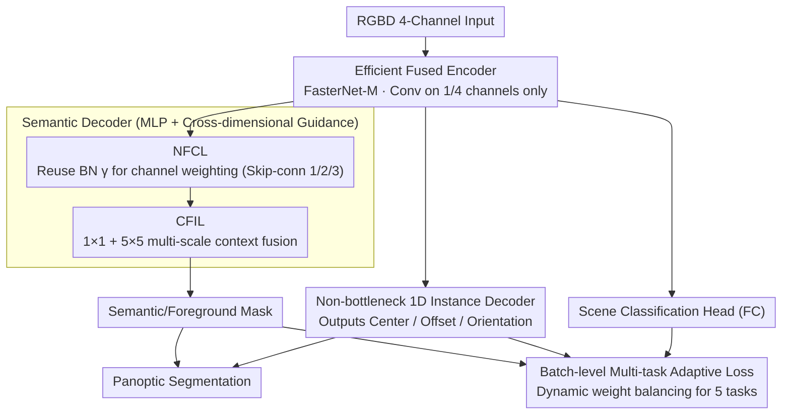

# Efficient RGB-D Scene Understanding via Multi-task Adaptive Learning and Cross-dimensional Feature Guidance

**Conference**: CVPR2026  
**arXiv**: [2603.07570](https://arxiv.org/abs/2603.07570)  
**Code**: Not yet open-sourced  
**Area**: Semantic Segmentation / Panoptic Segmentation / Multi-task Learning  
**Keywords**: RGB-D Scene Understanding, Multi-task Adaptive Learning, Cross-dimensional Feature Guidance, Panoptic Segmentation, Fused Encoder

## TL;DR

An efficient RGB-D multi-task scene understanding network is proposed. It utilizes an improved fused encoder to accelerate feature extraction by exploiting channel redundancy, designs a Normalized Focal Channel Layer (NFCL) and a Contextual Feature Interaction Layer (CFIL) for cross-dimensional feature guidance, and introduces a batch-level multi-task adaptive loss function to dynamically adjust weights. The model simultaneously performs semantic segmentation, instance segmentation, orientation estimation, panoptic segmentation, and scene classification on NYUv2/SUN RGB-D/Cityscapes datasets, achieving advantages in both accuracy and speed.

## Background & Motivation

1.  **Limitations of Single-task Models**: Traditional scene understanding methods mostly focus on a single task, preventing robots from comprehensive environment perception. Multi-task learning enables collaborative optimization through information sharing, but task complexity variances and fixed learning strategies make it difficult to adapt.
2.  **Inefficiency of Dual Encoders**: Methods like EMSANet use dual encoders to process RGB and Depth separately, failing to fully fuse complementary information. EMSAFormer uses a single Swin Transformer for joint extraction, but it suffers from high computational cost and frequent memory access, limiting inference speed.
3.  **Shallow Features Misleading MLP Decoders**: Lightweight semantic decoders based on MLP are efficient but can be misled by noise and errors in the shallow layers of the encoder, affecting local detail representation.
4.  **Insufficient Local-Global Fusion**: MLP decoders excel at global feature mapping but lack the ability to fuse local information and multi-scale context, leading to inaccurate boundary segmentation in complex scenes.
5.  **Instance Decoder Parameter Efficiency**: Bottleneck structures reduce parameters via dimensionality reduction but lose feature diversity. Depthwise separable convolutions suffer from frequent memory access. A better balance between parameter efficiency and non-linear expression is needed.
6.  **Fixed Loss Weights Incompatible with Dynamic Scenarios**: Existing multi-task learning methods either assign weights randomly, leading to instability, or adjust based only on the first batch, lacking real-time adaptation to task importance changes during training.

## Method

### Overall Architecture

The core problem addressed is enabling a robot to perform five tasks—semantic segmentation, instance segmentation, panoptic segmentation, orientation estimation, and scene classification—within a single model without sacrificing inference speed. The data flow starts with an RGBD four-channel image processed by an improved fused encoder. Features are then sent to three decoders: a semantic decoder (with NFCL and CFIL) for semantic/foreground masks, an instance decoder for instance centers and offsets, and a fully connected head for scene classification. Semantic and instance outputs are combined for panoptic segmentation. All tasks share the encoder and are balanced by a batch-level adaptive loss.

### Key Designs

**1. Efficient Fused Encoder: Reducing FLOPs to 1/16 via Channel Redundancy**

To address the high computational cost of Swin Transformers in EMSAFormer, the fused encoder follows the FasterNet-M architecture with a 4-stage structure. Each stage uses a $4 \times 4$ convolution for expansion and downsampling. Based on the observation of high channel similarity, each fusion block performs convolution on only $1/4$ of the channels and concatenates the remaining channels, reducing FLOPs to $1/16$ of a regular convolution. Pointwise convolutions then capture inter-channel relationships. To reuse ImageNet pre-trained weights, the depth channel weight is derived from RGB as $D = (R+G+B)/2$.

**2. Normalized Focal Channel Layer (NFCL): Preventing Misleading Shallow Features**

The NFCL reuses the learned scaling factor $\gamma$ from BN layers to measure channel importance. Absolute values $|\gamma|$ are normalized into weights $W_i = |\gamma_i| / \sum_j |\gamma_j|$. Features are reshaped to $B \times H \times W \times C$, multiplied by weights, activated by Sigmoid, and combined with the input. NFCL is applied only to skip-connections in stages 1, 2, and 3, effectively providing "free" channel attention without extra parameters or SE-module overhead.

**3. Contextual Feature Interaction Layer (CFIL): Enhancing Local-Global Fusion**

CFIL compensates for the MLP decoder's weakness in local and multi-scale contextual fusion. It applies $1 \times 1$ and $5 \times 5$ adaptive average pooling to capture context, reduces channels from $C$ to $C/2$ via convolution, upsamples for resolution alignment, and concatenates with the original input. This module is placed at the multi-layer feature fusion stage of the semantic decoder.

**4. Non-bottleneck 1D Instance Decoder: Parameter Efficiency without Losing Non-linearity**

Instead of using Bottlenecks (which lose diversity) or depthwise separable convolutions (which are slow), this design decomposes each $3 \times 3$ 2D convolution into $3 \times 1$ and $1 \times 3$ 1D convolutions with an intermediate ReLU. This reduces parameters by ~30% for a kernel size of 3 and enhances non-linear decision-making. The decoder consists of three layers, each featuring a $3 \times 3$ conv, three non-bottleneck 1D modules, and upsampling, with pyramid supervision.

**5. Batch-level Multi-task Adaptive Loss: Real-time Weight Adjustment**

To solve the instability of fixed or random weights, the model calculates relative loss $RL_k = L_k / \sum_t L_t$ at the end of each batch and maintains historical means $AvgRL_k$. Weights are dynamically updated as $W_k = \max(\bar{W}_k \times (AvgRL_k)^\alpha, W_{min})$. Using $\alpha = 0.01$ and $W_{min} = 0.1$ ensures the model adapts to task importance shifts in real-time while preventing any task from being ignored.

### Loss & Training

Specific losses include Cross-Entropy for semantic segmentation and scene classification, MSE for instance centers, MAE for instance offsets, and a Cosine-Sine probability distribution loss for orientation estimation. These are aggregated using the batch-level adaptive weights.

## Key Experimental Results

### Main Results: NYUv2 Dataset SOTA Comparison

| Method | Modality | Backbone | Semantic mIoU |
|------|------|------|:---:|
| EMSAFormer | RGB-D | Swin v2 | 49.76 |
| MMANet | RGB-D | R34-NBt1D | 49.62 |
| Malleable 2.5D | RGB-D | ResNet50 | 49.70 |
| **Ours** | **RGB-D** | **FasterNet-M** | **49.82** |

### Multi-dataset Semantic mIoU Summary

| Dataset | EMSAFormer | Ours | Gain |
|--------|:---:|:---:|:---:|
| NYUv2 | 49.76 | **49.82** | +0.06 |
| SUN RGB-D | 44.13 | **45.56** | +1.43 |
| Cityscapes | 60.76 | **65.11** | +4.35 |

### Model Complexity Comparison

| Method | Params | FLOPs | FPS | Memory |
|------|:---:|:---:|:---:|:---:|
| EMSAFormer (Swin v2) | 72.08M | 50.66G | 16.32 | 3188 MiB |
| MPViT | 92.76M | 235.24G | 9.94 | 5266 MiB |
| **Ours** | **71.82M** | 75.28G | **20.33** | 3293 MiB |

### Ablation Study (NYUv2)

-   Fused Encoder -> Instance PQ 58.59 (Significant speed gain over Swin v2 baseline).
-   +Adaptive Loss -> Instance PQ 59.37, improvement across 6 metrics.
-   +CFIL -> Semantic mIoU 49.72 (+2.0), improvement across 8 metrics.
-   +NFCL -> Panoptic PQ 43.21, final model Semantic mIoU 49.82, Instance PQ 59.90.
-   Adjustment Factor: $\alpha=0.01$ yielded best panoptic PQ (41.81); $\alpha=0.1$ was unstable.
-   NFCL Layers: Optimal at stages 1/2/3; no gain at stage 4 as features are already refined.

## Highlights & Insights

1.  **Channel Redundancy Utilization**: Performing convolution on only $1/4$ of the channels efficiently extracts features while reducing FLOPs significantly.
2.  **BN $\gamma$ as Channel Attention**: Leverages existing BN parameters for channel importance without adding extra parameters or SE-module costs.
3.  **Batch-level Adaptive Loss**: Real-time dynamic adjustments per batch provide more stability and faster convergence compared to epoch-level or random weighting.
4.  **Unified 5-Task Framework**: Completes semantic, instance, orientation, panoptic, and scene classification tasks in a single network.
5.  **Efficiency and Speed**: 71.82M parameters and 20.33 FPS, outperforming Swin v2-based methods, making it suitable for robot deployment.

## Limitations & Future Work

1.  **Marginal Accuracy Gains**: On NYUv2, semantic mIoU is only 0.06 higher than EMSAFormer.
2.  **High-Resolution Scalability**: Complexity grows with resolution, making ultra-high-res or video processing challenging.
3.  **Idealized Depth Noise Assumptions**: The model assumes calibrated RGB-D input and does not address consumer-grade sensor issues like reflections or sparse boundaries.
4.  **Lack of Temporal Consistency**: Frame-by-frame processing may lead to flickering in dynamic video streams.
5.  **Information Loss in Encoder**: Using only $1/4$ channels for convolution might miss some fine-grained inter-channel interactions.
6.  **Single Modality Constraint**: Does not explore other modalities such as thermal or point clouds for robustness.

## Related Work & Insights

-   **vs EMSAFormer**: Replaces Swin v2 with FasterNet-M, achieving fewer parameters and 24% faster inference (20.33 vs 16.32 FPS) with comparable accuracy.
-   **vs EMSANet**: Shares the non-bottleneck 1D philosophy but specializes it for the instance decoder and adds cross-dimensional guidance.
-   **vs SegFormer**: Inherits the lightweight MLP decoder but identifies and fixes shallow feature misleading via NFCL.
-   **vs FasterNet**: Extends the partial convolution concept to an RGB-D 4-channel fusion encoder.

## Rating

-   Novelty: ⭐⭐⭐ — Components are logical improvements of existing techniques (Channel redundancy + BN attention + Adaptive loss).
-   Experimental Thoroughness: ⭐⭐⭐⭐ — Comprehensive testing across three datasets and detailed ablation studies.
-   Writing Quality: ⭐⭐⭐⭐ — Clear structure, rich visualization, and complete derivations.
-   Value: ⭐⭐⭐ — High practical utility for resource-constrained robotics, though academic contribution is incremental.

<!-- RELATED:START -->

## Related Papers

- [\[CVPR 2026\] RDNet: Region Proportion-Aware Dynamic Adaptive Salient Object Detection Network in Optical Remote Sensing Images](rdnet_region_proportion-aware_dynamic_adaptive_salient_object_detection_network_.md)
- [\[CVPR 2026\] SARMAE: Masked Autoencoder for SAR Representation Learning](sarmae_masked_autoencoder_for_sar_representation_learning.md)
- [\[CVPR 2026\] SAM2Text: Towards Prompt-Free and Multi-Resolution Video Scene Text Segmentation](sam2text_towards_prompt-free_and_multi-resolution_video_scene_text_segmentation.md)
- [\[CVPR 2026\] Cross-Domain Few-Shot Segmentation via Multi-view Progressive Adaptation](cross-domain_few-shot_segmentation_via_multi-view_progressive_adaptation.md)
- [\[CVPR 2026\] V²-SAM: Marrying SAM2 with Multi-Prompt Experts for Cross-View Object Correspondence](v2-sam_marrying_sam2_with_multi-prompt_experts_for_cross-view_object_corresponde.md)

<!-- RELATED:END -->
