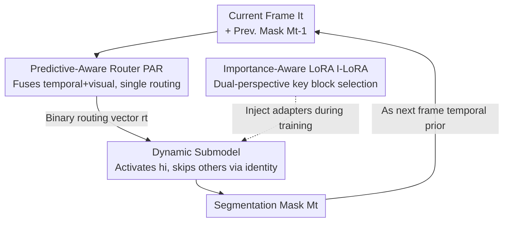

# Efficient Video Object Segmentation and Tracking with Recurrent Dynamic Submodel

**Conference**: CVPR 2026  
**Paper**: [CVF Open Access](https://openaccess.thecvf.com/content/CVPR2026/html/Tang_Efficient_Video_Object_Segmentation_and_Tracking_with_Recurrent_Dynamic_Submodel_CVPR_2026_paper.html)  
**Code**: TBD  
**Area**: Video Object Segmentation  
**Keywords**: Video Object Segmentation, Dynamic Networks, SAM2 Acceleration, Block Skipping, LoRA Fine-tuning  

## TL;DR
To address the slow inference speeds of large video segmentation models like SAM2, this paper introduces a "Predictive-Aware Router" (taking the previous segmentation mask and current visual features) to activate only a specific subset of blocks per frame. Combined with "Importance-Aware LoRA" that fine-tunes only critical blocks, it achieves a 1.3× real-world speedup on DAVIS 2017 with a performance drop of <0.4%, training only 3% of the parameters.

## Background & Motivation
**Background**: State-of-the-art (SOTA) Video Object Segmentation and Tracking (VOST) increasingly relies on vision foundation models like SAM2. While these models offer strong zero-shot generalization and stable tracking, their massive computational overhead makes real-time deployment difficult in resource-constrained scenarios.

**Limitations of Prior Work**: Existing efficiency methods follow two main paths, both with drawbacks. First, **static pruning** (e.g., SlimSAM, PBD) removes fixed channels or blocks regardless of the specific frame; however, different tasks and frames prefer different "key blocks." As shown in Figure 1(a), two static models with identical pruning rates may have similar average accuracy but vastly different per-frame performance, indicating that a "one-size-fits-all" approach is suboptimal. Second, **dynamic networks** (e.g., AdaViT, DyT) assign a lightweight router to each block to decide activation based on intermediate features. While theoretical FLOPs decrease, the cumulative overhead of "dense routing" often results in slower real-world inference (Figure 1(b)).

**Key Challenge**: Static methods ignore temporal heterogeneity, while dynamic methods struggle with dense routing overhead. Furthermore, most methods treat videos as a collection of independent images, failing to leverage the **temporal correlation** between adjacent frames. SAM2’s own memory mechanism demonstrates that the previous frame's prediction is a powerful prior for the current one.

**Goal**: (1) Enable frame-adaptive block selection with minimal routing overhead for real-world speedup; (2) Explicitly incorporate temporal priors into routing decisions; (3) Minimize the parameter count required to adapt to this dynamic architecture.

**Key Insight**: The authors observe that SAM2 segmentation is conditional on historical memory ($M_t = D(E(I_t, M_{t-1}))$). The previous mask $M_{t-1}$ naturally indicates target location and appearance, serving as a free temporal routing signal. Additionally, block importance is non-uniform, with a "core subset" of blocks being universally critical across samples.

**Core Idea**: Replace multiple routers with a single **Predictive-Aware Router** that fuses the previous mask and current features to output a complete block activation plan for the entire model. Use **Importance-Aware LoRA (I-LoRA)** to inject trainable parameters only into core blocks, minimizing adaptation costs.

## Method

### Overall Architecture
RDS (Recurrent Dynamic Submodel) adds two components to a frozen SAM2 encoder. During inference for each frame $I_t$, the current patch embeddings $X_t$ and the previous mask $M_{t-1}$ are fused into a spatio-temporal feature $Y_t$. This is fed into a **single** Predictive-Aware Router (PAR), which outputs a binary routing vector of length $L$ ($L=48$ for SAM2), deciding which blocks to activate or skip. Skipped blocks use identity mappings. This ensures that only a "submodel" is executed per frame. At the training side, **Importance-Aware LoRA (I-LoRA)** identifies the most critical blocks offline and restricts fine-tuning to these adapters and the router.

The system is a recurrent structure where the output mask serves as the prior for the next frame's routing decision.

### Key Designs

**1. Predictive-Aware Router (PAR): Using Mask as Temporal Prior with Single-Pass Routing**

PAR addresses the overhead of dense routing and the neglect of temporal cues. It takes two inputs: current patch embeddings $X_t \in \mathbb{R}^{H\times W\times C}$ and the previous binary mask $M_{t-1} \in \{0,1\}^{H\times W\times 1}$. They are fused via:

$$Y_t = F(X_t, M_{t-1}) = \alpha \cdot f(M_{t-1}) + g(X_t)$$

where $\alpha$ is a learnable scalar, and $f, g$ are convolutions for alignment. The combined feature $Y_t$ passes through a router $\phi$ (convolutions + pooling + linear) to produce logits $l_t \in \mathbb{R}^L$. 

To enable end-to-end training of discrete decisions, the authors use Straight-Through Estimator (STE) with Bernoulli sampling. Logits are normalized using a target activation ratio $\beta\in(0,1]$ to obtain probabilities:

$$\tilde{w}^i_t = \min\!\left(\frac{\beta \cdot L \cdot \sigma(l^i_t)}{\sum_{j=1}^{L}\sigma(l^j_t)},\ 1.0\right)$$

This normalization naturally constrains the expected number of active blocks to approximately $\beta L$, eliminating the need for complex sparse penalty losses. A small subset of "core blocks $K$" is kept permanently active for stability. Binary decisions $r^i_t$ are sampled for other blocks. Feature propagation for block $i$ is defined as $X^{i+1}_t = r^i_t \cdot h_i(X^i_t) + (1-r^i_t)\cdot X^i_t$. Unlike prior work, the **router is executed only once per model**, reducing routing latency from ~17.2 ms to ~0.5 ms (Table 4).

**2. Importance-Aware LoRA (I-LoRA): Dual-Perspective Identification of Core Blocks**

To minimize adaptation costs, only the most critical blocks receive LoRA adapters. Importance is measured via two complementary perspectives:

- **Global Importance** $I^i_G$: Measures the impact of removing block $i$ on the final J&F score: $I^i_G = \mathbb{E}[\text{J\&F}(O) - \text{J\&F}(O^i)]$.
- **Local Importance** $I^i_L$: Measures the feature transformation magnitude via cosine similarity: $I^i_L = 1 - \mathbb{E}\!\left[\frac{\langle X^i, X^{i+1}\rangle}{\|X^i\|\cdot\|X^{i+1}\|}\right]$. 

Blocks are ranked by $s(i) = -(r_G(i)+r_L(i))$. LoRA adapters are injected into $W_Q, W_K, W_V, W_O$ and MLP weights $W_U, W_D$ for the top blocks. PAR enables fast inference, while I-LoRA enables efficient training.

**3. Training Strategy: Normalization Over Sparse Penalties**

Training involves two steps: (i) **I-LoRA Identification**—using a small subset of data to locate core blocks; (ii) **Dynamic Component Fine-tuning**—jointly training the router and adapters. Fixed $\beta$ during training provides a precise compute budget. Inference uses Bernoulli sampling (stochastic) or thresholding (deterministic, $\tau=0.5$).

## Key Experimental Results

### Main Results
Comparing RDS with other strategies on SAM2 for DAVIS 2017:

| Method | Tunable Params (M) | Training Data | FLOPs (G)↓ | FPS↑ | J&F↑ |
|------|------|------|------|------|------|
| SAM2 (Base) | 224 | 100% | 819 | 29.8 | 90.0 |
| SlimSAM | 147 | >5% | 547 | 33.4 | 87.8 |
| PBD | 7.6 | <0.03% | 500 | 39.8 | 85.6 |
| DyT | 20.5 | <0.03% | 629 | 22.3 | **90.2** |
| AdaViT | 9.6 | <0.03% | 528 | 26.3 | 88.3 |
| **RDS (Ours)** | **7.6** | **<0.03%** | **500** | **38.2** | **89.6** |

RDS achieves 38.2 FPS (1.3× speedup) with only 7.6M parameters (3% of total), while J&F remains high at 89.6. Models like DyT have higher J&F but are actually slower than the original SAM2 due to routing overhead.

**Cross-model Transferability**:
| Model | Config | DAVIS J&F | SA-V G | YTVOS | FPS |
|------|------|------|------|------|------|
| SAM2 | Base | 90.0 | 78.5 | 88.5 | 29.8 |
| SAM2 | w/ RDS₀.₆ | 89.6 | 74.3 | 86.0 | 38.2 |
| SAMURAI | Base | 90.1 | 78.8 | 88.3 | 28.5 |
| SAMURAI | w/ RDS₀.₆ | 90.1 | 74.7 | 85.6 | 35.7 |

### Ablation Study
| Config | Result | Insight |
|------|---------|------|
| Single vs. Dense Router | Latency 17.2ms → 0.5ms | Critical for real acceleration (Table 4) |
| Input: Image only | J&F drop | Susceptible to background clutter |
| Input: Mask only | J&F drop | Fails to capture appearance changes |
| Input: Fusion (Ours) | **89.6** | Best balance of temporal prior + visual cues |
| I-LoRA: Dual-view | **89.6** | Better than using Global or Local alone |

### Key Findings
- **Real speedup depends on routing frequency**: Reducing routing from a per-block task to a per-model task is the key to converting theoretical FLOP savings into wall-clock speedup.
- **Short-term temporal priors are sufficient**: Using only the previous frame $M_{t-1}$ is nearly as effective as using a longer window ($M_{t-1..t-4}$).
- **Block importance is depth-independent**: Active blocks are distributed throughout the model, confirming that key blocks are a sparse core subset rather than concentrated in shallow/deep layers.

## Highlights & Insights
- **Diagnosing the "Theoretical vs. Real" Gap**: The paper explicitly measures routing latency, identifying it as the primary bottleneck in dynamic networks.
- **Compute Constraints via Normalization**: Normalizing probabilities based on $\beta$ simplifies the training process by removing sensitive sparse loss coefficients.
- **"Zero-cost" Temporal Prior**: Reusing the previous frame's mask—which is already generated by SAM2—provides an effective routing signal without extra overhead.

## Limitations & Future Work
- **Generalization on Large Datasets**: RDS shows a larger performance drop on SA-V (e.g., 78.5 → 74.3) compared to DAVIS, suggesting limitations in complex long-form videos.
- **Static vs. Adaptive $\beta$**: The current activation ratio $\beta$ is fixed per run; making this adaptive (activating more blocks for hard frames) could further optimize the efficiency-accuracy frontier.
- **Threshold Calibration**: Deterministic deployment relies on threshold $\tau$, which may require domain-specific recalibration.

## Related Work & Insights
- **vs. Static Pruning (SlimSAM/PBD)**: Static methods are frame-agnostic. RDS adapts per-frame, achieving higher accuracy for the same compute budget.
- **vs. Dynamic Block/Token Skipping**: RDS avoids the "negative acceleration" of dense routing by using a single-pass router and using masks as temporal priors.
- **vs. Full Fine-tuning**: I-LoRA reduces GPU memory and training time by identifying and adapting only the core functional blocks.

## Rating
- Novelty: ⭐⭐⭐⭐ (Single-pass router with temporal priors effectively solves dynamic network overhead)
- Experimental Thoroughness: ⭐⭐⭐⭐ (Extensive ablations on routing latency and cross-model transfer)
- Writing Quality: ⭐⭐⭐⭐ (Clear motivation and well-structured evidence)
- Value: ⭐⭐⭐⭐ (Practical utility for deploying SAM2-based models on edge devices)

<!-- RELATED:END -->

## Related Papers

- [\[CVPR 2026\] InterRVOS: Interaction-Aware Referring Video Object Segmentation](interrvos_interaction-aware_referring_video_object_segmentation.md)
- [\[CVPR 2026\] SDDF: Specificity-Driven Dynamic Focusing for Open-Vocabulary Camouflaged Object Detection](sddf_specificity-driven_dynamic_focusing_for_open-vocabulary_camouflaged_object.md)
- [\[CVPR 2026\] RAVEN: Radar Adaptive Vision Encoders for Efficient Chirp-wise Object Detection and Segmentation](raven_radar_adaptive_vision_encoders_for_efficient_chirp-wise_object_detection_a.md)
- [\[CVPR 2026\] CaptionFormer: Unified Segmentation, Tracking, and Captioning for Spatio-Temporal Objects](captionformer_unified_segmentation_tracking_and_captioning_for_spatio-temporal_o.md)
- [\[CVPR 2026\] Reinforcing Video Object Segmentation to Think before it Segments](reinforcing_video_object_segmentation_to_think_before_it_segments.md)

<!-- RELATED:END -->

<!-- RELATED:START -->

## Related Papers

- [\[CVPR 2026\] Weakly-Supervised Referring Video Object Segmentation through Text Supervision](wsrvos_weakly_supervised_rvos.md)
- [\[CVPR 2026\] CaptionFormer: Unified Segmentation, Tracking, and Captioning for Spatio-Temporal Objects](captionformer_unified_segmentation_tracking_and_captioning_for_spatio-temporal_o.md)
- [\[CVPR 2026\] Annotation-Efficient Coreset Selection for Context-dependent Segmentation](annotation-efficient_coreset_selection_for_context-dependent_segmentation.md)
- [\[CVPR 2026\] LEMMA: Laplacian Pyramids for Efficient Marine Semantic Segmentation](lemma_laplacian_pyramids_for_efficient_marine_semantic_segmentation.md)
- [\[CVPR 2026\] MixerCSeg: An Efficient Mixer Architecture for Crack Segmentation via Decoupled Mamba Attention](mixercseg_an_efficient_mixer_architecture_for_crack_segmentation_via_decoupled_m.md)

<!-- RELATED:END -->
