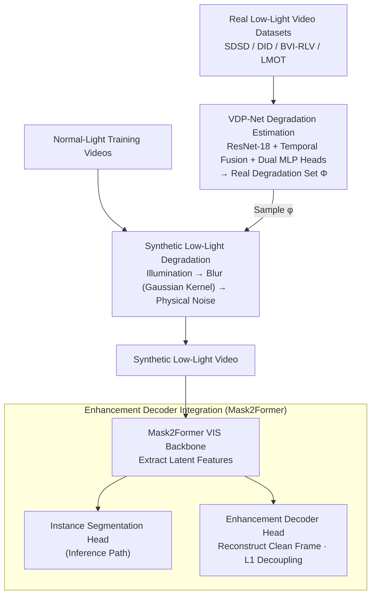

# ELVIS: Enhance Low-Light for Video Instance Segmentation in the Dark

**Conference**: CVPR 2026  
**arXiv**: [2512.01495](https://arxiv.org/abs/2512.01495)  
**Code**: [joannelin168.github.io/research/ELVIS](https://joannelin168.github.io/research/ELVIS)  
**Area**: Semantic Segmentation  
**Keywords**: Low-light video instance segmentation, synthetic low-light pipeline, degradation estimation, domain adaptation, enhancement decoder

## TL;DR

ELVIS proposes the first low-light Video Instance Segmentation (VIS) framework, which achieves gains of +3.7 AP and +2.8 AP on synthetic and real low-light videos, respectively. This is accomplished through a physics-driven synthetic low-light video pipeline with motion blur modeling, an uncalibrated degradation parameter estimation network (VDP-Net), and an enhancement decoder integrated into the VIS architecture for degradation-content decoupling.

## Background & Motivation

Video Instance Segmentation in low-light conditions is a critical yet under-researched problem with broad applications in autonomous driving, wildlife conservation, and surveillance. The field faces several challenges:

**Lack of annotated data**: Degradation in low-light conditions makes both manual and automatic annotation extremely difficult, and no public benchmarks specifically for low-light VIS exist.

**Incomplete synthetic pipelines**: Existing low-light synthesis methods are primarily designed for images, ignoring the motion blur degradation caused by long shutter speeds in low-light videos.

**Lack of robustness in existing VIS methods**: SOTA VIS methods are not designed for low-light degradation and perform poorly even after fine-tuning on synthetic low-light data.

**Limitations of prior work**: Pipelines that perform enhancement followed by segmentation are limited by the immature nature of low-light video enhancement itself.

**Core Idea**: Design an end-to-end domain adaptation framework that includes a physically realistic synthetic low-light video pipeline and a degradation-content decoupling mechanism to adapt existing VIS models to low-light scenarios.

## Method

### Overall Architecture

ELVIS is a domain adaptation framework designed to adapt existing VIS models to low-light scenarios, consisting of two components in sequence. In the **offline stage**, VDP-Net unsupervisedly estimates degradation parameters from real low-light video datasets (SDSD, DID, BVI-RLV, LMOT) to compile a real degradation parameter set $\Phi$. In the **training stage**, the synthetic low-light pipeline samples parameters $\phi$ from $\Phi$ and degrades normal-light training videos into low-light videos in real-time according to a physical degradation model: "Illumination Adjustment → Blurring → Noise". These low-light videos are fed into a VIS network (using Mask2Former as the backbone) integrated with an enhancement decoder. The segmentation head outputs instance masks, while the enhancement decoder head forces the backbone to decouple degradation from scene content by reconstructing normal-light frames. During inference, only the segmentation branch is retained, and the enhancement decoder adds no overhead.

### Key Designs

1.  **Synthetic Low-Light Video Degradation Model**: Fully models the physical process from normal-light to low-light.

    Final degradation formula: $X^{low} = Deg(X^{high}, \phi) = H * (2^\epsilon X^{high}) + N$

    Includes three types of degradation:
    -   **Illumination Adjustment**: First converted to XYZ color space to ensure linearity, then brightness is reduced according to the exposure value $\epsilon$: $X' = 2^\epsilon X$.
    -   **Blurring Degradation** (First introduced here for low-light video synthesis): Uses a multivariate Gaussian distribution to model the joint effect of motion blur and defocus blur, requiring only 3 parameters $(\sigma_{Hx}, \sigma_{Hy}, \theta_H)$. Defocus blur occurs when $\sigma_{Hx} = \sigma_{Hy}$.
    -   **Physical Noise**: Four types—read noise (Gaussian), shot noise (Poisson), quantization noise (Uniform), and row/column noise (Gaussian).

    Degradation parameter vector: $\phi = \{\epsilon, \sigma_r, K, \lambda_q, \sigma_b, \theta_b, \sigma_{Hx}, \sigma_{Hy}, \theta_H\}$.

2.  **VDP-Net (Video Degradation analysis Network)**:

    -   **Unsupervised** estimation of degradation parameters $\phi$ from real low-light videos without camera calibration.
    -   Architecture: Lightweight ResNet-18 backbone + temporal fusion convolutional blocks + two MLP prediction heads.
    -   Two prediction heads work separately: one for exposure and noise (global degradation), and one for blur (local degradation).
    -   **Unsupervised training strategy**: Synthesize low-light inputs by uniformly sampling parameters and learn to reverse-estimate them.
    -   Loss function: $\mathcal{L}_{total} = \lambda_1 \|\phi - \phi'\|_1 + \lambda_2 (1 - \cos(|\theta_H - \theta_H'|))$, where cosine angle loss handles the periodicity of the blur angle.

3.  **Enhancement Decoder Integration**:

    -   Integrates an enhancement decoder head into the Mask2Former segmentation module.
    -   The decoder uses a multi-scale deformable attention pixel decoder (10-layer Transformer decoder + bilinear upsampling) to reconstruct normal-light frames.
    -   An additional L1 loss (clean frame vs. reconstructed frame) is added during training to guide the network in decoupling scene content from degradation in the latent feature space.
    -   Inference only uses the segmentation output; the decoder adds no inference overhead.

### Loss & Training

-   During VIS training, parameters are sampled from the pre-generated real degradation parameter set $\Phi$ (estimated from SDSD, DID, BVI-RLV, and LMOT) to synthesize low-light versions of training videos on-the-fly.
-   The extra L1 loss for the enhancement decoder is joint-trained with the original VIS segmentation loss.
-   The VDP-Net training phase uses uniformly sampled degradation parameters within reasonable upper bounds determined by domain experts.

## Key Experimental Results

### Main Results

**Synthetic Low-Light YouTube-VIS 2019 Validation Set**

| Method | Backbone | ELVIS | AP | AP50 | AP75 |
| :--- | :--- | :--- | :--- | :--- | :--- |
| MinVIS | ResNet-50 | ✗ | 36.4 | 57.3 | 36.4 |
| MinVIS | ResNet-50 | ✓ | 37.2 | 57.0 | 39.6 |
| GenVIS | ResNet-50 | ✗ | 39.1 | 58.4 | 42.7 |
| GenVIS | ResNet-50 | ✓ | **41.0** | **59.8** | **46.2** |
| DVIS++ | ResNet-50 | ✗ | 38.8 | 59.9 | 42.8 |
| DVIS++ | ResNet-50 | ✓ | **42.5** | **63.8** | **46.6** |
| DVIS++ | ViT-L | ✗ | 55.2 | 77.2 | 62.1 |
| DVIS++ | ViT-L | ✓ | **56.9** | **78.7** | **65.3** |

Maximum gain is **+3.7 AP** (DVIS++ R50).

**Real Low-Light Video Evaluation (LMOT-S)**

| Method | ELVIS | AP | AP50 | AR10 |
| :--- | :--- | :--- | :--- | :--- |
| GenVIS R50 | ✗ | 6.6 | 14.5 | 9.8 |
| GenVIS R50 | ✓ | 6.7 | 15.5 | 12.1 |
| DVIS++ ViT-L | ✗ | 10.0 | 21.4 | 13.1 |
| DVIS++ ViT-L | ✓ | **10.5** | **22.6** | **14.5** |

### Ablation Study

**Comparison with two-stage baselines (ELVIS-S and LMOT-S)**

| Method | ELVIS-S AP | LMOT-S AP |
| :--- | :--- | :--- |
| SDSD-Net (Enhance → Seg) | 46.7 | 2.5 |
| StableLLVE (Enhance → Seg) | 57.3 | 3.9 |
| DarkIR (Enhance → Seg) | 55.9 | 3.8 |
| **Ours** | **58.0** | **6.7** |

Ours outperforms the best two-stage method on LMOT-S by **+2.8 AP**.

**Synthesis Pipeline Comparison**

| Synthesis Pipeline | ELVIS-S AP | LMOT-S AP |
| :--- | :--- | :--- |
| Lv et al. | 53.5 | 5.1 |
| Cui et al. | 51.1 | 5.7 |
| Ours (random $\phi$) | 39.9 | 4.7 |
| **Ours (VDP-Net $\phi$)** | **54.5** | **6.6** |

Parameters estimated by VDP-Net provide a gain of +14.6 AP / +1.9 AP over random sampling, proving the importance of matching the real degradation distribution.

### Key Findings

-   ELVIS consistently improves all VIS methods and backbones, demonstrating the framework's universality.
-   The enhancement decoder significantly improves AP75 (strict metric) via degradation-content decoupling, indicating substantial improvements in fine segmentation quality.
-   Including blur modeling in the synthesis pipeline is crucial, as existing pipelines ignore this inherent low-light video degradation.
-   The unsupervised training strategy for VDP-Net is effective in extracting real degradation distributions from real low-light videos.

## Highlights & Insights

-   **Physics-driven low-light video synthesis**: For the first time, motion blur is modeled in the synthesis pipeline (via multivariate Gaussian kernels), addressing the limitation of existing methods that only consider noise. The constraint of blur direction to $[0, \pi]$ accounts for the bidirectional nature of motion blur kernels.
-   **Degradation-content decoupling**: By using an auxiliary reconstruction task with an enhancement decoder, the VIS backbone is forced to learn degradation-agnostic feature representations. This approach is more elegant than two-stage methods.
-   **Uncalibrated degradation estimation**: VDP-Net does not require camera metadata (model, ISO, etc.) and can be used on any dataset. The use of cosine angle loss to handle periodic parameters is a clever design.
-   **Zero inference overhead**: The enhancement decoder is used only during training, ensuring no additional computational cost during inference.

## Limitations & Future Work

-   Limited evaluation data for real low-light VIS (ELVIS-S is only 250 frames; LMOT-S uses pseudo-labels); a larger-scale real low-light VIS benchmark is needed.
-   The synthesis pipeline does not model spatial correlation artifacts introduced by ISPs (compression, demosaicing, in-camera denoising, etc.), which may be significant in real scenarios.
-   VDP-Net assumes uniform degradation parameters within a video clip, whereas degradation in real low-light videos may vary across space and time.
-   The framework has only been validated on Mask2Former-based VIS methods; the applicability to other architectures (e.g., tracking-based methods) remains unexplored.
-   Absolute AP on real low-light data remains low (<11%), indicating that low-light VIS is still highly challenging.

## Related Work & Insights

-   The synthetic low-light pipeline design can be generalized to other low-light downstream tasks (detection, tracking, depth estimation, etc.).
-   The degradation-content decoupling idea can be applied to domain adaptation for other degradation conditions (fog, rain, underwater, etc.).
-   VDP-Net's unsupervised degradation estimation can be used independently to provide scene-adaptive degradation parameters for low-light enhancement methods.
-   Complementary to RAW-domain methods (which require raw sensor data), ELVIS operates directly in the sRGB domain, making it more practical.

## Rating

-   **Novelty**: ⭐⭐⭐⭐ — First low-light VIS framework; blur modeling in the synthesis pipeline is novel.
-   **Experimental Thoroughness**: ⭐⭐⭐⭐ — Tested across multiple VIS methods and backbones with both synthetic and real evaluations, though real data scale is limited.
-   **Writing Quality**: ⭐⭐⭐⭐ — Clear physical model derivation and complete framework presentation.
-   **Value**: ⭐⭐⭐⭐ — Fills a gap in low-light VIS and provides a reusable synthesis pipeline.

<!-- RELATED:START -->

## Related Papers

- [\[CVPR 2025\] LiVOS: Light Video Object Segmentation with Gated Linear Matching](../../CVPR2025/segmentation/livos_light_video_object_segmentation_with_gated_linear_matching.md)
- [\[CVPR 2026\] Phrase-Instance Alignment for Generalized Referring Segmentation](phrase-instance_alignment_for_generalized_referring_segmentation.md)
- [\[CVPR 2026\] MARIS: Marine Open-Vocabulary Instance Segmentation](maris_marine_open-vocabulary_instance_segmentation.md)
- [\[CVPR 2026\] DIMOS: Disentangling Instance-level Moving Object Segmentation](dimos_disentangling_instance-level_moving_object_segmentation.md)
- [\[CVPR 2026\] BiPA: Bilevel Prompt Adaptation for Underwater Instance Segmentation](bipa_bilevel_prompt_adaptation_for_underwater_instance_segmentation.md)

<!-- RELATED:END -->
