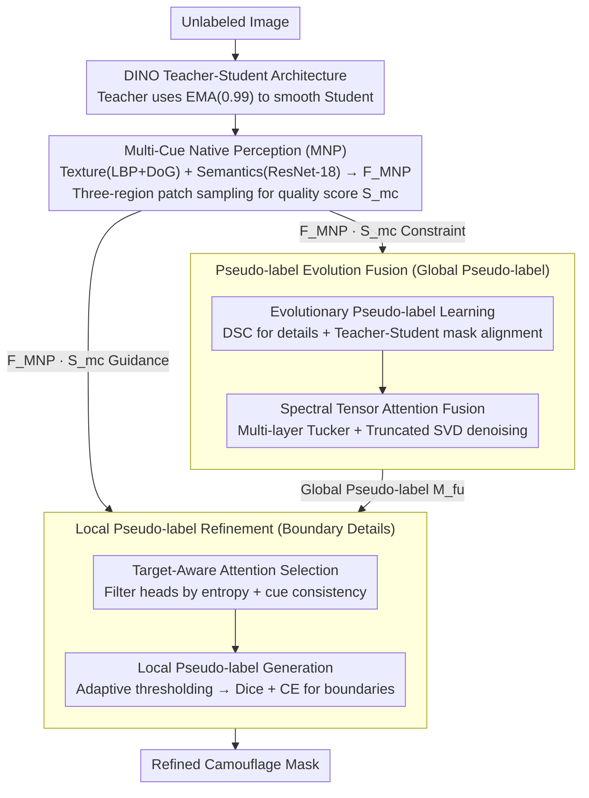

# EReCu: Pseudo-label Evolution Fusion and Refinement with Multi-Cue Learning for Unsupervised Camouflage Detection

**Conference**: CVPR 2026  
**arXiv**: [2603.11521](https://arxiv.org/abs/2603.11521)  
**Code**: [GitHub](https://github.com/JSLiam94/EReCu)  
**Area**: Unsupervised camouflaged object detection / Image segmentation  
**Keywords**: unsupervised camouflaged object detection, pseudo-label evolution, multi-cue perception, teacher-student, spectral attention fusion

## TL;DR

Ours proposes EReCu, a unified framework that utilizes Multi-cue Native Perception (MNP) to extract texture and semantic priors from the DINO teacher-student architecture. These priors guide Pseudo-label Evolution Fusion (PEF) and Local Pseudo-label Refinement (LPR) to recover boundary details. This work represents the first unification of pseudo-label guidance and feature learning paradigms in UCOD, achieving SOTA across four COD datasets.

## Background & Motivation

**Background**: Camouflaged Object Detection (COD) is highly challenging due to the high similarity between targets and backgrounds. Fully supervised methods rely on expensive pixel-level annotations, which limits dataset scale and ecological diversity. Current Unsupervised COD (UCOD) follows two paradigms: pseudo-label guidance and feature learning.

**Limitations of Prior Work**:

1. Pseudo-label guidance paradigms (e.g., UCOS-DA, UCOD-DPL) rely excessively on high-dimensional embeddings while ignoring native image cues, leading to boundary overflow and semantic drift.
2. Feature learning paradigms (e.g., SdalsNet, EASE) lack explicit pseudo-label supervision, resulting in blurred boundaries and lost details.
3. Both paradigms have fatal flaws and have not yet been unified—semantic reliability and texture fidelity are optimized in isolation.

**Key Challenge**: Pseudo-label guidance addresses "where" but with inaccurate boundaries, while feature learning addresses "what it looks like" but with blurry localization—the two are complementary, yet existing methods cannot utilize both simultaneously.

**Goal**: Construct a unified UCOD framework where pseudo-label reliability and feature fidelity synergistically evolve through a mutual feedback loop.

**Key Insight**: Extract multi-cue native perception (texture + semantics) from original images to simultaneously constrain pseudo-label semantic evolution and local detail refinement.

**Core Idea**: Drive both global evolution and local refinement of pseudo-labels using native image cues to achieve semantic-perceptual co-evolution.

## Method

### Overall Architecture

EReCu aims to bridge the two UCOD routes—"pseudo-label guidance" (good at localization but blurry boundaries) and "feature learning" (good details but unstable localization)—into a closed loop of mutual data feeding. The system is built on a DINO teacher-student architecture: the Teacher produces a stable version via EMA (momentum 0.99), while the Student refines the segmentation mask iteratively.

When an unlabeled image enters, MNP extracts texture and semantic native cues from **original pixels** rather than high-dimensional embeddings and calculates a quality score $S_{\text{mc}}$ to measure mask accuracy. These cues and scores drive two paths: PEF for global pseudo-label evolution and fusion, and LPR for boundary detail refinement. Inside PEF, EPL performs denoising through iterative student-teacher alignment, and STAF applies spectral fusion to multi-layer attention to suppress noise. LPR selects clean, focused attention heads from the Teacher to generate local pseudo-labels for boundary recovery. MNP constrains both paths, ensuring semantic reliability and texture fidelity rise together.

### Key Designs

**1. Multi-Cue Native Perception (MNP): Finding flaws in camouflage via original textures**

A common issue in prior work is focusing only on high-dimensional backbone embeddings, which often smooth out the subtle differences between target and background, leading to boundary overflow. MNP returns to the original image: it extracts low-level texture features $F_{\text{text}}$ using LBP + DoG and mid-level semantic features $F_{\text{sem}}$ using a frozen ResNet-18, concatenating them into $F_{\text{MNP}} = \mathcal{C}(F_{\text{text}}, F_{\text{sem}})$.

To turn this into a supervision signal, MNP partitions the image into internal $R_i$, boundary $R_s$, and external $R_o$ regions based on the current mask. It randomly samples $K\times K$ patches across these regions over $N$ rounds to calculate the corrected cosine similarity and aggregate the quality score:

$$S_{\text{mc}} = (D_{\text{io}} + D_{\text{is}} + S_{\text{so}}) / 3$$

The constraint loss is defined as $\mathcal{L}_{\text{MNP}} = 1 - S_{\text{mc}}$. The intuition is that even in perfect camouflage, subtle distinguishable texture differences exist between internal and external regions. Forcing low similarity between internal/external regions and mid-level transitions pushes the mask toward true boundaries. Random patch sampling addresses irregular shapes that fixed grids cannot capture.

**2. Pseudo-label Evolution Fusion (PEF): Mutual error correction between shallow details and deep semantics**

Pseudo-labels from a single layer often lack either semantics or detail. PEF uses EPL and STAF to solve this. EPL (Evolutionary Pseudo-label Learning) passes Student shallow features through Depthwise Separable Convolution (DSC) to recover spatial details ($M_s^{\text{dsc}}$), then iteratively aligns $M_s^{\text{dsc}}$ with pseudo-masks $M_s^p$ and $M_t^p$ from both branches while applying multi-cue constraints:

$$M_s^{\text{dsc}(r+1)} = \arg\min\big[\mathcal{L}_D(M_s^{\text{dsc}}, M_s^p) + \mathcal{L}_D(M_s^{\text{dsc}}, M_t^p) + \mathcal{L}_{\text{MNP}}\big]$$

STAF (Spectral Tensor Attention Fusion) addresses noisy single-layer attention maps. It stacks Student attention maps from three levels into a third-order tensor $\mathcal{T}_s \in \mathbb{R}^{3 \times C \times HW}$, applies Tucker decomposition followed by truncated SVD to retain only the top $t$ principal spectral components, resulting in a low-rank approximation $A_s^{\text{fu}} = P_t \Sigma_t Q_t^\top$. This naturally discards high-frequency noise while preserving shared semantics and structure, with a complexity of only $\mathcal{O}(r^2 d)$.

**3. Local Pseudo-label Refinement (LPR): Using attention head diversity for boundary recovery**

While global pseudo-labels locate the target center, they often miss boundary details. LPR leverages the spatial diversity of different Teacher attention heads. TAS (Target-Aware Attention Selection) calculates a focus entropy $E_k$ and retains heads that are both clean ($E_k < \tau_e$) and consistent with native cues ($S_{\text{mc}}(\hat{A}_k, F_{\text{MNP}}) > \tau_s$). Thresholds are learnable.

LPG (Local Pseudo-label Generation) applies an adaptive threshold $\tau_k = \mu_{A_k} + \alpha \cdot \sigma_{A_k}$ to selected heads to extract high-confidence regions. These form local pseudo-labels $P_k$, which guide the refinement of the global prediction $M_s^{\text{fu}}$ using Dice + CE losses.

### Loss & Training

Total Loss = EPL Dice loss (aligning student DSC mask with student/teacher pseudo-masks) + $\mathcal{L}_{\text{MNP}}$ (multi-cue constraint) + LPR Dice+CE loss (aligning fused prediction with local pseudo-labels). Training: 25 epochs, batch size 32, AdamW + Cosine Annealing, AMP. Backbone: DINO-ViT-S/8. Datasets: CAMO-Train (1000) + COD10K-Train (3040), unlabeled.

## Key Experimental Results

### Main Results

**Comparison with UCOD Methods (4 COD Datasets)**

| Method | Type | CHAMELEON $S_m$↑ | CAMO $S_m$↑ | COD10K $S_m$↑ | NC4K $S_m$↑ |
|------|------|-----------|----------|-----------|----------|
| FOUND | UOS | .7161 | .6913 | .6783 | .7459 |
| UCOS-DA | UCOD | .6715 | .6581 | .6334 | .7189 |
| UCOD-DPL | UCOD | .7287 | .7013 | .7090 | .7538 |
| SdalsNet | UCOD | .7236 | .6971 | .6967 | .7386 |
| **EReCu** | **UCOD** | **.7321** | **.7027** | **.7221** | **.7583** |

### Ablation Study

**Module Combinations (CAMO / COD10K $S_m$↑)**

| MNP | EPL | STAF | LPR | CAMO | COD10K |
|-----|-----|------|-----|------|--------|
| ✓ | ✓ | ✓ | ✓ | **.7027** | **.7221** |
| ✗ | ✓ | ✓ | ✓ | .6887 | .7111 |
| ✓ | ✗ | ✗ | ✓ | .6758 | .7038 |
| ✓ | ✓ | ✓ | ✗ | .6895 | .7109 |
| ✗ | ✗ | ✗ | ✗ | .6376 | .6400 |

### Key Findings

- The full module combination achieves UCOD SOTA across all major metrics on four datasets.
- PEF (including EPL+STAF) provides the largest contribution: removing it drops CAMO $S_m$ by 2.69% (.7027→.6758).
- The MNP + EPL combination yields the greatest complementary gain, validating the role of native cues in guiding pseudo-label evolution.
- Single or double module performance is significantly lower than the full combination, confirming strong complementarity.
- DINO baseline (no modules): CAMO $S_m = .6376$; our full model improves this by +.0651.

## Highlights & Insights

- Unifies the two UCOD paradigms into a synergistic evolution framework, which is conceptually robust.
- The $S_{\text{mc}}$ quality metric designed via the three-region (internal/boundary/external) patch sampling is ingenious and can be reused for mask quality estimation in other unsupervised tasks.
- STAF provides a lightweight and elegant solution ($\mathcal{O}(r^2d)$) for multi-scale feature aggregation using Tucker decomposition and SVD.
- The dual-condition selection in TAS (entropy + consistency) shows strong generalization capability.

## Limitations & Future Work

- Gains on certain datasets/metrics are marginal (e.g., +.0014 for CAMO $S_m$), and performance on COD10K MAE is comparable to UCOD-DPL.
- Validated only on DINO-ViT-S/8; larger backbones like DINOv2 remain unexplored.
- Texture descriptors in MNP (LBP, DoG) are hand-crafted; learning-based substitutes could be explored.
- The training overhead of multi-loss, Tucker/SVD, and EMA is non-trivial.
- Handling of multi-instance camouflage scenarios was not discussed.

## Related Work & Insights

- **vs UCOD-DPL**: Both use teacher-student dynamic pseudo-labels, but UCOD-DPL ignores native cues leading to overflow. EReCu introduces MNP for guidance and STAF for superior aggregation.
- **vs SdalsNet**: SdalsNet lacks pseudo-label supervision leading to blurry details. ERECu bridges both advantages.
- **vs FOUND**: FOUND uses a background-first paradigm which fails at fine-grained boundaries in high-similarity camouflage scenarios.
- **Insights**: The $S_{\text{mc}}$ metric can be applied in active learning to estimate mask quality for unlabeled samples. The pseudo-label evolution + native cue guidance paradigm is transferable to unsupervised saliency or medical image segmentation.

## Rating

- Novelty: ⭐⭐⭐⭐ Strong unification idea; individual module designs are innovative.
- Experimental Thoroughness: ⭐⭐⭐⭐ 4 datasets plus comprehensive ablation and visualization.
- Writing Quality: ⭐⭐⭐⭐ Clear framework diagram, complete formulas, and logical flow.
- Value: ⭐⭐⭐⭐ SOTA in UCOD with open-source code; $S_{\text{mc}}$ and STAF are reusable components.

<!-- RELATED:START -->

## Related Papers

- [\[ECCV 2024\] Learning Camouflaged Object Detection from Noisy Pseudo Label](../../ECCV2024/segmentation/learning_camouflaged_object_detection_from_noisy_pseudo_label.md)
- [\[CVPR 2026\] Uncertainty-Aware Modality Fusion for Unaligned RGB-T Salient Object Detection](uncertainty-aware_modality_fusion_for_unaligned_rgb-t_salient_object_detection.md)
- [\[NeurIPS 2025\] Towards Robust Pseudo-Label Learning in Semantic Segmentation: An Encoding Perspective](../../NeurIPS2025/segmentation/towards_robust_pseudo-label_learning_in_semantic_segmentation_an_encoding_perspe.md)
- [\[CVPR 2026\] Synthetic Object Compositions for Scalable and Accurate Learning in Detection, Segmentation, and Grounding](synthetic_object_compositions_for_scalable_and_accurate_learning_in_detection_se.md)
- [\[CVPR 2026\] PromptMoE: A Segmentation Refinement Framework Leveraging Mixture of Experts for Improved Prompting](promptmoe_a_segmentation_refinement_framework_leveraging_mixture_of_experts_for_.md)

<!-- RELATED:END -->
