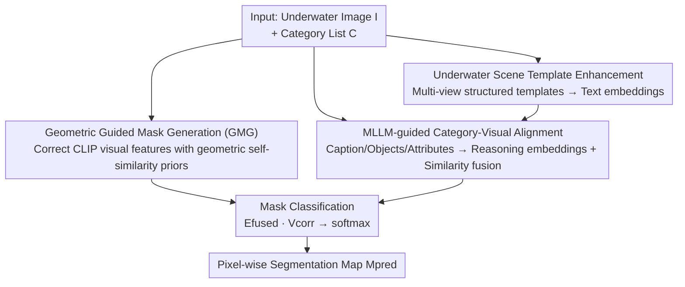

# Exploring the Underwater World Segmentation without Extra Training

**Conference**: CVPR 2026  
**Paper**: [CVF Open Access](https://openaccess.thecvf.com/content/CVPR2026/html/Li_Exploring_the_Underwater_World_Segmentation_without_Extra_Training_CVPR_2026_paper.html)  
**Code**: https://github.com/LiBingyu01/Earth2Ocean  
**Area**: Semantic Segmentation / Open-Vocabulary Segmentation  
**Keywords**: Underwater Segmentation, Open-Vocabulary, training-free, CLIP, MLLM Reasoning  

## TL;DR
Addressing the scarcity of data and models in underwater scenarios, this work introduces the first fine-grained underwater open-vocabulary segmentation dataset and benchmark (AquaOV255 / UOVSBench). It also proposes Earth2Ocean, a training-free framework that corrects CLIP visual features with geometric self-similarity priors and enhances text embeddings via MLLM reasoning. This transfers terrestrial VLMs to underwater contexts without any extra training, achieving an average mIoU improvement of 6+.

## Background & Motivation
**Background**: Segmentation of underwater organisms (fish, corals, invertebrates, etc.) is crucial for ecological monitoring and biodiversity assessment. However, most existing segmentation datasets and models are designed for terrestrial or general scenarios. Current underwater research either features extremely limited categories (e.g., USIS10K has only 10 classes, with many benchmarks grouping all aquatic creatures as "fish") or relies on closed-set training with heavy pipelines dependent on pre-defined classes.

**Limitations of Prior Work**: Directly applying terrestrial pre-trained Vision-Language Models (VLMs) like CLIP or BLIP to underwater scenes encounters two primary obstacles. First, the **Visual Feature Wall**: underwater imaging suffers from color attenuation, light scattering, low visibility, and blurred textures. CLIP's late-stage visual features are inherently global and lack spatial locality, which further degrades underwater, resulting in blurry segmentation masks. Second, the **Semantic Alignment Wall**: while CLIP/BLIP are strong in terrestrial zero-shot recognition, they struggle to distinguish visually similar underwater species. MLLMs show significantly higher classification accuracy on USIS16K / AquaOV255 / MAS3K compared to CLIP backbones, indicating a systematic misalignment between text embeddings and underwater visual features.

**Key Challenge**: To be "open-vocabulary and practical," one cannot retrain for every underwater scenario due to high costs and fixed categories. However, without training, the visual features and semantic alignment of terrestrial VLMs are ill-suited for underwater environments.

**Goal**: (1) Provide fine-grained, multi-category underwater segmentation data and a unified benchmark. (2) Develop a **completely training-free** framework to transfer terrestrial VLMs to underwater without additional training.

**Key Insight**: The authors observe that while color and texture degrade severely underwater, **geometric structural information remains relatively stable**. Thus, a self-similarity map from a geometric encoder (geometric-DINO) can serve as a "spatial structure prior" to correct CLIP visual features. Simultaneously, **MLLMs are more adept at interpreting underwater images than standard VLMs**; their reasoning results (captions, objects, attributes) can be injected into text embeddings to bridge the semantic alignment gap.

**Core Idea**: Use two training-free modules—"Geometric Prior for Visual Correction" and "MLLM Reasoning for Text Enhancement"—to overcome the visual feature wall and semantic alignment wall, respectively, transforming terrestrial VLMs into underwater segmenters without training.

## Method

### Overall Architecture
Given an input image $I \in \mathbb{R}^{H\times W\times 3}$ and a set of text categories $C=\{c_1,\dots,c_T\}$, the goal is to output a dense segmentation map $M_{pred}\in\mathbb{R}^{T\times H\times W}$ assigning the most semantically compatible category to each pixel. Earth2Ocean is a **dual-branch parallel, late-fusion** training-free pipeline. On the visual side, **GMG** uses geometric self-similarity priors to correct CLIP late-stage visual features into more local, structure-aligned features $V_{corr}$. On the text side, **CSA** expands category lists with "underwater scene templates" and fuses them with "MLLM reasoning embeddings" via similarity guidance to obtain $E_{fused}$, which is rich in underwater semantics. Finally, **Mask Classification** performs a linear projection and softmax between the two to generate pixel-level predictions. All modules remain frozen throughout the process.

### Key Designs

**1. Geometric Guided Mask Generation (GMG): Using Stable Geometric Priors to Rescue Degraded Visual Features**

This part addresses the "Visual Feature Wall." CLIP's late-stage visual embeddings are global, and underwater degradation makes them even blurrier, leading to messy segmentation boundaries. The key insight of GMG is that **geometric structure is relatively stable** despite color/texture loss. Thus, features from a geometric encoder (geometric-DINO) provide a "spatial prior." Specifically, CLIP visual embeddings $V=\text{CLIP}_{1:L-1}(I)\in\mathbb{R}^{N\times C}$ (where $N=H\cdot W$) are extracted from the first $L-1$ layers. The geometric encoder outputs multi-scale features, and the last layer $G_{L_g}$ is used to compute a geometric similarity map:

$$S = \hat{G}^\top \hat{G} \in \mathbb{R}^{(H_gW_g)\times(H_gW_g)}$$

Mean subtraction, scaling, and thresholding are applied to emphasize discriminative regions:

$$\tilde S = \gamma(S - \beta\bar S),\qquad \tilde S_{ij}=\begin{cases}\tilde S_{ij}, & \tilde S_{ij}\ge 0\\ -\infty, & \tilde S_{ij}<0\end{cases},\qquad A=\text{Softmax}(\tilde S)$$

Here, $\bar S$ is the mean of $S$, and $\beta$ (default 1.2) and $\gamma$ (default 3.0) control centering and scaling. The CLIP embeddings are interpolated to $V'$ and corrected using this attention: $V_{corr}=A\cdot V'$. This allows the stable geometric structure to "reallocate spatial attention" for the unstable semantic features, resulting in masks that better fit the true structure of underwater objects.

**2. Underwater Scene Template Enhancement (CSA-Template): Injecting Environment Semantics via Structured Templates**

This is the first part of CSA, targeting the **lack of scene context** in the semantic alignment wall. Standard OVS uses terrestrial templates like "a photo of {category}". The authors design structured templates covering **object appearance, scene context, environmental conditions, interaction relationships, and scale changes**. For each category, $T$ templates are generated and encoded to obtain underwater-aware text embeddings $E_t \in \mathbb{R}^{T\times C}$. This replaces single terrestrial templates with multi-view "underwater-specific" prompts.

**3. MLLM-Guided Category-Visual Alignment (CSA-Reasoning + Similarity Fusion): Aligning Instance-Level Attributes**

To address misalignments where CLIP cannot distinguish similar species, MLLM reasoning is introduced. Given an image, the MLLM outputs (1) a short caption, (2) a list of objects from the category set, and (3) attributes (color, shape, size) for each object. For example, for a zebrafish, it might output `{"Objects":["Zebrafish"], "Attributes":{"Zebrafish":["silver","striped","small"]}}`. These are formatted into "A photo of {Objects} that have attributes {Attributes} underwater." and encoded into **reasoning-aware embeddings** $E_r \in \mathbb{R}^{1\times C}$.

Similarity-guided fusion then integrates $E_r$ into $E_t$. Both are L2-normalized to compute cosine similarity $s = E_t^{norm} \cdot {E_r^{norm}}^\top \in \mathbb{R}^{T\times 1}$. Weights are determined by similarity and filtered by a threshold:

$$w = \min(s, w_{max}) \odot (s \ge \tau)$$

The final fused embedding is:

$$E_{fused} = \frac{E_t + w \cdot E_r}{\lVert E_t + w \cdot E_r \rVert_2}$$

Where $w_{max}$ (default 0.5) caps the contribution of reasoning embeddings, and $\tau$ (default 0.5) filters out categories with low similarity. This ensures only relevant categories are enhanced.

> ⚠️ MLLM reasoning is pre-encoded and injected offline, ensuring that end-to-end inference remains fast without needing real-time MLLM calls.

### Loss & Training
**Training-free**. All parameters are frozen (CLIP, geometric encoder, MLLM). No learnable parameters are introduced. Final masks are obtained via $M = E_{fused} \cdot V_{corr}^\top$ and $M_{pred} = \text{softmax}(M)$. Default hyperparameters: $\beta=1.2, \gamma=3.0, w_{max}=0.5, \tau=0.5$. Experiments were conducted on a single RTX 4090 using MMSegmentation.

## Key Experimental Results

### Main Results
On UOVSBench (6 underwater datasets: DUT-USEG / MAS3K / SUIM / USIS10K / USIS16K / AquaOV255), Earth2Ocean sets new SOTA records across three backbones. The table shows the **average mIoU** across all 6 datasets:

| Backbone | Metric | Prev. SOTA | Earth2Ocean | Gain |
|----------|------|----------|-------------|------|
| ViT-B/16 | Avg mIoU | 29.56 (CorrCLIP) | **34.32** | +4.76 |
| ViT-L/14 | Avg mIoU | 37.33 (CorrCLIP) | **44.00** | +6.67 |
| ViT-H/14 | Avg mIoU | 41.26 (CorrCLIP) | **49.67** | +8.41 |
| ViT-H/14 | Avg aAcc | 61.75 | **68.17** | +6.42 |
| ViT-H/14 | Avg mAcc | 55.98 | **64.89** | +8.91 |

The gain increases with backbone size, suggesting the framework effectively leverages stronger visual representations.

### Ablation Study
Ablations (average of 6 datasets, ViT-B/16) show cumulative improvements for each module:

| Config | aAcc | mIoU | mAcc | Description |
|------|------|------|------|------|
| Baseline | 34.30 | 15.31 | 25.86 | Vanilla CLIP |
| w/ GMG | 46.92 | 27.98 | 42.16 | Geometric correction, mIoU +12.67 |
| w/ GMG + UWprompt | 49.93 | 30.81 | 46.62 | Added UW templates, +2.83 |
| w/ GMG + UWprompt + CSA | **54.34** | **34.32** | **49.84** | Added MLLM alignment, +3.51 |

### Key Findings
- **GMG is the most significant contributor**: Scaling mIoU from 15.31 to 27.98 (+12.67) validates that geometric priors are critical for underwater visual correction.
- **Hyperparameter Robustness**: Performance is stable across ranges for $\gamma$ and $w_{max}$. However, $\beta$ is sensitive; excessively high $\beta$ (e.g., 3.2) causes the similarity map to collapse.
- **Long-tail Friendly**: On AquaOV255's 255 categories, Earth2Ocean shows significant gains in "less common" and "special" categories, proving MLLM reasoning helps with rare species.
- **Efficiency**: Since MLLM information is pre-encoded, the inference speed is high, making it suitable for real-world deployment.

## Highlights & Insights
- **Leveraging "Stable Geometry vs. Blurred Semantics"**: By using geometric self-similarity as an attention prior, the model addresses physics-based underwater degradation more effectively than simple image enhancement.
- **MLLM as an "Offline Semantic Annotator"**: Injecting MLLM knowledge into CLIP offline avoids inference latency while maintaining high precision.
- **Demand-driven Fusion**: The Similarity-guided fusion mechanism ($w = \min(s, w_{max}) \odot (s \ge \tau)$) prevents irrelevant categories from being "polluted" by reasoning embeddings.
- **Dataset Contribution**: AquaOV255 and UOVSBench move underwater segmentation from a "fish-only" classification to fine-grained open-vocabulary tasks.

## Limitations & Future Work
- **Dependency on External Models**: Performance is capped by the quality of the MLLM and the geometric encoder.
- **$\beta$ Sensitivity**: The centering intensity of the geometric similarity map requires careful tuning; cross-domain robustness of $\beta$ is not fully explored.
- **Preprocessing Costs**: Although inference is fast, generating MLLM outputs for every test image incurs a one-time preprocessing overhead.
- **Future Directions**: Exploring joint gating between geometric priors and MLLM reasoning or implementing confidence filtering for MLLM outputs.

## Related Work & Insights
- **vs ProxyCLIP / CorrCLIP / Trident**: While these use DINO/SAM for spatial priors, they are terrestrial-focused and ignore underwater semantic misalignment. Earth2Ocean out-performs them by addressing both visual and text branches.
- **vs MaskCLIP / SCLIP / ClearCLIP**: These modify CLIP's self-attention for spatial fidelity, whereas Earth2Ocean introduces external geometric and MLLM-based priors, which provide larger gains in unreliable underwater feature spaces.
- **vs Closed-set models (USIS10K/MASNet)**: Earth2Ocean is training-free and open-vocabulary, offering better scalability.

## Rating
- Novelty: ⭐⭐⭐⭐ Solid combination of geometric correction and MLLM injection.
- Experimental Thoroughness: ⭐⭐⭐⭐⭐ Comprehensive evaluation across 6 datasets and 3 backbones.
- Writing Quality: ⭐⭐⭐⭐ Clear framework and formulas.
- Value: ⭐⭐⭐⭐⭐ High practical value for underwater ecological monitoring.

<!-- RELATED:START -->

## Related Papers

- [\[CVPR 2026\] Direct Segmentation without Logits Optimization for Training-Free Open-Vocabulary Semantic Segmentation](direct_segmentation_without_logits_optimization_for_training-free_open-vocabular.md)
- [\[CVPR 2026\] BiPA: Bilevel Prompt Adaptation for Underwater Instance Segmentation](bipa_bilevel_prompt_adaptation_for_underwater_instance_segmentation.md)
- [\[CVPR 2026\] PEARL: Geometry Aligns Semantics for Training-Free Open-Vocabulary Semantic Segmentation](pearl_geometry_aligns_semantics_for_training-free_open-vocabulary_semantic_segme.md)
- [\[CVPR 2026\] SegCompass: Exploring Interpretable Alignment with Sparse Autoencoders for Enhanced Reasoning Segmentation](segcompass_exploring_interpretable_alignment_with_sparse_autoencoders_for_enhanc.md)
- [\[CVPR 2026\] Live Interactive Training for Video Segmentation](live_interactive_training_for_video_segmentation.md)

<!-- RELATED:END -->
