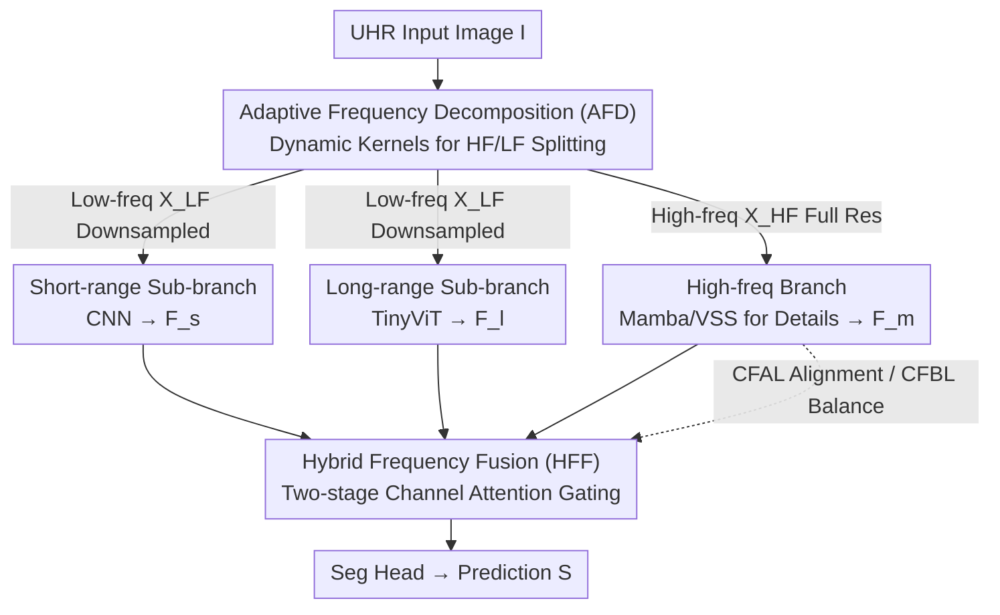

# F2Net: A Frequency-Fused Network for Ultra-High Resolution Remote Sensing Segmentation

**Conference**: CVPR 2026  
**Paper**: [CVF Open Access](https://openaccess.thecvf.com/content/CVPR2026/html/Chen_F2Net_A_Frequency-Fused_Network_for_Ultra-High_Resolution_Remote_Sensing_Segmentation_CVPR_2026_paper.html)  
**Code**: https://github.com/easm002/F2Net  
**Area**: Remote Sensing Segmentation / Ultra-High Resolution Segmentation  
**Keywords**: Ultra-high resolution remote sensing, frequency domain decomposition, multi-branch network, semantic segmentation, gradient balancing  

## TL;DR
F2Net decomposes ultra-high resolution (UHR) remote sensing images in the frequency domain into high-frequency and low-frequency components for separate processing. A high-frequency branch preserves full resolution for boundary details, while the low-frequency branch is downsampled and split into two sub-branches (short-range and long-range) for semantic capture. A Hybrid Frequency Fusion (HFF) module integrates the three features, supported by two cross-frequency losses to stabilize multi-branch training, achieving SOTA results of 80.22 and 83.39 mIoU on DeepGlobe and Inria Aerial, respectively.

## Background & Motivation
**Background**: UHR remote sensing images (typically exceeding 4K, e.g., 2448×2448 in DeepGlobe and 5000×5000 in Inria) are approximately 100 times larger than the $256 \times 256$ inputs standard segmentation models are designed for, making it impossible to feed the entire image into a network. Early approaches took two paths: **global downsampling** (saving memory but losing boundary and texture details) or **patch-based processing** (preserving local structure but sacrificing global context).

**Limitations of Prior Work**: Recent mainstream approaches utilize multi-branch architectures (e.g., GLNet, ISDNet, SGNet), using a global branch for downsampled images and a local branch for high-resolution patches to balance global and local information. However, these methods face two major issues: (1) **Inference redundancy and high computational cost**—for example, GLNet requires processing ~200 patches for a single UHR image; (2) **Gradient conflict during training**—joint optimization of multiple branches leads to naturally imbalanced gradient magnitudes, causing one branch to dominate and resulting in misaligned features.

**Key Challenge**: Existing multi-branch methods rely on **spatial partitioning** (cropping/patching), which destroys object integrity (e.g., a continuous river or a long, narrow field passing through a forest is shattered), and provide no specialized mechanism to manage gradient imbalances caused by heterogeneous branches.

**Key Insight**: The authors pivot to a different dimension—decomposing the image in the **frequency domain** rather than the spatial domain. High-frequency components naturally correspond to boundaries and textures requiring full resolution, while low-frequency components contain rich semantics but are spatially redundant, allowing for downsampling without significant information loss. Frequency decomposition models details and global context simultaneously without introducing spatial artifacts.

**Core Idea**: Use dynamic frequency decomposition to split UHR images into high and low frequencies, processing each with the most suitable backbone (SSM/Mamba for high-frequency full-resolution modeling; CNN+ViT sub-branches for low-frequency downsampled modeling). These are fused via attention gating, with explicit alignment of cross-frequency semantics and balancing of cross-frequency gradients.

## Method

### Overall Architecture
F2Net is a three-branch frequency-aware network. Given a UHR input $I \in \mathbb{R}^{H\times W\times C}$, an **Adaptive Frequency Decomposition (AFD)** module first splits it into a high-frequency component $X^{HF}$ and a low-frequency component $X^{LF}$. The **high-frequency branch** uses a multi-stage encoder based on State Space Models (Mamba/VSS) at full resolution to capture structural details, outputting $F_m$. The **low-frequency branch** downsamples the input and splits it into two complementary sub-branches: a short-range sub-branch (CNN for local texture) outputting $F_s$, and a long-range sub-branch (TinyViT for global dependencies) outputting $F_l$. These three features are fed into the **Hybrid Frequency Fusion (HFF)** module: the two low-frequency sub-features are first fused into $F_{sl}$, which is then fused with the high-frequency $F_m$ to create a unified representation for the segmentation head. During training, a **Cross-Frequency Alignment Loss (CFAL)** ensures semantic consistency between branches, while a **Cross-Frequency Balancing Loss (CFBL)** equalizes gradient magnitudes across branches.

### Key Designs

**1. Adaptive Frequency Decomposition (AFD): Pixel-wise Dynamic Kernels**

Static low-pass kernels for frequency separation fail because signal frequencies vary across different image regions. AFD utilizes $1\times1$ convolutions for cross-channel understanding to obtain $X=\mathrm{Conv}_{1\times1}(I) \in \mathbb{R}^{H\times W\times D}$, which is then divided into $N$ groups ($N=8$). For each group $X_n$, **pixel-wise dynamic low-pass kernels** are generated: $W^{LF}_n = \mathrm{Softmax}(\mathrm{Conv}(X_n)) \in \mathbb{R}^{H\times W\times k^2}$, where the softmax ensures non-negative weights summing to 1. The high-pass kernel is derived by subtracting from the identity kernel: $W^{HF}_n = \mathbf{1}_{k\times k} - W^{LF}_n$. Depth-wise convolutions are applied to generate $X^{LF}$ and $X^{HF}$. The kernels vary by spatial location and content, capturing local context better than fixed Gaussian or Laplacian pyramids. Ablations show AFD (80.22 mIoU / 15.4 FPS) significantly outperforms Laplacian pyramids (78.1 / 9.8) and raw inputs (74.2).

**2. Frequency-Aware Heterogeneous Backbones: Optimized Networks for Specific Frequencies**

Different frequency components require different processing. The **high-frequency branch** maintains full resolution using SSM (Mamba/VSS), which excels at long-sequence modeling—ideal for full-resolution feature maps. It consists of convolutional embeddings followed by VSS blocks (LayerNorm → SS2D → FFN with residuals). The **low-frequency branch** is downsampled for efficiency and split: the short-range sub-branch uses DeepLabv3 (ResNet18 backbone) for local textures $F_s$, while the long-range sub-branch uses a 6-layer ViT-tiny to capture global semantics $F_l$. Table 3 proves the synergy: while single branches achieve ~71–72.5 mIoU, the combined three-branch architecture reaches 80.22, 3.5 points higher than the best dual-branch combination.

**3. Hybrid Frequency Fusion (HFF): Hierarchical Channel Attention Gating**

Heterogeneous features contain redundant or misaligned channels. HFF computes channel attention for low-frequency sub-branches: $A_s=\sigma(\mathrm{MLP}(\mathrm{Pool}(F_s)))$ and $A_l=\sigma(\mathrm{MLP}(\mathrm{Pool}(F_l)))$, then builds a cross-branch relationship matrix $M=\sigma(A_s A_l^\top) \in \mathbb{R}^{C_s\times C_l}$. This interaction info is injected back into the attention maps $\tilde{A}_s$ and $\tilde{A}_l$. Branch features are weighted and projected via $1\times1$ convolutions to sum into $F_{sl}$. This fused low-frequency feature undergoes a second HFF with $F_m$. Adaptive frequency gating is superior to simple merging—HFF (80.22) outperforms Concat (76.1), Add (74.6), and even computationally expensive Cross-attention (72.4, 93.8 GFLOPs) while remaining efficient (60.8 GFLOPs).

**4. Dual Cross-Frequency Losses (CFAL + CFBL): Semantic Consistency and Gradient Balance**

Asymmetric high/low-frequency branches present two optimization challenges. First, **semantic inconsistency**: the same object may be encoded differently. CFAL uses symmetric KL divergence: $L_{CFAL}=\frac{1}{2}[D_{KL}(F_{sl}\|F_m)+D_{KL}(F_m\|F_{sl})]$ to converge representations. Second, **gradient imbalance**: vastly different gradient magnitudes cause one branch to dominate. CFBL explicitly regularizes the gradient norms: $L_{CFBL}=\sum_\Theta |G_\Theta - \bar{G}|$, where $G_\Theta=\|\nabla_\Theta L_{CE}\|_2$ and $\bar{G}$ is the mean across all branches. This prevents any single branch from hijacking the learning dynamics.

### Loss & Training
The total loss is a weighted sum: $L=\lambda_1 L_{CFAL}+\lambda_2 L_{CFBL}+\lambda_3 L_{CE}$, with $\lambda_1=\lambda_2=0.1$ and $\lambda_3=1$. The short-range sub-branch uses DeepLabv3 with ResNet18, and the long-range sub-branch uses 6-layer ViT-tiny, both pre-trained on ImageNet-1K. The Mamba backbone is based on VMamba-Tiny-M2 (depths [2,2,4,2], baseline channels 64). Optimization uses SGD (momentum 0.9, initial lr $1\times10^{-3}$, polynomial decay power 0.9), batch size 8. Training involves 80k iterations for DeepGlobe and 40k for Inria Aerial on a DGX-1 (Tesla V100).

## Key Experimental Results

### Main Results
F2Net achieves SOTA on two UHR benchmarks. It is the first to exceed 80 mIoU on DeepGlobe.

| Dataset | Metric | F2Net | Prev. SOTA | Gain |
|--------|------|-------|----------|------|
| DeepGlobe | mIoU | **80.22** | BPT 76.60 | +3.62 |
| DeepGlobe | F1 | **87.09** | BPT 85.7 | +1.39 |
| Inria Aerial | mIoU | **83.39** | RUE 79.00 | +4.39 |
| Inria Aerial | F1 | **91.19** | ISDNet 86.35 | +4.84 |

Efficiency: DeepGlobe reaches 24.30 FPS, ranking as the third fastest among reported methods (behind RUE 44.38 and ISDNet 27.70), with memory usage of 2767 MB.

### Ablation Study
The branch combination ablation (DeepGlobe, Table 3) demonstrates three-branch synergy:

| Configuration | mIoU | Description |
|------|------|------|
| HF Only | 72.5 | Full Res + Mamba, strongest single branch |
| Short-range Only | 71.3 | Downsampled CNN, loses boundaries |
| Long-range Only | 71.9 | Downsampled ViT, loses boundaries |
| HF + Short-range | 76.7 | Local textures complement frequency |
| HF + Long-range | 76.5 | Global semantics complement frequency |
| Three-branch Full | **80.22** | +3.5 over the best dual-branch |

Other findings: The high-frequency branch is highly sensitive to resolution (dropping 5.1/7.4 mIoU at 1/2 and 1/4 scales), while low-frequency branches are robust. AFD (80.22 mIoU) outperforms Laplacian pyramids (78.1).

### Key Findings
- **Non-linear Synergy**: Combining three branches yields 80.22 mIoU, far exceeding the ~71–72.5 range of single branches, proving that frequency details, local textures, and global semantics are complementary.
- **Resolution Vitality**: Full resolution is only essential for the high-frequency branch. Low-frequency branches handle downsampling with minimal loss, justifying the efficiency design.
- **Loss Categorization**: CFBL (+1.45) stabilizes gradients, while CFAL (+1.85) aligns semantics. Together, they provide cumulative gains (+2.87).
- **HFF vs. Attention**: Plain cross-attention underperforms (72.4) due to redundant correlation overfitting. Frequency-gated fusion is more effective and efficient.

## Highlights & Insights
- **Spatial vs. Frequency Decomposition**: Replacing spatial patching with frequency splitting avoids shattering continuous objects (e.g., rivers), a significant qualitative advantage over GLNet/FCtL.
- **Backbone Mapping**: Mapping backbones to frequency characteristics is brilliant—SSM/Mamba for full-resolution high-frequencies and CNN/ViT for downsampled low-frequencies.
- **Gradient Regularization**: Using gradient norm differences (CFBL) is a highly transferable trick for any heterogeneous multi-branch/multi-modal training plagued by gradient imbalance.
- **Dynamic AFD**: Content-adaptive kernels for frequency decomposition are more flexible and faster than fixed transforms, proving learning pixel-wise low-pass kernels preserves detail efficiently.

## Limitations & Future Work
- **Memory Overhead**: Memory usage is high (5534 MB on Inria). The low-frequency branch resolution was capped at 1/2 to avoid OOM on 16GB GPUs, indicating scalability bottlenecks.
- **Limited Dataset Scope**: Evaluated only on DeepGlobe (7 classes) and Inria (binary). Generalization to complex taxonomies (urban material classes, etc.) remains unverified.
- **Stability Evidence**: Quantitative evidence for CFBL stability is mostly provided in supplementary materials rather than the main text.
- **Future Directions**: Exploring multi-band decomposition, learnable loss weights $\lambda$, or memory-efficient Mamba variants to mitigate high-resolution memory constraints.

## Related Work & Insights
- **vs. Multi-branch UHR (GLNet / ISDNet)**: These use **spatial** partitioning, leading to redundant inference and gradient conflict. F2Net uses **frequency** partitioning, processing the whole image without patches, outperforming BPT by +3.62 mIoU on DeepGlobe.
- **vs. Frequency Methods (Wavelets / FFC)**: Previous works often used fixed transforms and ignored fusion stability. F2Net introduces dynamic decomposition and specialized losses for the UHR remote sensing scenario.
- **vs. Pure Transformers**: Pure Transformers struggle with memory at UHR. F2Net restricts ViT to downsampled low-frequency sub-branches, avoiding prohibitive costs at full resolution.

## Rating
- Novelty: ⭐⭐⭐⭐ Shifts UHR segmentation from spatial to frequency-branch paradigms with dynamic decomposition.
- Experimental Thoroughness: ⭐⭐⭐⭐ Complete ablation chain across branches/loss/fusion, though limited to two datasets.
- Writing Quality: ⭐⭐⭐⭐ Clear logic from motivation to experiment with solid mathematical backing.
- Value: ⭐⭐⭐⭐ Substantial mIoU gains; the gradient balancing loss is valuable for heterogeneous multi-task learning.

<!-- RELATED:START -->

## Related Papers

- [\[CVPR 2026\] RDNet: Region Proportion-Aware Dynamic Adaptive Salient Object Detection Network in Optical Remote Sensing Images](rdnet_region_proportion-aware_dynamic_adaptive_salient_object_detection_network_.md)
- [\[CVPR 2026\] SGMA: Semantic-Guided Modality-Aware Segmentation for Remote Sensing with Incomplete Multimodal Data](sgma_semantic-guided_modality-aware_segmentation_for_remote_sensing_with_incompl.md)
- [\[CVPR 2026\] Task-Oriented Data Synthesis and Control-Rectify Sampling for Remote Sensing Semantic Segmentation](task-oriented_data_synthesis_and_control-rectify_sampling_for_remote_sensing_sem.md)
- [\[CVPR 2026\] Test-Time Multi-Prompt Adaptation for Open-Vocabulary Remote Sensing Image Segmentation](test-time_multi-prompt_adaptation_for_open-vocabulary_remote_sensing_image_segme.md)
- [\[CVPR 2026\] ReSAM: Refine, Requery, and Reinforce: Self-Prompting Point-Supervised Segmentation for Remote Sensing Images](resam_refine_requery_and_reinforce_self-prompting_point-supervised_segmentation_.md)

<!-- RELATED:END -->
