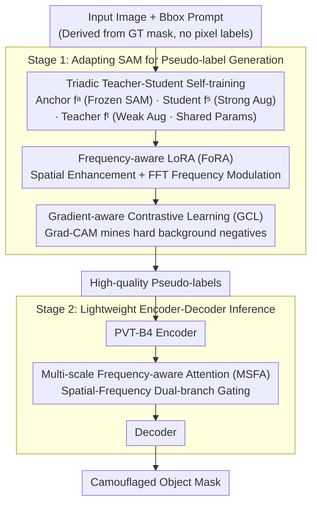

# FCL-COD: Weakly Supervised Camouflaged Object Detection with Frequency-aware and Contrastive Learning

**Conference**: CVPR 2026 Findings  
**arXiv**: [2603.22969](https://arxiv.org/abs/2603.22969)  
**Code**: None  
**Area**: Image Segmentation  
**Keywords**: Camouflaged Object Detection, Weakly Supervised, SAM, Frequency-aware LoRA, Contrastive Learning

## TL;DR

The FCL-COD framework is proposed, which injects camouflaged scene knowledge into SAM via Frequency-aware Low-Rank Adaptation (FoRA), enhances foreground-background feature separation through Gradient-aware Contrastive Learning (GCL), and refines boundary-sensitive features using Multi-scale Frequency-aware Attention (MSFA). Under a weakly supervised setting using only bounding box annotations, it outperforms state-of-the-art (SOTA) fully supervised methods.

## Background & Motivation

Camouflaged Object Detection (COD) requires identifying targets that are highly similar to their backgrounds, facing four major challenges:

**Limitations of Prior Work**: Fully supervised methods rely on pixel-level annotations, which are costly and may overlook the overall structural features of the target.

**Key Challenge**: The performance gap between weakly supervised methods and fully supervised methods remains significant.
3. SAM-based methods exhibit specific issues in camouflaged scenes:
    - (a) Non-camouflaged object response — incorrect detection of non-target objects.
    - (b) Local response — detecting only parts of the target.
    - (c) Extreme response — excessively large or small detection areas.
    - (d) Lack of fine boundary awareness.

Ours systematically designs corresponding solutions for these four issues.

## Method

### Overall Architecture

A two-stage framework:
- **Stage 1**: Adapts SAM using a triadic teacher-student self-training architecture, combined with FoRA and GCL to generate high-quality pseudo-labels.
- **Stage 2**: Trains a lightweight PVT-B4 encoder-decoder using the pseudo-labels, embedding the MSFA module for efficient inference.

### Key Designs

1. **Triadic Teacher-Student Self-training**:
    - Maintains three encoders: Anchor encoder $f^a$ (frozen original SAM to preserve pre-trained knowledge), Student encoder $f^s$ (strong augmentation input), and Teacher encoder $f^t$ (weak augmentation input, sharing parameters with the student).
    - Student-Teacher Loss: Focal Loss + Dice Loss guiding the student to learn from teacher's pseudo-labels.
    - Anchor Loss: Prevents the student and teacher from deviating too far from pre-trained SAM knowledge, suppressing error accumulation in pseudo-labels.
    - Input prompts are bounding boxes (derived from GT mask bboxes, without pixel-level labels).

2. **Frequency-aware Low-Rank Adaptation (FoRA)**:
   Addressing the non-camouflaged object response issue. Cascaded transformations are inserted between the encoder-decoder paths of standard LoRA:
    - **Spatial Enhancement $\mathcal{S}_{spa}$**: Aggregates multi-scale context via $1 \times 1, 3 \times 3, 5 \times 5$ convolutions + residual connections.
    - **Frequency Modulation $\mathcal{S}_{fre}$**: FFT → frequency domain $3 \times 3$ convolution → IFFT, modeling high-frequency texture differences in camouflaged scenes within the frequency domain.
    - Forward Propagation: $h = W_0 x + W_d \mathcal{S}_{fre}(\mathcal{S}_{spa}(W_e x))$.
    - **Core Idea**: Camouflaged objects and backgrounds are extremely similar in the spatial domain but possess distinguishable subtle texture differences in the frequency domain.

3. **Gradient-aware Contrastive Learning (GCL)**:
   Addressing local and extreme response issues. The key innovation lies in the sampling strategy:
    - Utilizes Grad-CAM from teacher feature maps to derive gradient activation maps $G^t$.
    - Constructs gradient-weighted background masks $\tilde{m}_0 = \hat{m}_0 \odot G^t$, focusing on hard background regions easily confused with the foreground.
    - Builds foreground instance prototypes and background prototypes for student/teacher branches via masked average pooling.
    - Positive pairs: Student-teacher representations of the same instance; Negative pairs: Other instances + gradient-weighted background prototypes.
    - InfoNCE contrastive loss pushes representation distances between foreground and hard backgrounds.

4. **Multi-scale Frequency-aware Attention (MSFA)**:
   Addressing the lack of fine boundary awareness. Inserted between the Stage 2 encoder and decoder:
    - Dual-branch design: Spatial branch $\mathcal{M}_{spa}$ (stacked $3 \times 3$ convolutions) + Frequency branch $\mathcal{M}_{fre}$ (FFT → $1 \times 1$ convolution → IFFT).
    - Tri-channel attention $\mathcal{T}$: Uses multi-scale features from one domain to gate features of the other domain.
    - Concatenated fusion after cross-gating spatial and frequency features across three scales (S/M/L).

### Loss & Training

**Stage 1 Total Loss**:
$$\mathcal{L} = \mathcal{L}_{st}^{dice} + \lambda_1 \mathcal{L}_{anchor} + \lambda_2 \mathcal{L}_{GCL} + \lambda_3 \mathcal{L}_{st}^{focal}$$

Optimal hyperparameters: $\lambda_1 = 0.50, \lambda_2 = 1.00, \lambda_3 = 20$.

**Stage 2 Loss**: BCE + uncertainty-aware loss with cosine annealing.

Training environment: 2 × NVIDIA H20 GPUs, PVT-B4 encoder, SGD (lr=1e-3, momentum=0.9), 60 epochs.

## Key Experimental Results

### Main Results

Comparison with fully supervised and weakly supervised methods (SAM-H backbone):

| Method | Supervision | CAMO-MAE↓ | CAMO-$S_m$↑ | COD10K-MAE↓ | COD10K-$S_m$↑ |
|------|------|-----------|-------------|-------------|-------------|
| SARNet | Fully Supervised | 0.046 | 0.874 | 0.021 | 0.885 |
| CamoFormer-P | Fully Supervised | 0.046 | 0.872 | 0.023 | 0.869 |
| HitNet | Fully Supervised | 0.055 | 0.849 | 0.023 | 0.871 |
| SAM-COD | Weak(B) | 0.062 | 0.837 | 0.028 | 0.842 |
| **FCL-COD(H)** | **Weak(B)** | **0.050** | **0.862** | **0.022** | **0.878** |

Under the weakly supervised setting, FCL-COD significantly outperforms SAM-COD (MAE reduction of 0.012) and even **exceeds multiple fully supervised methods** (ZoomNet, CamoFormer-R, etc.).

Results across different SAM scales:

| Backbone | CAMO-MAE↓ | COD10K-MAE↓ | NC4K-MAE↓ |
|----------|-----------|-------------|-----------|
| FCL-COD(SAM-B) | 0.060 | 0.027 | 0.041 |
| FCL-COD(SAM-L) | 0.054 | 0.022 | 0.034 |
| FCL-COD(SAM-H) | 0.050 | 0.022 | 0.033 |

### Ablation Study

Stepwise ablation of component contributions (COD10K, $E_m$↑):

| FoRA | GCL | MSFA | COD-Train $E_m$ | CHAMELEON $E_m$ | COD10K $E_m$ |
|------|-----|------|-----------------|-----------------|--------------|
| ✗ | ✗ | ✗ | 0.959 | 0.927 | 0.919 |
| ✓ | ✗ | ✗ | 0.963 | 0.928 | 0.923 |
| ✓ | ✓ | ✗ | 0.969 | 0.947 | 0.926 |
| ✓ | ✓ | ✓ | — | **0.954** | **0.938** |

FoRA improves pseudo-label quality → GCL further strengthens foreground-background separation → MSFA refines boundaries during inference.

FoRA sub-ablation: Spatial enhancement and frequency modulation each contribute +0.001-0.002 $E_m$, with combined use yielding +0.004.
GCL sub-ablation: Standard Contrastive Learning (CL) improves +0.005, and adding gradient awareness yields another +0.001.

### Key Findings

- **Frequency domain information is key for camouflaged objects**: High spatial similarity in camouflaged scenes can be overcome by exploiting texture differences in the frequency domain.
- Grad-CAM guided hard negative mining is more effective than random sampling.
- Multi-scale spatial-frequency cross-gating outperforms single-branch designs.
- The method generalizes to Weakly Supervised Salient Object Detection (SOD), also surpassing fully supervised methods.

## Highlights & Insights

1. **Systematic Problem Decomposition**: The four failure modes of SAM in camouflaged scenes (non-camouflaged response/local/extreme/rough boundaries) directly map to the designs of FoRA/GCL/GCL/MSFA, demonstrating clear logic.
2. **Multi-level Utilization of Frequency Priors**: FoRA injects frequency priors during feature adaptation, while MSFA leverages frequency branches to refine boundaries during inference, forming a complete frequency-aware system.
3. **Weak Supervision Surpassing Full Supervision**: These results are robust, indicating that SAM's strong precursors plus correct adaptation methods can compensate for missing annotation information.
4. **Engineering Rationality of Two-stage Design**: Stage 1 uses large SAM for high-quality pseudo-labels, while Stage 2 uses a lightweight model for inference, balancing precision and efficiency.

## Limitations & Future Work

- Bbox prompts during training are derived from GT masks; the acquisition of bboxes in practical applications requires further discussion.
- The process is slightly complex due to the two-stage requirement (pseudo-label generation + lightweight detector).
- Evaluations on the CHAMELEON dataset (only 76 images) may exhibit statistical fluctuations.
- Extensions to video camouflaged object detection or instance-level COD were not discussed.

## Related Work & Insights

- The spatial-frequency cascaded design of FoRA can be extended to other LoRA adaptation tasks requiring fine-grained texture discrimination.
- The gradient-aware negative mining strategy is a valuable reference for any contrastive learning scenario needing hard negative samples.
- The paradigm of SAM + Lightweight Adaptation + Pseudo-label Training can be migrated to other weakly supervised dense prediction tasks.

## Rating

- Novelty: ⭐⭐⭐⭐ — FoRA and GCL designs are innovative; systematic use of frequency domain priors is a highlight.
- Experimental Thoroughness: ⭐⭐⭐⭐⭐ — Four datasets + detailed component ablations + hyperparameter analysis + qualitative visualization + SOD extension.
- Writing Quality: ⭐⭐⭐⭐ — Clear problem decomposition, though mathematical notation is somewhat dense.
- Value: ⭐⭐⭐⭐ — Weak supervision results exceeding full supervision are impressive and hold practical value.

<!-- RELATED:START -->

## Related Papers

- [\[CVPR 2026\] Frequency-Aware Affinity for Weakly Supervised Semantic Segmentation](frequency-aware_affinity_for_weakly_supervised_semantic_segmentation.md)
- [\[ECCV 2024\] Frequency-Spatial Entanglement Learning for Camouflaged Object Detection](../../ECCV2024/segmentation/frequency-spatial_entanglement_learning_for_camouflaged_object_detection.md)
- [\[CVPR 2026\] Weakly-Supervised Referring Video Object Segmentation through Text Supervision](wsrvos_weakly_supervised_rvos.md)
- [\[CVPR 2026\] Beyond Appearance: Camouflaged Object Detection via Geometric Structure](beyond_appearance_camouflaged_object_detection_via_geometric_structure.md)
- [\[CVPR 2026\] Hierarchical Action Learning for Weakly-Supervised Action Segmentation](hierarchical_action_learning_for_weakly-supervised_action_segmentation.md)

<!-- RELATED:END -->
