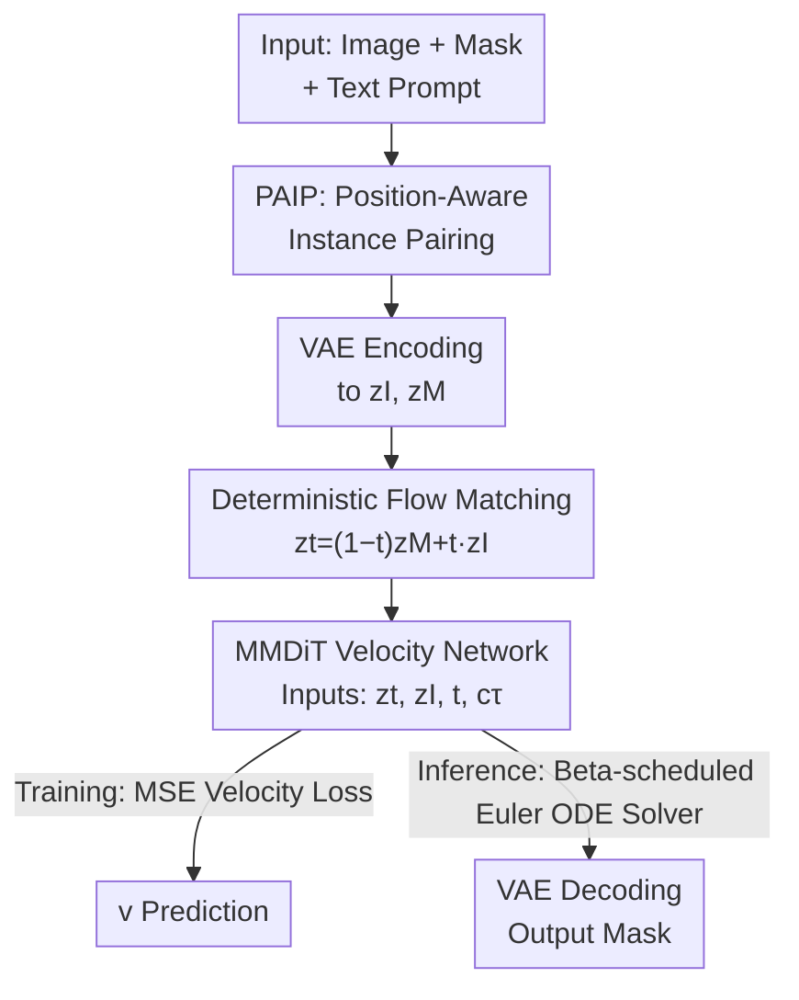

# FlowDIS: Language-Guided Dichotomous Image Segmentation with Flow Matching

**Conference**: CVPR 2026  
**arXiv**: [2605.05077](https://arxiv.org/abs/2605.05077)  
**Code**: https://github.com/Picsart-AI-Research/FlowDIS (Available)  
**Area**: Image Segmentation / Flow Matching Generation / Language Guidance  
**Keywords**: Dichotomous Image Segmentation (DIS), Flow Matching, Language-controllable, Instance Pairing, Deterministic Generation

## TL;DR
FlowDIS reformulates high-precision Dichotomous Image Segmentation (DIS) as a **flow matching** problem—directly learning a time-dependent velocity field to transport the "image distribution" to the "mask distribution," replacing the stochastic denoising process of diffusion models with a deterministic ODE. Combined with the PAIP instance-pairing training strategy to enhance language controllability, it achieves new SOTA results on all DIS5K test sets. With only 1-step inference, it achieves a approximately 5.5% higher $F_\beta^\omega$ and 43% lower MAE on DIS-TE compared to the runner-up LawDIS.

## Background & Motivation
**Background**: DIS (Dichotomous Image Segmentation) is a standard task for evaluating "category-agnostic, pixel-level ultra-high precision foreground segmentation," typically using the DIS5K dataset. Mainstream approaches fall into two categories: one treats segmentation as pixel-wise binary classification using classification backbones like ResNet or Swin (e.g., IS-Net, BiRefNet, MVANet); the other is inspired by generative models, framing segmentation within the DDPM framework to leverage pre-trained text-to-image (T2I) diffusion priors for "image-conditioned mask generation" (e.g., DiffDIS, LawDIS).

**Limitations of Prior Work**: Classification backbones are optimized for predicting image-level categories, lacking fine-grained foreground semantics, which leads to performance drops in complex detail images and misidentification of foregrounds in multi-object scenes. While diffusion-based methods introduce rich semantic priors, they suffer from a fundamental mismatch: segmentation is a **deterministic dense prediction** (must align precisely with GT), whereas diffusion is a **stochastic process of denoising from Gaussian noise**. This mismatch leads to slow training convergence (often tens of thousands of steps), and the randomness of denoising can blur or bias fine boundaries.

**Key Challenge**: To utilize the semantic priors of large generative models without the randomness and slow convergence of "generation from noise"—there is a tension between "generative priors" and "deterministic segmentation."

**Goal**: (1) Find a segmentation formulation that is naturally deterministic while reusing pre-trained generative models; (2) Achieve reliable language-controllable segmentation in real-world multi-object scenes.

**Key Insight**: The authors observe that Flow Matching (FM) is a more general framework than diffusion—it learns a continuous mapping between any two distributions, where the reference distribution $p_1$ **does not have to be Gaussian**. By setting $p_1$ directly as the image distribution and $p_0$ as the mask distribution, segmentation becomes "deterministically transporting an image to its mask." The training and sampling processes are entirely deterministic, while diffusion is merely a special case where $p_1$ is Gaussian.

**Core Idea**: Replace "generating masks from noise via denoising" with "deterministic flow matching transport from image to mask," and employ PAIP instance pairing to construct multi-foreground samples to support language controllability.

## Method

### Overall Architecture
Based on the flow matching framework, FlowDIS treats the RGB image as the reference distribution $p_1$ and the binary mask as the target distribution $p_0$, training a velocity network $v_\theta$ to learn the velocity field transporting images to masks along a linear interpolation path. During training: a batch of (image, mask, prompt) triplets is selectively mixed into multi-foreground samples using **PAIP**. Mixed images and masks are encoded into latent space via VAE to obtain $z^I$ and $z^M$. Linear interpolation is performed between them at timestep $t\sim p(t)$ to get the intermediate latent $z_t$. Text prompts are encoded into tokens $c_\tau$ via CLIP+T5 and fed into the MMDiT velocity prediction model along with $z_t$, the image latent $z^I$, and the timestep $t$. The loss is the MSE between predicted and ground-truth velocities. During inference: starting from $z_1=z^I$, the probability flow ODE is solved iteratively using the Euler method along a Beta-scheduled time grid to reach $z_0$, which is then restored by the VAE decoder.

### Key Designs

**1. Deterministic Flow Matching Segmentation: "Flowing" images directly to masks instead of denoising from noise**

To address the fundamental mismatch between the "stochastic process vs. deterministic segmentation" in diffusion-based DIS, flow matching learns a time-dependent velocity field $v_\theta(x,t)$ that transports samples from $p_1$ to $p_0$ along a trajectory. The conditional flow often uses linear interpolation $x_t=(1-t)x_0+tx_1$, where the ground-truth velocity is constant $v=x_1-x_0$. A key step in FlowDIS is setting $p_1$ as the image distribution and $p_0$ as the mask distribution. Both image $I$ and mask $M$ are encoded into $z^I, z^M$, with the latent trajectory:

$$z_t=(1-t)z^M+t\,z^I,\quad t\in[0,1]$$

The network learns to predict the velocity $z^I-z^M$. During inference, the ODE is solved starting from $z_1=z^I$ to obtain the mask, with **no random noise involved**. This approach reuses semantic priors from large generative models while restoring the determinism inherent in segmentation—leading to rapid convergence (exceeding LawDIS, which trained for 36K steps, in just 1K iterations) and avoiding blurred boundaries.

**2. Concatenational Image Latent Conditioning: Seeing the clean original image at every inference step**

The intermediate latent $z_t$ is a mixture of image and mask; as it approaches $z_0$ (the mask end), the image signal weakens, risking the loss of details during multi-step inference. The authors **concatenate** the image latent $z^I$ directly to the velocity network input, ensuring $v_\theta$ has access to the full, clean image signal at every step. The loss becomes:

$$\mathcal{L}(\theta)=\mathbb{E}_{z^I,z^M,t}\big[\|v_\theta(z_t,z^I,t,c_\tau)-(z^I-z^M)\|_2^2\big]$$

To integrate this extra condition, they expand the input channels of the first linear layer in the transformer and initialize new weights to zero. This "zero-initialization" ensures that pre-trained behavior is not disrupted at the start of training. Ablations in the appendix (Tab. 5) confirm consistent improvements across all metrics with this $z^I$ condition.

**3. PAIP (Position-Aware Instance Pairing): Supporting language controllability with synthetic multi-foreground scenes**

Standard DIS datasets primarily consist of single-foreground images, making it difficult for models to learn reliable language-guided selection—the model rarely sees cases where it must "select one object from multiple based on a prompt." Within each mini-batch, PAIP randomly pairs a reference triplet $(I_j, M_j, \tau_j)$ with another triplet $(I_k, M_k, \tau_k)$, pasting the latter's foreground into the reference image to create a synthetic multi-object image $I_{\text{mix}}$. The pasting is "position-aware": the bounding box $B_j$ of the reference foreground is calculated, and the largest non-overlapping rectangular area $R_j^{\max}$ adjacent to $B_j$ is used as the placement zone. Since $R_j^{\max}$ is often smaller than $B_j$, **reflection padding** is applied to the reference image along the shared edge to double the placement area. The paired foreground is then cropped, scaled with its aspect ratio maintained, and Alpha-blended into the zone. The key is the supervision: the target mask is randomly selected from $\{\hat{M}_j\,\text{AND}\,(\hat{M}_k)^c,\ \hat{M}_k,\ \hat{M}_j\,\text{OR}\,\hat{M}_k\}$, and the text prompt is adjusted accordingly to $\{\tau_j,\ \tau_k,\ \text{"}\tau_j\text{ and }\tau_k\text{"}\}$. This forces the model to actually follow the language prompt to select the object rather than ignoring it.

**4. Beta Timestep Scheduling: Training biased toward difficult large $t$, non-uniform inference sampling**

To optimize both training and sampling, a Beta distribution regulates timesteps. During training, $t\sim\mathrm{Beta}(2.5,1)$ biases sampling toward larger $t$ values—where prediction is harder because the latent is further from the mask end and information is more mixed. This focuses training resources on the most challenging segments. For inference, the inverse Beta CDF maps a uniform grid $q$ to a non-uniform time grid $t_i=F^{-1}_{\text{Beta}}(q_i;\alpha,\beta)$ (with the same $\alpha=2.5,\beta=1$), enabling denser sampling at critical trajectory segments to produce high-quality masks with fewer Euler steps (SOTA with 1 step, even better with 2).

### Loss & Training
- **Base Model**: Initialized with pre-trained weights from FLUX.1-Schnell (an MMDiT flow matching model); text encoders use CLIP + T5.
- **Training Objective**: MSE between predicted velocity and ground-truth velocity $z^I-z^M$.
- **Hyperparameters**: Batch size 32, 10,000 iterations (approx. 1.8 days on 8×A100); AdamW with initial learning rate $5\times10^{-5}$, halved at steps 512/2048/4096/8192.
- **Inference**: Euler solver for probability flow ODE; RGB mask output is converted to grayscale by averaging channels and clipped to $[0,1]$.

## Key Experimental Results

Evaluated on DIS5K (5,470 high-res image-mask pairs): training on DIS-TR (3,000), testing on DIS-VD (470) and DIS-TE (2,000, split into four complexity levels TE1–TE4). All methods evaluated at $1024\times1024$. Metrics: $F_\beta^w\uparrow$, $F_\beta^{mx}\uparrow$, $\mathcal{M}\downarrow$ (MAE), $S_\alpha\uparrow$, $E_\phi^{mn}\uparrow$.

### Main Results (Combined DIS-TE 1-4 and DIS-VD)

| Test Set | Method | $F_\beta^\omega\uparrow$ | $F_\beta^{mx}\uparrow$ | $\mathcal{M}\downarrow$ | $\mathcal{S}_\alpha\uparrow$ | $E_\phi^{mn}\uparrow$ |
|----------|--------|------|------|------|------|------|
| DIS-TE(1-4) | LawDIS25 (Runner-up) | 0.884 | 0.918 | 0.030 | 0.916 | 0.947 |
| DIS-TE(1-4) | **FlowDIS (1-step)** | 0.933 | 0.958 | 0.017 | 0.951 | 0.971 |
| DIS-TE(1-4) | **FlowDIS (2-step)** | **0.938** | **0.959** | **0.016** | **0.951** | **0.973** |
| DIS-VD | LawDIS25 (Runner-up) | 0.884 | 0.917 | 0.030 | 0.917 | 0.949 |
| DIS-VD | **FlowDIS (2-step)** | **0.938** | **0.958** | **0.014** | **0.953** | **0.974** |

On DIS-TE(1-4), 1-step FlowDIS relative to LawDIS: $F_\beta^\omega$ increases from 0.884 to 0.933 (~+5.5%), and $\mathcal{M}$ decreases from 0.030 to 0.017 (~-43%). On the hardest subset DIS-TE4, 2-step FlowDIS reaches an $F_\beta^\omega$ of 0.919, significantly leading LawDIS (0.884).

### Ablation Study (Evaluated on DIS-VD, 2-step inference unless specified)

| Configuration | $F_\beta^\omega\uparrow$ | $F_\beta^{mx}\uparrow$ | $\mathcal{M}\downarrow$ | Note |
|---------------|------|------|------|------|
| denoising FM (from Gaussian) | 0.883 | 0.916 | 0.025 | $z_1$ set to Gaussian noise |
| **deterministic FM (Ours)** | **0.938** | **0.958** | **0.014** | $z_1=z^I$ image side |
| w/o language guidance | 0.901 | 0.926 | 0.027 | No text provided |
| **w/ language guidance** | **0.937** | **0.956** | **0.015** | Text provided |

PAIP specific evaluation (DIS-VD-Complex is a multi-object scene test set constructed using PAIP logic):

| Test Set | Configuration | $F_\beta^{mx}\uparrow$ | $\mathcal{M}\downarrow$ | $\mathcal{S}_\alpha\uparrow$ |
|----------|---------------|------|------|------|
| DIS-VD-Complex | w/o PAIP | 0.783 | 0.063 | 0.831 |
| DIS-VD-Complex | **w/ PAIP** | **0.960** | **0.014** | **0.955** |
| DIS-VD (Simple) | w/o PAIP | 0.956 | 0.015 | 0.952 |
| DIS-VD (Simple) | **w/ PAIP** | **0.958** | **0.014** | **0.953** |

### Key Findings
- **Deterministic formulation is the main contributor**: Changing $z_1$ from Gaussian noise to the image side improved $F_\beta^\omega$ from 0.883 to 0.938 and MAE from 0.025 to 0.014, validating the core argument for deterministic FM in segmentation.
- **Superior convergence speed**: Achieving parity with 36K steps of LawDIS training in just 1K iterations (Fig. 4).
- **PAIP focuses on complex cases**: $F_\beta^{mx}$ in multi-object scenes improved from 0.783 to 0.960 while remaining stable in simple scenes (0.956 to 0.958).
- **Language guidance provides semantic cues**: Text input helped increase $F_\beta^\omega$ from 0.901 to 0.937 by resolving multi-foreground ambiguities.

## Highlights & Insights
- **"Changing the reference distribution" is extremely clever**: Since diffusion is a special case of FM with $p_1$=Gaussian, replacing it with the image distribution makes segmentation naturally deterministic—a small conceptual change that yields an order of magnitude faster convergence and cleaner boundaries.
- **PAIP decomposes "language controllability" into supervisable signals**: The key is the strict pairing between mask sets and prompt sets (AND/OR/Complement), forcing the model to learn that the prompt dictates which object to select.
- **Zero-initialization of extended input channels** is a safe engineering paradigm for adding new conditions without destroying pre-trained behaviors.
- **Beta scheduling's dual utility**: The same $(\alpha, \beta)$ parameters prioritize training on difficult segments and enable dense sampling during inference for high-quality results in few steps.

## Limitations & Future Work
- **Dependency on large generative models**: Building on FLUX.1-Schnell/CLIP/T5 results in parameters and VRAM usage far exceeding lightweight classification backbones.
- **Requires external VLM for prompts**: Training/eval captions were generated by GPT-4V/GPT-4o-mini, introducing dependency on closed-source models.
- **PAIP evaluation uses self-constructed benchmarks**: DIS-VD-Complex and COCO-derived sets follow the training distribution; "absolute" linguistic controllability should be verified on independent third-party multi-object benchmarks ⚠️.
- **Future Directions**: Exploring distillation into lightweight networks, extending PAIP to more complex references (3+ objects), and validating transferability to medical or remote sensing domains.

## Related Work & Insights
- **vs. LawDIS / DiffDIS (Diffusion DIS)**: These treat segmentation as denoising from Gaussian noise, causing mismatch, slow convergence, and blurring. FlowDIS outperforms their 36K-step results in 1 step via deterministic transfer.
- **vs. BiRefNet / MVANet (Discriminative classification backbones)**: These use structural priors for details but lack generative semantic priors and language control. FlowDIS leads significantly in $F_\beta^\omega$ and MAE.
- **vs. GenPercept**: Also leverages generative priors but stays within the diffusion/denoising paradigm; FlowDIS demonstrates that the FM deterministic formulation is more natural and performant for dense prediction.

## Rating
- Novelty: ⭐⭐⭐⭐⭐ Reformulates DIS as deterministic FM and uses PAIP to make controllability supervisable.
- Experimental Thoroughness: ⭐⭐⭐⭐ Extensive DIS5K results and ablations; language benchmarks are somewhat self-constructed, minus one star.
- Writing Quality: ⭐⭐⭐⭐⭐ Clear derivation from diffusion mismatch to FM determinism.
- Value: ⭐⭐⭐⭐⭐ New SOTA with fast convergence; the FM paradigm is broadly inspiring for dense prediction.

<!-- RELATED:START -->

## Related Papers

- [\[ICLR 2026\] Deforming Videos to Masks: Flow Matching for Referring Video Segmentation](../../ICLR2026/segmentation/deforming_videos_to_masks_flow_matching_for_referring_video_segmentation.md)
- [\[CVPR 2026\] High-Precision Dichotomous Image Segmentation via Depth Integrity-Prior and Fine-Grained Patch Strategy](high-precision_dichotomous_image_segmentation_via_depth_integrity-prior_and_fine.md)
- [\[CVPR 2026\] Universal 3D Shape Matching via Coarse-to-Fine Language Guidance](universal_3d_shape_matching_via_coarse-to-fine_language_guidance.md)
- [\[ICCV 2025\] LawDIS: Language-Window-based Controllable Dichotomous Image Segmentation](../../ICCV2025/segmentation/lawdis_language-window-based_controllable_dichotomous_image_segmentation.md)
- [\[CVPR 2026\] PR-MaGIC: Prompt Refinement Via Mask Decoder Gradient Flow For In-Context Segmentation](pr-magic_prompt_refinement_via_mask_decoder_gradient_flow_for_in-context_segment.md)

<!-- RELATED:END -->
