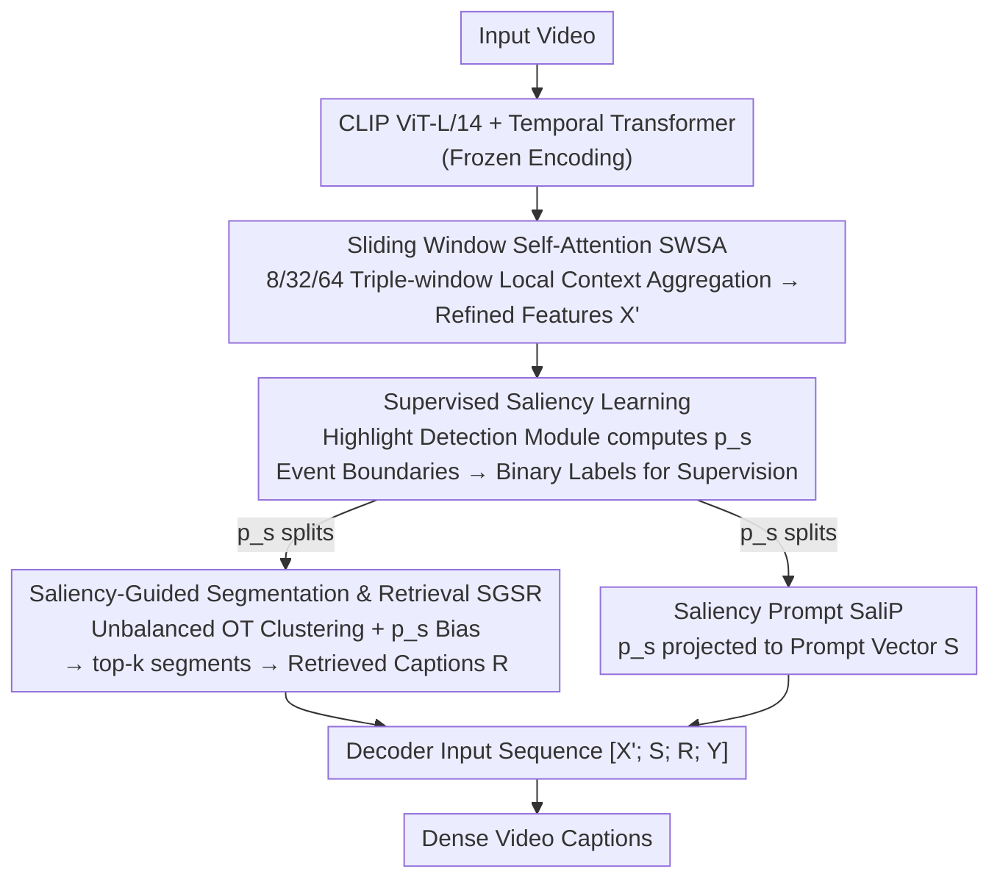

# Follow the Saliency: Supervised Saliency for Retrieval-augmented Dense Video Captioning

**Conference**: CVPR 2026  
**arXiv**: [2603.11460](https://arxiv.org/abs/2603.11460)  
**Code**: [GitHub](https://github.com/ermitaju1/STaRC)  
**Area**: Segmentation  
**Keywords**: Dense video captioning, saliency learning, retrieval augmentation, temporal segmentation, optimal transport

## TL;DR

The STaRC framework is proposed to unify retrieval (saliency-guided segmentation + retrieval) and description generation (saliency prompt injection for the decoder) through supervised frame-level saliency learning, significantly improving temporal alignment and caption quality in Dense Video Captioning (DVC).

## Background & Motivation

Dense Video Captioning (DVC) requires detecting multiple events in long videos and generating natural language descriptions for each, which is fundamentally different from single-sentence video captioning. Recently, retrieval-augmented methods have achieved good results by retrieving relevant captions from external databases to enhance the decoder's event understanding.

However, retrieval operations rely on video segmentation—clustering frames into segments—and the quality of segmentation directly affects captioning quality. Existing methods have clear flaws in temporal segmentation:
- **HiCM2**: Uses uniform sampling for fixed-length segments, failing to adapt to variable-length events.
- **Sali4Vid**: Derives boundaries based on inter-frame similarity changes, but the saliency is derived through timestamp heuristics and lacks supervised learning.

The authors verified a key finding through correlation analysis: **improvements in segment quality metrics (Recall@0.5, Mean IoU, Matched Segments) are strongly positively correlated with downstream DVC metrics (CIDEr, METEOR)**. When segment boundaries closer match ground-truth event boundaries, retrieved captions are more relevant, and the decoder receives more accurate context. This finding clearly points to the need for a framework that improves the alignment between segments and ground-truth events.

## Method

### Overall Architecture

STaRC aims to solve the problem where "retrieval augmentation" in DVC relies heavily on video segmentation; if segment boundaries misalign with ground-truth events, retrieved captions become irrelevant, polluting the decoder's context. The core insight is to let **the same frame-level saliency score** drive the entire pipeline—using it to partition frames into event-aligned segments for retrieval and feeding it as a prompt to the decoder. The workflow is as follows: The input video first extracts spatial embeddings via a frozen CLIP ViT-L/14 and temporal Transformer encoding, then refines frame features $X'$ through Sliding Window Self-Attention (SWSA); a highlight detection module computes supervised frame-level saliency scores $p_s$ on $X'$; this score then splits into two paths: one driving Saliency-Guided Segmentation and Retrieval (SGSR) to select top-k segments for retrieval, and one injected into the decoder as a Saliency Prompt (SaliP). Crucially, saliency labels require no extra annotation—they are converted directly from existing DVC event boundaries.

### Key Designs

**1. Sliding Window Self-Attention (SWSA): Enhancing local temporal context before saliency scoring**

Predicting saliency directly on CLIP frame features is noisy because a single frame lacks information about "what is happening around it." SWSA uses three sliding windows of different scales $\{w_1, w_2, w_3\}$ (sizes 8, 32, 64) to perform local self-attention on frame sequences, aggregating neighborhood information into each frame. Overlapping positions are averaged, followed by a residual connection to obtain refined features $X'$. Multi-scale windows are used because action durations vary—small windows capture instantaneous actions, while large windows capture sustained events. The module deliberately introduces no learnable parameters to save overhead and avoid overfitting.

**2. Supervised Saliency Learning: Converting DVC event boundaries into "free" frame-level supervision**

This is the core innovation. Previously, Sali4Vid's saliency was derived heuristically; STaRC uses a highlight detection module, combining local features $X'$ with global video features $X'_g$ (via attention pooling) to compute per-frame saliency:

$$P_s(x'_n) = \frac{(x'_n \mathbf{W}_1^\top)(x'_{n_g} \mathbf{W}_2^\top)^\top}{\sqrt{D}}$$

The supervision comes from a simple transformation: frames within event boundaries are labeled 1, others 0. A listwise softmax loss is used to ensure annotated frames gain higher probability in the softmax competition across the video. Thus, existing event boundaries in DVC datasets serve as ground truth without new annotations.

**3. Saliency-Guided Segmentation and Retrieval (SGSR): Using Optimal Transport clustering instead of heuristic segmentation with saliency dominance**

SGSR uses Optimal Transport (OT) clustering: $K$ learnable anchors act as semantic prototypes to assign frames into segments. Saliency is injected in two ways: first, via unbalanced OT on the frame side, using $p_s$ as a soft constraint on the frame marginal distribution by adding a KL divergence term $\gamma D_{\text{KL}}(\mathbf{T}^\top \mathbf{1}_K \| p_s)$, allowing salient frames to receive more transport mass; second, $p_s$ is added as a bias to the cost matrix $C^k_{nj} = (1 - \text{cos}(x^s_n, a_j)) - \mu p_{s_n}$. After clustering, segments are ranked by the product of alignment score $\mathcal{S}_{\text{OT}}$ and length regularization $\mathcal{S}_{\text{len}}$ to retrieve top-k captions. Saliency-weighted pooling ensures salient frames dominate the segment representation.

**4. Saliency Prompt (SaliP): Explicitly injecting saliency into decoder inputs**

Unlike Sali4Vid which multiplies saliency into video features (implicit injection easy to dilute), SaliP uses an explicit scheme: a learnable linear layer projects $p_s$ into a prompt vector $S$, concatenated with features $X'$, retrieval embeddings $R$, and transcript $Y$ into a sequence $T_{in} = [X'; S; R; Y]$. This allows the decoder to "read" which frames are semantically important during auto-regressive generation, aligning descriptions with keyframes.

### A Complete Example

In a multi-step cooking video, this unified saliency works as follows:

- **Refinement**: Frames pass through CLIP + Transformer, followed by SWSA 8/32/64 aggregation to get $X'$ with local context.
- **Scoring**: The highlight module computes $p_s$—action frames like "chopping onions" or "stir-frying" get high scores, while transitions like camera shifts get low scores.
- **Segmentation + Retrieval**: SGSR uses $K$ anchors for unbalanced OT, where $p_s$ acts as both a marginal constraint and cost bias. High-score action frames are prioritized into clusters and dominate segment vectors. Top-k (e.g., $k=10$) segments are selected to retrieve captions $R$.
- **Generation**: SaliP projects the same $p_s$ into prompt $S$, which joins $[X'; S; R; Y]$ for the decoder. When generating "Add the chopped onions to the pan," attention focuses precisely on the "adding" frames.

Segmentation, retrieval, and captioning all utilize the **same** saliency score, ensuring temporal consistency.

### Loss & Training

- Total Loss: $\mathcal{L}_{\text{total}} = \mathcal{L}_{\text{CE}} + \lambda \mathcal{L}_{\text{saliency}}$
- The decoder uses original frame features $X$ during training (for fine-grained alignment) and refined features $X'$ during inference (for rich temporal context).
- Based on the Vid2Seq pretrained model (1.8M pairs), pretraining follows original settings, followed by 10 epochs of fine-tuning.
- Learning rate 1e-5, linear warmup + cosine decay, single A6000, batch size 4.
- YouCook2: $\lambda=6.0$; ViTT: $\lambda=2.0$.

## Key Experimental Results

### Main Results

| Dataset | Metric | STaRC | Sali4Vid (Prev. SOTA) | Gain |
|--------|------|-------|---------------------|------|
| YouCook2 | CIDEr | 80.53 | 75.80 | +4.73 |
| YouCook2 | METEOR | 13.86 | 13.54 | +0.32 |
| YouCook2 | SODA_c | 10.73 | 10.28 | +0.45 |
| YouCook2 | BLEU_4 | 6.75 | 6.35 | +0.40 |
| YouCook2 | F1 (Localization) | 34.34 | 33.61 | +0.73 |
| ViTT | CIDEr | 56.04 | 53.87 | +2.17 |
| ViTT | METEOR | 10.49 | 10.05 | +0.44 |

STaRC achieves SOTA on most metrics for YouCook2 and ViTT.

### Ablation Study

| Configuration | CIDEr | METEOR | Description |
|------|-------|--------|------|
| Baseline (Vid2Seq) | 66.29 | 12.41 | Without saliency components |
| + SGSR | 76.94 | 13.60 | Improved segmentation only (+10.65) |
| + SaliP | 78.74 | 13.75 | Prompt injection only (+12.45) |
| SGSR + SaliP (Full) | 80.53 | 13.86 | Complementary effects (+14.24) |
| w/o SWSA | 75.82 | 13.23 | Refinement is beneficial |
| k-means segmentation | 75.63 | 13.34 | OT significantly outperforms k-means |
| Adaptive clustering | 78.19 | 13.69 | OT outperforms adaptive clustering |

### Key Findings

- SGSR and SaliP are independently effective and complementary, validating the unified saliency design.
- The 8, 32, 64 triple-window configuration is optimal; excessively large windows degrade performance.
- Retrieval count $p=10$ is best; too few lacks information, too many introduces noise.
- Saliency prompt quality is critical: replacing with Gaussian noise or zero vectors significantly reduces performance.

## Highlights & Insights

1. **"Free" Supervision**: Converting existing DVC event boundaries into frame-level saliency labels is clever and cost-effective.
2. **Unified Signal**: The same saliency score serves both retrieval (SGSR) and generation (SaliP), ensuring temporal consistency between segmentation and captioning.
3. **OT + Saliency Bias**: Injecting saliency through both marginal constraints and cost matrices within the OT framework provides a solid theoretical foundation.
4. **Asymmetric Training-Inference Features**: Using original features for training (accuracy) and refined features for inference (context) is a skillful design choice.

## Limitations & Future Work

- Reliance on Vid2Seq 1.8M pretraining; no fair comparison with non-pretrained methods (though shown in groups).
- F1 localization on ViTT (44.34) is lower than Sali4Vid (46.58) and HiCM2 (45.98), suggesting segmentation might not be superior on short-label data.
- SWSA lacks learnable parameters; missing comparison with learnable local attention.
- Saliency labels are hard binary; they do not account for transitions near boundaries, potentially introducing noise.

## Related Work & Insights

- Sali4Vid first identified that important frames benefit retrieval/generation, but its saliency was heuristic—STaRC's contribution is making this a learnable supervised signal.
- OT clustering originates from ASOT; STaRC's novelty lies in the saliency bias and unbalanced constraints.
- Highlight detection modules draw from QD-DETR and EASeg, adapted for DVC.
- The unified signal concept can be extended to other multimodal tasks requiring coordinated segmentation and generation.

## Rating

- Novelty: ⭐⭐⭐⭐ The idea of unifying saliency across retrieval and generation channels is clear and effective.
- Experimental Thoroughness: ⭐⭐⭐⭐ Extensive ablation, hyperparameter analysis, and qualitative comparisons, though cross-dataset generalization is limited.
- Writing Quality: ⭐⭐⭐⭐ Clear motivation (correlation plots are convincing) and tight structure.
- Value: ⭐⭐⭐⭐ Substantial progress in DVC; the unified saliency paradigm has potential for broader application.

<!-- RELATED:START -->

## Related Papers

- [\[CVPR 2026\] M4-SAM: Multi-Modal Mixture-of-Experts with Memory-Augmented SAM for RGB-D Video Salient Object Detection](m4-sam_multi-modal_mixture-of-experts_with_memory-augmented_sam_for_rgb-d_video_.md)
- [\[CVPR 2026\] ROSE: Retrieval-Oriented Segmentation Enhancement](rose_retrieval-oriented_segmentation_enhancement.md)
- [\[CVPR 2026\] CaptionFormer: Unified Segmentation, Tracking, and Captioning for Spatio-Temporal Objects](captionformer_unified_segmentation_tracking_and_captioning_for_spatio-temporal_o.md)
- [\[ICCV 2025\] Beyond Single Images: Retrieval Self-Augmented Unsupervised Camouflaged Object Detection](../../ICCV2025/segmentation/beyond_single_images_retrieval_self-augmented_unsupervised_camouflaged_object_de.md)
- [\[CVPR 2026\] Frequency-Aware Affinity for Weakly Supervised Semantic Segmentation](frequency-aware_affinity_for_weakly_supervised_semantic_segmentation.md)

<!-- RELATED:END -->
