# FoV-Net: Rotation-Invariant CAD B-rep Learning via Field-of-View Ray Casting

**Conference**: CVPR 2026  
**arXiv**: [2602.24084](https://arxiv.org/abs/2602.24084)  
**Code**: [GitHub](https://github.com/UGent-CVAMO/fovnet)  
**Area**: Segmentation  
**Keywords**: CAD B-rep learning, rotation invariance, ray casting, graph attention networks, 3D segmentation

## TL;DR

FoV-Net is proposed as the first rotation-invariant framework for CAD B-rep learning that simultaneously captures local surface geometry and global structural context. It achieves robust classification and segmentation under arbitrary $\mathbf{SO}(3)$ rotations through Local Reference Frame UV grids (LRF UV) and Field-of-View (FoV) ray casting descriptors.

## Background & Motivation

CAD Boundary Representation (B-rep) is a graph structure where faces are nodes and shared edges are connections, making it naturally suitable for GNN processing. A core challenge in existing B-rep learning methods is designing descriptors that can capture both local surface geometry and global structural context.

UV-Net pioneered sampling the UV parameter domain into grids, storing absolute coordinates $(x,y,z)$ and normal vectors $(n_x, n_y, n_z)$ in the global coordinate system, serving as the foundation for many subsequent methods. However, this reliance on global coordinates introduces significant **rotation sensitivity**. The authors' experiments reveal a striking phenomenon:

> Models achieving over 95% accuracy on aligned benchmarks can **collapse to 10%** under arbitrary $\mathbf{SO}(3)$ rotations.

This is unacceptable in real-world manufacturing pipelines—CAD models come from diverse sources and analysis must be robust to arbitrary orientations. While rotation augmentation partially mitigates this, it cannot cover all rotations and incurs computational costs. More importantly, even on aligned data, rotation invariance is crucial for segmentation: face variations at different positions can lead to spurious pose correlations, harming generalization in small-data scenarios.

## Method

### Overall Architecture

FoV-Net aims to solve the problem of computing a descriptor for each B-rep face that is **aware of its own geometry, its surrounding structure, and remains invariant under any rotation**. It provides two complementary inputs for each face: one focusing on the face's own local surface shape (LRF UV grid) and another using ray casting to "see" what surrounds the face (FoV grid). Both descriptors are extracted into feature vectors by lightweight CNNs, then concatenated with basic face attributes (type, area) and fused through an MLP into a unified face embedding. These embeddings are attached to the nodes of the B-rep graph (faces as nodes, shared edges as connections). Finally, a 3-layer Graph Attention Network (GAT) propagates information across the graph for classification or per-face segmentation. Crucially, as both descriptor coordinates and directions are defined in the **face's own local coordinate system**, the entire model is naturally immune to global orientation.

```mermaid
%%{init: {'flowchart': {'rankSpacing': 24, 'nodeSpacing': 28, 'padding': 6, 'wrappingWidth': 400, 'subGraphTitleMargin': {'top': 8, 'bottom': 16}}}}%%
flowchart TD
    A["B-rep Face (Graph Node)<br/>Local Reference Frame R_f at center o"]
    subgraph D1["Local Reference Frame UV Grids (LRF UV)"]
        direction TB
        B["UV Domain Sampling<br/>Points Transformed to Local Frame"] --> C["n_u×n_v×7 Grid<br/>Rel. Coords + Normals + Mask"]
    end
    subgraph D2["Field-of-View Descriptors (FoV)"]
        direction TB
        E["Ray Casting from Center to Hemisphere<br/>6×12 Grid: Hit / Dist / Incidence"] --> F["Outward Vision (OV)<br/>Along N to Environment"]
        E --> G["Inward Vision (IV)<br/>Along −N to Internal Structure"]
    end
    A --> B
    A --> E
    subgraph D3["Lightweight Architecture"]
        direction TB
        H["LRF UV Encoder<br/>3-layer CNN → 64D"]
        I["OV/IV Encoder<br/>2-layer CNN → 64D"]
        J["Face Attributes<br/>Type (6D) + Area"]
        H --> K["Fusion MLP<br/>2-layer (256 Hidden) → 64D Embedding"]
        I --> K
        J --> K
        K --> L["3-layer GAT (4 heads)<br/>Info Prop on B-rep Graph"]
    end
    C --> H
    F --> I
    G --> I
    L --> M["Classification (GMP + MLP) / Per-face Segmentation"]
```

### Key Designs

**1. Local Reference Frame UV grids (LRF UV): Decoupling local geometry from global pose**

Methods in the UV-Net lineage sample the UV domain into grids and store absolute $(x,y,z)$ coordinates and normals—the source of collapse under rotation, as coordinates change when the part rotates. FoV-Net instead stores **relative coordinates in the face’s local coordinate system**. Specifically, an orthonormal basis is constructed at the face center $\mathbf{o}$ using the normal vector $\mathbf{N}$, the normalized projection of the U-direction tangent vector $\mathbf{U}$, and $\mathbf{V} = \mathbf{N} \times \mathbf{U}$. This forms a rotation matrix $\mathbf{R}_f$, and each sampled grid point $\mathbf{p}$ is transformed:

$$\mathbf{p}' = \mathbf{R}_f^\top (\mathbf{p} - \mathbf{o})$$

Regardless of the part's orientation, a face remains stationary relative to its own frame, ensuring identical descriptors. Each face is represented as an $n_u \times n_v \times 7$ tensor (3D relative coordinates + 3D normals + 1D trim mask). Constructing an LRF on B-reps is more reliable than on point clouds because B-rep faces provide inherent parametric discretization and a clear reference direction, avoiding noisy local LRF calculations.

**2. Field-of-View (FoV) Descriptors: Recovering structural context via ray casting**

LRF UV solves rotation but captures only the face itself, losing context. FoV addresses this via computer graphics ray casting: rays are cast from the face center $\mathbf{o}$ towards the normal hemisphere, discretized into a grid (default $6 \times 12$). Each ray records: hit status, distance to intersection, and the dot product between the ray and the surface normal at the hit point (encoding incidence angle). Since ray origins and directions are local, the "surround-view" descriptor is rotation-invariant and, based on relative distances, translation-invariant.

Rays are cast in two directions: **Outward Vision (OV)** along $\mathbf{N}$ to detect external environments, and **Inward Vision (IV)** along $-\mathbf{N}$ to detect internal structures. For watertight solids, inward rays almost certainly intersect, providing rich distance information. For example, a slot bottom's OV rays hit walls quickly (short distance), while IV rays pass through the solid material; this contrast encodes the face's role as a "slot bottom."

**3. Lightweight Architecture: Focus on efficiency and pruning redundant features**

Three encoders are used: OV/IV encoders use 2-layer CNNs ($32 \to 64$ channels) with global average pooling and circular padding for angular periodicity. The LRF UV encoder uses a 3-layer CNN ($32 \to 64 \to 128$) pooled to 64D. Face attributes (one-hot type and area) are combined. These features are fused into a 64D face embedding via a 2-layer MLP and processed by a 3-layer, 4-head GAT. The model intentionally omits edge features as ablation showed minimal gains, reducing computational overhead for industrial pipelines.

### Loss & Training

- Classification: Global Max Pooling + 2-layer MLP head.
- Segmentation: Face embeddings fed into a per-face prediction head.
- Optimizer: Adam (lr=0.001, batch size 64), early stopping (patience 30).
- Hardware: Single NVIDIA RTX A5000 (24GB); experiments repeated 5 times.

## Key Experimental Results

### Main Results

| Dataset | Task | Metric | FoV-Net (Rotated) | FoV-Net (Original) | UV-Net (Rotated) | AAGNet (Rotated) |
|--------|------|------|----------------|----------------|---------------|---------------|
| SolidLetters | Class. | Acc% | **96.35** | 96.35 | 8.94 | 14.03 |
| TraceParts | Class. | Acc% | **100.00** | 100.00 | 45.67 | 91.33 |
| Fusion360 | Seg. | Acc% | **91.72** | 91.72 | 69.13 | 79.85 |
| Fusion360 | Seg. | IoU% | **73.81** | 73.81 | 37.07 | 53.42 |
| MFCAD++ | Seg. | Acc% | **99.33** | 99.33 | 35.44 | 80.13 |
| MFCAD++ | Seg. | IoU% | **97.81** | 97.81 | 18.79 | 64.70 |

FoV-Net performance is identical before and after rotation. UV-Net collapses from 97.10% to 8.94% on SolidLetters.

### Ablation Study

| Configuration | SolidLetters Acc% | Description |
|------|-------------------|------|
| FoV-Net Full | 96.35 | LRF UV + FoV are complementary |
| FoV Grid Only | 95.79 | Rich structural context |
| LRF UV Only | 94.39 | Strong local geometry |
| OV Only | 92.92 | Outward vision |
| IV Only | 93.40 | Inward slightly better than outward |
| Face Attr. Only | 70.68 | Basic attributes insufficient |
| Topology Only | 37.72 | Graph structure alone is inadequate |

### Key Findings

- FoV grids and LRF UV are highly complementary, outperforming either alone.
- Even small FoV resolutions ($4 \times 2$) produce effective features; however, a single ray ($1 \times 1$) drops accuracy to 75%.
- **Surprising Data Efficiency**: Ours reaches 80% accuracy on MFCAD++ with only 50 samples, whereas UV-Net requires ~10,000 samples.
- Rotation augmentation improves robustness at the cost of overall performance; FoV-Net avoids this trade-off.

## Highlights & Insights

1.  **Strong Problem Identification**: Systematically quantifies the severity of rotation sensitivity in B-rep learning; the 95% to 10% collapse is impactful.
2.  **Ray Casting for Descriptors**: Creatively introduces classical graphics techniques to B-rep learning, leveraging CAD kernel precision to observe surrounding structures.
3.  **Dual Vision Complementarity**: Outward rays detect environment and inward rays detect internal structure, providing complete 3D context.
4.  **B-rep Face LRF Advantages**: B-rep faces naturally provide parameterization and reference directions, making LRF construction simpler and more reliable than in point clouds.
5.  **Data Efficiency**: Low data requirement is a significant advantage in industrial CAD where IP restrictions limit data availability.

## Limitations & Future Work

- Ray casting relies on the PythonOCC CAD kernel (CPU) and lacks GPU acceleration.
- Experiments focused on medium-complexity single parts; scalability to large assemblies remains to be verified.
- FoV grids use equirectangular 3D-to-2D mapping, which has polar distortion; spherical CNNs might provide more uniform parameterization.
- UV axis flipping/swapping ambiguities are not explicitly handled (UV-Net used D2 equivariant convolutions).
- Omission of edge features may limit performance in tasks where edge characteristics are critical, such as B-rep generation.

## Related Work & Insights

- UV-Net pioneered the UV grid paradigm but lacked rotation invariance—FoV-Net solves this via LRF transformation.
- Concepts from rotation-invariant point cloud methods (combining LRF and global context) are successfully migrated to the B-rep domain.
- Ray casting, previously used for tool accessibility in CAD, is extended here as a general face descriptor.
- FoV descriptors show high potential for contrastive pre-training and unsupervised CAD retrieval.

## Rating

- Novelty: ⭐⭐⭐⭐⭐ First rotation-invariant B-rep framework; ray casting descriptor is highly original.
- Experimental Thoroughness: ⭐⭐⭐⭐⭐ Four datasets, classification and segmentation tasks, rotation/original comparisons, detailed ablation, and data efficiency analysis.
- Writing Quality: ⭐⭐⭐⭐⭐ Strong problem statement, clear visualizations, and rigorous structure.
- Value: ⭐⭐⭐⭐⭐ Solves the long-standing rotation sensitivity problem in B-rep learning with broad industrial potential.

<!-- RELATED:START -->

## Related Papers

- [\[CVPR 2026\] Pointer-CAD: Unifying B-Rep and Command Sequences via Pointer-based Edges & Faces Selection](pointer-cad_unifying_b-rep_and_command_sequences_via_pointer-based_edges_faces_s.md)
- [\[CVPR 2026\] Unified Spherical Frontend: Learning Rotation-Equivariant Representations of Spherical Images from Any Camera](unified_spherical_frontend_learning_rotation-equivariant_representations_of_sphe.md)
- [\[CVPR 2026\] Learning Cross-View Object Correspondence via Cycle-Consistent Mask Prediction](learning_cross-view_object_correspondence_via_cycle-consistent_mask_prediction.md)
- [\[CVPR 2026\] PRUE: A Practical Recipe for Field Boundary Segmentation at Scale](prue_a_practical_recipe_for_field_boundary_segmentation_at_scale.md)
- [\[CVPR 2026\] XSeg: A Large-scale X-ray Contraband Segmentation Benchmark for Real-World Security Screening](xseg_a_large-scale_x-ray_contraband_segmentation_benchmark_for_real-world_securi.md)

<!-- RELATED:END -->
