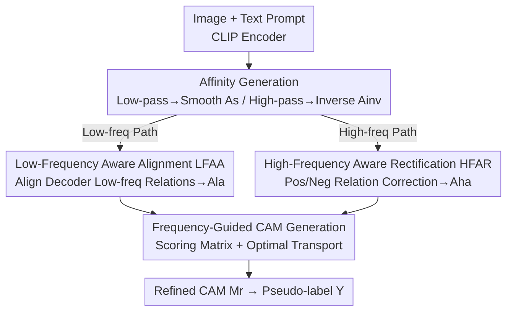

# Frequency-Aware Affinity for Weakly Supervised Semantic Segmentation

**Conference**: CVPR 2026  
**Paper**: [CVF Open Access](https://openaccess.thecvf.com/content/CVPR2026/html/Yang_Frequency-Aware_Affinity_for_Weakly_Supervised_Semantic_Segmentation_CVPR_2026_paper.html)  
**Code**: Available (Original text notes "Code is available here", but no explicit repository link provided)  
**Area**: Weakly Supervised Semantic Segmentation  
**Keywords**: Weakly Supervised Semantic Segmentation, CAM Refinement, Frequency-Domain Affinity, Optimal Transport, CLIP  

## TL;DR
Addressing the issue where ViT self-attention acts as a low-pass filter, resulting in affinity that only diffuses within object interiors and loses boundaries, this paper proposes the Dual Frequency-Aware (DFA) framework. DFA uses low-frequency affinity to align internal semantics and high-frequency (inverse) affinity to correct object boundaries. By employing Optimal Transport-based Frequency-Guided CAM generation, the "generation + refinement" process is merged into a single step, achieving new single-stage WSSS SOTA results on PASCAL VOC (val 79.3% mIoU) and MS COCO (val 51.5%).

## Background & Motivation
**Background**: Weakly Supervised Semantic Segmentation (WSSS) utilizes only image-level labels for training. Class Activation Maps (CAM) provide pixel-level localization to generate pseudo-labels for supervising the segmentation head. However, original CAMs often only activate the most discriminative local regions (e.g., the bird's body rather than the whole bird), providing sparse supervision signals. Mainstream remedies use ViT/CLIP self-attention to construct affinity matrices between patch tokens, diffusing activations along semantically consistent directions to expand object coverage and improve pseudo-label quality.

**Limitations of Prior Work**: The self-attention mechanism in ViT is essentially a **low-pass filter** that smooths token features. This smoothing suppresses high-frequency signals corresponding to fine-grained details (object boundaries, inter-class distinctions), causing the resulting affinity to be dominated by low-frequency components. Consequently, while affinity propagates semantics effectively within uniform object regions, it fails to refine complex boundaries—refined CAMs achieve complete internal activation but suffer from over-activation, bleeding into the background.

**Key Challenge**: Low-frequency affinity (from low-pass filtering) excels at interiors but fails at boundaries, whereas high-frequency affinity (from high-pass filtering) does the opposite—it preserves boundary activations and suppresses background noise but lacks the low-frequency semantic prior needed to maintain coherent internal activation. These two types of affinity are **complementary in strength and weakness**, yet they have not been correctly unified.

**Goal**: To "purify" these two complementary affinities into directly usable frequency-aware forms and fuse them under appropriate supervision to ensure both internal consistency and boundary precision, while simplifying the traditional "coarse CAM then multi-step refinement" pipeline.

**Key Insight**: The authors explicitly treat self-attention as a low-pass filter and its spectral inversion in the frequency domain as a high-pass filter, obtaining both smoothed affinity and inverse affinity simultaneously. Furthermore, decoder features naturally decompose into low/high-frequency components, which provide supervision signals for the two affinity paths.

**Core Idea**: Replace "single smoothed affinity + multi-step refinement" with "low-frequency interior alignment + high-frequency boundary correction + single-step optimal transport generation," enabling CAMs to possess both internal completeness and boundary accuracy.

## Method

### Overall Architecture
DFA is a **single-stage framework requiring only image-level supervision**. Inputs consist of an image and text prompts for $C$ categories. Through a frozen CLIP (ViT-B/16) image/text encoder, patch token features $F\in\mathbb{R}^{d\times hw}$ and text features $T_f\in\mathbb{R}^{C\times d}$ are obtained. The framework extracts smoothed affinity $A_s$ from self-attention (low-pass) and inverse affinity $A_{inv}$ from its frequency-domain inversion (high-pass); both paths are made learnable via MLPs. Subsequently, the **LFAA module** aligns $A_s$ with decoder low-frequency feature relations to obtain low-frequency aware affinity $A_{la}$ (strengthening internal consistency). The **HFAR module** uses high-frequency feature relations, pseudo-labels, and shifted windows to identify positive/negative relations to correct $A_{inv}$, obtaining high-frequency aware affinity $A_{ha}$ (strengthening boundaries). Finally, the **FG CAM Generation module** fuses $A_{la}$, $A_{ha}$, and image-text similarity into a scoring matrix. Under Optimal Transport (OT) optimization, token features are assigned to target classes to generate refined CAMs in **one step**, from which pseudo-labels are derived.

### Key Designs

**1. Dual-path Frequency-domain Affinity Generation: Splitting Self-attention into Low-pass and High-pass Components**

Traditional methods use a single ViT self-attention (low-pass) path for affinity, resulting in dominance by low-frequency components and loss of boundaries. This paper extracts two complementary signals from the same attention. First, standard attention is obtained via query-key dot product $W=\mathrm{Softmax}\!\left(\frac{QK^{\mathrm T}}{\sqrt d}\right)$. Then, $W$ is moved to the frequency domain via Fourier Transform, subtracted from an all-pass filter $\mathbb{I}$, and transformed back to obtain high-pass inverse attention:

$$W_{inv}=\mathcal{F}^{-1}\big(\mathbb{I}-\mathcal{F}(W)\big)$$

After MLPs, the two attentions remain asymmetric and are symmetrized into affinities using Sinkhorn normalization:

$$A_s=\tfrac{1}{2}\big(\mathrm{Norm}(W')+\mathrm{Norm}(W')^{\mathrm T}\big),\quad A_{inv}=\tfrac{1}{2}\big(\mathrm{Norm}(W'_{inv})+\mathrm{Norm}(W'_{inv})^{\mathrm T}\big)$$

$A_s$ (smoothed affinity) captures structural relations of the object body, while $A_{inv}$ (inverse affinity) captures boundary detail relations. The elegance of this step lies in obtaining complementary perspectives with almost zero additional parameters by using **spectral inversion**.

**2. Low-Frequency Aware Alignment (LFAA): Using Decoder Low-frequency Relations to Densify Sparse Internal Relations**

Smoothed affinity $A_s$ tends to homogenize tokens, leading to sparse internal semantic relations. LFAA aligns $A_s$ with a denser distribution derived from low-frequency relations of decoder features during training. Specifically, decoder patch features $F_d$ are transformed to the frequency domain, high-frequency components are masked by regional ratios, and inverse transformed to obtain low-frequency features $F_{ld}$. These represent structural information corresponding to $A_s$. The low-frequency feature relation is $S_l=\mathrm{Sigmoid}(F_{ld}^{\mathrm T}F_{ld})$.

Since decoder features update continuously, early relations are unreliable. The authors use **selective alignment** to transfer only the most confident, dense relations by constructing a mask $M_d^{i,j}=1$ if $S_l^{i,j}>\alpha$ (where $\alpha$ is a quality value accumulated from the difference between $A_s$ and $S_l$). $S_l$ acts as a teacher to distill knowledge into $A_s$ via a masked KL divergence loss:

$$\mathcal{L}_a=\frac{1}{\sum_{i,j}M_d^{i,j}}\sum_{i,j}M_d^{i,j}\,\tilde S_l^{i,j}\log\frac{\tilde S_l^{i,j}}{\tilde A_s^{i,j}}$$

Guided by $\mathcal{L}_a$, $A_s$ approximates the dense distribution, refining into low-frequency aware affinity $A_{la}$ and enhancing internal consistency.

**3. High-Frequency Aware Rectification (HFAR): Denoising Inverse Affinity with Pseudo-labels and High-frequency Relations**

While $A_{inv}$ contains boundary relations, it is plagued by background and semantically irrelevant noise. HFAR aims to **enhance positive relations and suppress negative relations**. It calculates high-frequency relations $S_h=\mathrm{Sigmoid}(F_{hd}^{\mathrm T}F_{hd})$ from high-frequency features $F_{hd}$ (total features minus low-frequency) and uses pseudo-labels $Y$ as cross-conditions to select reliable relations:

$$M_+^{i,j}=\begin{cases}1,& S_h^{i,j}>\overline{S_h}\ \text{and}\ Y^i=Y^j\\0,&\text{otherwise}\end{cases}\qquad M_-^{i,j}=\begin{cases}1,& S_h^{i,j}\le\overline{S_h}\ \text{and}\ Y^i\neq Y^j\\0,&\text{otherwise}\end{cases}$$

For relations where $S_h$ and $Y$ are inconsistent or ambiguous, a **shifted window** is used to judge based on structural consistency of neighbor patches. Finally, a rectification loss pulls positive relations toward 1 and pushes negative relations toward 0:

$$\mathcal{L}_r=\frac{1}{\sum_{i,j}M_+^{i,j}}\sum_{i,j}M_+^{i,j}\big(1-A_{inv}^{i,j}\big)+\frac{1}{\sum_{i,j}M_-^{i,j}}\sum_{i,j}M_-^{i,j}A_{inv}^{i,j}$$

This refines $A_{inv}$ into high-frequency aware affinity $A_{ha}$.

**4. Frequency-Guided (FG) CAM Generation: Merging Generation and Refinement via Optimal Transport**

Traditional CLIP-WSSS methods generate coarse CAMs via Grad-CAM or patch-text alignment and then apply multi-step refinement, causing error accumulation. This paper models the assignment of image token features $F$ to text features $T_f$ as an Optimal Transport (OT) problem, replacing the cost matrix with a **scoring matrix** $O$ built from the dual frequency-aware affinities:

$$O^{i,c}=\lambda_l\sum_{j=1}^{hw}A_{la}^{i,j}S^{j,c}+\lambda_h\bar A_{ha}^{i}$$

$O$ integrates target class information, low-frequency relations, and high-frequency relations. To guide tokens toward target classes, text distribution marginal constraints $v=\mathrm{Softmax}(x)$ are used, where $x_c=\sum_i S^{i,c}$. The resulting OT plan $T^*$ is solved:

$$T^{*}=\arg\max_{T}\sum_{i,c}T^{i,c}O^{i,c},\quad \text{s.t.}\ T\mathbf{1}_C=\tfrac{1}{hw}\mathbf{1}_{hw},\ T^{\mathrm T}\mathbf{1}_{hw}=v$$

Using Sinkhorn distance for optimization, the probability matrix $T^*$ is max-normalized to generate refined CAMs: $M_r^{i,c}=T^{*\,i,c}/\max(T^{*,:,c})$.

### Loss & Training
The total objective fuses segmentation loss, distribution alignment loss, and relation rectification loss:

$$\mathcal{L}_{DFA}=\mathcal{L}_{seg}+\lambda_1\mathcal{L}_a+\lambda_2\mathcal{L}_r$$

Implementation uses frozen CLIP ViT-B/16 with a lightweight transformer decoder. Training uses AdamW, input crop to $320\times320$, and window size $r=9$. Scoring matrix weights are $\lambda_l=1, \lambda_h=0.1$. Loss weights are $\lambda_1=0.1, \lambda_2=0.2$. Inference uses Dense CRF and multi-scale (1.0/1.2/1.5).

## Key Experimental Results

### Main Results
Comparison of CAM Seed and Pseudo-label (Mask) quality on PASCAL VOC train split:

| Method | Superv. | Backbone | Seed | Mask |
|------|------|----------|------|------|
| CLIP-ES (CVPR'23) | I+L | RN101 | 70.8 | 75.0 |
| ToCo (CVPR'23) | I | ViT-B | 71.6 | 72.2 |
| POT (CVPR'25) | I+L | RN50 | 75.0 | 79.3 |
| ExCEL (CVPR'25) | I+L | ViT-B | 78.0 | - |
| **Ours (DFA)** | I+L | ViT-B | **79.1** | **80.8** |

Final segmentation mIoU (VOC val/test and COCO val):

| Method | Type | Backbone | VOC val | VOC test | COCO val |
|------|------|----------|---------|----------|----------|
| PSDPM (CVPR'24) | Multi-stage | RN101 | 74.1 | 74.9 | 47.2 |
| POT (CVPR'25) | Multi-stage | RN50 | 76.1 | 76.7 | 47.9 |
| WeCLIP (CVPR'24) | Single-stage | ViT-B | 76.4 | 77.2 | 47.1 |
| ExCEL (CVPR'25) | Single-stage | ViT-B | 78.4 | 78.5 | 50.3 |
| **Ours (DFA)** | Single-stage | ViT-B | **79.3** | **79.8** | **51.5** |

### Ablation Study
Effectiveness of modules (VOC train, M for CAM mIoU%; E(⊙) for element-wise refinement):

| # | $A_s$ | $A_{inv}$ | $A_{la}$ | $A_{ha}$ | E(⊙) | FG | M |
|---|------|------|------|------|------|------|------|
| 0 | ✓ | | | | ✓ | | 64.8 |
| 1 | ✓ | ✓ | | | ✓ | | 67.2 |
| 2 | | | ✓ | | ✓ | | 75.1 |
| 3 | | | ✓ | ✓ | ✓ | | 77.9 |
| 4 | | | ✓ | ✓ | | ✓ | **79.1** |

### Key Findings
- **Inverse affinity provides complementary value**: Adding $A_{inv}$ to traditional refinement improves mIoU from 64.8% to 67.2%, confirming high-frequency boundary relations as a useful supplement.
- **Alignment and Rectification are primary drivers**: Refining to $A_{la}+A_{ha}$ significantly boosts performance to 77.9%, proving that the supervision losses effectively purify coarse affinity.
- **FG CAM Generation outperforms traditional refinement**: Switching from element-wise multiplication to OT scoring matrix further increases performance to 79.1%, proving that unifying generation and refinement is more effective and avoids error accumulation.

## Highlights & Insights
- **Self-attention as Low-pass, Spectral Inversion as High-pass**: Deriving complementary high-frequency affinity via simple frequency-domain subtraction ($\mathbb{I}-\mathcal{F}(W)$) is an elegant, parameter-free approach applicable to any attention-based affinity task.
- **Decoder as a "Frequency Teacher"**: Using low/high-frequency feature relations from the decoder of the current model provides a self-distilled frequency-domain supervision that strengthens as training progresses.
- **Rewriting CAM Generation as OT Assignment**: Using a scoring matrix and marginal constraints within an OT framework condenses "coarse map + multi-step refinement" into a single Sinkhorn iteration, improving both quality and efficiency.

## Limitations & Future Work
- The framework depends on a frozen CLIP encoder; performance is bound to the quality of CLIP's image-text alignment.
- Details of the positive/negative relation determination in HFAR are relegated to the supplementary material.
- Frequency decomposition relies on hyperparameters like regional ratios and weights ($\lambda_1/\lambda_2$), whose robustness across different scales or datasets requires further analysis.

## Related Work & Insights
- **vs. ViT Self-attention Affinity (e.g., AFA / ToCo)**: These use only low-pass smoothed affinity, failing at boundaries, whereas DFA introduces high-frequency inverse affinity.
- **vs. CLIP-ES / ExCEL**: DFA merges generation and refinement into a single OT-based step, exceeding ExCEL's CAM quality by 1.1%.
- **vs. POT / DHR (OT-WSSS)**: Unlike prior OT methods that focus on class prototype assignment or area balancing, DFA integrates **frequency-aware affinities** into the OT scoring matrix.

## Rating
- Novelty: ⭐⭐⭐⭐⭐ 
- Experimental Thoroughness: ⭐⭐⭐⭐ 
- Writing Quality: ⭐⭐⭐⭐ 
- Value: ⭐⭐⭐⭐⭐ 

<!-- RELATED:START -->

## Related Papers

- [\[CVPR 2026\] Leveraging Class Distributions in CLIP for Weakly Supervised Semantic Segmentation](leveraging_class_distributions_in_clip_for_weakly_supervised_semantic_segmentati.md)
- [\[CVPR 2026\] Beyond Text: Visual Description Assembly by Probabilistic Model for CLIP-based Weakly Supervised Semantic Segmentation](beyond_text_visual_description_assembly_by_probabilistic_model_for_clip-based_we.md)
- [\[AAAI 2026\] SSR: Semantic and Spatial Rectification for CLIP-based Weakly Supervised Segmentation](../../AAAI2026/segmentation/ssr_semantic_and_spatial_rectification_for_clip-based_weakly_supervised_segmenta.md)
- [\[CVPR 2025\] Exploring CLIP's Dense Knowledge for Weakly Supervised Semantic Segmentation](../../CVPR2025/segmentation/exploring_clips_dense_knowledge_for_weakly_supervised_semantic_segmentation.md)
- [\[CVPR 2026\] Rethinking Box Supervision: Bias-Free Weakly Supervised Medical Segmentation](rethinking_box_supervision_bias-free_weakly_supervised_medical_segmentation.md)

<!-- RELATED:END -->
