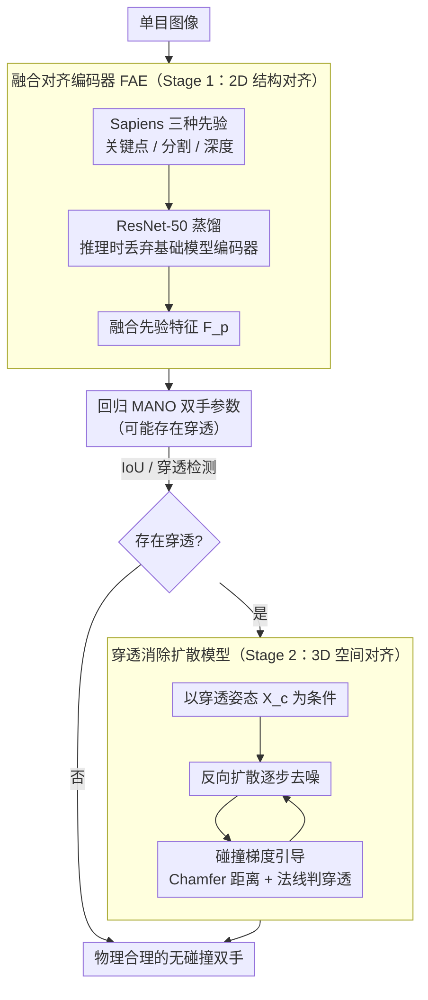

# From 2D Alignment to 3D Plausibility: Unifying Heterogeneous 2D Priors and Penetration-Free Diffusion for Occlusion-Robust Two-Hand Reconstruction

**Conference**: CVPR 2026  
**arXiv**: [2503.17788](https://arxiv.org/abs/2503.17788)  
**Code**: [Project Page](https://gaogehan.github.io/A2P/)  
**Area**: Segmentation / 3D Hand Reconstruction  
**Keywords**: Two-hand reconstruction, 2D prior fusion, diffusion models, penetration removal, occlusion robustness

## TL;DR

The authors decouple two-hand reconstruction into 2D structural alignment (fusing keypoint/segmentation/depth priors) and 3D spatial interaction alignment (penetration-removal diffusion model). This approach achieves an MPJPE of 5.36mm on InterHand2.6M, significantly outperforming the state-of-the-art.

## Background & Motivation

Monocular two-hand reconstruction faces two core challenges: (1) **Ambiguous 2D-3D correspondence** due to complex poses and severe occlusion, where existing methods lack effective structural guidance; (2) Frequent **hand interpenetration** in interactive scenarios, which existing methods fail to handle with dedicated mechanisms.

Although vision foundation models (e.g., Sapiens) excel in keypoint detection, segmentation, and depth estimation, fine-tuning these large models directly is computationally expensive, and 2D priors are not entirely reliable under occlusion. Meanwhile, although diffusion models can capture interaction priors, they require accurate observation alignment to avoid degradation.

The Key Insight of the authors is that **2D alignment and 3D alignment require a divide-and-conquer strategy**: first align structures using heterogeneous 2D priors, then eliminate penetration in 3D space using generative models.

## Method

### Overall Architecture

The pipeline consists of two stages: Stage 1 involves 2D multi-modal prior alignment, which fuses features from three foundation models—keypoints, segmentation, and depth—to guide hand parameter regression. Stage 2 utilizes a 3D penetration-free diffusion model to map penetrating two-hand poses into physically plausible, collision-free configurations. A gate based on IoU/penetration detection is used between stages—only samples with actual penetration enter the Stage 2 diffusion to avoid redundant inference on collision-free results.

### Key Designs

1.  **Fusion Alignment Encoder (FAE)**: The core idea is to use a lightweight ResNet-50 encoder to distill three prior features (keypoints $\mathbf{F}_k$, segmentation $\mathbf{F}_s$, depth $\mathbf{F}_d$) from Sapiens foundation models during training. The fused feature $\mathbf{F}_p = \text{Proj}(\mathbf{F}_k, \mathbf{F}_s, \mathbf{F}_d)$ is unified through learnable projection layers. FAE aligns $\mathbf{F}_{fa}$ and $\mathbf{F}_p$ using an MSE loss. **All foundation model encoders are discarded during inference**, enabling encoder-free deployment—retaining multi-prior accuracy while significantly reducing computational overhead. This strategy of "distill during training, discard during inference" is highly efficient.

2.  **Two-Hand Penetration-Free Diffusion Model**: This Transformer-based diffusion model is conditioned on the penetrating two-hand MANO parameters $\mathbf{X}_c$, learning a generative mapping from penetrating to collision-free poses. Training data is constructed in two ways: (a) penetration results predicted by low-performance models; (b) adding small noise to ground truth until penetration occurs. The diffusion loss is $\mathcal{L}_{diffusion} = \|\mathbf{X}_0 - \mathcal{D}(\mathbf{X}_t, \mathbf{X}_c)\|_2$. During inference, IoU and penetration detection are performed first, and diffusion is only triggered for samples that actually exhibit penetration (reducing unnecessary inference cost).

3.  **Collision Gradient Guidance**: A collision gradient is introduced at each step of reverse diffusion. Specifically, $\hat{\mathbf{X}}_0$ is obtained from $\mathbf{X}_{t-1}$ via DDIM sampling, mesh vertices are retrieved through the MANO model, and collision is detected using a hybrid distance-direction criterion: Chamfer distance $\mathbf{N}_{ij} = |\mathbf{V}_{t-1}^i - \mathbf{V}_c^j|^2$ is first calculated to filter neighbor vertex pairs, and then normal cosine similarity $\cos(\theta_{ij})$ is used to judge penetration. The collision loss utilizes a GMoF robust function, and $\hat{\mathbf{X}}_0$ is updated via gradient descent: $\hat{\mathbf{X}}_0 = \hat{\mathbf{X}}_0 - \lambda(\delta_i \mathcal{L}_{collision})$.

### Loss & Training

*   **Hand Regression Loss** $\mathcal{L}_{hand}$: L1 distance supervision for MANO parameters, 3D/2.5D joint coordinates, and 3D relative translation.
*   **Prior Alignment Loss** $\mathcal{L}_{prior}(\mathbf{F}_p, \mathbf{F}_{fa})$: MSE distillation for FAE.
*   **Total Loss**: $\mathcal{L}_{total} = \mathcal{L}_{hand} + \mathcal{L}_{prior}$.
*   The diffusion model is trained separately using an MDM-style process with 1000 noise steps and a cosine schedule.
*   Training Hardware: 4×A100, AdamW optimizer, lr=1e-4, batch size=48.

## Key Experimental Results

### Main Results

| Dataset | Metric | Ours | Prev. SOTA (4DHands) | Gain |
| :--- | :--- | :--- | :--- | :--- |
| InterHand2.6M | MRRPE (mm) | **21.60** | 24.58 | -2.98 |
| InterHand2.6M | MPJPE (mm) | **5.36** | 7.49 | -2.13 |
| InterHand2.6M | MPVPE (mm) | **5.58** | 7.72 | -2.14 |
| HIC | MPJPE (mm) | **6.67** | 9.32 | -2.65 |
| HIC | MPVPE (mm) | **6.93** | 9.93 | -3.00 |

### Ablation Study

| Configuration | MPJPE | MPVPE | Description |
| :--- | :--- | :--- | :--- |
| Baseline | 7.77 | 7.93 | No additional priors |
| + Key Points | 6.48 | 6.72 | 2D keypoint prior |
| + Segmentation | 6.19 | 6.34 | Overlapping segmentation prior |
| + Depth Prior | 5.74 | 5.98 | Depth prior, significant gain in Z-direction |
| + Penetration-Free Diffusion | **5.36** | **5.58** | Full model |

### Key Findings

*   The three 2D priors provide complementary gains across XY and Z dimensions: keypoints primarily aid XY, while depth aid Z.
*   The diffusion model shows more significant effects in IH (interacting hand) scenarios.
*   The method substantially outperforms SOTA on the HIC dataset (unseen data), demonstrating strong generalization.
*   The training uses a limited dataset, far smaller than 4DHands (3 two-hand + 9 single-hand datasets).

## Highlights & Insights

*   The design of FAE, featuring **train-time distillation and inference-time discarding**, is the most elegant contribution of this paper—providing structural guidance from multiple priors with zero extra inference cost.
*   Penetration detection uses a dual criterion of distance plus normals, which is more robust than simple distance thresholds.
*   Modeling penetration removal as a conditional generative task (rather than post-processing optimization) better captures the manifold of feasible interactions.
*   The IoU detection gate avoids redundant diffusion inference for non-penetrating samples.

## Limitations & Future Work

*   FAE relies on the quality of Sapiens foundation models; its priors may be unreliable under extreme occlusion.
*   Additional 2D information might become unreliable under extreme motion blur; the authors suggest introducing temporal processing in the future to mitigate this.
*   The diffusion model introduces extra latency during inference; despite the IoU gate, real-time performance is limited (full model 18 FPS vs. 56 FPS without diffusion).
*   The method is specifically designed for two-hand scenarios and has not been extended to hand-object interaction or full-body reconstruction.
*   Collision detection is based on mesh vertices, so accuracy is limited by mesh resolution.

## Related Work & Insights

*   **WHAM/TRAM**: Pioneering works using 2D priors in full-body reconstruction; this paper introduces this concept to the two-hand scenario for the first time.
*   **InterHandGen**: Diffusion priors used for two-hand generation, but only as a regularization term. This work directly models the penetration removal mapping, reducing penetration volume from 0.76 to 0.11 and distance from 0.04 to 0.01.
*   **BUDDI**: Uses diffusion priors in two-person reconstruction; this paper scales a similar idea down to the two-hand level.
*   **Zuo et al.**: Uses VAE to capture interaction priors but relies on CNNs to extract interaction features, lacking strong geometric constraints.
*   Insight: The "distill-discard" paradigm of FAE can be generalized to other tasks requiring multi-modal priors but seeking lightweight inference (e.g., human pose, hand-object interaction).

## Rating

*   Novelty: ⭐⭐⭐⭐ First to unify three heterogeneous 2D priors for two-hand reconstruction; novel penetration-free diffusion modeling.
*   Experimental Thoroughness: ⭐⭐⭐⭐ Evaluated on three datasets with complete ablations and clear qualitative comparisons.
*   Writing Quality: ⭐⭐⭐⭐ Clear logic with well-explained two-stage motivation.
*   Value: ⭐⭐⭐⭐ Significant contribution to the field of two-hand reconstruction; the FAE design paradigm is highly generalizable.

<!-- RELATED:START -->

## Related Papers

- [\[CVPR 2026\] Unlocking 3D Affordance Segmentation with 2D Semantic Knowledge](unlocking_3d_affordance_segmentation_with_2d_semantic_knowledge.md)
- [\[CVPR 2026\] Making Training-Free Diffusion Segmentors Scale with the Generative Power](making_training-free_diffusion_segmentors_scale_with_the_generative_power.md)
- [\[CVPR 2026\] Unsupervised Multi-Scale Segmentation of 3D Subcellular World with Stable Diffusion Foundation Model](unsupervised_multi-scale_segmentation_of_3d_subcellular_world_with_stable_diffus.md)
- [\[ECCV 2024\] PartSTAD: 2D-to-3D Part Segmentation Task Adaptation](../../ECCV2024/segmentation/partstad_2d-to-3d_part_segmentation_task_adaptation.md)
- [\[AAAI 2026\] EAGLE: Episodic Appearance- and Geometry-Aware Memory for Unified 2D-3D Visual Query Localization](../../AAAI2026/segmentation/eagle_episodic_appearance-_and_geometry-aware_memory_for_unified_2d-3d_visual_qu.md)

<!-- RELATED:END -->
