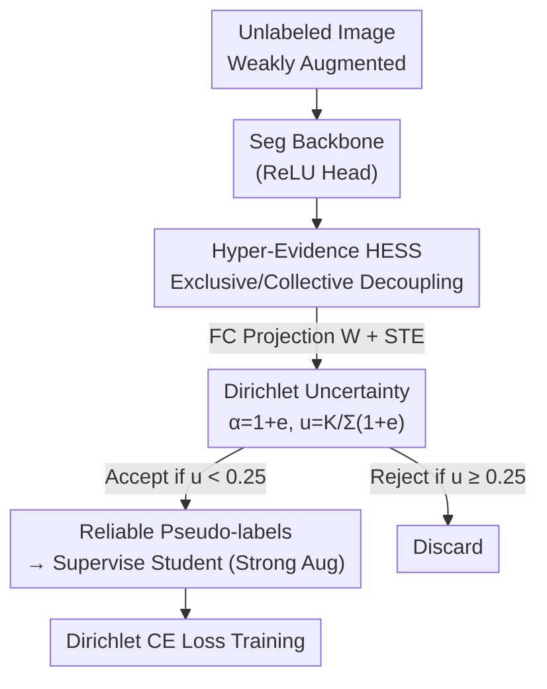

# From Softmax to Dirichlet: Evidential Learning for Semi-supervised Semantic Segmentation

**Conference**: CVPR 2026  
**Paper**: [CVF Open Access](https://openaccess.thecvf.com/content/CVPR2026/html/Mai_From_Softmax_to_Dirichlet_Evidential_Learning_for_Semi-supervised_Semantic_Segmentation_CVPR_2026_paper.html)  
**Code**: None  
**Area**: Semi-supervised Semantic Segmentation  
**Keywords**: Evidential Learning, Dirichlet Distribution, Uncertainty Estimation, Pseudo-label Filtering, Teacher-Student Framework

## TL;DR
To address the issue of unreliable pseudo-label filtering caused by network overconfidence in softmax scores, this paper utilizes evidential learning to model per-pixel class probabilities as a Dirichlet distribution, obtaining principled uncertainty. Furthermore, HESS is proposed to decouple "exclusive evidence" from "collective evidence." Serving as a plug-and-play module for UniMatch/UniMatch V2, it achieves stable performance gains across Pascal/Cityscapes/COCO benchmarks under low-label settings (up to +2.3% mIoU on the most challenging 1/16 split).

## Background & Motivation

**Background**: The dominant paradigm in semi-supervised semantic segmentation (S4) is "pseudo-labeling + consistency regularization" within a teacher-student framework: the teacher generates pseudo-labels on weakly augmented views, and the student fits these labels on strongly augmented views. The success depends entirely on the quality of pseudo-labels—the selection accuracy directly determines the performance upper bound.

**Limitations of Prior Work**: Current dominant filtering relies on softmax score thresholding, i.e., taking the maximum softmax output $s_{ij}^u=\max\sigma(f_T(\cdot))$ and retaining only those above a high threshold (e.g., 0.95). This assumes "high softmax score $\iff$ low prediction uncertainty." However, neural networks suffer from well-known **overconfidence**: the correlation between softmax scores and actual pseudo-label accuracy is weak. Observations show that in the first epoch, the Pearson correlation between softmax scores and pseudo-label accuracy is only 0.79; even in the highest confidence bin (>0.95), accuracy is only 0.81. Consequently, many incorrect pseudo-labels are treated as "high confidence," polluting training.

**Key Challenge**: Softmax output is essentially just a **point estimate** $\hat p=\sigma(f(x))$ of class probability $p$. it indicates "which class is most likely" but **fails to quantify how uncertain the prediction is**. Relying on a point estimate as a proxy for uncertainty is inherently unreliable.

**Goal**: To find a method for **explicitly modeling** prediction uncertainty to filter pseudo-labels, rather than indirectly using softmax scores. While Bayesian inference (variational inference, MC dropout, deep ensembles) provides uncertainty, they require multiple forward passes or training multiple models, which is computationally expensive and slow.

**Key Insight**: This work adopts **Evidential Learning**—rooted in Dempster-Shafer Evidence Theory—as an efficient alternative to Bayesian inference, providing Bayesian-equivalent uncertainty quantification in a single forward pass.

**Core Idea**: Instead of single-point class probabilities, a **higher-order distribution over class probabilities** (Dirichlet) is used to characterize the distribution of "all possible softmax outputs." Uncertainty is derived directly from the statistical properties of this distribution. Furthermore, by decoupling exclusive and collective evidence (HESS), structural uncertainty across classes is incorporated, leading to more accurate estimation.

## Method

### Overall Architecture

The method performs "surgical" modification on the classic S4 teacher-student framework: **replacing the terminal softmax layer of the segmentation network with a ReLU activation layer** to ensure non-negative outputs interpreted as "evidence" $e$. This evidence is parameterized as a Dirichlet distribution, from which a bounded uncertainty $u\in[0,1)$ is calculated to filter the teacher's pseudo-labels instead of softmax scores. Building on this, "evidence" is upgraded to "hyper-evidence" ($e^H$): the network outputs hyper-evidence corresponding to **class subsets**, which is then projected back to single-class evidence $e$ via a fully connected layer. This expresses both "exclusive evidence" supporting a single class and "collective evidence" supporting multiple classes. During training, cross-entropy is replaced by CE loss under Dirichlet expectation.

HESS is plug-and-play: it does not change the overall teacher-student structure, only the output head and the loss function, allowing integration into frameworks like UniMatch and UniMatch V2.

### Key Designs

**1. Mechanism: From Softmax to Dirichlet (Uncertainty via Posterior)**

This addresses the "softmax is just a point estimate" issue. The network output is reinterpreted as **evidence** $e=[e_1,\dots,e_K]$ collected from data (non-negative values representing support for each class), ensured by ReLU. A **uniform Dirichlet prior** $p_{\text{prior}}\sim\mathrm{Dir}(p;\mathbf{1})$ is placed over class probabilities $p$. The evidence forms a multinomial likelihood $P(x\mid p)$.

Since Dirichlet is the conjugate prior for the multinomial distribution, the posterior derived via Bayes' theorem $P(p\mid x)\propto P(x\mid p)P(p)$ is **still Dirichlet**, with parameters $p\mid x\sim\mathrm{Dir}(p;\mathbf{1}+e)$. Intuitively, as evidence accumulates, the distribution concentrates on dominant classes. Uncertainty is derived from the ratio of the prior sum to the posterior concentration:

$$u=\frac{\sum_{i=1}^K \alpha_i^{\text{prior}}}{\sum_{i=1}^K \alpha_i^{\text{posterior}}}=\frac{K}{\sum_{i=1}^K(1+e_i)}$$

More evidence results in smaller $u$. Since evidence is non-negative, $u$ is strictly in $[0,1)$. Using evidential uncertainty, the Pearson correlation with accuracy improves from 0.79 to **0.86**. This framework is termed ESS (Evidential S4).

**2. Design Motivation: HESS (Hyper-Evidence)**

While ESS is effective, it only models **exclusive evidence** (supporting a single class), ignoring **collective evidence** (structural clues supporting multiple classes simultaneously). For example, a "wheel" pattern supports both "truck" and "bus"—this shared uncertainty cannot be fully captured by isolated single-class evidence.

HESS upgrades evidence to **hyper-evidence** $e^H$, where each $e^H$ corresponds to a **subset** $R$ of the class set $Y$:

$$e^H:=\begin{cases}\text{Exclusive Evidence},& |R|=1\\\text{Collective Evidence},& |R|>1\end{cases}$$

Implementation-wise, features are activated into hyper-evidence, then a fully connected layer $W$ projects them to $K$ classes. $W$ encodes the "hyper-evidence ↔ class" membership using a unit step function $H(\cdot)$ to identify the subset $R_i=\{j\mid H(W_{i,j})=1,\ j\in Y\}$. To handle the non-differentiable $H(\cdot)$, a **straight-through estimator (STE)** is used. Finally, hyper-evidence is mapped back to single-class evidence:

$$e_i=\sum_j \frac{\mathbb{I}(i\in R_j)}{|R_j|}\,e^H_j$$

This ensures collective evidence is explicitly incorporated, leading to a correlation improvement and an mIoU increase from 76.9% to 77.5% on the 1/16 split.

**3. Function: Dirichlet Expected Cross-Entropy Loss**

Since the output is a distribution, the training objective is to ensure **every point** on the estimated distribution aligns with the ground truth, by minimizing the expectation of CE loss under the Dirichlet distribution $\min\ \mathbb{E}_{p\sim\mathrm{Dir}(p;1+e)}\big[-\sum_i y_i\log p_i\big]$. This has a closed-form solution:

$$\ell_{ce}^{dir}=\sum_{j=1}^K y_j\left(\psi\Big(\sum_{i=1}^K\alpha_i\Big)-\psi(\alpha_j)\right)$$

where $\psi(\cdot)$ is the Digamma function. Replacing standard $\ell_{ce}$ in supervised and consistency losses with $\ell_{ce}^{dir}$ completes the evidential learning loop.

### Loss & Training
The total loss follows $\mathcal{L}=\mathcal{L}_{sup}+\mathcal{L}_{reg}$, but both pixel-wise cross-entropy terms are replaced by $\ell_{ce}^{dir}$. Pseudo-label filtering changes from "softmax score $>0.95$" to "uncertainty $u<0.25$". UniMatch V1 (ResNet-101) and V2 (DINOv2-S) settings are followed for a fair comparison.

## Key Experimental Results

### Main Results

HESS consistently improves UniMatch and UniMatch V2 across Pascal, Cityscapes, and COCO, with larger gains in lower-label settings.

| Dataset | Partition | Baseline | Baseline+HESS | Gain |
|--------|------|------|-----------|------|
| Pascal (HQ) | 1/16 (92) | UniMatch 75.2 | 77.5 | +2.3 |
| Pascal (HQ) | 1/16 (92) | UniMatch V2 79.0 | 80.9 | +1.9 |
| Cityscapes | 1/16 (186) | UniMatch 76.7 | 78.0 | +1.3 |
| Cityscapes | 1/16 (186) | UniMatch V2 80.6 | 81.8 | +1.2 |
| COCO | 1/512 (232) | UniMatch 31.9 | 33.8 | +1.9 |
| COCO | 1/512 (232) | UniMatch V2 39.3 | 41.4 | +2.1 |

(mIoU %; HESS shows no performance degradation across partitions.)

### Ablation Study

| Config | mIoU (1/16) | mIoU (1/4) | Description |
|------|-------------|------------|------|
| Baseline (UniMatch) | 75.2 | 78.8 | Softmax filtering |
| + ESS | 76.9 | 79.5 | Dirichlet uncertainty (Exclusive only) |
| + HESS | 77.5 | 80.0 | Full model (Exclusive + Collective) |

Threshold Sensitivity (Pascal classic, 1/16, ResNet-101):

| Filtering Method | Threshold Scan | Optimal / mIoU |
|----------|----------|------------------|
| Softmax score | 0.85 / 0.90 / 0.95 / 0.98 / 0.99 | 0.95 → 75.2 |
| Uncertainty $u$ | 0.10 / 0.20 / 0.25 / 0.30 / 0.40 | 0.25 → 77.5 |

### Key Findings
- **HESS improves over ESS by ~0.6%**: Explicitly modeling collective evidence (shared uncertainty) makes pseudo-label selection more accurate.
- **Uncertainty filtering outperforms softmax filtering**: The best softmax threshold (0.95) yields 75.2, whereas uncertainty at 0.25 reaches 77.5. The correlation (0.86) is significantly higher than softmax (0.79).
- **Value in Scarcity**: Gains are most prominent in the most difficult settings (COCO 1/512, Pascal 1/16), confirming that filtering unreliable labels is most beneficial when supervision is extremely sparse.
- Visualizations show that high evidential uncertainty areas match error regions in pseudo-labels closely, whereas $1-\text{softmax}$ often fails to highlight these errors.

## Highlights & Insights
- **Plug-and-play Dirichlet Module**: The modification is simple (softmax→ReLU, CE→Dirichlet CE, score→uncertainty), allowing it to be stacked on any SSS framework.
- **Hyper-evidence Abstraction**: Using class subset sizes $|R|$ to naturally distinguish exclusive/collective evidence, projected back via STE, expands expressiveness without breaking the closed-form uncertainty formulas.
- **Pragmatic Bounded Uncertainty**: The concentration ratio provides an intuitive $[0,1)$ range that is easier to transfer across datasets than the fragile high-threshold requirements of softmax scores.

## Limitations & Future Work
- **Interpretability of Collective Evidence**: The mapping from hyper-evidence to class subsets is implicitly learned via FC weights. Qualitative verification of whether subsets $R$ truly correspond to semantic structures (like "truck/bus") is limited.
- **Scalability**: While there are $2^K-1$ possible subsets, the paper uses a fixed number of hyper-evidences. Scalability to many-class datasets (e.g., COCO) requires further discussion.
- **Threshold Sensitivity**: Optimal performance is found at $u=0.25$; performance drops at 0.10 or 0.40, indicating that while better than softmax, it still requires tuning.
- **Future Directions**: Adapting subset structures based on data co-occurrence or making the uncertainty threshold dynamic during training.

## Related Work & Insights
- **vs. Softmax Filtering**: Existing methods rely on high softmax thresholds (0.95), which suffer from overconfidence. This work uses Dirichlet posterior for more reliable filtering.
- **vs. Classical Bayesian**: Unlike MC dropout or ensembles, evidential learning provides uncertainty in a single forward pass, making it suitable for pixel-wise segmentation.
- **vs. Original Evidential Learning (EDL)**: Unlike standard EDL which only models mutually exclusive classes, HESS decouples collective evidence to account for subset ambiguity.

## Rating
- Novelty: ⭐⭐⭐⭐
- Experimental Thoroughness: ⭐⭐⭐⭐
- Writing Quality: ⭐⭐⭐⭐
- Value: ⭐⭐⭐⭐

<!-- RELATED:START -->

## Related Papers

- [\[CVPR 2026\] Spatial-SAM: Spatially Consistent 3D Electron Microscopy Segmentation with SDF Memory and Semi-Supervised Learning](spatial-sam_spatially_consistent_3d_electron_microscopy_segmentation_with_sdf_me.md)
- [\[AAAI 2026\] S5: Scalable Semi-Supervised Semantic Segmentation in Remote Sensing](../../AAAI2026/segmentation/s5_scalable_semi-supervised_semantic_segmentation_in_remote_sensing.md)
- [\[CVPR 2026\] Hierarchical Action Learning for Weakly-Supervised Action Segmentation](hierarchical_action_learning_for_weakly-supervised_action_segmentation.md)
- [\[CVPR 2026\] Frequency-Aware Affinity for Weakly Supervised Semantic Segmentation](frequency-aware_affinity_for_weakly_supervised_semantic_segmentation.md)
- [\[CVPR 2026\] Leveraging Class Distributions in CLIP for Weakly Supervised Semantic Segmentation](leveraging_class_distributions_in_clip_for_weakly_supervised_semantic_segmentati.md)

<!-- RELATED:END -->
