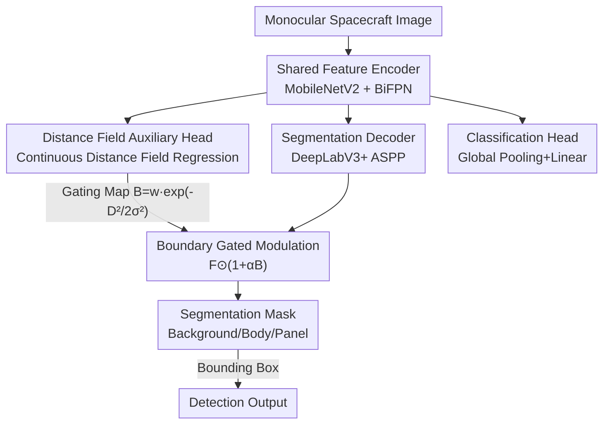

# GABI: Geometry-Aware Boundary Integration for Spacecraft Segmentation

**Conference**: CVPR2026  
**arXiv**: [2606.00886](https://arxiv.org/abs/2606.00886)  
**Code**: To be confirmed  
**Area**: Image Segmentation  
**Keywords**: Spacecraft Segmentation, Distance Fields, Boundary-aware, Multi-task Learning, Lightweight Perception  

## TL;DR
GABI equips a lightweight convolutional segmentation network with a "Distance Field Prediction" auxiliary head. It utilizes continuous distance fields to provide dense geometric supervision and constructs a boundary gating map to modulate segmentation features. This allows the model to learn features that incorporate both texture and geometry under extreme space lighting conditions—improving the baseline AP by up to 5% on the SPARK benchmark and over 50% in cross-domain generalization, while remaining 3~10 times smaller than Transformers.

## Background & Motivation
**Background**: Autonomous spacecraft (On-Orbit Servicing OOS, Active Debris Removal ADR) rely on monocular cameras for perception. Spacecraft segmentation is a prerequisite for downstream tasks like pose estimation and 3D situational awareness. Prevailing methods pair lightweight backbones (MobileNet / EfficientNet) with strong segmentation heads (DeepLabV3+ ASPP, SegFormer MiT encoders) to optimize pixel-level accuracy on terrestrial datasets.

**Limitations of Prior Work**: Space imaging is extreme—lacking atmospheric scattering and subject to intense lighting variations, which produce strong shadows and lens flares. Backgrounds vary from the bright Earth to deep space black. Spacecraft segmentation is inherently a "texture task"; a single solar panel's appearance varies drastically under different lighting. Networks trained purely on texture features often collapse when encountering new spacecraft or datasets, yet robustness and generalization have rarely been studied systematically.

**Key Challenge**: Pixel-wise cross-entropy loss focuses only on individual pixel correctness, which can misjudge image topology and cause holes or discontinuities at boundaries and thin structures (antennas, panel attachments). Spacecraft possess "rigid modular structures + planes/cylinders + sharp edges," offering highly regular geometric information that remains underutilized. Existing geometric supervision methods in terrestrial tasks (binary boundaries, distance transforms) mostly focus on **local boundary** precision rather than treating geometry as a cross-domain invariant inductive bias.

**Goal**: Inject a geometric inductive bias to ensure structural consistency and generalization across different spacecraft and lighting conditions without significantly increasing model complexity (to satisfy onboard computational constraints).

**Key Insight**: It is observed that binary boundaries only encode "where the boundary is," whereas **continuous distance fields** encode "how far each pixel is from the nearest boundary"—the latter describes global structural relationships and is more robust to occlusion and noise. The authors hypothesize that training the network to simultaneously learn texture and this global geometric field yields cross-domain invariant features.

**Core Idea**: Use "continuous distance field regression" as an auxiliary task to provide geometric regularization for segmentation features, then use the predicted distance field as a boundary gating signal to amplify the segmentation decoder's response near boundaries.

## Method

### Overall Architecture
GABI is a **multi-task encoder-decoder** architecture: given a monocular spacecraft image, a shared backbone extracts features followed by three supervision branches—segmentation, classification, and distance field. The MobileNetV2 backbone outputs P2–P5 multi-scale feature pyramids, which are fed into a BiFPN for bidirectional (top-down + bottom-up) cross-scale fusion. The fused features proceed to a DeepLabV3+ style segmentation decoder (ASPP for multi-scale context aggregation) to predict "Background / Body / Solar Panel" classes. Simultaneously, features undergo global pooling + dropout + linear layers for spacecraft model classification. The critical addition is the **Distance Field Prediction Head**, which upsamples encoded features to estimate the distance from each pixel to the nearest boundary. The predicted distance field is supervised and also fed into a **Boundary Gating Block** to modulate the segmentation decoder features, creating a closed loop of "geometric prediction → segmentation refinement." Final detection boxes are derived directly from the segmentation masks.

### Key Designs

**1. Continuous Distance Field Auxiliary Supervision: Replacing "Where" with "How Far"**

The limitation of pure pixel cross-entropy is its failure to maintain topology, causing gaps in thin structures. While previous geometric supervision used binary boundary maps, they only encode boundary locations and are sparse in information. GABI utilizes a **continuous distance field** calculated from mask boundaries: for every pixel in the image domain, the Euclidean distance to the nearest mask boundary is computed and clipped to a maximum $d_{\max}$, serving as a valid learning region within a radius $r$ of the boundary. The network upsamples to the predicted distance field $\hat{D}$ using convolutions and bilinear interpolation (with ReLU and BatchNorm). The distance field loss employs normalized L1 regression:

$$\mathcal{L}_{\text{DF}}=\lVert\hat{\mathcal{D}}_{n}-\mathcal{D}_{n}\rVert_{1},\quad \mathcal{D}_{n}=-\log\!\left(\frac{\mathcal{D}}{r}\right)$$

This is effective because the distance field describes the spatial relationship between each pixel and the contour as a dense, global geometric representation. This allows the network to capture the overall structure of spacecraft components rather than focusing solely on local edges, enhancing robustness to occlusion, noise, and lighting changes—the source of cross-domain generalization.

**2. Boundary Gating Modulation: Feeding Distance Fields back to Segmentation**

Beyond using the distance field as a side auxiliary task, the authors aim to flow geometric information back into the segmentation backbone. Let $\mathbf{F}$ be the segmentation decoder feature map. A Gaussian gating map $B=w\exp\!\left(-\frac{\hat{D}^{2}}{2\sigma^{2}}\right)$ is constructed using the predicted distance field $\hat{D}$, where $w$ controls the gating intensity and $\sigma$ controls the Gaussian decay rate—the value is higher closer to the boundary. Features are modulated residually:

$$\mathbf{F}_{\text{gate}}=\mathbf{F}\odot(1+\alpha\mathbf{B})$$

where $\odot$ denotes element-wise multiplication and $\alpha$ controls the boundary modulation strength. Similar to the attention maps in Gated-SCNN, this mechanism amplifies feature responses near predicted boundaries, forcing the segmentation decoder to focus on high-frequency structural cues while the $(1+\alpha B)$ residual form ensures global context in non-boundary regions is preserved.

**3. Multi-task Joint Optimization: Segmentation / Classification / Distance Field Shared Backbone**

Spacecraft perception is inherently multi-task (classification, detection, segmentation). GABI integrates these into a shared encoder with a weighted sum objective:

$$\mathcal{L}_{\text{total}}=\lambda_{\text{DF}}\mathcal{L}_{\text{DF}}+\lambda_{\text{seg}}\mathcal{L}_{\text{seg}}+\lambda_{\text{cls}}\mathcal{L}_{\text{cls}}$$

Segmentation is the primary task (pixel-level cross-entropy $\mathcal{L}_{\text{seg}}=-\frac{1}{|\Omega|}\sum_{\Omega}\log p_{S_{\text{gt}}}$), classification uses cross-entropy $\mathcal{L}_{\text{cls}}=-\sum_c y_c\log p_c$, and the distance field uses the L1 regression described above. The shared backbone allows for mutual constraint between geometric and texture features: the distance field task injects a geometric inductive bias, while the classification task helps learn model-agnostic semantics. This results in structural consistency with minimal parameter increase (GABI-v2 adds only 0.3M parameters over the baseline).

## Key Experimental Results

### Main Results (SPARK Dataset, higher AP is better)
The SPARK 2026 dataset, generated via Unreal Engine, contains 10 spacecraft models with 6,000 training and 2,000 test images per model, some with heavy lens flare. Metrics are mAP (IoU 0.50–0.95, step 0.05) for Body and Panel.

| Model | Params | FLOPs | Body mAP | Panel mAP |
|------|------|-------|----------|-----------|
| BL-v3s (Baseline) | 2.7 M | 4.8 G | 88.5 | 68.6 |
| **GABI-v3s** | 2.8 M | 8.6 G | **89.2** | **73.1** |
| BL-v2 (Baseline) | 3.9 M | 20.5 G | 91.4 | 71.8 |
| **GABI-v2** | 4.2 M | 34.5 G | **91.9** | **76.1** |
| SegFormer-b0 | 3.7 M | 44.0 G | 74.1 | 74.8 |
| SegFormer-b1 | 13.7 M | 86.6 G | 85.2 | 77.2 |

On the in-domain validation set, distance field supervision improved Panel mAP from 68.6 to 73.1 (+4.5), with significant gains at high IoU thresholds. Body mAP saw minor gains as it was already near saturation. GABI-v2 matched or exceeded the 13.7M SegFormer-b1 with only 4.2M parameters.

### Ablation Study (Generalization on unseen SPARK spacecraft)
Two spacecraft models (Soho, Proba3ocs) were held out during training to test geometric generalization.

| Model | Soho-Body mAP | Soho-Panel mAP | Proba3ocs-Panel mAP |
|------|---------------|----------------|---------------------|
| BL-v3s | 29.3 | 01.4 | 60.8 |
| **GABI-v3s** | **42.3** | **12.3** | **69.1** |
| BL-v2 | 36.4 | 11.7 | 64.4 |
| **GABI-v2** | **45.8** | **24.3** | **74.4** |

The most significant improvements occurred on unseen spacecraft: for Soho's unique geometry, the baseline panel mAP was only 1.4, which GABI-v2 boosted to 24.3 (an order of magnitude increase); Body mAP also saw general increases of +9~13.

### Cross-domain Results (SPE3R Dataset, Foreground Extraction)
SPE3R includes 100 spacecraft models with higher brightness/contrast variations and severe self-shading. The evaluation focuses on foreground extraction (Body + Panel merged).

| Model | Apollo mAP | Apollo IoU | lro mAP | lro IoU |
|------|-----------|-----------|---------|---------|
| BL-v3s | 25.1 | 54.0 | 38.5 | 62.1 |
| **GABI-v3s** | **54.4** | **75.2** | **56.9** | **75.0** |
| BL-v2 | 29.2 | 57.6 | 46.3 | 64.7 |
| **GABI-v2** | **58.6** | **76.8** | **69.1** | **81.2** |
| SegFormer-b1 | 60.9 | 76.8 | 66.1 | 79.4 |

Cross-domain settings highlight the value of geometric priors: the lightweight GABI-v3s (≈2.8M) performed within 5% of the 10x heavier SegFormer-b1 in IoU/F1, while GABI-v2 (≈4.2M) outperformed the Transformer on most models.

### Key Findings
- **Geometric supervision yields the highest gains in "hard" cases**: Body segmentation improved marginally, but gains were substantial for thin/complex structures (panels, unseen geometries, cross-domain), confirming that distance fields enhance structural consistency rather than just general accuracy.
- **Generalization is the primary value**: In-domain improvements were marginal, but results on unseen spacecraft and cross-domain datasets jumped from single digits to orders of magnitude—geometric priors are inherently cross-domain invariants.
- **Minimal overhead**: GABI-v2 outperformed Transformers with only a 0.3M parameter increase over the baseline, fitting onboard computation constraints.

## Highlights & Insights
- **Upgrading "Distance Fields" from a loss term to a feedback feature modulation signal**: While most works treat distance fields as auxiliary regression supervision, GABI uses predicted distance fields to generate gating maps that refine segmentation features ($\mathbf{F}\odot(1+\alpha B)$), creating a prediction-feedback loop.
- **"Marginal in-domain, massive cross-domain" is a compelling evidence chain**: It directly demonstrates that improvements stem from geometric inductive bias (cross-domain invariant) rather than simple overfitting.
- **The nuance of residual gating $(1+\alpha B)$**: Using "1 + modulation" instead of direct multiplication by $B$ ensures global context in non-boundary regions is not zeroed out, a design transferable to any task requiring local enhancement without global loss.
- **Transferability of geometric priors**: This approach is applicable to any segmentation task with regular rigid geometries (industrial parts, buildings, remote sensing) facing lighting or texture domain shifts.

## Limitations & Future Work
- **Dependence on regular geometry**: The method leverages the strong structural priors of spacecraft. For flexible, contour-less, or highly deformable targets, the geometric inductive bias of distance fields may fail.
- **Numerous hyperparameters**: $w,\sigma,\alpha,d_{\max},r,\lambda$ represent many hyperparameters; the paper lacks a systematic sensitivity analysis, making tuning costs for onboard deployment unclear.
- **Lack of formal ablation**: While "Baseline vs. GABI" provides an informal ablation, the "Distance Field Auxiliary Head" and "Boundary Gating Block" were not evaluated independently to determine their individual contributions.
- **Detection tied to masks**: Since detection relies on mask bounding boxes, fragmented or over-predicted segmentation directly impacts detection accuracy; an independent detection refinement capability is missing.
- **FLOPs nearly doubled**: While parameters increased slightly, FLOPs nearly doubled (e.g., v3s 4.8G to 8.6G), requiring further validation for real-time onboard performance.

## Related Work & Insights
- **vs. Gated-SCNN**: Gated-SCNN uses binary boundaries and shape streams to guide segmentation with dual regularization. GABI adopts the gating idea but replaces the signal source with denser continuous distance fields for cross-domain robustness rather than just boundary sharpening.
- **vs. SEMEDA / Binary Boundary methods**: These methods focus on semantic boundary perception in feature space to improve local edges. GABI provides global context beyond boundaries via distance fields to target structural consistency.
- **vs. Multi-task Keypoint/Pose Spacecraft Segmentation ([25])**: Such works incorporate 2D/3D geometry through pose and keypoints. GABI is more lightweight, using a single distance field head to achieve a cost-effective solution for onboard constraints.
- **vs. SegFormer (Transformer Baseline)**: SegFormer relies on Mit encoders for capacity. GABI demonstrates that injecting geometric priors into lightweight CNNs is more cost-effective and cross-domain stable than increasing Transformer capacity in data-scarce, cross-domain spacecraft scenarios.

## Rating
- Novelty: ⭐⭐⭐⭐ Upgrading continuous distance fields from auxiliary supervision to feedback gating signals for the unique space domain.
- Experimental Thoroughness: ⭐⭐⭐⭐ Rigorous design across in-domain, unseen geometry, and cross-domain, though missing component-level formal ablation.
- Writing Quality: ⭐⭐⭐⭐ Clear arguments for motivation and geometric priors with complete formulations.
- Value: ⭐⭐⭐⭐ High practical utility for autonomous spacecraft perception, providing cross-domain robustness at minimal parameter cost.

<!-- RELATED:START -->

## Related Papers

- [\[CVPR 2026\] PRUE: A Practical Recipe for Field Boundary Segmentation at Scale](prue_a_practical_recipe_for_field_boundary_segmentation_at_scale.md)
- [\[CVPR 2026\] VGGT-Segmentor: Geometry-Enhanced Cross-View Segmentation](vggt-segmentor_geometry-enhanced_cross-view_segmentation.md)
- [\[CVPR 2026\] GeoMotion: Rethinking Motion Segmentation via Latent 4D Geometry](geomotion_rethinking_motion_segmentation_via_latent_4d_geometry.md)
- [\[AAAI 2026\] EAGLE: Episodic Appearance- and Geometry-Aware Memory for Unified 2D-3D Visual Query Localization](../../AAAI2026/segmentation/eagle_episodic_appearance-_and_geometry-aware_memory_for_unified_2d-3d_visual_qu.md)
- [\[CVPR 2026\] GeCo: Geometry-Consistent Regularization for Domain Generalized Semantic Segmentation](geco_geometry-consistent_regularization_for_domain_generalized_semantic_segmenta.md)

<!-- RELATED:END -->
