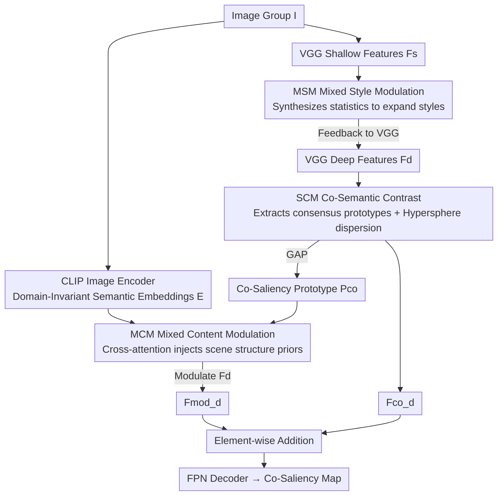

# Generalizable Co-Salient Object Detection via Mixed Content-Style Modulation

**Conference**: CVPR 2026  
**Paper**: [CVF Open Access](https://openaccess.thecvf.com/content/CVPR2026/html/Guo_Generalizable_Co_Salient_Object_Detection_via_Mixed_Content-Style_Modulation_CVPR_2026_paper.html)  
**Code**: Not disclosed  
**Area**: Co-salient Object Detection / Segmentation  
**Keywords**: Co-salient object detection, Domain generalization, Content-style modulation, CLIP semantic embedding, Style augmentation

## TL;DR
The paper proposes CoMCS, which leverages a dual approach of "content modulation + style modulation" to enhance the generalization of Co-Salient Object Detection (CoSOD) in unseen domains. Specifically, it employs CLIP semantic embeddings to inject domain-invariant scene structure priors (MCM), synthesizes expanded training domain styles using feature statistics (MSM), and pushes prototypes apart on a hypersphere using a uniformity loss (SCM). CoMCS outperforms 17 SOTA methods across four benchmarks, including a self-constructed unseen domain dataset (UND).

## Background & Motivation

**Background**: The task of Co-Salient Object Detection (CoSOD) is to identify "common salient objects" from a group of related images. Mainstream approaches follow a three-step process: pre-training an encoder (VGG-16 / PVT-v2) to extract multi-level features (deep layers rich in content semantics, shallow layers rich in texture/color styles), aggregating these features to extract "consensus" cues, and finally feeding them into a U-Net / FPN decoder to output co-saliency maps. High-quality consensus extraction is the key to model performance.

**Limitations of Prior Work**: This supervised learning paradigm on fixed training sets suffers from generalization collapse in real-world open scenes. The root causes are two-fold: First, **semantic content overfitting**, where the model only recognizes categories present in the training set and misidentifies unseen categories. For example, the model may misidentify "avocados" (unseen) as "bananas" (seen). Second, **style overfitting**, where binary label supervision causes the model to memorize specific texture/color patterns of the training set. Prediction quality drops when there is a significant style gap between the test domain and the source domain due to domain-specific styles embedded in consensus features.

**Key Challenge**: Existing Domain Generalization (DG) methods either only expand style diversity or simultaneously optimize content and style features, but they **lack perception of content information beyond the training set**, rendering them ineffective against unseen categories and styles. A key observation is that content and style information can be simultaneously encoded by neural networks and that styles can be edited independently while preserving semantic content.

**Goal**: To modulate "content" and "style" separately, enabling the model to perceive the semantic structure of unseen categories while encountering a broader distribution of styles, thereby decomposing the distribution shift problem into two solvable sub-problems.

**Core Idea**: Modulate content using domain-invariant multi-class semantic embeddings provided by CLIP and augment styles using synthesized feature statistics—"content modulation learns scene structure priors, style modulation expands source domain distributions"—while using a contrastive module to distribute prototypes uniformly on a hypersphere to eliminate representation ambiguity in unseen domains.

## Method

### Overall Architecture

CoMCS is a dual-branch network: one **VGG-16** branch extracts multi-level image features $F=\{F_s, F_m, F_d\}$ (shallow $F_s$ is style-rich, deep $F_d$ is content-rich), and one **CLIP-ViT-B/32** branch encodes the same batch of images into domain-invariant multi-class semantic embeddings $E$. Three core modules work collaboratively across these branches: shallow features $F_s$ first enter **MSM** to synthesize new styles resulting in $F^{style}_s$, which is fed back into VGG; deep features $F_d$ enter **SCM** to obtain co-enhanced features $F^{co}_d$, and the co-saliency prototype $P_{co}$ is obtained via Global Average Pooling (GAP); subsequently, $E$ and $P_{co}$ enter **MCM** for cross-attention to output a context-rich prototype $P_{con}$, which modulates $F_d$ to produce $F^{mod}_d$. Finally, $F^{co}_d$ and $F^{mod}_d$ are element-wise summed and sent to the FPN decoder. Training is supervised by uniform + BCE + IOU losses; **MSM is only enabled during training** and removed during inference.

### Key Designs

**1. MCM (Mixed Content Modulation): Injecting domain-invariant scene structure priors via CLIP embeddings**

This module addresses "semantic content overfitting." It establishes cross-attention between two types of prototypes: the query $Q$ comes from the co-saliency prototype $P_{co}$ (encoding only seen co-occurring content), and the key/value $K,V$ come from the CLIP multi-class semantic embeddings $E$ (encoding domain-invariant knowledge of the entire scene). Cross-attention allows $P_{co}$ to "query" the semantic relationships of various objects in the scene:

$$\text{Attention}(Q,K,V)=\text{Softmax}\!\left(\frac{QK^\top}{\sqrt{d_k}}\right)V,\quad P_{con}=\text{Attention}(Q,K,V)+Q$$

The resulting context-rich prototype $P_{con}$ is element-wise multiplied with deep features $F_d$ to obtain $F^{mod}_d$. The insight is that semantic relationships between categories are domain-invariant (e.g., the relationship between an unseen "avocado" and a distractor "lemon" holds across domains). By leveraging CLIP's knowledge, the model incorporates "scene structure"—which objects appear together and which are distractors—as cross-domain stable priors.

**2. MSM (Mixed Style Modulation): Synthesizing feature statistics to create new styles within the source domain**

This module addresses "style overfitting" by targeting shallow features $F_s$. It calculates first-order (mean $\mu$) and second-order (standard deviation $\sigma$) statistics across the spatial dimension, which together characterize style. It then calculates the variance of these statistics $S^2_\mu, S^2_\sigma$ across $N$ feature maps in the batch to measure "style dispersion." Random perturbations are injected to generate new style statistics:

$$\mu_{random}(F_s)=\mu(F_s)+w\,\epsilon_\mu S^2_\mu,\quad \sigma_{random}(F_s)=\sigma(F_s)+w\,\epsilon_\sigma S^2_\sigma,\quad \epsilon_\mu,\epsilon_\sigma\sim\mathcal{N}(0,1)$$

Where $w$ is a scaling factor. A mixing coefficient $\lambda$ sampled from $\text{Beta}(\alpha,\alpha)$ interpolates the random and original styles into $\gamma^{(new)}, \beta^{(new)}$. Finally, AdaIN applies the new style: $\text{MSM}(x)=\beta^{(new)}\frac{F_s-\mu(F_s)}{\sigma(F_s)}+\gamma^{(new)}$. This expands the training distribution, making the model robust to domain shifts.

**3. SCM (Co-Semantic Contrast Module): Extracting consensus prototypes + Uniformity loss for hypersphere dispersion**

This module extracts high-quality "consensus" and eliminates representation ambiguity. It computes a correlation map $S\in\mathbb{R}^{NHW\times NHW}$ of pairwise image similarities within a group. By selecting the highest similarity vectors and averaging them, it yields the primary prototype $P_{pr}$. After adaptive adjustment $P_{ad}=P_{pr}\odot\text{Sigmoid}(\text{Conv}(P_{pr}))$, it is used as a kernel to convolve $F_d$, resulting in enhanced co-features $F^{en}_d$. The generalization is driven by the uniformity loss:

$$L_{Uni}(P_1,P_2;t)=\log e^{-t\left(1-\frac{P_1\cdot P_2}{\lVert P_1\rVert\,\lVert P_2\rVert}\right)}$$

This loss pushes the semantic embeddings $P_1, P_2$ of different groups apart on the hypersphere, ensuring categories remain distinct in unseen domains.

### Loss & Training

The total loss is a weighted sum: $L_{all}=\lambda_1 L_{Uni}+\lambda_2 L_{BCE}+\lambda_3 L_{IOU}$. Conventional BCE and IOU losses provide segmentation supervision, while the uniformity loss ensures hypersphere distribution. The model is trained for 200 epochs using Adam ($lr=1e-4, \beta_1=0.9, \beta_2=0.999$) with images resized to 224×224 on an RTX 4090. The training set follows the CoCo-SEG + DUTS-class combination.

## Key Experimental Results

### Main Results

CoMCS was compared against 17 SOTA methods on three standard benchmarks. CoMCS achieves optimal or tied-optimal performance across all metrics. On the challenging CoCA dataset, it shows significant gains over the second-best method:

| Dataset | Metric | CoMCS | Second Best (Method) | Gain |
|--------|------|-------|-----------|------|
| CoCA | $S_\alpha$ | 0.747 | 0.747 (IPPO) | Tied |
| CoCA | $F^{max}_\beta$ | **0.649** | 0.644 (IPPO) | +0.5% |
| CoCA | $E^{max}_\phi$ | **0.821** | 0.816 (ASCoD) | +0.5% |
| CoSOD3k | $S_\alpha$ | **0.857** | 0.856 (MCCL) | +0.1% |
| CoSal2015 | $F^{max}_\beta$ | **0.896** | 0.893 (ICSM) | +0.3% |
| CoSal2015 | $E^{max}_\phi$ | **0.929** | 0.927 (MCCL) | +0.2% |

On the self-constructed **UND** dataset (50 groups of unseen categories, 290 classes total), the advantages are more pronounced:

| Dataset | Metric | CoMCS | Second Best | Gain |
|--------|------|-------|------|------|
| UND | $S_\alpha$ | **0.856** | 0.834 (MCCL) | +2.2% |
| UND | $F^{max}_\beta$ | **0.830** | 0.803 (GCoNet+) | +2.7% |
| UND | $E^{max}_\phi$ | **0.908** | 0.892 (GCoNet+) | +1.6% |
| UND | MAE | **0.051** | 0.059 (GCoNet+) | -0.8% |

### Ablation Study

Incremental addition of the three modules (Results on CoCA $S_\alpha$ / $F^{max}_\beta$ and UND $S_\alpha$):

| Configuration | CoCA $S_\alpha$ | CoCA $F^{max}_\beta$ | UND $S_\alpha$ | Description |
|------|------|------|------|------|
| Baseline | 0.662 | 0.492 | — | No modules |
| +SCM | 0.724 | 0.608 | 0.786 | Consensus + Dispersion |
| +SCM+MCM | 0.743 | 0.636 | 0.847 | +Content Modulation |
| +Full (Ours) | **0.747** | **0.649** | **0.856** | +Style Augmentation |

### Key Findings

- **SCM provides the largest contribution**: Adding SCM alone improves $S_\alpha$ from 0.662 to 0.724 (+6.2%) on CoCA, indicating that high-quality consensus and prototype uniformity are foundational for generalization.
- **MCM benefits datasets with high distraction**: On CoCA (many distractors), MCM improves $S_\alpha$ by 1.9%, whereas on CoSOD3k (fewer distractors), the gain is 1.3%, validating MCM's role in filtering distractors via scene priors.
- **MSM consistently adds value**: It provides ~1.1% gain in $S_\alpha$ across datasets, proving that style augmentation is a universally beneficial enhancement for robustness against domain shift.

## Highlights & Insights

- **Explicit decoupling of "Content" and "Style"** for separate modulation is a clean design philosophy. The content branch utilizes CLIP's domain-invariant semantics for unseen categories, while the style branch utilizes statistical perturbations to widen the training distribution.
- **Using inter-batch statistical variance** to calibrate style perturbation is clever. It ensures randomized styles remain within a reasonable neighborhood of the source domain, a trick applicable to any feature-level style augmentation task in DG.
- **Leveraging CLIP as an "External Knowledge Source"** avoids the need for re-training semantic classifiers and bypasses the lack of category labels in CoSOD datasets.

## Limitations & Future Work

- **Dependency on CLIP's Coverage**: MCM relies on CLIP's multi-class embeddings. If an unseen object is outside CLIP's training distribution (e.g., highly specialized domains), the scene structure prior may fail.
- **Aging Backbone**: The use of VGG-16 for fair comparison limits absolute performance. The potential gains from stronger backbones remain unexplored.
- **Hyperparameter Sensitivity**: The weights for the three losses ($\lambda_1, \lambda_2, \lambda_3$) and parameters for MSM ($p, w, \alpha$) are potential sensitive areas for replication.

## Related Work & Insights

- **vs GCoNet+ / MCCL (CoSOD SOTA)**: These methods rely on contrastive learning or class labels for consensus within fixed sets. Ours outperforms them on UND by +2.7% $F^{max}_\beta$ by treating generalization as a primary objective through MCM and MSM.
- **vs General DG Methods**: Traditional DG often lacks content awareness outside the training set. CoMCS differs by using CLIP to introduce domain-invariant semantics, specifically tailored to the CoSOD requirement of identifying unseen categories.

## Rating
- Novelty: ⭐⭐⭐⭐ The combination of content/style modulation with CLIP priors is fresh for CoSOD, though individual components like AdaIN and cross-attention are mature.
- Experimental Thoroughness: ⭐⭐⭐⭐ Extensive testing on 4 benchmarks + UND against 17 SOTAs.
- Writing Quality: ⭐⭐⭐⭐ Clear logic and effective visualizations.
- Value: ⭐⭐⭐⭐ Provides a practical framework for moving CoSOD toward open-domain generalization.

<!-- RELATED:START -->

## Related Papers

- [\[CVPR 2026\] TF-SSD: A Strong Pipeline via Synergic Mask Filter for Training-free Co-salient Object Detection](tf-ssd_a_strong_pipeline_via_synergic_mask_filter_for_training-free_co-salient_o.md)
- [\[CVPR 2025\] Visual Consensus Prompting for Co-Salient Object Detection](../../CVPR2025/segmentation/visual_consensus_prompting_for_co-salient_object_detection.md)
- [\[ICLR 2026\] S3OD: Towards Generalizable Salient Object Detection with Synthetic Data](../../ICLR2026/segmentation/s3od_towards_generalizable_salient_object_detection_with_synthetic_data.md)
- [\[CVPR 2026\] Uncertainty-Aware Modality Fusion for Unaligned RGB-T Salient Object Detection](uncertainty-aware_modality_fusion_for_unaligned_rgb-t_salient_object_detection.md)
- [\[ECCV 2024\] Self-supervised Co-salient Object Detection via Feature Correspondences at Multiple Scales](../../ECCV2024/segmentation/self-supervised_co-salient_object_detection_via_feature_correspondences_at_multi.md)

<!-- RELATED:END -->
## Related Papers

- [\[CVPR 2026\] TF-SSD: A Strong Pipeline via Synergic Mask Filter for Training-free Co-salient Object Detection](tf-ssd_a_strong_pipeline_via_synergic_mask_filter_for_training-free_co-salient_o.md)
- [\[CVPR 2026\] Uncertainty-Aware Modality Fusion for Unaligned RGB-T Salient Object Detection](uncertainty-aware_modality_fusion_for_unaligned_rgb-t_salient_object_detection.md)
- [\[CVPR 2025\] Visual Consensus Prompting for Co-Salient Object Detection](../../CVPR2025/segmentation/visual_consensus_prompting_for_co-salient_object_detection.md)
- [\[CVPR 2026\] M4-SAM: Multi-Modal Mixture-of-Experts with Memory-Augmented SAM for RGB-D Video Salient Object Detection](m4-sam_multi-modal_mixture-of-experts_with_memory-augmented_sam_for_rgb-d_video_.md)
- [\[ECCV 2024\] Self-supervised Co-salient Object Detection via Feature Correspondences at Multiple Scales](../../ECCV2024/segmentation/self-supervised_co-salient_object_detection_via_feature_correspondences_at_multi.md)

<!-- RELATED:END -->
