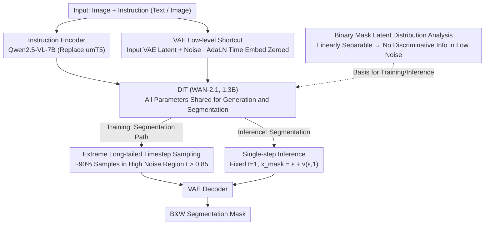

# GenMask: Adapting DiT for Segmentation via Direct Mask Generation

**Conference**: CVPR 2026  
**arXiv**: [2603.23906](https://arxiv.org/abs/2603.23906)  
**Code**: None  
**Area**: Segmentation  
**Keywords**: Diffusion Transformer, segmentation mask generation, timestep sampling strategy, single-step inference, generative segmentation

## TL;DR

This paper proposes GenMask, which directly trains a Diffusion Transformer (DiT) to generate black-and-white segmentation masks (sharing the same model used for color image generation). By discovering the unique property that VAE latent representations of binary masks are linearly separable, the authors design an extreme long-tailed timestep sampling strategy specifically for segmentation. This enables single-step inference to produce segmentation masks, achieving SOTA performance on referring and reasoning segmentation benchmarks.

## Background & Motivation

1. **Background**: Text-guided segmentation is a core task in computer vision. Utilizing pre-trained generative models (such as diffusion models) for segmentation has become a popular research direction. Existing methods typically use a pre-trained diffusion model as a backbone, extracting hidden features during denoising or the reverse diffusion process and feeding them into a trainable task-specific decoder to obtain segmentation masks.
2. **Limitations of Prior Work**: These methods belong to the "indirect use" of diffusion models, which faces two core issues: (a) **Representation Mismatch** — the pre-training objective of diffusion models is to model the low-level distribution of VAE features, whereas segmentation requires compact semantic-level label prediction; (b) **Pipeline Complexity** — they require sophisticated indirect feature extraction pipelines (e.g., reverse processes, activation aggregation), which increases complexity and limits adaptation performance.
3. **Key Challenge**: The fundamental problem lies in the "indirect adaptation" paradigm — extracting features to train a segmentation head rather than allowing the generative model to produce segmentation results directly. The authors argue that segmentation should be trained directly in a generative manner.
4. **Goal**: (a) How can DiT directly generate segmentation masks instead of indirectly extracting features? (b) How can two distinct tasks, image generation and segmentation, be handled simultaneously in the same model? (c) How to resolve the massive distribution difference between binary masks and natural images in the VAE latent space?
5. **Key Insight**: The authors discovered a crucial fact: the VAE latent representations of binary segmentation masks possess specific properties, including sharp distributions, noise robustness, and linear separability. This is fundamentally different from the smooth, noise-sensitive latent representations of natural images. Based on this discovery, different training strategies can be designed to unify the two.
6. **Core Idea**: By designing an extreme long-tailed timestep sampling strategy for segmentation masks (concentrated in high-noise regions), DiT can learn to generate both color images and black-and-white segmentation masks under the same generative objective. During inference, only a single forward pass is needed to output the mask.

## Method

### Overall Architecture

GenMask performs a counter-intuitive operation: instead of using the diffusion model as a "feature extractor," it forces the model to **directly generate a black-and-white segmentation mask** just as it would generate a color image. The entire pipeline is built upon the pre-trained WAN-2.1 DiT (1.3B parameters), with Qwen2.5-VL-7B replacing the original umT5 to allow the instruction encoder to process both images and text. During training, segmentation data and image generation data are mixed 1:1 and fed into the **exact same** DiT — with all parameters shared across both tasks. The only difference lies in the "timestep sampling strategy." The segmentation path also concatenates the VAE latent representation of the input image into the DiT input to provide low-level cues like texture and color that the text encoder cannot capture. Finally, during inference, segmentation does not use multi-step denoising but is fixed at the pure noise step to output the mask in a single forward pass.

The logical loop of the methodology is tied together by a "discovery": observing that binary masks are linearly separable in VAE space implies that low-noise steps are useless for segmentation. Thus, training is concentrated in high-noise regions, naturally leading to single-step high-noise inference.

### Key Designs

**1. Latent Distribution Analysis of Binary Masks: Physical Basis for "Free" Generative Segmentation**

The premise of this method rests on answering one question: what exactly is the difference between segmentation masks and natural images in VAE space? Three experiments provided the answer. First, adding high-intensity noise to natural images destroys content, but for binary masks, the global position and rough shape remain recognizable — masks are inherently noise-robust. Second, applying PCA to the VAE representations of $N$ masks $\mathbf{X} \in \mathbb{R}^{N \times hw \times d}$ ($d=16$) to reduce them to one dimension $\mathbf{Y} = \mathbf{X}\mathbf{W}$ results in a visualization nearly identical to the original masks, proving they are **linearly separable** in VAE space. Third, using an SVM to classify these latent representations shows that linear separability only breaks down at extremely high noise levels. The conclusion is vital: for masks, low-to-medium noise denoising steps carry almost no segmentation information. The truly valuable discriminative signals only exist in the high-noise region.

**2. Extreme Long-tailed Timestep Sampling for Segmentation: Concentrating Training on High Noise**

Since only high-noise steps are useful for segmentation, using the balanced sampling common in image generation is wasteful. While image generation continues to use logit-normal sampling (emphasizing medium noise levels with a peak probability of 1.6%), segmentation adopts a specifically designed long-tailed distribution:

$$p(t) = \frac{2a^2 t}{(t^2 + a^2)^2}, \quad a = 0.05$$

This places approximately 90% of training samples in the high-noise region ($t > 0.85$), with a peak at 13%, which is 8 times higher than the generation task. In implementation, no rejection sampling is needed; the inverse transform $t = \sqrt{\frac{u}{1-u}} \cdot a$ where $u \sim \mathcal{U}(0,1)$ can draw from this long-tailed distribution. Consequently, segmentation learning is precisely focused where mask "discriminative information density" is highest, while the image generation path remains unaffected.

**3. Single-step Inference: Generative Training, Deterministic Discriminative Inference**

Since training occurs almost entirely at high-noise steps, the contribution of the low-noise region to mask prediction is negligible. Therefore, multi-step denoising is unnecessary. GenMask fixes the timestep at $t=1$ (pure noise), calculates the velocity field in one forward pass, and adds it back to the noise to obtain the mask:

$$x_{\text{mask}} = \epsilon + v(\epsilon, 1)$$

Passing this through the VAE decoder yields the final result. The brilliance of this step is that its execution mode — deterministic, single forward pass — is **identical** to traditional, task-specific segmentation decoders, yet it requires no architectural changes to the DiT and adds no segmentation-specific parameters.

**4. VAE Low-level Information Shortcut: Recovering Texture and Color for VLMs**

Replacing the instruction encoder with a VLM brings a side effect: VLMs are excellent at high-level semantics but insensitive to pixel-level texture and color connectivity, which are essential for precise boundary segmentation. GenMask compensates for this by concatenating the VAE latent representation of the input image with randomly sampled noise before feeding it into the DiT. Simultaneously, the time embedding corresponding to this VAE representation in the AdaLN layers is set to zero, essentially telling the model "this part is completely clean, noise-free ground truth." Ablation studies show that without this VAE input, segmentation performance drops significantly.

### Loss & Training

The segmentation task uses MSE loss in the VAE latent space, as it is most consistent with the original generative objective of DiT and avoids the overhead of backpropagating through the VAE decoder. The authors also tested a BCE variant: calculating BCE in RGB space requires backpropagation through the VAE decoder, which is inefficient; using a linear layer instead of the decoder to calculate BCE mitigates this but still underperforms compared to MSE. Regarding other settings, CFG (classifier-free guidance) is only used for image generation, not segmentation. Segmentation and generation data are mixed 1:1 with a global batch size of 1024, converging in approximately 8000 iterations.

## Key Experimental Results

### Main Results

**Referring Segmentation (oIoU):**

| Method | RefCOCO test A / B | RefCOCO+ test A / B | RefCOCO-g val / test |
|------|-------------------|--------------------|--------------------|
| LISA | 79.1 / 72.3 | 70.8 / 58.1 | 67.9 / 70.6 |
| GLaMM | 83.2 / 76.9 | 78.7 / 64.6 | 74.2 / 74.9 |
| **GenMask (Ours)** | **83.3 / 79.4** | **78.7 / 68.1** | **75.6 / 76.5** |

**Reasoning Segmentation (ReasonSeg):**

| Method | Val gIoU | Val cIoU | Test gIoU | Test cIoU |
|------|---------|---------|----------|----------|
| LISA* (Fine-tuned) | 52.9 | 54.0 | 47.3 | 34.1 |
| **GenMask (Ours)** | **51.1** | **50.9** | **52.3** | **45.8** |

GenMask significantly outperforms LISA* on the Test set (+5.0 gIoU, +11.7 cIoU), suggesting that generative segmentation generalizes better to reasoning-based tasks.

### Ablation Study

**Impact of Sampling Strategy parameter $a$ (RefCOCO mIoU/oIoU):**

| Value of $a$ | RefCOCO | RefCOCO+ | RefCOCO-g |
|--------|---------|----------|-----------|
| 0.05 (Extreme long-tail)| 82.2/81.3 | 75.8/73.5 | 77.7/76.0 |
| 0.1 | 78.1/77.6 | 69.3/68.1 | 73.7/72.3 |
| 0.5 (Near uniform) | 66.0/66.0 | 52.7/53.3 | 57.5/56.6 |

**Other Ablations:**

| Configuration | RefCOCO mIoU | Description |
|------|-------------|------|
| With generation data mixing | 82.2 | Full model |
| Without generation data | 81.0 | Data mixing provides positive gain |
| With VAE input | 82.2 | Full model |
| Without VAE input | Significant drop | Low-level info is vital for segmentation |
| MSE Loss | 82.2 | Optimal |
| BCE Loss | 78.1 | High optimization difficulty via VAE |
| BCE + Linear Layer | 81.3 | Mitigated but still inferior to MSE |

### Key Findings

- **Sampling strategy is the core**: As $a$ moves from 0.05 to 0.5, RefCOCO+ mIoU plummets from 75.8 to 52.7 (-23.1), indicating the extreme long-tail sampling is critical for success.
- **Mixed training yields positive gains**: Including generation data does not interfere with segmentation; instead, it provides a +1.2 mIoU gain, suggesting the gap between generative modeling and segmentation is smaller than previously thought.
- **MSE > BCE**: MSE is most consistent with the DiT native objective and requires no extra adaptation.
- VAE low-level shortcut is indispensable for pixel-level prediction.

## Highlights & Insights

- **Deep distribution analysis drives design**: Discovering the linear separability of binary mask VAE representations is the most critical insight. The resulting sampling strategy follows a tight logical chain: "Masks are linearly separable under low noise → Low-noise steps are useless → Focus training on high noise → Inference only needs one high-noise step."
- **Minimalist unified architecture**: It is remarkable that GenMask modifies no DiT architecture and adds no segmentation-specific parameters. It proves that generative objectives and discriminative tasks can be perfectly unified.
- **Elegance of single-step inference**: A model trained purely with a generative objective behaves exactly like a traditional deterministic segmentation decoder during inference. This duality of "training for generation, inferring for discrimination" is a fascinating contribution.
- The positive transfer from generation data to segmentation suggests a deeper connection between generative capability and visual understanding.

## Limitations & Future Work

- **Large model scale**: The combination of a 1.3B DiT and a 7B VLM consumes significant resources, despite the efficiency of single-step inference.
- **Two-stage reasoning segmentation**: Requires the VLM to generate a description before feeding it into the DiT, adding a step and VLM inference latency.
- **Limited data format**: Currently only supports binary masks; how to extend this to semantic (multi-class) and instance segmentation is unclear.
- **VAE Bottleneck**: Limited by VAE spatial resolution (typically 8x downsampling), fine boundary prediction may be constrained.
- Future work could explore unifying more visual understanding tasks (depth estimation, keypoint detection) into the same generative framework.

## Related Work & Insights

- **vs LISA**: LISA treats segmentation as a downstream task for LLMs and requires an additional SAM decoder. GenMask generates masks directly within the DiT, offering a more unified architecture and outperforming LISA on ReasonSeg test cIoU by 11.7 points.
- **vs Diffusion feature extraction (e.g., DiffSegmenter)**: These methods extract intermediate features for segmentation ("indirect use"). GenMask allows the diffusion model to generate masks directly, removing pipeline complexity.
- **vs UNINEXT-L**: While UNINEXT-L is close in performance, it requires a complex, specifically designed unified architecture. GenMask achieves comparable results without architectural modifications.

## Rating

- Novelty: ⭐⭐⭐⭐⭐ The discovery of linear separability and the resulting sampling strategy is highly elegant.
- Experimental Thoroughness: ⭐⭐⭐⭐ Comprehensive ablation studies, though comparison with more 2D segmentation methods could be strengthened.
- Writing Quality: ⭐⭐⭐⭐⭐ Extremely clear logical chain from discovery to design, with intuitive visualizations.
- Value: ⭐⭐⭐⭐⭐ Successfully demonstrates the paradigm that generative models can perform segmentation directly, which is significant for unifying vision tasks.

<!-- RELATED:START -->

## Related Papers

- [\[CVPR 2026\] Direct Segmentation without Logits Optimization for Training-Free Open-Vocabulary Semantic Segmentation](direct_segmentation_without_logits_optimization_for_training-free_open-vocabular.md)
- [\[CVPR 2026\] Concept-Aware LoRA for Domain-Aligned Segmentation Dataset Generation](concept-aware_lora_for_domain-aligned_segmentation_dataset_generation.md)
- [\[CVPR 2026\] SAMTok: Representing Any Mask with Two Words](samtok_representing_any_mask_with_two_words.md)
- [\[CVPR 2026\] VideoMaMa: Mask-Guided Video Matting via Generative Prior](videomama_mask-guided_video_matting_via_generative_prior.md)
- [\[CVPR 2026\] CA-LoRA: Concept-Aware LoRA for Domain-Aligned Segmentation Dataset Generation](ca-lora_concept-aware_lora_for_domain-aligned_segmentation_dataset_generation.md)

<!-- RELATED:END -->
