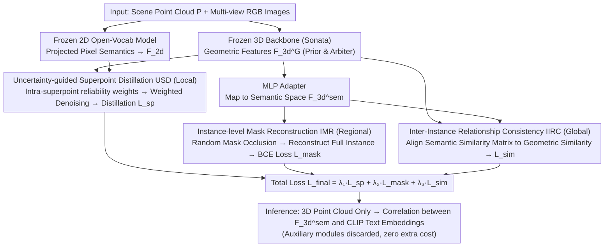

# GeoGuide: Hierarchical Geometric Guidance for Open-Vocabulary 3D Semantic Segmentation

**Conference**: CVPR 2026  
**arXiv**: [2603.26260](https://arxiv.org/abs/2603.26260)  
**Code**: None  
**Area**: Segmentation  
**Keywords**: Open-vocabulary 3D semantic segmentation, geometric priors, 2D-to-3D distillation, superpoint aggregation, instance-level consistency

## TL;DR

This paper proposes GeoGuide, a hierarchical geometric guidance framework for open-vocabulary 3D semantic segmentation. By utilizing three complementary modules—uncertainty-guided superpoint distillation, instance-level mask reconstruction, and inter-instance relationship consistency—the framework leverages geometric priors from pre-trained 3D models to correct geometric biases in 2D-to-3D knowledge distillation, achieving SOTA performance with 64.8 mIoU on ScanNet v2.

## Background & Motivation

1. **Background**: Open-vocabulary 3D semantic segmentation aims to segment arbitrary classes beyond the training set. Due to the scarcity of 3D point-text paired data, mainstream methods distill knowledge from pre-trained 2D open-vocabulary models (e.g., CLIP, LSeg, OpenSeg) into 3D models. The two primary paradigms are "2D-to-3D distillation" (projecting pixel-level features onto point clouds via geometric correspondence) and "point-text alignment" (aligning 3D features with text embeddings via contrastive learning).
2. **Limitations of Prior Work**: Both paradigms essentially train 3D models to replicate 2D feature representations, leading to two core issues: (a) **Limited intrinsic 3D geometric learning** — aligning 3D features to a 2D representation space suppresses the learning of 3D geometric structures; (b) **Inherited 2D prediction errors** — 2D models are prone to incorrect object masks due to occlusions and viewpoint changes, which 3D models inherit as incorrect segmentation patterns.
3. **Key Challenge**: How to effectively preserve intrinsic 3D geometric information during the 2D-to-3D knowledge distillation process? Directly incorporating pre-trained 3D features does not necessarily improve performance, as heterogeneous supervisory signals from different modalities can introduce instability during training.
4. **Goal**: Address the geometric-semantic consistency problem at three levels: (a) **Intra-superpoint consistency** — points within the same superpoint should share semantic labels, though 2D projections often lead to inconsistency; (b) **Intra-instance consistency** — single-view 2D predictions cover only portions of an instance, leading to semantic fragmentation in 3D space; (c) **Inter-instance relationship consistency** — multi-view feature aggregation introduces feature distribution shifts between instances of the same class.
5. **Key Insight**: Pre-trained 3D models (e.g., Sonata) have already learned strong geometric priors from large-scale point cloud data—objects of the same class possess similar geometric representations. The key is to leverage these priors during distillation to correct 2D-level errors.
6. **Core Idea**: Utilize geometric priors from pre-trained 3D models to guide the 2D-to-3D distillation process through three levels of geometric-semantic consistency modeling (superpoint, instance, and inter-instance), ensuring distilled 3D features retain geometric structure while gaining open-vocabulary semantic capabilities.

## Method

### Overall Architecture

Given a scene point cloud $\mathbf{P} \in \mathbb{R}^{N \times 3}$ and multi-view RGB images $\mathcal{I}$, GeoGuide extracts two types of features in parallel: (1) geometric features $\mathbf{F}_{3d}^G \in \mathbb{R}^{N \times C_1}$ from a frozen pre-trained 3D backbone; (2) pixel-level semantic features $\mathbf{F}_{2d}^M$ from a frozen 2D open-vocabulary segmentation model. 2D-3D correspondences are established via camera parameters to project 2D features onto the point cloud as $\mathbf{F}_{2d} \in \mathbb{R}^{N \times C}$. 3D geometric features are mapped to the same semantic space via a lightweight MLP adapter to obtain $\mathbf{F}_{3d}^{\text{sem}}$. Three hierarchical modules (USD, IMR, IIRC) guide the distillation process from local to global scales. During inference, only the 3D point cloud input is required, and all auxiliary modules are discarded.

### Key Designs

The three modules correspond to three scales of distillation bias—superpoint (local), instance (regional), and inter-instance (global). Each uses frozen pre-trained 3D geometric features as an "arbiter" to correct projected 2D semantic features.

**1. Uncertainty-guided Superpoint Distillation (USD): suppress unreliable 2D projections using geometry before distillation**

When 2D features are projected along camera rays onto point clouds, occlusions and boundary blur introduce numerous incorrect labels. While points within a superpoint should share semantics, traditional mean pooling averages these errors, amplifying bias. USD first partitions the point cloud into superpoints $\{Q_i\}_{i=1}^{N_Q}$ by normals. It mean-pools 3D geometric and 2D semantic features within each superpoint to obtain $\mathbf{S}_{3d}^G$ and $\mathbf{S}_{2d}$. "Superpoint-to-point feature differences" are concatenated and fed into an MLP to predict reliability weights $\mathcal{W} = \text{MLP}(\text{concat}[(\mathbf{S}_{3d}^G - \mathbf{F}_{3d}^G); (\mathbf{S}_{2d} - \mathbf{F}_{2d})])$. These weights are used for weighted pooling of 2D features within superpoints to obtain denoised semantic features $\overline{\mathbf{S}}_{2d}$. Finally, cosine similarity distillation loss $\mathcal{L}_{sp}$ is applied at both superpoint and point levels. This is effective because points that geometrically deviate from the superpoint consensus are often those where 2D predictions fail.

**2. Instance-level Mask Reconstruction (IMR): enforce semantic consistency by reconstructing full instances from partial masks**

Superpoints and single-view 2D predictions often cover only parts of an instance, leading to fragmented 3D semantics. IMR combats this via a self-supervised "mask completion" task: it takes class-agnostic 3D instance masks $\{M_i\}_{i=1}^{N_M}$, randomly occludes them to create incomplete masks $\overline{M}_i$, and pools semantic features $\mathbf{F}_{3d}^{\text{sem}}$ from these partial points to get mask features $\overline{\mathbf{F}}_i^{\text{mask}}$. The model then predicts the full mask $\hat{M}_i = \text{sigmoid}(\cos(\overline{\mathbf{F}}_i^{\text{mask}}, \mathbf{F}_{3d}^{\text{sem}}))$ using BCE loss $\mathcal{L}_{\text{mask}}$. To reconstruct a whole instance from partial points, the model is forced to learn highly similar semantic features for all points within the same instance.

**3. Inter-Instance Relationship Consistency (IIRC): align semantic similarity matrices with geometric similarity matrices**

Multi-view feature aggregation causes semantic distribution shifts between similar instances. IIRC explicitly enforces the prior that "geometrically similar objects should have similar semantics": 3D geometric and semantic features within each instance mask are aggregated into embeddings $\mathbf{F}_{\text{mask}}^G$ and $\mathbf{F}_{\text{mask}}^{\text{sem}}$. Pairwise similarity matrices are calculated for both:

$$\mathbf{P}_{\text{sim-m}}^G = \mathbf{F}_{\text{mask}^T} \mathbf{F}_{\text{mask}}^G, \quad \mathbf{P}_{\text{sim-m}}^{\text{sem}} = \mathbf{F}_{\text{mask}}^T \mathbf{F}_{\text{mask}}^{\text{sem}}$$

MSE loss aligns the semantic similarity to the geometric similarity: $\mathcal{L}_{\text{sim}} = \text{MSE}(\mathbf{P}_{\text{sim-m}}^G, \mathbf{P}_{\text{sim-m}}^{\text{sem}}) + \text{MSE}(\mathbf{P}_{\text{sim-sp}}^G, \mathbf{P}_{\text{sim-sp}}^{\text{sem}})$. This constrains the structural relationship between instances, ensuring geometric proximity translates to semantic proximity.

### Loss & Training

Total Loss: $\mathcal{L}_{\text{final}} = \lambda_1 \mathcal{L}_{\text{sp}} + \lambda_2 \mathcal{L}_{\text{mask}} + \lambda_3 \mathcal{L}_{\text{sim}}$

During inference, only 3D point cloud input is required. The adapter output $\mathbf{F}_{3d}^{\text{sem}}$ is compared against CLIP text embeddings for classification. All auxiliary modules are discarded, maintaining zero additional inference overhead.

## Key Experimental Results

### Main Results

**Open-Vocabulary 3D Semantic Segmentation (mIoU / mAcc):**

| Method | ScanNet v2 mIoU | nuScenes mIoU | Matterport3D mIoU |
|------|----------------|--------------|-------------------|
| OpenScene (LS) | 54.2 | 36.7 | 43.4 |
| SAS (stage1) | 59.2 | 45.4 | 46.3 |
| SAS (stage2) | 61.9 | 47.5 | 48.6 |
| **GeoGuide (SAS*)** | **64.8** | **50.3** | **51.9** |

GeoGuide outperforms SAS(stage1) by +5.6 mIoU on ScanNet v2 and +4.9 mIoU on nuScenes.

**Long-tail Scene Evaluation (Matterport3D):**

| Method | K=21 mIoU | K=40 mIoU | K=80 mIoU | K=160 mIoU |
|------|----------|----------|----------|-----------|
| OpenScene (OS) | 41.1 | 33.4 | 18.1 | 8.9 |
| DMA (OS) | 45.1 | 37.9 | 19.7 | 9.4 |
| **GeoGuide (OS)** | **47.7** | **38.5** | **22.0** | **11.6** |

### Ablation Study

| Module | ScanNet v2 mIoU | mAcc | Description |
|------|----------------|------|------|
| Full model | 53.4 | 74.8 | Using OpenSeg features |
| w/o USD | Decrease | Decrease | Loss of intra-superpoint consistency |
| w/o IMR | Decrease | Decrease | Loss of instance-level consistency |
| w/o IIRC | Decrease | Decrease | Lack of inter-instance relationship constraints |

**Preliminary Experiments (Validating Motivation):**

| Method | mIoU (OpenSeg) | mAcc (OpenSeg) |
|------|---------------|---------------|
| OpenScene (Full 3D Net Training) | 47.5 | 70.7 |
| Frozen 3D Backbone + MLP Adapter | 50.4 | 75.2 |

Freezing the 3D backbone and using a lightweight adapter yields a +2.9 mIoU gain, but performance varies across different 2D models (e.g., slight drop with LSeg), suggesting naive distillation can disrupt pre-trained geometric priors.

### Key Findings

- **Complementarity**: USD (local), IMR (regional), and IIRC (global) address distillation biases at different scales.
- **Robust Generalization**: GeoGuide achieves consistent improvements regardless of whether LSeg, OpenSeg, or SAS features are used, indicating it addresses fundamental geometric inconsistencies.
- **Synchronized mIoU and mAcc Gains**: Improvements in both metrics suggest the network learns more discriminative and class-specific features through geometric consistency.
- **Long-tail Robustness**: GeoGuide shows the least performance degradation in long-tail scenarios, credited to IIRC maintaining semantic consistency across similar instances.

## Highlights & Insights

- **Core Insight on "Preserving Geometric Priors"**: Instead of forcing the 3D model to replicate 2D features entirely, the authors freeze the pre-trained 3D backbone and train only a lightweight adapter. This "conservative distillation" preserves learned 3D priors.
- **Hierarchical Consistency**: The local-to-global alignment (superpoint → instance → inter-instance) creates a robust semantic alignment mechanism where each layer has a distinct, complementary function.
- **Zero Inference Overhead**: All auxiliary modules are used only during training. Consequently, GeoGuide matches the inference efficiency of base methods like OpenScene, making it highly practical.
- **Broad Applicability**: The uncertainty-guided weighted aggregation concept can be extended to any scenario involving the fusion of potentially noisy multi-source features.

## Limitations & Future Work

- **Dependency on Class-Agnostic Segmentation**: The effectiveness of IMR and IIRC depends on the quality of 3D instance segmentation (e.g., Mask3D).
- **Absence of Self-Distillation**: While methods like SAS use time-consuming self-distillation for gains, GeoGuide achieves SOTA without it.
- **Segmentation Errors**: Quality of superpoints and instances directly affects USD, particularly in geometrically ambiguous regions.
- **Cross-Domain Generalization**: While ScanNet to Matterport3D experiments were conducted, large-scale transfers (e.g., indoor to outdoor) remain challenging.
- **Stronger Backbones**: Future work could explore more advanced 3D pre-trained models (e.g., PointMAE v2) for even stronger geometric priors.

## Related Work & Insights

- **vs. OpenScene**: OpenScene trains the entire 3D network to align with 2D features, which destroys geometric priors. GeoGuide outperforms it by +5.9 mIoU on ScanNet v2 using OpenSeg features by preserving these priors.
- **vs. SAS**: SAS ensembles multiple 2D models to reduce bias but ignores 3D structure. GeoGuide improves on SAS by +5.6 mIoU (ScanNet v2) using the same features without needing self-distillation.
- **vs. GGSD**: While GGSD uses a mean-teacher framework for distillation, it lacks explicit geometric constraints compared to GeoGuide’s hierarchical approach.
- **Insight**: In cross-modal distillation, the pre-trained priors of the target modality should not be discarded; they should serve as a "teacher" or "arbiter" during the process.

## Rating

- Novelty: ⭐⭐⭐⭐ The hierarchical design is sound, though the technical novelty of individual modules is incremental.
- Experimental Thoroughness: ⭐⭐⭐⭐⭐ Comprehensive evaluation across three benchmarks, long-tail, and cross-domain settings.
- Writing Quality: ⭐⭐⭐⭐ Clear motivation and logical module design.
- Value: ⭐⭐⭐⭐ Significant improvement in open-vocabulary 3D segmentation by introducing hierarchical geometric constraints with high practical utility.

<!-- RELATED:START -->

## Related Papers

- [\[CVPR 2026\] MARIS: Marine Open-Vocabulary Instance Segmentation](maris_marine_open-vocabulary_instance_segmentation.md)
- [\[CVPR 2026\] Universal 3D Shape Matching via Coarse-to-Fine Language Guidance](universal_3d_shape_matching_via_coarse-to-fine_language_guidance.md)
- [\[CVPR 2026\] HOPS: Hierarchical Open-vocabulary Part Segmentation with Attention-Aware Filtering and Affinity-Guided Enhancement](hops_hierarchical_open-vocabulary_part_segmentation_with_attention-aware_filteri.md)
- [\[CVPR 2026\] Beyond Appearance: Camouflaged Object Detection via Geometric Structure](beyond_appearance_camouflaged_object_detection_via_geometric_structure.md)
- [\[CVPR 2026\] The Power of Prior: Training-Free Open-Vocabulary Semantic Segmentation with LLaVA](the_power_of_prior_training-free_open-vocabulary_semantic_segmentation_with_llav.md)

<!-- RELATED:END -->
