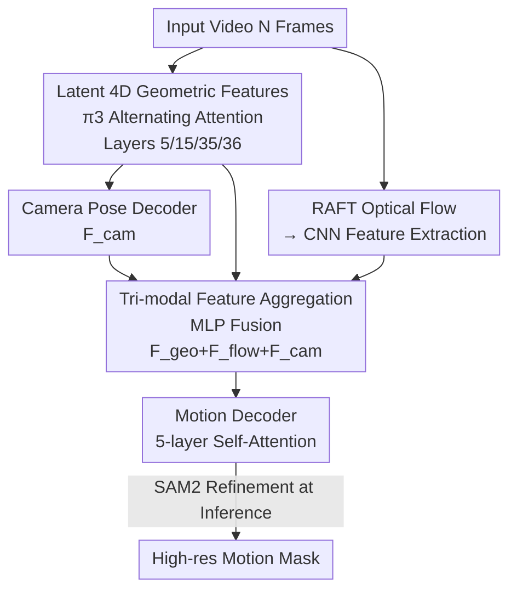

# GeoMotion: Rethinking Motion Segmentation via Latent 4D Geometry

**Conference**: CVPR 2026  
**Paper**: [CVF Open Access](https://openaccess.thecvf.com/content/CVPR2026/html/He_GeoMotion_Rethinking_Motion_Segmentation_via_Latent_4D_Geometry_CVPR_2026_paper.html)  
**Code**: https://github.com/zjutcvg/GeoMotion  
**Area**: Motion Segmentation / Video Understanding  
**Keywords**: Motion segmentation, 4D geometric priors, feed-forward model, optical flow, π3 reconstruction  

## TL;DR
GeoMotion reformulates motion segmentation from "explicit estimation of camera pose and point correspondence + iterative optimization" to "direct feed-forward decoding of motion masks from latent geometric features of a pre-trained 4D reconstruction model (π3)". Utilizing a feature aggregation module and a 5-layer self-attention decoder, it decouples object motion from camera motion in a single forward pass. It achieves SOTA on multiple zero-shot benchmarks and runs at 0.31s per frame, more than 20x faster than iterative optimization methods.

## Background & Motivation
**Background**: Motion segmentation aims to separate "self-moving objects" in a video from the "global displacement caused by camera motion." Primary approaches rely on explicit motion cues—optical flow or point trajectories—to estimate camera motion and point correspondences first, then infer which regions belong to the independently moving foreground.

**Limitations of Prior Work**: These explicit cues are inherently noisy. Optical flow is unreliable in textureless regions, under occlusion, or during large camera movements, and its receptive field is limited to adjacent frames. Point trajectories suffer from drift. Crucially, these methods are **multi-stage serial pipelines**, where noise from earlier stages accumulates downstream. To combat error accumulation, recent works (e.g., RoMo using epipolar constraints + SAM2 iterative refinement, SegAnyMotion using trajectories as prompts for iterative segmentation) introduce **per-scene iterative optimization**. While accuracy improves, these methods require 6–8 seconds per frame, hindering practical deployment.

**Key Challenge**: Iterative optimization methods face a dilemma: either use noisy intermediate representations (flow/correspondence/epipolar constraints) leading to error accumulation, or rely on expensive iterative optimization to remedy these errors. Both paths cannot bypass the step of "explicitly estimating intermediate geometric quantities."

**Goal**: Can motion segmentation be made **purely feed-forward**, similar to visual segmentation, depth estimation, or 3D/4D reconstruction? Specifically, obtaining motion masks in a single forward pass without explicit correspondence estimation or iteration.

**Key Insight**: The authors observe that human perception of moving objects stems from a strong understanding of 3D scene geometry and spatiotemporal relationships. Recent feed-forward 4D reconstruction models (DUSt3R, VGGT, π3), pre-trained on large-scale data, already **implicitly encode geometric priors for camera pose and motion perception in their latent feature layers**. Since these "latent 4D geometric features" already contain the information needed to decouple motion, the difficulty of motion segmentation reduces from "estimating geometry" to "how to decode these representations into motion masks."

**Core Idea**: Bypass explicit correspondence estimation and apply attention-only decoding directly on the latent features of a pre-trained 4D reconstruction model (π3). This allows the model to implicitly decouple object motion from camera motion—replacing "recomputing geometry" with "understanding geometric priors."

## Method

### Overall Architecture
GeoMotion is an end-to-end feed-forward framework that takes $N$ frames of video as input and outputs a motion mask $M \in [0,1]^{H \times W}$ for each frame (the probability of each pixel belonging to a moving object). The pipeline consists of only two modules: the **Feature Aggregation Module** merges three complementary features (latent 4D geometry, optical flow, and camera pose) into a unified spatiotemporal representation; the **Motion Decoder** uses 5 layers of self-attention to "read out" moving objects directly from the fused features. During training, the pre-trained backbone is frozen, and only the decoder is learned. During inference, SAM2 is used to refine the low-resolution coarse masks into high-resolution results. The essence of the design is "simplicity"—zero iterative optimization, with all heavy lifting handled by the pre-trained geometric priors.

### Key Designs

**1. Latent 4D Geometric Features instead of Explicit Estimation: "Reading" Geometry**

This design addresses the pain point of "noisy intermediate representations + error accumulation." Instead of explicitly estimating camera poses, point correspondences, or epipolar constraints, the authors treat the pre-trained 4D reconstruction model π3 as a "feature library" of geometric priors. Specifically, DINOv2 features are extracted per frame and fed into the **alternating attention** of π3 (view-wise attention for intra-frame structure, global attention for cross-frame spatiotemporal consistency) serving as the Visual Geometric Backbone (VGB) to obtain latent 4D geometric features $F_\text{geo}$. These features naturally encode scene structure, 3D geometry, and camera pose—exactly what is needed to decouple motion. The original 36-layer alternating attention backbone of π3 is used and frozen.

The key insight is **multi-layer feature fusion**: the authors concatenate shallow layers (closer to DINO, biased towards image-level semantics/object structure) and deep layers (accumulated high-level context and geometry). Empirically, concatenating layers 5, 15, 35, and 36 yields the best results—shallow layers provide boundaries and appearance, while deep layers provide global geometry.

**2. Tri-modal Feature Aggregation: Complementary Fusion**

Optical flow provides a composite pixel-level signal of "camera motion + object motion"; 4D geometric priors provide global structure but lack fine-grained local motion; camera poses directly characterize the background motion that needs to be "subtracted." These three are highly complementary. The authors compute flow using RAFT followed by a CNN to get $F_\text{flow}$, and use π3's built-in camera pose decoder to get $F_\text{cam}$. The modalities are fused via a simple MLP:

$$\mathbf{F}_\text{fuse} = \mathrm{MLP}([\mathbf{F}_\text{geo}; \mathbf{F}_\text{flow}; \mathbf{F}_\text{cam}])$$

Ablations show their unique contributions: camera features "suppress" global background motion (+6.3), shallow features identify coherent regions via object-level structures when motion is weak (+4.5), and optical flow complements dense local pixel motion (+6.8).

**3. Motion Decoder + Initialization via π3 Confidence Decoder**

The fused features enter the motion decoder—a minimalist 5-layer standard self-attention module (Multi-Head Attention + Norm + FFN + Residual) followed by a lightweight MLP head. It "perceives" dynamic objects from the fused representation, utilizing cross-frame attention for temporal information.

A clever design involves initialization: the training data is much smaller than the large-scale 4D data used for π3 pre-training. Random initialization leads to instability. The authors use the pre-trained weights of the **π3 confidence decoder** (originally designed to predict pixel reliability based on reconstruction residuals) to initialize the motion decoder. Figure 5 shows that this initialization leads to faster convergence and higher final accuracy, proving that geometric inductive biases from large-scale 4D pre-training benefit motion estimation.

### Loss & Training
The mask decoder predicts $M \in [0,1]^{H \times W}$ for each frame, supervised by binary ground truth $M_\text{gt}$. The objective combines Focal Loss and Dice Loss over $N$ frames:

$$\mathcal{L} = \sum_{t=1}^{N} \left( \lambda_1 \mathcal{L}_\text{focal}(M^t, M_\text{gt}^t) + \lambda_2 \mathcal{L}_\text{dice}(M^t, M_\text{gt}^t) \right)$$

Focal Loss focuses on hard pixels (small objects, blur), while Dice Loss mitigates foreground-background imbalance. $\lambda_1 = \lambda_2 = 0.5$. The model is trained using Adam (LR 5e-5) for 15 epochs on 4 RTX 5090s. Frames are randomly sampled per video each epoch to increase diversity.

## Key Experimental Results

### Main Results
GeoMotion was compared across five zero-shot motion segmentation benchmarks. It outperforms almost all efficient non-iterative methods and rivals the speed of flow-only methods.

| Method | Iterative Optimization | DAVIS2016-M (J&F) | DAVIS2016 (J&F) | SegTrackV2 (J) | Time per Frame |
|--------|:----:|:----:|:----:|:----:|:----:|
| OCLR-TTA | Yes | 78.5 | 78.8 | 72.3 | 1.25s |
| RoMo | Yes | - | - | 67.7 | 8.34s |
| SegAnyMotion | Yes | 89.5 | 90.9 | 76.3 | 6.44s |
| RCF-Stage1 | No | 77.3 | 78.5 | 76.7 | - |
| ABR | No | 72.0 | 72.5 | 76.6 | 0.28s |
| **GeoMotion (Ours)** | **No** | **83.9** | **84.7** | **77.3** | **0.31s** |

GeoMotion achieves 83.9 J&F on DAVIS2016-M and 84.7 on DAVIS2016, exceeding the second-best non-iterative method RCF-Stage1 by +6.6 and +6.2, respectively. It also outperforms the iterative method OCLR-TTA. At 0.31s/frame, its efficiency is comparable to ABR (0.28s), while SegAnyMotion and RoMo require >6s. A notable weakness is FBMS-59 (72.5 J vs ABR's 81.9), where appearance-driven saliency (ABR) outperforms geometric methods when motion is subtle.

Compared to 3D/4D reconstruction-based methods (using Easi3R protocol with SAM2 refinement):

| Method | DAVIS2016 JM | DAVIS2017 JM | DAVIS-All JM |
|--------|:----:|:----:|:----:|
| MonST3R | 64.3 | 56.4 | 51.9 |
| VGGT4D | 69.2 | 60.0 | 54.8 |
| Easi3R-monst3r | 70.7 | 67.9 | 63.1 |
| **GeoMotion** | **84.5** | **81.1** | **74.8** |

Ours leads significantly, highlighting the advantages of a "motion-aware learning" architecture over post-hoc attention adaptation used in standard reconstruction models.

### Ablation Study

**Feature Modal Ablation** (DAVIS2017, baseline = VGB last two layers only):

| Configuration | J&F | Explanation |
|------|:----:|------|
| Baseline | 67.9 | Latent geometry only |
| + Cam | 74.2 | Camera pose +6.3, suppresses background motion |
| + Flow | 74.7 | Optical flow +6.8, dense local motion |
| + Shallow | 72.4 | Shallow features +4.5, object-level structure |
| + Cam + Flow | 80.2 | Bi-modal combination |
| **All** | **81.4** | Tri-modal fusion (Optimal) |

**Data Scale Ablation**: Performance increased monotonically as more datasets (HOI4D, Dynamic Replica, OmniWorld-motion, YTVOS18-m, GOT-Motion) were added, demonstrating the framework's scalability.

### Key Findings
- **Tri-modal Synergy**: Camera poses contribute most to background suppression, flow provides fine-grained details, and shallow features provide a safety net for weak motion.
- **Pre-trained Initialization**: Reusing π3 confidence decoder weights for the motion decoder is a "free lunch," improving convergence speed and final accuracy.
- **Geometry-driven Trade-off**: In scenes with weak motion where boundaries are defined by appearance saliency (FBMS-59), GeoMotion tends toward conservative predictions.

## Highlights & Insights
- **Problem Reformulation**: Shifting from "estimate geometry + iterative repair" to "decode existing geometric priors" reduces a complex multi-stage pipeline to a single pass, yielding a 20x speedup.
- **Frozen Backbone Paradigm**: When powerful pre-trained geometric or video foundation models exist, downstream tasks may not need to re-estimate low-level quantities; instead, they can simply learn a lightweight head to "read" these features.
- **Multi-layer Hierarchical Semantics**: The selection of layers (5/15/35/36) reveals the hierarchy of 4D backbones: shallow for objects/appearance, deep for global geometry.

## Limitations & Future Work
- Performance on scenes heavily dependent on appearance saliency (e.g., FBMS-59) is conservative compared to ABR.
- **Upstream Dependency**: Performance is tightly coupled with the quality of π3, RAFT, and SAM2. The paper does not fully analyze the vulnerability of this cascade if π3 fails during extreme dynamics.
- Integration of SAM2 refinement into end-to-end training or adding an appearance-specific branch for "weak motion" scenarios are potential future directions.

## Related Work & Insights
- **vs RoMo / SegAnyMotion (Iterative)**: These utilize iterative refinement for robustness (6–8s per frame). Ours is purely feed-forward (0.31s) with comparable accuracy by bypassing explicit intermediate estimation.
- **vs Easi3R / VGGT4D (Reconstruction)**: These utilize training-free adaptation and lack semantic awareness of objects in complex motion. Ours significantly outperforms them on DAVIS (+11.7 to +16.2 JM).
- **vs ABR (Appearance)**: ABR excels in appearance-dominant scenarios, while Ours excels in geometrically complex ones. They represent complementary "appearance-driven vs geometry-driven" approaches.

## Rating
- **Novelty**: ⭐⭐⭐⭐ Reformulating motion segmentation as decoding 4D priors is a clean and powerful insight, though the modules are built from existing components.
- **Experimental Thoroughness**: ⭐⭐⭐⭐ Comprehensive testing across five benchmarks and various baselines, though the analysis of upstream failures could be deeper.
- **Writing Quality**: ⭐⭐⭐⭐ Clear motivation and architectural visualization.
- **Value**: ⭐⭐⭐⭐ Significant engineering value by reducing frame processing time to 0.31s while maintaining SOTA performance.

<!-- RELATED:START -->

## Related Papers

- [\[CVPR 2026\] VGGT-Segmentor: Geometry-Enhanced Cross-View Segmentation](vggt-segmentor_geometry-enhanced_cross-view_segmentation.md)
- [\[CVPR 2026\] Rethinking Box Supervision: Bias-Free Weakly Supervised Medical Segmentation](rethinking_box_supervision_bias-free_weakly_supervised_medical_segmentation.md)
- [\[CVPR 2026\] PEARL: Geometry Aligns Semantics for Training-Free Open-Vocabulary Semantic Segmentation](pearl_geometry_aligns_semantics_for_training-free_open-vocabulary_semantic_segme.md)
- [\[ECCV 2024\] Un-EVIMO: Unsupervised Event-based Independent Motion Segmentation](../../ECCV2024/segmentation/un-evimo_unsupervised_event-based_independent_motion_segmentation.md)
- [\[CVPR 2025\] Rethinking Query-Based Transformer for Continual Image Segmentation](../../CVPR2025/segmentation/rethinking_query-based_transformer_for_continual_image_segmentation.md)

<!-- RELATED:END -->
