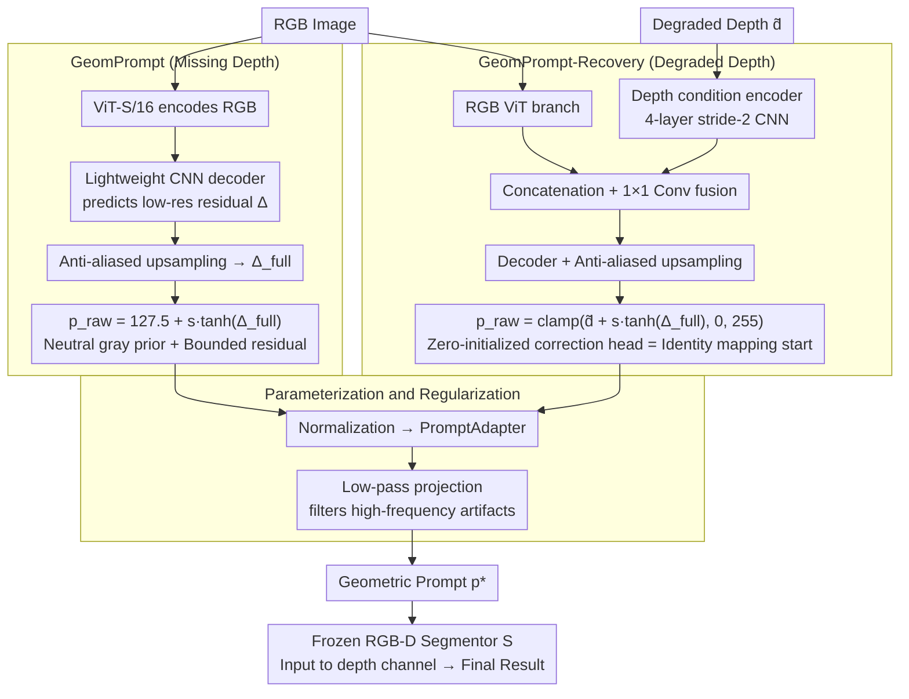

# GeomPrompt: Geometric Prompt Learning for RGB-D Semantic Segmentation Under Missing and Degraded Depth

**Conference**: CVPR 2026  
**arXiv**: [2604.11585](https://arxiv.org/abs/2604.11585)  
**Code**: [https://geomprompt.github.io](https://geomprompt.github.io)  
**Area**: Semantic Segmentation  
**Keywords**: RGB-D Semantic Segmentation, Missing Depth, Modality Robustness, Geometric Prompt, Lightweight Adaptation

## TL;DR
GeomPrompt learns a lightweight geometric prompt module for frozen RGB-D segmentation models. It synthesizes task-driven geometric proxy signals from RGB (without depth supervision), improving performance by 6.1 mIoU under missing depth and up to 3.6 mIoU under depth degradation.

## Background & Motivation

**Background**: RGB-D semantic segmentation improves performance by fusing depth information. However, in real-world deployment, depth sensors often fail, produce incomplete data, or suffer from severe noise (e.g., reflective/transparent surfaces, sensor glitches).

**Limitations of Prior Work**: (1) Distilling depth as privileged information into RGB still requires depth supervision; (2) Using monocular depth estimation as a proxy requires additional heavy models and focuses on depth reconstruction rather than segmentation optimization; (3) There is a lack of lightweight solutions specifically designed to maintain segmentation performance under missing or degraded depth.

**Key Challenge**: RGB-D segmentors expect geometric priors from depth input, but depth may be unavailable or unreliable at deployment. The core problem is: can a "good enough" geometric signal be learned to satisfy the segmentor without the need for authentic depth reconstruction?

**Core Idea**: Learning "task-driven geometric prompts" instead of "reconstructing depth"—training the prompt generation module solely with segmentation loss allows it to automatically discover geometric signals that are most beneficial for segmentation.

## Method

### Overall Architecture
GeomPrompt addresses scenarios where a pre-trained RGB-D segmentation model expects geometric priors in the depth channel, but fails when depth is missing or noisy. Instead of modifying the segmentor, a lightweight module is prepended to generate the required input for the depth channel on-the-fly, while the segmentor backbone remains completely frozen.

The pipeline comprises two branches: for **missing depth**, the GeomPrompt module synthesizes a "geometric prompt map" solely from RGB; for **degraded depth**, the GeomPrompt-Recovery module predicts a correction residual over the original degraded depth to remove harmful components. In both paths, the generated prompts undergo normalization, a PromptAdapter, and low-pass projection to ensure they resemble "normal depth" before entering the frozen segmentor's depth channel. The entire module is trained end-to-end using only segmentation loss, without any depth supervision.

### Key Designs

**1. GeomPrompt: Synthesizing "Task-Driven Geometric Prompts" from RGB for Missing Depth**

When depth is unavailable, a typical approach is monocular depth estimation (MDE). However, MDE aims for "true geometry," which may not align perfectly with the "optimal signal for segmentation." GeomPrompt bypasses reconstruction: it uses a ViT-S/16 to encode RGB features and a lightweight CNN decoder to predict a low-resolution residual map. After anti-aliased upsampling, a geometric prompt is generated by adding a bounded residual $s \cdot \tanh(\cdot)$ to a neutral gray prior (127.5). crucially, it is **trained only with segmentation loss** without depth ground truth, allowing the signal to converge to what is most useful for the task rather than what is physically accurate. This eliminates the objective misalignment between MDE and segmentation.

**2. GeomPrompt-Recovery: Correcting Degraded Depth via Residual Learning from Identity Mapping**

Degraded depth differs from missing depth as partial information is often still useful. GeomPrompt-Recovery uses a dual-path architecture: an RGB ViT branch provides semantic context, while a lightweight depth condition encoder (4-layer stride-2 CNN) processes the degraded depth. The fused features predict a bounded correction residual:

$$p_{raw} = \text{clamp}\big(\tilde{d} + s \cdot \tanh(\Delta_{full}),\ 0,\ 255\big)$$

The **zero-initialization of the correction head** is critical: at the start of training, $\Delta_{full}=0$, making the module an identity mapping that passes the degraded depth through. The model then learns "where and how much to modify" driven by segmentation loss, ensuring it does not destroy useful depth information prematurely.

**3. Parameterization & Regularization: Constraining Prompts to the Valid Input Space**

To ensure the frozen segmentor can process the generated prompts effectively, GeomPrompt applies several constraints. The $\tanh$ function ensures bounded residual magnitudes. a scaling factor $s$ is progressively increased during training to prevent drastic perturbations in early stages. Additional TV regularization suppresses spatial jitter, while L1 magnitude regularization encourages minimal sufficient modifications. Finally, a low-pass projection removes high-frequency artifacts, ensuring the prompts "look like depth" to the segmentor.

### Loss & Training
The total loss consists of segmentation loss and two regularization terms:

$$\mathcal{L} = \mathcal{L}_{seg}(\text{OHEM CE}) + \lambda_{tv}\, \mathcal{L}_{tv}(p_{raw}) + \lambda_\delta\, \|\Delta\|_1$$

The segmentation term uses OHEM cross-entropy to focus on hard samples. $\mathcal{L}_{tv}$ provides total variation smoothing for the prompt map, and $\|\Delta\|_1$ constrains the residual magnitude. During training for GeomPrompt-Recovery, various depth degradations (spatial loss, quantization, noise) are randomly synthesized to improve robustness.

## Key Experimental Results

### Main Results

| Setting | Model | Baseline (RGB-only) | + GeomPrompt | Gain |
|------|------|---------------|-------------|------|
| Missing Depth | DFormer | 43.8 mIoU | 49.9 mIoU | +6.1 |
| Missing Depth | GeminiFusion | 47.2 mIoU | 50.2 mIoU | +3.0 |
| Degraded Depth (Severe) | DFormer | 45.x mIoU | +3.6 mIoU | Improvement |

### Ablation Study

| Configuration | mIoU | Latency | Description |
|------|------|------|------|
| GeomPrompt | 49.9 | 7.8ms | Lightweight and efficient |
| Depth Anything V2 | 50.1 | 38.3ms | Similar accuracy but 5x slower |
| Metric3Dv2 | 49.6 | 71.9ms | Slower and lower accuracy |
| Gray-fill | 43.8 | 0ms | Baseline |

### Key Findings
- GeomPrompt achieves accuracy competitive with Depth Anything V2 (38.3ms) at only 7.8ms latency, showing significant efficiency advantages.
- Task-driven geometric prompts do not need to be precise depth maps; the segmentor only requires a "good enough" geometric prior.
- The training strategy involving zero-initialization and progressive scaling is vital for stability.

## Highlights & Insights
- **Paradigm Shift**: Moves from "estimating depth" to "generating task-useful geometric signals," bypassing the need for depth supervision and heavy pre-training.
- **Plug-and-play**: Applicable to any frozen RGB-D segmentor without modifying the backbone weights.

## Limitations & Future Work
- Requires separate training of GeomPrompt for each specific segmentor.
- Recovery capabilities are limited under extreme depth degradation.
- Future work could explore universal geometric prompts that generalize across different segmentors.

## Related Work & Insights
- **vs Depth Anything V2**: General-purpose depth estimation objectives do not perfectly align with segmentation goals; GeomPrompt optimizes for the downstream task directly.
- **vs Privileged Information Distillation**: Distillation methods typically modify backbone weights, whereas GeomPrompt maintains a frozen backbone.

## Rating
- Novelty: ⭐⭐⭐⭐ The "task-driven geometric prompt" perspective is innovative.
- Experimental Thoroughness: ⭐⭐⭐⭐ Evaluated under both missing and degraded settings.
- Writing Quality: ⭐⭐⭐⭐⭐ Clear motivation and detailed parameterization design.
- Value: ⭐⭐⭐⭐ Practical value for robotics and embedded perception.

<!-- RELATED:START -->

## Related Papers

- [\[CVPR 2026\] Heuristic Self-Paced Learning for Domain Adaptive Semantic Segmentation under Adverse Conditions](heuristic_self-paced_learning_for_domain_adaptive_semantic_segmentation_under_ad.md)
- [\[CVPR 2026\] GeoGuide: Hierarchical Geometric Guidance for Open-Vocabulary 3D Semantic Segmentation](geoguide_hierarchical_geometric_guidance_for_open-vocabulary_3d_semantic_segment.md)
- [\[CVPR 2026\] REL-SF4PASS: Panoramic Semantic Segmentation with REL Depth Representation and Spherical Fusion](rel-sf4pass_panoramic_semantic_segmentation_with_rel_depth_representation_and_sp.md)
- [\[CVPR 2026\] The Missing Point in Vision Transformers for Universal Image Segmentation](the_missing_point_in_vision_transformers_for_universal_image_segmentation.md)
- [\[CVPR 2026\] Beyond Appearance: Camouflaged Object Detection via Geometric Structure](beyond_appearance_camouflaged_object_detection_via_geometric_structure.md)

<!-- RELATED:END -->
