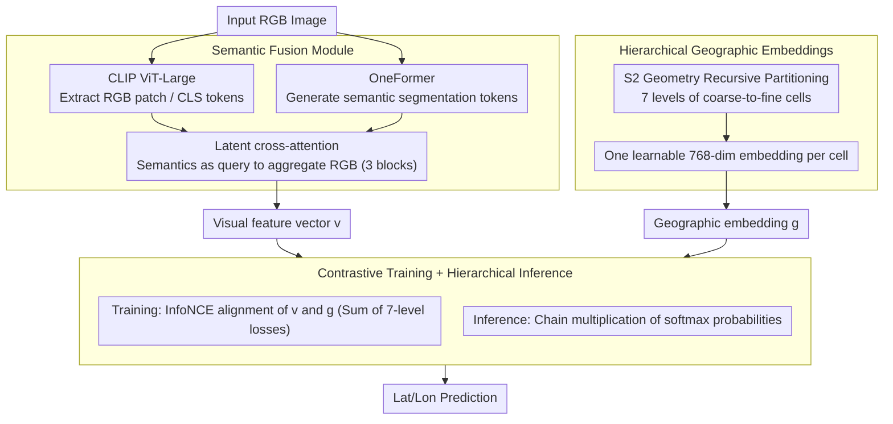

# GeoSURGE: Geo-localization using Semantic Fusion with Hierarchy of Geographic Embeddings

**Conference**: CVPR 2026  
**arXiv**: [2510.01448](https://arxiv.org/abs/2510.01448)  
**Code**: None  
**Area**: Image Retrieval and Localization  
**Keywords**: Visual Geo-localization, Semantic Fusion, Hierarchical Geographic Embeddings, Contrastive Learning, Cross-attention

## TL;DR
GeoSURGE proposes hierarchical geographic embeddings and a semantic fusion module, modeling the global image geo-localization problem as a matching task between visual representations and learned geographic representations. It achieves SOTA on 22 out of 25 metrics across 5 benchmarks.

## Background & Motivation

**Background**: Global visual geo-localization aims to determine the location of an image on Earth based solely on its visual content. Existing methods primarily fall into two categories: retrieval-based methods (matching a query image against a large-scale geotagged database) and classification-based methods (discretizing the Earth's surface into geographic cells and training a classifier). Recently, GeoCLIP replaced image references with GPS coordinates, while Img2Loc and G3 introduced Large Vision-Language Models (LVLMs) to further improve performance.

**Limitations of Prior Work**: Retrieval-based methods suffer from high computational overhead during inference due to large-scale similarity searches. Classification-based methods must compromise between spatial resolution and global coverage. Fundamentally, the dimensionality of GPS coordinates is too low to learn highly expressive geographic representations. While GeoCLIP uses Random Fourier Features to mitigate this, the low-dimensional GPS representation remains a bottleneck.

**Key Challenge**: Geographic coordinates (latitude/longitude) are essentially two-dimensional scalars, making it difficult for them to carry rich geographic semantics. Furthermore, the appearance of images is easily affected by lighting, weather, and viewpoint changes, making single RGB features insufficient for robustness.

**Goal**: (1) How to make geographic representations expressive enough so that geographic regions at different scales have distinguishable features? (2) How to make visual representations more robust by fusing scene semantic information to complement appearance features?

**Key Insight**: The authors observe that the concept of geographic cells from classification methods can be combined with retrieval methods—not by treating cells as discrete labels, but by learning a trainable embedding vector for each cell. Simultaneously, scene structural information provided by semantic segmentation can be used to augment RGB appearance features.

**Core Idea**: Use hierarchical learnable geographic embeddings instead of low-dimensional GPS coordinates for geographic representation, and employ a latent cross-attention fusion of semantic segmentation and RGB features instead of pure appearance features.

## Method

### Overall Architecture
The input to GeoSURGE is an RGB image, and the output is its predicted latitude and longitude. The system consists of two core components: (1) Geographic Representation—recursively partitioning the Earth's surface into multi-level geographic cells using S2 Geometry, where each cell learns an embedding vector to form a hierarchical distributed geographic representation; (2) Visual Representation—extracting RGB features with CLIP ViT and generating semantic segmentation maps with OneFormer, then fusing them into a robust visual feature vector through latent cross-attention. Training utilizes an InfoNCE contrastive learning objective to align visual-geographic feature pairs. During inference, matching is performed level-by-level through the hierarchy, with the product of probabilities at each level serving as the final prediction.

### Key Designs

**1. Hierarchical Geographic Embeddings: Allowing each region to accumulate its own visual features rather than relying on low-dimensional GPS coordinates.**

Latitude and longitude are merely two scalars with naturally limited expressiveness. GeoCLIP uses Random Fourier Features essentially to "add dimensions" to this low-dimensional representation. GeoSURGE takes a different approach: projecting the Earth's surface onto the six faces of a cube using Google S2 Geometry, then recursively subdividing into cells. If a cell contains more than $\tau_{max}$ training samples, it splits; if it has fewer than $\tau_{min}$, it is excluded. By decreasing $\tau_{max}$ from 25,000 to 500, a 7-level coarse-to-fine partition is obtained. Each cell in each partition corresponds to a **learnable 768-dimensional embedding vector**, aligned directly with image features via contrastive learning. Consequently, a region's embedding "absorbs" visual information from all images within it during training, forming a much richer geographic representation than GPS coordinates. Embeddings at different levels are learned independently to maintain diversity, where coarse levels provide high confidence and fine levels provide high resolution.

**2. Semantic Fusion Module: Using semantic segmentation to guide RGB feature aggregation rather than treating semantics as an independent parallel feature.**

RGB appearance features are sensitive to lighting, weather, and perspective, whereas scene structures provided by semantic segmentation (buildings, vegetation, roads) are much more stable and can implicitly identify non-stationary regions (pedestrians, vehicles) as noise. The module first extracts RGB patch tokens and CLS tokens using CLIP ViT-Large (with parameters frozen except for the last few layers), then generates ADE20K semantic maps using OneFormer, which are linearly projected into semantic tokens. The key lies in the fusion mechanism: semantic tokens act as queries, while RGB tokens act as keys and values in latent multi-headed cross-attention (the latent form reduces memory overhead). This is followed by MLP, residuals, and LayerNorm. Three such fusion blocks are stacked to refine features. Finally, the fused CLS token is passed through LayerNorm and a linear projection to obtain the visual feature vector. Using semantics as the query means it "selectively guides" which RGB patches to aggregate rather than directly replacing appearance, preserving the discriminative power of RGB better than simple concatenation.

**3. Contrastive Training + Hierarchical Inference: Aligning visual and geographic features in the same space and performing multi-scale localization via cumulative multiplication.**

During training, each sample has a fused visual CLS token $\mathbf{v}$ and a geographic embedding $\mathbf{g}$ corresponding to its ground truth location. InfoNCE is used to maximize the cosine similarity of correct pairs:

$$\mathcal{L}_i = -\log \frac{\exp(\mathbf{v}_i^\top \mathbf{g}_i / \tau)}{\sum_j \exp(\mathbf{v}_i^\top \mathbf{g}_j / \tau)}$$

The full objective is the sum of losses from all 7 levels (with independent temperature $\tau$ initialized at 0.07). During inference, the softmax probability between the query image and all embeddings is calculated for each level. For a specific fine-grained cell, the probabilities of all its parent levels are multiplied to compute the final score. This performs a progressive geographic search: coarse levels narrow the search scope to high-confidence regions, while fine levels pinpoint high-resolution cells within them, making it more stable and accurate than single-scale classification.

### Loss & Training
The AdamW optimizer is used with an initial learning rate of 0.0001, weight decay of 0.0001, and an effective batch size of 1024. Learning rate decay (gamma=0.5) is applied per epoch with early stopping after 4 epochs without improvement. Temperature parameters are initialized at 0.07 independently for each level. Training took 21 hours on 8 A6000 GPUs. Predictions are averaged using the Ten Crop method.

## Key Experimental Results

### Main Results

| Dataset | Metric (1km) | GeoSURGE | GeoCLIP | PIGEOTTO | G3/GPT-4V |
|---------|--------------|----------|---------|----------|-----------|
| IM2GPS | Street-level | **27.0** | 16.5 | 11.8 | - |
| IM2GPS | Continent | **93.2** | 88.6 | 91.1 | - |
| IM2GPS3k | Street-level | **17.2** | 14.1 | 10.9 | 16.6 |
| IM2GPS3k | Continent | **87.6** | 83.8 | 84.4 | 84.7 |
| YFCC26k | Street-level | **17.8** | 11.6 | 10.1 | - |
| GWS15k | Continent | **80.8** | 74.1 | 84.7† | - |

Ours achieves SOTA in 22 out of 25 metrics across 5 datasets. Excluding LVLM-based methods, it is the best across all 25 metrics.

### Ablation Study

| Configuration | YFCC26k 1km | YFCC26k 25km | GWS15k 1km | GWS15k 25km |
|---------------|-------------|--------------|------------|-------------|
| Full (7 levels) | 17.8 | 31.5 | 1.0 | 4.6 |
| 5 levels | 11.1 | 30.0 | 0.4 | 3.5 |
| 1 level | 8.9 | 27.5 | 0.1 | 3.1 |
| 3 modules | 17.8 | 31.5 | 1.0 | 4.6 |
| No fusion | 13.8 | 30.4 | 0.6 | 4.6 |

### Key Findings
- Hierarchical depth significantly impacts fine-grained metrics (street/city level): 7 levels vs. 1 level shows an approximate 2x difference on YFCC26k 1km (17.8 vs. 8.9).
- The semantic fusion module provides a relative Gain of ~36.5% on YFCC26k 1km (13.8 → 17.8).
- Geographic embeddings (retrieval target) consistently outperform classification targets in both hierarchical and flat settings, proving that embeddings and hierarchies are complementary.
- LVLM methods have an advantage in fine-grained localization (likely due to memorization of landmarks during large-scale pre-training), but GeoSURGE wins across the board in medium-to-coarse localization.

## Highlights & Insights
- The design unifying the geographic units of classification methods and the feature matching of retrieval methods is ingenious. Treating units as learnable embeddings instead of labels allows each region to "automatically accumulate" its visual features, gaining the advantages of both paradigms.
- Using semantic segmentation as a query for cross-attention rather than an independent second representation is a significant perspective. Semantics do not participate directly in feature expression but serve as structural signals to guide the aggregation of RGB features; this "guidance rather than replacement" approach is transferable to other multi-modal fusion tasks.
- The performance Gain is most significant on GWS15k (globally uniform distribution), indicating strong generalization.

## Limitations & Future Work
- Dependency on OneFormer for semantic segmentation preprocessing increases inference overhead (processing hundreds of thousands of images).
- The partitioning scheme is fixed to S2; adaptive or data-driven partitioning's impact on performance has not been explored.
- Lack of exploration with different visual backbones (e.g., ViT-H, DINOv2).
- In geographically sparse regions (e.g., small islands in the ocean), the distance from the reference image to ground truth can reach 800+ km, indicating that data coverage remains a fundamental bottleneck.

## Related Work & Insights
- **vs GeoCLIP**: Both use CLIP backbones and contrastive learning, but GeoCLIP embeds GPS coordinates directly (using Random Fourier Features), while GeoSURGE uses learnable geographic unit embeddings to avoid information loss from low-dimensional GPS. GeoSURGE wins comprehensively given the same backbone and data.
- **vs Img2Loc/G3**: These methods leverage the massive knowledge of GPT-4V for RAG-based localization, holding an advantage at the street level (possibly from landmark recognition), but GeoSURGE is stronger at medium-to-coarse granularities.
- **vs TransLocator**: TransLocator performs repetitive fusion between parallel semantic and RGB backbones; GeoSURGE is more efficient and effective using latent cross-attention.

## Rating
- Novelty: ⭐⭐⭐⭐ Combination of hierarchical embeddings and semantic fusion is innovative, though components are not entirely new.
- Experimental Thoroughness: ⭐⭐⭐⭐⭐ 5 benchmark datasets + detailed ablation + qualitative analysis, very comprehensive.
- Writing Quality: ⭐⭐⭐⭐ Clear logic and standard structure.
- Value: ⭐⭐⭐⭐ Establishes a new SOTA baseline in the field of global visual localization.

<!-- RELATED:START -->

## Related Papers

- [\[CVPR 2026\] SouPLe: Enhancing Audio-Visual Localization and Segmentation with Learnable Prompt Contexts](souple_enhancing_audio-visual_localization_and_segmentation_with_learnable_promp.md)
- [\[CVPR 2026\] REL-SF4PASS: Panoramic Semantic Segmentation with REL Depth Representation and Spherical Fusion](rel-sf4pass_panoramic_semantic_segmentation_with_rel_depth_representation_and_sp.md)
- [\[CVPR 2026\] LoD-Loc v3: Generalized Aerial Localization in Dense Cities using Instance Silhouette Alignment](lod-loc_v3_generalized_aerial_localization_in_dense_cities_using_instance_silhou.md)
- [\[CVPR 2026\] Uncertainty-Aware Modality Fusion for Unaligned RGB-T Salient Object Detection](uncertainty-aware_modality_fusion_for_unaligned_rgb-t_salient_object_detection.md)
- [\[CVPR 2026\] Revisiting Geometric Obfuscation with Dual Convergent Lines for Privacy-Preserving Image Queries in Visual Localization](revisiting_geometric_obfuscation_with_dual_convergent_lines_for_privacy-preservi.md)

<!-- RELATED:END -->
