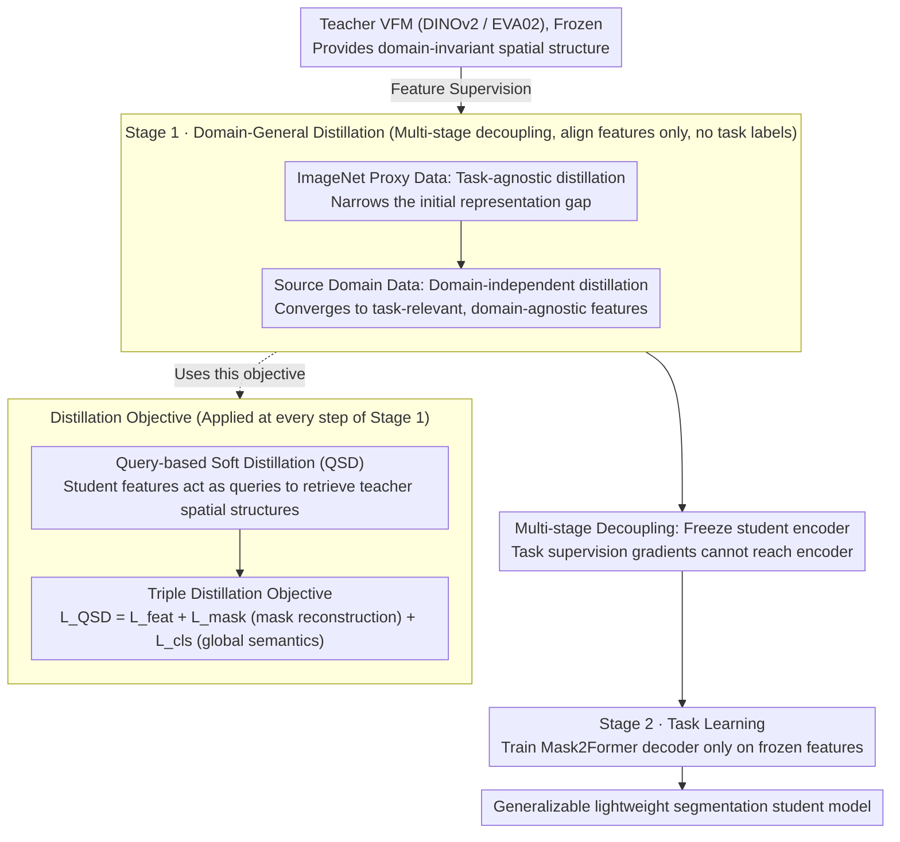

# GKD: Generalizable Knowledge Distillation from Vision Foundation Models for Semantic Segmentation

**Conference**: CVPR 2026  
**arXiv**: [2603.02554](https://arxiv.org/abs/2603.02554)  
**Code**: [https://github.com/Younger-hua/GKD](https://github.com/Younger-hua/GKD)  
**Area**: Semantic Segmentation / Knowledge Distillation / Domain Generalization  
**Keywords**: Knowledge Distillation, Vision Foundation Models, Domain Generalizable Segmentation, DINOv2, Multi-stage Distillation

## TL;DR

Ours proposes the GKD framework, which decouples representation learning from task learning using a multi-stage distillation process (general feature learning → freeze encoder → task head training) combined with a Query-based Soft Distillation (QSD) mechanism. By distilling cross-domain generalization capabilities from VFMs into lightweight student models, it achieves an average mIoU gain of +10.6% in F2L settings and +1.9% in F2F settings.

## Background & Motivation

**Background**: Knowledge Distillation (KD) is extensively used for semantic segmentation model compression—distilling knowledge from large teacher models to lightweight students. Traditional KD methods (CWD, Af-DCD, CIRKD, etc.) focus on preserving in-domain accuracy and perform reasonably well within the source domain. The paradigm of using VFMs (DINOv2, EVA02) as universal feature extractors with lightweight decoders has been widely adopted.

**Limitations of Prior Work**: Traditional KD focuses only on in-domain accuracy, neglecting domain generalization capabilities. This issue is particularly severe in the VFM era; while VFMs themselves possess strong generalization, this capability often evaporates in student models after traditional KD. Experiments demonstrate that traditional single-stage KD can even **harm** student generalization, with some methods performing worse than a no-distillation baseline.

**Key Challenge**: A significant **optimization conflict** exists in single-stage KD: task loss drives the student to fit source-domain-specific decision boundaries, while distillation loss encourages the student to approximate the teacher's domain-invariant representations. These conflicting gradient directions lead to training instability (oscillating loss curves) and generalization degradation. This implies that "KD compresses capacity but damages robustness."

**Goal**: To distill compact models from VFMs while **preserving or even enhancing** cross-domain generalization. Two evaluation settings are considered: F2F (VFM to small VFM, e.g., DINOv2-L to DINOv2-B) and F2L (VFM to local model, e.g., DINOv2-B to ViT-S).

**Key Insight**: Representation learning and task learning **should not be coupled**. The student should first purely learn the teacher's domain-general representations (without exposure to task labels), and subsequently, the encoder should be frozen while only the task head is trained.

**Core Idea**: Decouple representation learning and task learning—Stage 1 utilizes pure feature distillation to acquire domain-general representations; Stage 2 freezes the encoder to train the task head, complemented by QSD to selectively retrieve spatial knowledge from the teacher space.

## Method

### Overall Architecture

GKD addresses a critical issue: why does the strong generalization of VFMs collapse when distilled into small models? The authors hypothesize that the coupling of "representation learning" and "task learning" is the cause. Consequently, the workflow is split into two distinct stages. **Stage 1 focuses on domain-general distillation**, performed in two steps: first, task-agnostic distillation on the ImageNet proxy dataset to narrow the initial representation gap between the student and the VFM; second, domain-independent distillation on the source domain to learn task-relevant but domain-agnostic features. In both steps, only features are aligned without using task labels, employing the Query-based Soft Distillation (QSD) objective. **Stage 2 involves task learning**, where the student encoder is frozen, and a Mask2Former decoder is trained on its features for segmentation. Since the task-supervision gradient never reaches the encoder, the learned generalization representations remain undistorted by source-domain labels.

### Key Designs

**1. Multi-stage Decoupling: Separating feature distillation and task supervision into independent training phases to prevent interference.**

The root cause of single-stage KD is the optimization conflict where task loss forces the student to fit source-domain specific boundaries while distillation loss seeks domain-invariant representations. Diagnosis shows the single-stage loss curve oscillates (Fig. 3b), leading to generalization decay. GKD completely separates these phases. Stage 1 first performs distillation on ImageNet: $\min_{\theta_s} \mathbb{E}_{x_P \sim D_P}[\mathcal{L}_{QSD}(\mathcal{F}_{\theta_t}(x_P), \mathcal{F}_{\theta_s}(x_P))]$ to learn task-agnostic representations, followed by distillation on the source domain: $\min_{\theta_s} \mathbb{E}_{x_S \sim D_S}[\mathcal{L}_{QSD}(\mathcal{F}_{\theta_t}(x_S), \mathcal{F}_{\theta_s}(x_S))]$ for domain-independent features. In Stage 2, the encoder $\theta_s$ is frozen, and only the decoder $\theta_h$ is trained: $\min_{\theta_h} \mathbb{E}[\mathcal{L}(\mathcal{H}_{\theta_h}(\mathcal{F}_{\theta_s}(x_S)), y_S)]$. This decoupling results in smooth convergence and a significant gain—improving mIoU from 46.4 (single-stage MSE) to 53.1 (two-stage MSE, +6.7).

**2. Query-based Soft Distillation (QSD): Allowing students to actively retrieve spatial relationships from the teacher rather than imitating activation values point-by-point.**

The value of VFMs lies in their domain-invariant spatial structure (evidenced by PCA visualizations), which traditional point-wise MSE fails to preserve as it only aligns local values and discards global relationships. QSD treats student features $v_s \in \mathbb{R}^{B \times N \times C_s}$ as queries to retrieve teacher spatial features $v_t$ via attention. First, attention is calculated: $W = \varphi(v_s) \cdot v_t^\top$; then, student features are reconstructed: $v_s' = \sigma(\varphi(v_s) \cdot v_t^\top) \cdot \phi(v_s)$; finally, MSE aligns the reconstruction to the teacher: $\mathcal{L}_{feat} = \|v_s' - v_t\|_2^2$, where $\varphi, \phi$ are linear projections. This allows the student to internalize the teacher's relational structure via attention, maintaining spatial correspondence while selectively aggregating semantically relevant positions.

**3. Triple Distillation Objective: Approximating the teacher across spatial features, masked reconstruction, and global semantics.**

To ensure comprehensive alignment, the distillation objective is defined as a weighted sum: $\mathcal{L}_{QSD} = \alpha \mathcal{L}_{feat} + \beta \mathcal{L}_{mask} + \gamma \mathcal{L}_{cls}$ (weights default to 1.0). While $\mathcal{L}_{feat}$ handles spatial structure alignment on full inputs, $\mathcal{L}_{mask}$ requires the student to reconstruct the teacher's full features from randomly masked inputs, forcing the model to infer global context from partial information—similar to DINOv2's MIM objective. $\mathcal{L}_{cls}$ distills the CLS token to transfer global semantic consistency. Ablations show that removing $\mathcal{L}_{mask}$ drops performance by 0.6 mIoU, while removing $\mathcal{L}_{cls}$ drops it by 0.1, identifying the mask term as the primary contributor.

### Loss & Training

Distillation Stage: AdamW, lr=5e-4, weight decay 0.05. F2L Setup: ImageNet 100 epochs (batch 512, 224×224) + Source Domain 300 epochs (batch 128, 512×512). F2F Setup: Directly on Source Domain for 300 epochs. Task Stage: Mask2Former, lr=1e-5 (frozen backbone) / 1e-4 (decoder), 40K iterations, batch 4, crop size 512×512.

## Key Experimental Results

### Main Results—F2L Setting (DINOv2-B → ViT-S)

| Method | GTAV→Citys | GTAV→BDD | GTAV→Map | Avg | Gain |
|------|-----------|---------|---------|-----|------|
| Stu baseline (DeiT-S) | 34.9 | 33.8 | 42.8 | 37.2 | - |
| +Vanilla KD | 45.0 | 44.2 | 49.9 | 46.4 | +9.2 |
| +G2SD | 45.2 | 45.9 | 52.3 | 47.8 | +10.6 |
| +Proteus | 47.4 | 44.6 | 50.2 | 47.4 | +10.2 |
| **Ours (GKD)** | **54.9** | **49.8** | **57.8** | **54.1** | **+16.9** |

### Ablation Study (GTAV→Citys+BDD+Map Avg, DINOv2-B→ViT-S)

| Configuration | mIoU | Description |
|------|------|------|
| Single-stage MSE | 46.4 | Traditional KD baseline |
| Two-stage MSE | 53.1 | +6.7, decoupling is critical |
| Two-stage QSD | 54.1 | +1.0, QSD outperforms MSE |
| Single-stage QSD | 48.8 | Single-stage is still significantly weaker than two-stage |
| W/O $\mathcal{L}_{mask}$ | 53.5 | Masked distillation contribution +0.6 |
| W/O $\mathcal{L}_{cls}$ | 54.0 | CLS distillation contribution +0.1 |

### Key Findings

- **Multi-stage decoupling is the primary contributor**: The transition from single-stage to two-stage yields a +6.7 mIoU gain, far exceeding improvements from specific distillation losses.
- **Exceptional 1/16 label efficiency**: In the F2L setting, GKD achieves 51.4 mIoU with only 1/16 of the labels, outperforming Af-DCD using full labels (47.1).
- **Effectiveness in F2F**: DINOv2-L→DINOv2-B Avg 58.8→59.8 (+1.0), and DINOv2-B→DINOv2-S 53.9→55.6 (+1.7).
- **PCA Visualizations**: Confirm that the spatial structure of the student features after GKD distillation is highly consistent with the DINOv2 teacher.

## Highlights & Insights

- **Systemic Diagnosis of KD Generalization Bottlenecks**: The discovery that traditional KD can actually impair student generalization is a valuable contribution, as prior KD work focused almost exclusively on in-domain accuracy.
- **Simplicity and Effectiveness of Multi-stage Decoupling**: The "learn general features → freeze encoder → train task head" paradigm is clear and remarkably effective, applicable to various VFM downstream adaptation scenarios.
- **Huge Advantage in F2L Scenarios**: A +10.6% average improvement implies that small ImageNet-pretrained models can practically match the generalization performance of VFMs.
- **Practical Value of Label Efficiency**: Surpassing traditional KD with only 1/16 labels provides significant value for real-world deployment where annotation resources are limited.

## Limitations & Future Work

- Requires an additional ImageNet pre-distillation phase (100 epochs), increasing training time and computational costs.
- Only validated on ViT architectures; whether CNN student models (ResNet/MobileNet) benefit equally remains unknown.
- Freezing the encoder for task learning might limit the upper bound of source domain accuracy—GKD's in-domain accuracy (GTAV mIoU) is sometimes lower than traditional KD.
- Focused solely on semantic segmentation; more complex tasks like panoptic/instance segmentation and object detection are yet to be verified.
- The underlying reasons for differences in generalization transfer efficiency between different VFM teachers (DINOv2 vs. EVA02) have not been deeply analyzed.

## Related Work & Insights

- **vs. Traditional Segmentation KD (CWD/Af-DCD/CIRKD)**: These methods lag behind GKD in cross-domain evaluation, with some even falling below the no-distillation baseline due to their focus on in-domain accuracy.
- **vs. VFM Distillation (G2SD/Proteus/TinyMIM)**: While these utilize a "general to specific" paradigm, their task stages still couple distillation. GKD employs a "general → frozen → task" paradigm that isolates distillation from task learning.
- **vs. DGSS Methods (FisherTune/CrossEarth)**: GKD addresses generalization from a distillation perspective, complementing domain generalization methods.
- The principle of decoupling representation and task learning during distillation is extensible to all VFM downstream adaptation scenarios—linear probing is essentially an instance of frozen encoder adaptation.

## Rating

- Novelty: ⭐⭐⭐⭐ Multi-stage decoupling is not entirely new, but the QSD and generalization-oriented diagnosis are novel.
- Experimental Thoroughness: ⭐⭐⭐⭐⭐ Extremely comprehensive with 5 benchmarks, F2F/F2L dual settings, multiple VFMs, label efficiency, and multi-source domain extensions.
- Writing Quality: ⭐⭐⭐⭐⭐ The logical chain from diagnosis to design to verification is excellent; the loss curve comparison in Fig. 3 is highly intuitive.
- Value: ⭐⭐⭐⭐⭐ Addresses the neglected generalization issue in VFM distillation, providing important guidance for practical deployment.

<!-- RELATED:START -->

## Related Papers

- [\[CVPR 2026\] Selective, Regularized, and Calibrated: Harnessing Vision Foundation Models for Cross-Domain Few-Shot Semantic Segmentation](selective_regularized_and_calibrated_harnessing_vision_foundation_models_for_cro.md)
- [\[AAAI 2026\] Causal-Tune: Mining Causal Factors from Vision Foundation Models for Domain Generalized Semantic Segmentation](../../AAAI2026/segmentation/causal-tune_mining_causal_factors_from_vision_foundation_mod.md)
- [\[CVPR 2026\] Unlocking 3D Affordance Segmentation with 2D Semantic Knowledge](unlocking_3d_affordance_segmentation_with_2d_semantic_knowledge.md)
- [\[CVPR 2026\] Metric-Guided Feature Fusion of Visual Foundation Models for Segmentation Tasks](metric-guided_feature_fusion_of_visual_foundation_models_for_segmentation_tasks.md)
- [\[CVPR 2026\] Towards Robust Multi-Modal Semantic Segmentation with Teacher-Student Framework and Hybrid Prototype Distillation](towards_robust_multi-modal_semantic_segmentation_with_teacher-student_framework_.md)

<!-- RELATED:END -->
