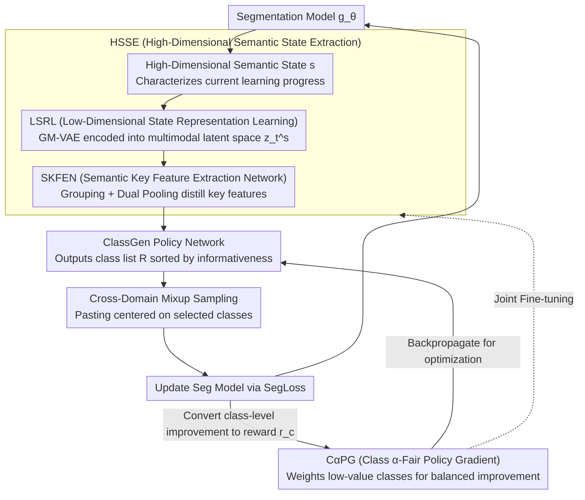

# Heuristic Self-Paced Learning for Domain Adaptive Semantic Segmentation under Adverse Conditions

**Conference**: CVPR 2026  
**arXiv**: [2603.24322](https://arxiv.org/abs/2603.24322)  
**Code**: None  
**Area**: Semantic Segmentation / Domain Adaptation  
**Keywords**: Unsupervised Domain Adaptation, Semantic Segmentation, Curriculum Learning, Reinforcement Learning, Adverse Weather

## TL;DR

This paper reformulates class-level curriculum learning in unsupervised domain adaptation as a sequential decision-making problem in reinforcement learning. It proposes the HeuSCM framework, which achieves autonomous curriculum planning through high-dimensional semantic state perception and a class-fair policy gradient, reaching SOTA performance on ACDC, Dark Zurich, and Nighttime Driving (72.9 mIoU).

## Background & Motivation

**Background**: Unsupervised Domain Adaptation for Semantic Segmentation (UDA-SS) is a core technology for autonomous driving environment perception, aiming to migrate models trained in clear weather to adverse weather (fog, rain, nighttime) scenarios. Mainstream methods employ style transfer to mitigate domain discrepancies while addressing class imbalance through Curriculum Learning (CL) or Hard Class Mining (HCM).

**Limitations of Prior Work**: Existing CL and HCM methods suffer from fundamental paradigm flaws: (1) Difficulty assessment relies on **fixed manually designed metrics** (e.g., prediction uncertainty, confidence), using a one-dimensional scalar to describe the model's high-dimensional dynamic cognitive state; (2) Learning paths are driven by **manually designed rules** (e.g., "easy-to-hard" or "focus entirely on difficult classes"), which cannot adapt to the model's evolving internal state. This "prescriptive paradigm" leads to class bias when facing composite problems like adverse weather—some classes receive excessive attention while others are under-learned.

**Key Challenge**: The model training process is a high-dimensional, dynamic, and non-monotonic evolutionary process. Attempting to statically plan this learning path with fixed, one-dimensional, human-defined scalars is inherently irrational. The "easy-to-hard" approach of CL ignores classes the model currently needs, while "all hard classes" in HCM lacks inter-class balance.

**Goal**: To shift from "designing a curriculum" to "learning a curriculum"—allowing an Agent to autonomously discover the optimal learning trajectory based on the model's current state, rather than relying on human prior assumptions.

**Key Insight**: Inspired by reinforcement learning, this work models curriculum learning as a sequential decision-making problem—the Agent observes the model state at each training step and autonomously decides which classes are most informative, centering cross-domain mixup sampling on these classes.

**Core Idea**: The paper proposes an autonomous curriculum scheduler featuring a high-dimensional state encoder to perceive the model's learning state and a class-fair policy gradient to ensure balanced improvements, achieving true adaptive class-level curriculum learning.

## Method

### Overall Architecture

The paper addresses how to sequence the "what to learn first, what to learn later" curriculum in domain adaptive segmentation under adverse weather. Instead of using fixed manual rules (easy-to-hard or focusing only on hard classes), HeuSCM assigns curriculum scheduling to a reinforcement learning Agent that makes decisions based on the model's current state during training.

The entire pipeline is a closed loop: in each training step, a high-dimensional semantic state $\mathbf{s}$ (characterizing the "current learning progress") is extracted from the segmentation model. This is passed to the High-dimensional Semantic State Extraction (HSSE) network for decision-related feature processing—first compressed into a low-dimensional latent space $z_t^s$ by a GM-VAE, and then distilled into key features reflecting learning progress by the SKFEN. The policy network ClassGen uses these features to output a class list $R$ ranked by informativeness, guiding cross-domain mixup sampling to "paste" these classes into mixed images and labels. The segmentation model is updated on the mixed data using SegLoss. The resulting class-level improvements are converted into rewards and fed back to drive the next round of scheduling via the Class $\alpha$-Fair Policy Gradient (C$\alpha$PG). This loop persists throughout training, allowing the curriculum to self-adjust according to the model state.

### Key Designs

**1. Low-Dimensional State Representation Learning (LSRL): Compressing high-dimensional states into a multi-modal latent space via GM-VAE**

Traditional CL/HCM methods use a single scalar (like uncertainty) to summarize the model's cognitive state, losing high-dimensional information such as inter-class coupling and feature space drift. This work employs a two-stage HSSE network. The first stage, LSRL, uses a Gaussian Mixture VAE (GM-VAE) to encode the high-dimensional state $\mathbf{s}$ into a compact latent space. The discrete component $q_\psi(c|\mathbf{s})$ captures the "current learning mode," while the continuous latent variable $q_\psi(\mathbf{z}|\mathbf{s},c)$ encodes the specific state. The training objective is to maximize the variational lower bound:

$$\mathcal{L}_{GM\text{-}VAE} = \mathbb{E}_{q_\psi(c|\mathbf{s})}\big[\mathbb{E}_{q_\psi(\mathbf{z}|\mathbf{s},c)}[\log p_\theta(\mathbf{s}|\mathbf{z})] - \text{KL}(q_\psi(\mathbf{z}|\mathbf{s},c) \,\|\, p(\mathbf{z}|c))\big] - \text{KL}(q_\psi(c|\mathbf{s}) \,\|\, p(c)).$$

A Gaussian mixture is used because the model may fall into different "learning modes" when adapting to various conditions (fog, rain, night). The GM-VAE is pre-trained unsupervised, after which the decoder is frozen and the encoder is jointly fine-tuned with the policy network.

**2. Semantic Key Feature Extraction Network (SKFEN): Filtering the latent space for decision-relevant dimensions**

As the second stage of HSSE, although the latent space is lower-dimensional, it still contains redundancy irrelevant to "which classes to select." SKFEN提纯 (purifies) this in two steps: first, it uses a 1×1 → 5×5 depthwise separable → 1×1 convolutional combination for feature fusion and interaction, expanding and splitting channels into $G$ groups. Each group undergoes max pooling and average pooling to capture "peak" and "mean" statistical perspectives. These are concatenated and fused via 3×3 convolution with residual connections to obtain the refined feature $z_{out}$.

**3. Class $\alpha$-Fair Policy Gradient (C$\alpha$PG): Embedding fairness into the optimization to prioritize lagging classes**

Standard RL maximizing total reward $J_{sum}$ tends to allocate resources to classes that are "already well-learned and high-reward," causing a Matthew effect. C$\alpha$PG defines a value function for each class:

$$V_c^\pi(s) = \mathbb{E}_\pi\Big[\sum_{k=0}^{\infty}\gamma^k r_c(t+k)\,\big|\,S_t=s\Big],$$

where the class-level reward $r_c(t)$ considers both transferability (cosine similarity) and discriminability (separation in the target domain). The optimization objective is shifted to an $\alpha$-fair target $J_F(\pi) = \sum_{c=1}^{C} \frac{1}{1-\alpha}\big(V_c^\pi(s)\big)^{1-\alpha}$. The policy gradient uses a fair-weighted advantage $\tilde{A}_\alpha$, where weights $w_c(s_t) = V_c^\pi(s_t)^{-\alpha}$ are inversely proportional to class value—giving higher weights to lower-valued classes to balance global improvement.

### Loss & Training

- Segmentation Loss: $\mathcal{L}_{seg} = \lambda_1 \mathcal{L}_{CE}(g_\theta(x_s), y_s) + \lambda_2 \mathcal{L}_{CE}(g_\theta(\mathcal{X}_{mix}^T), \mathcal{Y}_{mix}^R)$, with $\lambda_1 = \lambda_2 = 1.0$.
- GM-VAE Reconstruction Loss: $\mathcal{L}_{recon} = \mathbb{E}_{\mathbf{s}_t}[\|\mathbf{s}_t - p_\theta(\text{Enc}_\psi(\mathbf{s}_t))\|^2]$, used to maintain latent space structure during fine-tuning.
- Policy Optimization: Maximizes fair objective $J_F(\pi)$ using the AdamW optimizer.
- Training: 60k iterations on Cityscapes → ACDC, 1024×1024 crop, NVIDIA A800 GPU.

## Key Experimental Results

### Main Results (Cityscapes → ACDC test)

| Method | Backbone | mIoU |
|------|----------|------|
| DeepLab-v2 (source only) | DeepLab-v2 | 38.0 |
| Refign | DeepLab-v2 | 48.0 |
| VBLC | DeepLab-v2 | 47.8 |
| **HeuSCM (Ours)** | DeepLab-v2 | **58.7** |
| HRDA (source only) | HRDA | 68.0 |
| CoDA | HRDA | 72.6 |
| ACSegFormer | HRDA | 72.7 |
| **HeuSCM (Ours)** | HRDA | **72.9** |

### Ablation Study (ACDC val, HRDA backbone)

| Configuration | mIoU | Gain | Description |
|------|------|------|------|
| Baseline (Refign) | 71.1 | +0.0 | Without HeuSCM |
| + LSRL only | 72.2 | +1.1 | Low-dimensional state representation contributes most |
| + SKFEN only | 71.7 | +0.6 | Key feature distillation is effective |
| + C$\alpha$PG only | 71.6 | +0.5 | Fair policy gradient is effective |
| + LSRL + SKFEN | 72.3 | +1.2 | State perception synergy works well |
| + LSRL + C$\alpha$PG | 72.0 | +0.9 | State + fairness combination is effective |
| + All Three (Full Model) | **72.7** | **+1.6** | Three modules are complementary |

### Key Findings

- Significant improvement on the DeepLab-v2 backbone (+10.7 mIoU), indicating HeuSCM benefits weaker backbones more.
- Achieved SOTA of 72.9 mIoU on HRDA, surpassing CoDA (72.6) and ACSegFormer (72.7).
- Reached 52.8 mIoU on Dark Zurich and 59.3 mIoU on Nighttime Driving, proving generalization across nighttime scenarios.
- The curriculum sampling strategy (HCSP) can serve as a plug-and-play module for existing hard class mining methods.

## Highlights & Insights

- **Paradigm Shift Insight**: The shift from "designing curricula" to "learning curricula" reveals the fundamental limitation of existing CL/HCM—humans cannot effectively design optimal paths for high-dimensional dynamic processes.
- **Elegant $\alpha$-Fair Policy Gradient**: Porting the multi-agent fairness concept to a single-agent multi-class scenario naturally solves class bias via inverse weighting.
- **State Modeling via GM-VAE**: Using a Gaussian mixture to capture multi-modal learning states is insightful—models indeed fall into different modes when adapting to different adverse conditions.

## Limitations & Future Work

- Three-stage training (GM-VAE pre-training → joint fine-tuning → segmentation training) increases implementation complexity and overhead.
- SKFEN architecture parameters (number of groups $G$, expansion dimensions) might require tuning for different scenarios.
- Current reward design assumes source and target features can be compared in the same space, which may not be robust for extreme domain gaps.
- Potential extension to other tasks like object detection or instance segmentation to verify framework universality.

## Related Work & Insights

- **vs. CoDA**: CoDA also performs easy-to-hard adaptation but uses manually designed curricula (easy domain to hard domain), while HeuSCM autonomously learns class sequences.
- **vs. ACSegFormer**: Achieves similar performance but the methods are orthogonal—ACSegFormer improves architecture while HeuSCM improves training strategy.
- **vs. CoPT**: CoPT uses prompt tuning for conditional adaptation, whereas HeuSCM uses RL for curriculum learning.
- Introducing the RL paradigm for training strategy optimization (rather than model architecture) can be extended to active learning and data selection.

## Rating

- Novelty: ⭐⭐⭐⭐⭐ Paradigm shift to "learning curricula" and fair policy gradients are highly innovative.
- Experimental Thoroughness: ⭐⭐⭐⭐⭐ Comprehensive evaluation across three backbones and three benchmarks.
- Writing Quality: ⭐⭐⭐⭐ Motivation is clear; method section is mathematically dense.
- Value: ⭐⭐⭐⭐ Provides an elegant new paradigm for curriculum learning in domain adaptation.

<!-- RELATED:START -->

## Related Papers

- [\[CVPR 2026\] Masked Representation Modeling for Domain-Adaptive Segmentation](mrm_masked_representation_modeling_domain_adaptive.md)
- [\[ECCV 2024\] FREST: Feature Restoration for Semantic Segmentation under Multiple Adverse Conditions](../../ECCV2024/segmentation/frest_feature_restoration_for_semantic_segmentation_under_multiple_adverse_condi.md)
- [\[ICML 2025\] Balanced Learning for Domain Adaptive Semantic Segmentation](../../ICML2025/segmentation/balanced_learning_for_domain_adaptive_semantic_segmentation.md)
- [\[CVPR 2026\] Seeing Beyond: Extrapolative Domain Adaptive Panoramic Segmentation](seeing_beyond_extrapolative_domain_adaptive_panoramic_segmentation.md)
- [\[CVPR 2026\] Mixture of Prototypes for Test-time Adaptive Segmentation](mixture_of_prototypes_for_test-time_adaptive_segmentation.md)

<!-- RELATED:END -->
